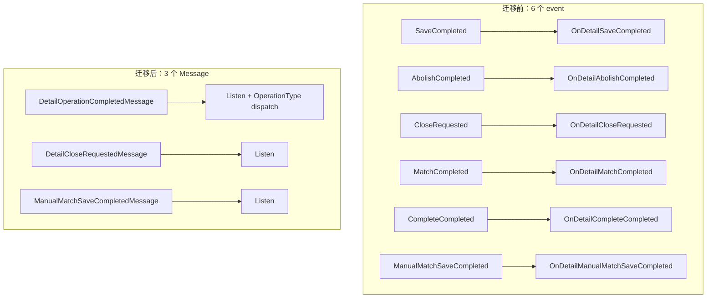
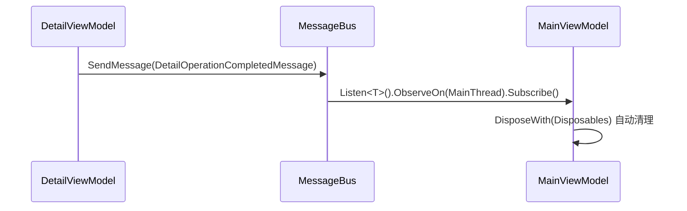

## Context

当前 ViewModel 层存在三类 EventHandler 使用：

```
ViewModel 层 Event 使用地图
├── AttendedWeighingDetailViewModelBase（发布方）
│   ├── SaveCompleted          → AttendedWeighingViewModel（订阅方）
│   ├── AbolishCompleted       → AttendedWeighingViewModel
│   ├── CloseRequested         → AttendedWeighingViewModel
│   ├── MatchCompleted         → AttendedWeighingViewModel
│   ├── CompleteCompleted      → AttendedWeighingViewModel
│   └── ManualMatchSaveCompleted → AttendedWeighingViewModel
├── ManualMatchEditWindowViewModel（发布方）
│   └── SaveCompleted          → ManualMatchWindow.axaml.cs（订阅方）
└── SettingsWindowViewModel（发布方）
    └── CloseRequested          → SettingsWindow.axaml.cs（订阅方）
```

Service 层已全面使用 `MessageBus.Current`（10 种 Message 类型），ViewModel 层是唯一残留 EventHandler 的区域。

现有 Message 类型约定：`class` + primary constructor + 不可变属性，命名空间 `MaterialClient.Common.Events`。

## Goals / Non-Goals

**Goals:**

- 消除 ViewModel 间所有 `public event` 声明，统一使用 ReactiveUI MessageBus
- 移除手动 `+=`/`-=` 订阅，改用 `MessageBus.Current.Listen<T>().Subscribe()` + `DisposeWith()`
- 保持与现有 Message 类型风格一致（class + primary constructor）
- 确保线程安全：View 层订阅需 `ObserveOn(RxApp.MainThreadScheduler)`

**Non-Goals:**

- 不迁移 `SerialPortWrapper.DataReceived`（BCL 事件透传，属于基础设施层）
- 不迁移测试代码中 NSubstitute 的 `Raise.Event` 模式（随 event 移除同步更新即可）
- 不改变 Service 层已有的 MessageBus 使用方式
- 不引入新的 MessageBus 框架（继续使用 ReactiveUI 内置 MessageBus）
- 不改造现有的 `Events/` 目录下已存在的 10 种 Message 类型

## Decisions

### Decision 1: 合并为单一 DetailOperationCompletedMessage

6 个 Detail event 的 EventArgs 均为 `ItemOperationCompletedEventArgs`，结构完全一致，仅 `OperationType` 字段区分操作类型。

**选择**：合并为 `DetailOperationCompletedMessage`，通过枚举 `DetailOperationType` 区分操作。

**替代方案**：为每个操作创建独立 Message 类型（6 个类）。

**理由**：合并方案减少类型数量，订阅方只需一个 `Listen<DetailOperationCompletedMessage>` 即可覆盖全部操作，通过 `OperationType` 过滤。与现有 `SaveCompletedMessage` 等 Service 层消息不冲突（不同层级、不同用途）。



### Decision 2: 新增 DetailOperationType 枚举

```csharp
public enum DetailOperationType
{
    Save,
    Abolish,
    Match,
    Complete
}
```

5 个含 `ItemOperationCompletedEventArgs` 的 event（Save/Abolish/Match/Complete/ManualMatchSave）合并为 `DetailOperationCompletedMessage`，CloseRequested 单独一个 Message。

### Decision 3: Message 类型设计

遵循现有模式（class + primary constructor）：

| Message 类型 | 字段 | 替代 |
|---|---|---|
| `DetailOperationCompletedMessage(long itemId, WeighingListItemType itemType, OrderTypeEnum? orderType, bool isCompleted, DetailOperationType operationType)` | Save/Abolish/Match/Complete 4 个 event |
| `DetailCloseRequestedMessage()` | CloseRequested event |
| `ManualMatchSaveCompletedMessage(long? waybillId)` | ManualMatchEditWindowViewModel.SaveCompleted |

### Decision 4: 订阅生命周期管理

使用 `DisposeWith(Disposables)` 模式（项目已在 Rx 中广泛使用）替代手动 `-=`：



### Decision 5: View code-behind 订阅

`SettingsWindow.axaml.cs` 和 `ManualMatchWindow.axaml.cs` 中，订阅改为：

```csharp
MessageBus.Current.Listen<DetailCloseRequestedMessage>()
    .ObserveOn(RxApp.MainThreadScheduler)
    .Subscribe(_ => Close())
    .DisposeWith(_disposables);
```

需在 View 中添加 `CompositeDisposable _disposables` 字段，在 `OnClosed` 中 Dispose。

### Decision 6: ManualMatchSaveCompleted 的归属

`ManualMatchEditWindowViewModel.SaveCompleted` 目前被 `ManualMatchWindow.axaml.cs` 直接消费。迁移后：
- 新增 `ManualMatchSaveCompletedMessage(long? waybillId)`
- `ManualMatchEditWindowViewModel` 发送 `MessageBus.Current.SendMessage(new ManualMatchSaveCompletedMessage(...))`
- `ManualMatchWindow.axaml.cs` 通过 `Listen<ManualMatchSaveCompletedMessage>()` 接收

注意：此 `ManualMatchSaveCompletedMessage` 也被 `AttendedWeighingDetailViewModelBase.ManualMatchSaveCompleted` event 间接触发，需要统一处理。

## Risks / Trade-offs

| 风险 | 缓解措施 |
|------|---------|
| MessageBus 是全局广播，可能被非预期订阅方接收 | Message 类型具有强类型约束，不会误收；必要时可在 handler 中验证 sender |
| 迁移期间 event 和 Message 共存导致重复触发 | 一次性迁移每个 ViewModel，不保留旧 event |
| View code-behind 需新增 `CompositeDisposable` | 与现有 ViewModel 的 `DisposeWith` 模式一致，复杂度可控 |
| `ItemOperationCompletedEventArgs` 删除可能影响其他引用 | 先扫描确认仅有上述 ViewModel 使用，全局编译验证 |

## Migration Plan

1. **新增 Message 类型**：在 `Events/` 目录添加 `DetailOperationCompletedMessage`、`DetailCloseRequestedMessage`、`ManualMatchSaveCompletedMessage` 及 `DetailOperationType` 枚举
2. **改造发布方**：`AttendedWeighingDetailViewModelBase`、`ManualMatchEditWindowViewModel`、`SettingsWindowViewModel` 将 `Invoke` 替换为 `SendMessage`
3. **改造订阅方**：`AttendedWeighingViewModel` 移除 `+=`/`-=`，改用 `Listen` + `DisposeWith`
4. **改造 View code-behind**：`SettingsWindow.axaml.cs`、`ManualMatchWindow.axaml.cs` 同步迁移
5. **清理**：移除 event 声明、`ItemOperationCompletedEventArgs` 类、`ManualMatchSaveCompletedEventArgs` 类
6. **更新 AGENTS.md**：添加 ViewModel 通信约定
7. **编译验证**：确保零编译错误

**回滚策略**：每个步骤独立 Git commit，可逐个 revert。
