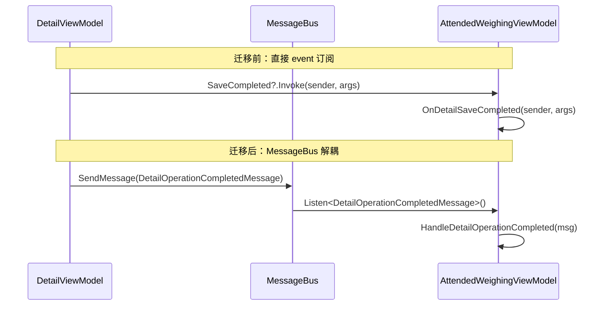

## Why

项目中 ViewModel 层仍存在 8 处 C# `event` 声明（`EventHandler<T>` / `EventHandler`），集中在 `AttendedWeighingDetailViewModelBase`、`ManualMatchEditWindowViewModel`、`SettingsWindowViewModel` 三个类中。这些 event 通过 `+=`/`-=` 手动订阅，由父 ViewModel 或 View code-behind 消费，导致：

1. **强耦合**：订阅方必须持有发布方的直接引用
2. **生命周期风险**：6 个 event 在 `AttendedWeighingViewModel` 中需要成对 `+=`/`-=`，遗漏即内存泄漏
3. **风格不一致**：Service 层已全面使用 `MessageBus.Current`，ViewModel 层混用 event 破坏统一性

项目已有 ReactiveUI `MessageBus` 基础设施（10 种 Message 类型在 `Events/` 目录中），迁移成本可控。

## What Changes

- 将 `AttendedWeighingDetailViewModelBase` 的 6 个 event（`SaveCompleted`、`AbolishCompleted`、`CloseRequested`、`MatchCompleted`、`CompleteCompleted`、`ManualMatchSaveCompleted`）替换为 MessageBus 消息发布
- 将 `ManualMatchEditWindowViewModel.SaveCompleted` event 替换为 MessageBus 消息发布
- 将 `SettingsWindowViewModel.CloseRequested` event 替换为 MessageBus 消息发布
- 将 `AttendedWeighingViewModel` 中 12 处 `+=`/`-=` 订阅替换为 `MessageBus.Current.Listen<T>()` 订阅
- 将 `SettingsWindow.axaml.cs` 中 1 处 `+=`/`-=` 替换为 MessageBus 监听
- 将 `ManualMatchWindow.axaml.cs` 中 1 处 `+=` 替换为 MessageBus 监听
- 新增对应的 Message 类型（如 `DetailOperationCompletedMessage`、`ManualMatchSaveCompletedMessage`、`CloseRequestedMessage`）
- 将 `ItemOperationCompletedEventArgs` 和 `ManualMatchSaveCompletedEventArgs` 迁移为 record 类型 Message
- 移除废弃的 event 声明和 EventArgs 子类
- 在 `AGENTS.md` 中添加编码约定：ViewModel 间通信必须使用 MessageBus，禁止新增 `public event`

> **注意**：`SerialPortWrapper.DataReceived` 是对 BCL `SerialPort` 事件的透传封装，属于基础设施层硬件回调，不在本次迁移范围内。

## Capabilities

### New Capabilities

- `viewmodel-messagebus-communication`：定义 ViewModel 层通过 ReactiveUI MessageBus 进行组件间通信的统一规范，包括消息类型定义约定、订阅生命周期管理、线程调度策略

### Modified Capabilities

_无。本次变更为纯内部重构，不改变任何已有 spec 的需求行为。_

## Impact

### 代码变更表

| 文件路径 | 变更类型 | 变更原因 | 影响范围 |
|---------|---------|---------|---------|
| `MaterialClient/ViewModels/AttendedWeighingDetailViewModelBase.cs` | 修改 | 移除 6 个 event 声明，替换为 MessageBus.SendMessage | Detail ViewModel 基类 |
| `MaterialClient/ViewModels/AttendedWeighingViewModel.cs` | 修改 | 移除 12 处 +=/-=，替换为 MessageBus.Listen | 主称重 ViewModel |
| `MaterialClient/ViewModels/ManualMatchEditWindowViewModel.cs` | 修改 | 移除 SaveCompleted event，替换为 MessageBus | 手动匹配编辑 |
| `MaterialClient/ViewModels/SettingsWindowViewModel.cs` | 修改 | 移除 CloseRequested event，替换为 MessageBus | 设置窗口 ViewModel |
| `MaterialClient/Views/SettingsWindow.axaml.cs` | 修改 | 移除 +=/-=，替换为 MessageBus.Listen | 设置窗口 View |
| `MaterialClient/Views/ManualMatchWindow.axaml.cs` | 修改 | 移除 +=，替换为 MessageBus.Listen | 手动匹配窗口 View |
| `MaterialClient.Common/Events/` | 新增 | 新增 Message record 类型 | 事件定义 |
| `MaterialClient.Common/Events/ItemOperationCompletedEventArgs.cs` | 删除 | 迁移为 record message | 事件参数 |
| `AGENTS.md` | 修改 | 新增 MessageBus 编码约定 | 项目规范 |

### 用户交互流程

### 不受影响

- `SerialPortWrapper.DataReceived`：BCL 事件透传，保留
- Service 层已有的 MessageBus 使用：无需修改
- 所有测试代码中 NSubstitute 的 `Raise.Event` 调用：随 event 移除同步更新
- 对外业务行为：完全不变
