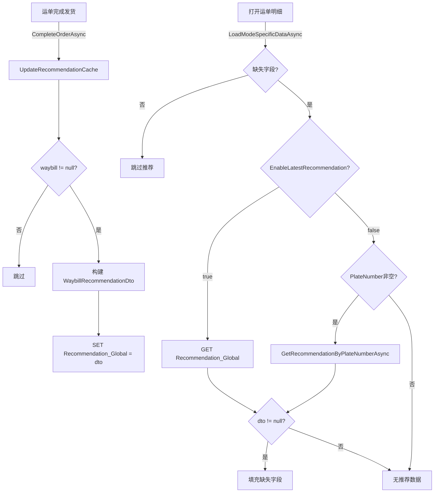

## Context

当前 `RecommendationService` 采用按车牌号索引的多值 LRU 缓存架构：`Recommendation_{车牌号}` 存储各车牌的推荐数据，`Recommendation_Index` 维护车牌号列表用于淘汰管理。业务需求已明确：推荐缓存应为全局唯一，任何运单完成发货时直接覆盖，不考虑车牌关联。

本变更仅涉及缓存结构简化，不涉及数据库查询路径（`GetRecommendationByPlateNumberAsync` 保持原样）。

## Goals / Non-Goals

**Goals:**
- 将 `GetLatestRecommendationAsync` 改为无参方法，读取全局唯一缓存
- 将 `UpdateRecommendationCache` 简化为直接覆盖全局缓存值
- 移除 LRU 淘汰、索引管理、`ReaderWriterLockSlim` 等不再需要的复杂度
- 适配所有调用方签名

**Non-Goals:**
- 不修改 `GetRecommendationByPlateNumberAsync`（数据库查询路径）
- 不修改 `RecommendPlateNumberService`（独立的车牌号推荐服务）
- 不修改 `UpdateRecommendationCache(Waybill)` 的入参签名（保持 `Waybill` 入参）
- 不添加缓存过期策略（当前 `NeverRemove` 保持）
- 不修改 UI 层

## Decisions

### D1: 全局缓存键设计

**选择**：固定键 `"Recommendation_Global"` 存储单个 `WaybillRecommendationDto?`

**理由**：
- 全局单值无需索引、无需淘汰
- `IMemoryCache` 的 `Set/Get` 对引用类型的读写天然线程安全
- 简化程度最高

**备选**：
- 使用静态字段 `volatile` + `lock`：脱离 `IMemoryCache` 体系，一致性差
- 使用 `Interlocked.Exchange`：值类型无法直接使用，需包装

### D2: 移除 ReaderWriterLockSlim

**选择**：完全移除锁

**理由**：
- 全局单值的 `IMemoryCache.Set()` 和 `TryGetValue()` 内部已线程安全
- 原先需要锁是因为同时维护 index 列表 + 多个缓存条目的一致性
- 移除后代码更简洁，无正确性风险

### D3: UpdateRecommendationCache 入参检查简化

**选择**：仅检查 `waybill != null`，不再检查 `waybill.PlateNumber`

**理由**：
- 全局缓存不关心车牌号，任何运单完成都应覆盖
- 即使车牌为空，其物料、供应商、单位信息仍有推荐价值

### D4: ViewModel 中 needsRecommendation 条件调整

**选择**：当 `EnableLatestRecommendation == true` 时，读取缓存不要求 `PlateNumber` 非空

**理由**：
- 全局缓存读取与车牌无关
- 数据库查询路径仍需车牌（`GetRecommendationByPlateNumberAsync`）
- 条件拆分：先判断是否缺失字段，再按开关决定数据源，数据库路径额外检查车牌

## 详细组件架构

```
组件层次（变更后）
├── IRecommendationService
│   ├── GetRecommendationByPlateNumberAsync(string)    ← 不变
│   ├── GetLatestRecommendationAsync()                  ← 变更：无参
│   └── UpdateRecommendationCache(Waybill)             ← 简化
│
├── RecommendationService (Singleton)
│   ├── IMemoryCache
│   │   └── "Recommendation_Global" → WaybillRecommendationDto?   ← 全局单值
│   ├── const CacheKey = "Recommendation_Global"
│   └── (移除: _lock, CacheKeyPrefix, CacheIndexKey, MaxCacheSize,
│         EvictCount, BuildCacheKey, GetOrCreateIndex, UpdateIndex)
│
├── StandardWeighingDetailViewModel
│   └── LoadModeSpecificDataAsync()
│       ├── needsRecommendation 条件调整
│       └── _recommendationService.GetLatestRecommendationAsync()  ← 无参调用
│
└── WeighingMatchingService
    ├── CompleteOrderAsync() → UpdateRecommendationCache(waybill)  ← 不变
    └── UpdateWaybillAsync() → UpdateRecommendationCache(waybill)  ← 不变
```

## 数据流图



## 详细代码变更清单

| 文件路径 | 变更类型 | 变更说明 | 影响模块 |
|---------|---------|---------|---------|
| `MaterialClient.Common/Services/RecommendationService.cs` — `IRecommendationService` 接口 | 修改 | `GetLatestRecommendationAsync` 移除 `string plateNumber` 参数 | 接口定义 |
| `MaterialClient.Common/Services/RecommendationService.cs` — `RecommendationService` 类 | 修改 | 移除 `_lock`、`CacheKeyPrefix`、`CacheIndexKey`、`MaxCacheSize`、`EvictCount`；替换为 `GlobalCacheKey` 常量 | 实现类 |
| `MaterialClient.Common/Services/RecommendationService.cs` — `GetLatestRecommendationAsync` | 修改 | 无参化，改为读取 `GlobalCacheKey` | 缓存读取 |
| `MaterialClient.Common/Services/RecommendationService.cs` — `UpdateRecommendationCache` | 修改 | 移除车牌检查、index 管理、LRU 淘汰；直接 `_memoryCache.Set(GlobalCacheKey, dto)` | 缓存写入 |
| `MaterialClient.Common/Services/RecommendationService.cs` — 私有方法 | 删除 | 移除 `BuildCacheKey`、`GetOrCreateIndex`、`UpdateIndex` | 辅助方法 |
| `MaterialClient/ViewModels/StandardWeighingDetailViewModel.cs` — L105 | 修改 | `_recommendationService.GetLatestRecommendationAsync()` 无参调用 | ViewModel |
| `MaterialClient/ViewModels/StandardWeighingDetailViewModel.cs` — L92-93 | 修改 | `needsRecommendation` 条件拆分：缓存路径不要求 PlateNumber 非空 | ViewModel |

## Risks / Trade-offs

| 风险 | 缓解措施 |
|------|---------|
| 全局缓存被任意运单覆盖，可能不适用于当前车牌 | 业务明确要求此行为；如需恢复按车牌隔离，可通过配置开关回退 |
| `IRecommendationService` 接口签名 BREAKING 变更 | 仅内部使用，无外部消费者；编译期即可发现所有调用点 |
| 移除锁后，极端并发场景下 `UpdateRecommendationCache` 和 `GetLatestRecommendationAsync` 可能看到短暂不一致 | `IMemoryCache` 内部线程安全，不一致窗口极小且不影响正确性（读旧值或新值均可接受） |
