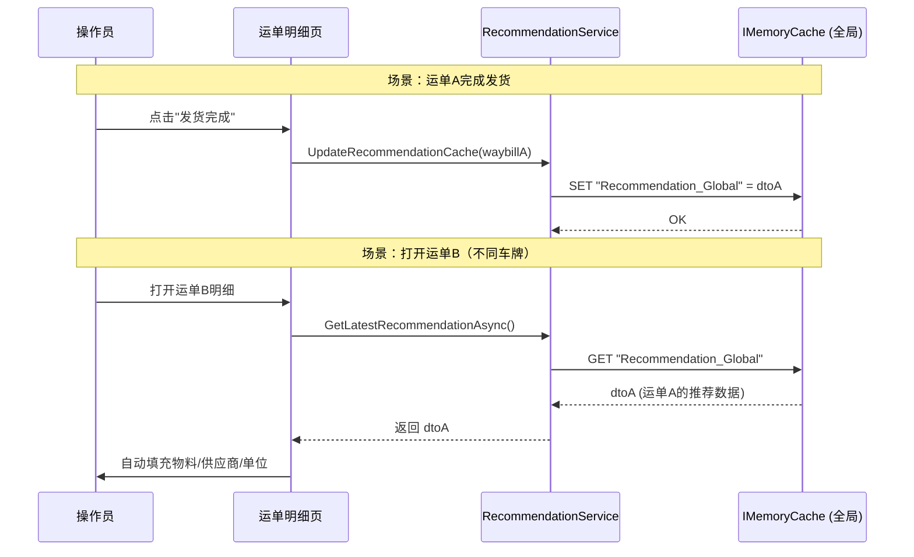

## Why

当前 `GetLatestRecommendationAsync(string plateNumber)` 按车牌号索引内存缓存，导致推荐数据与特定车辆绑定。业务需求是推荐缓存全局唯一——无论哪辆车的运单完成发货，都应直接覆盖全局缓存值，下一次任何运单打开时读取同一份推荐数据。按车牌区分缓存会导致不同车牌号之间推荐数据隔离，无法满足"最后一次发货完成即覆盖"的语义。

## What Changes

- **BREAKING** `IRecommendationService.GetLatestRecommendationAsync` 从 `GetLatestRecommendationAsync(string plateNumber)` 改为 `GetLatestRecommendationAsync()`（无参）
- 移除按车牌号索引的缓存结构（`Recommendation_{车牌号}` + `Recommendation_Index` + LRU 淘汰）
- 替换为全局唯一缓存键 `Recommendation_Global`，存储单个 `WaybillRecommendationDto?`
- `UpdateRecommendationCache(Waybill)` 简化为直接覆盖全局缓存值，不再维护索引和淘汰逻辑
- 移除 `ReaderWriterLockSlim`（`IMemoryCache` 对单值读写的原子性已足够）
- `StandardWeighingDetailViewModel.LoadModeSpecificDataAsync` 调用签名适配（移除 `PlateNumber` 参数传入）
- `StandardWeighingDetailViewModel.LoadModeSpecificDataAsync` 中 `needsRecommendation` 条件调整：读取全局缓存时不再要求 `PlateNumber` 非空（仅数据库查询路径仍需车牌）
- `UpdateRecommendationCache` 入参检查：移除对 `waybill.PlateNumber` 非空的前置条件检查

## Capabilities

### New Capabilities

（无新增能力）

### Modified Capabilities

- `recommendation-cache`: 缓存结构从"按车牌号索引的多值 LRU 缓存"改为"全局唯一单值缓存"，移除淘汰策略和索引管理
- `recommendation-service`: `GetLatestRecommendationAsync` 接口签名无参化，读取逻辑从按车牌查缓存改为读取全局缓存
- `recommendation-settings`: ViewModel 调用 `GetLatestRecommendationAsync` 时移除车牌参数传入，条件判断逻辑调整

## Impact

### 代码变更表

| 文件路径 | 变更类型 | 变更原因 | 影响范围 |
|---------|---------|---------|---------|
| `MaterialClient.Common/Services/RecommendationService.cs` | 修改 | 缓存全局化 + 接口签名变更 | 接口 + 实现 |
| `MaterialClient/ViewModels/StandardWeighingDetailViewModel.cs` | 修改 | 调用签名适配 + 条件调整 | ViewModel 层 |
| `MaterialClient.Common/Services/WeighingMatchingService.cs` | 无变更 | `UpdateRecommendationCache(Waybill)` 签名不变 | — |

### API 影响

- `IRecommendationService` 接口签名变更（**BREAKING**）：所有实现/调用方需适配

### 规格文档影响

- `openspec/specs/recommendation-cache/spec.md` — 需更新
- `openspec/specs/recommendation-service/spec.md` — 需更新
- `openspec/specs/recommendation-settings/spec.md` — 需更新

## 用户交互流程

