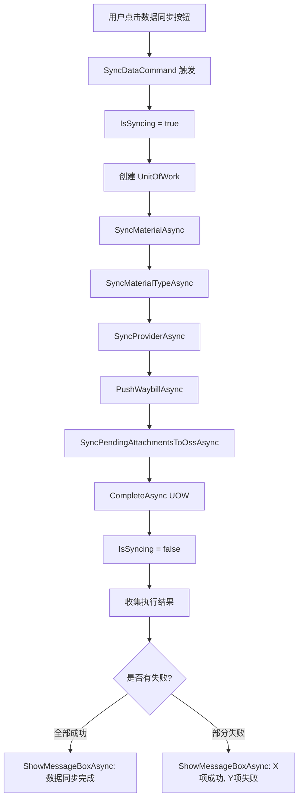
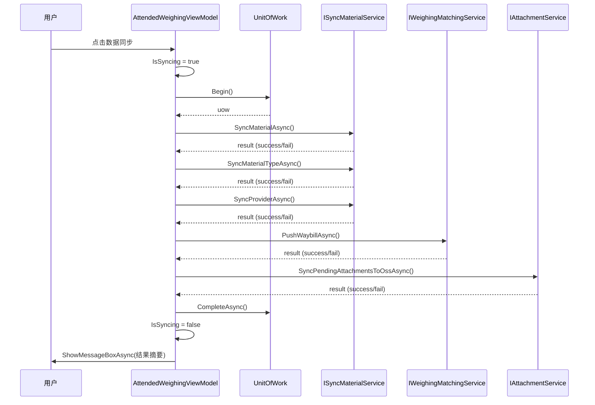

## Context

`PollingBackgroundService` 是基于 ABP `AsyncPeriodicBackgroundWorkerBase` 的后台定时任务，每 10 分钟自动执行一次同步操作。它通过 `IServiceScopeFactory` 创建独立的服务作用域，并在每个同步步骤中使用独立的 UOW（`WithUow` 方法）保证数据库事务隔离。

当前"数据同步"按钮存在于 `AttendedWeighingWindow.axaml` 顶部菜单栏（第 56-59 行），但没有绑定任何 `Command` 或 `Click` 事件。`AttendedWeighingViewModel` 使用 `[ReactiveCommand]` 属性标记命令方法，项目中 `ShowMessageBoxAsync` 方法已在此 ViewModel 中实现（第 2379 行）。

`PollingBackgroundService.DoWorkAsync` 依次执行 6 个同步步骤：
1. `VerifyAuthAsync` — 许可证验证
2. `SyncMaterialAsync` — 物料同步
3. `SyncMaterialTypeAsync` — 物料类型同步
4. `SyncProviderAsync` — 供应商同步
5. `PushWaybillAsync` — 运单推送
6. `UploadWaybillAttachmentsAsync` — 附件上传

## Goals / Non-Goals

**Goals:**

- 用户可通过"数据同步"按钮即时触发完整的同步流程
- 同步过程中按钮禁用，防止重复触发
- 同步完成后通过 `ShowMessageBoxAsync` 显示操作结果摘要
- 复用已有服务接口，不重复实现同步逻辑

**Non-Goals:**

- 不修改 `PollingBackgroundService` 的定时轮询逻辑
- 不提供同步进度实时显示（如进度条）
- 不支持选择性同步（用户无法选择只同步某类数据）
- 不涉及无人值守界面（`UnattendedWeighingWindow`）的变更

## Decisions

### 决策 1：直接调用服务接口 vs 触发后台 Worker

**选择**：直接调用 `ISyncMaterialService`、`IWeighingMatchingService`、`IAttachmentService` 服务接口，而非尝试触发 `PollingBackgroundService`。

**理由**：
- `AsyncPeriodicBackgroundWorkerBase` 的 `DoWorkAsync` 由 ABP 定时器内部调度，没有公开的"立即执行一次"API
- 直接调用服务接口更简单、更可控，可以获取每个步骤的执行结果用于反馈
- `PollingBackgroundService` 的 `WithUow` 模式可以在 ViewModel 中复用

**备选方案**：
- 通过事件/信号通知后台 Worker 立即执行 → 需要修改 `PollingBackgroundService` 增加信号机制，增加复杂度
- 重构同步逻辑为独立服务 → 当前服务接口已足够，无需额外抽象层

### 决策 2：同步步骤选择

**选择**：手动触发执行与 `PollingBackgroundService.DoWorkAsync` 相同的 6 个步骤，但跳过 `VerifyAuthAsync`（许可证验证）。

**理由**：
- 许可证验证在应用启动时已执行，手动同步时重复验证无意义
- 物料/物料类型/供应商同步、运单推送、附件上传是用户期望的同步操作
- `UploadWaybillAttachmentsAsync` 中 `PollingBackgroundService` 已有独立的 try-catch，手动触发时保持相同行为

### 决策 3：错误处理策略

**选择**：收集所有步骤的执行结果，最后统一显示摘要，而非遇到错误立即中断。

**理由**：
- 用户希望了解整体同步状态，而非被第一个错误阻断
- 与 `PollingBackgroundService` 的容错行为一致（各步骤独立 try-catch）
- 摘要信息格式：`"数据同步完成：X 项成功，Y 项失败"`

### 决策 4：按钮禁用机制

**选择**：使用 `IsSyncing` 布尔属性绑定按钮的 `IsEnabled`，通过 `this.RaisePropertyChanged` 通知 UI 更新。

**理由**：
- 与项目中其他按钮状态管理模式一致（如 `IsWeighingActive`）
- ReactiveUI 的 `RaisePropertyChanged` 已在项目中广泛使用
- 简单可靠，无需引入额外的异步锁机制

## 组件架构

```
AttendedWeighingWindow (View)
├── 数据同步 Button (Command="{Binding SyncDataCommand}", IsEnabled="{Binding !IsSyncing}")
│
AttendedWeighingViewModel (ViewModel)
├── [ReactiveCommand] SyncDataAsync()
│   ├── IsSyncing: bool (控制按钮禁用状态)
│   ├── ISyncMaterialService (DI 注入)
│   │   ├── SyncMaterialAsync()
│   │   ├── SyncMaterialTypeAsync()
│   │   └── SyncProviderAsync()
│   ├── IWeighingMatchingService (DI 注入)
│   │   └── PushWaybillAsync()
│   ├── IAttachmentService (DI 注入)
│   │   └── SyncPendingAttachmentsToOssAsync()
│   └── ShowMessageBoxAsync() (已有方法)
│
PollingBackgroundService (不受影响，保持 10 分钟定时轮询)
```

## 数据流图



## API 调用时序图



## 详细代码变更清单

| 文件路径 | 变更类型 | 变更说明 | 影响模块 |
|---------|---------|---------|---------|
| `MaterialClient/ViewModels/AttendedWeighingViewModel.cs` | 修改 | 新增 `ISyncMaterialService`、`IWeighingMatchingService`、`IAttachmentService` 构造函数注入；新增 `IsSyncing` 属性；新增 `[ReactiveCommand] SyncDataAsync()` 方法；新增同步步骤结果收集逻辑 | ViewModel 层 |
| `MaterialClient/Views/AttendedWeighing/AttendedWeighingWindow.axaml` | 修改 | 为"数据同步"按钮添加 `Command="{Binding SyncDataCommand}"` 绑定 | View 层 |

## Risks / Trade-offs

**[风险] 同步操作耗时较长导致 UI 无响应** → 同步操作为 async/await 异步调用，不会阻塞 UI 线程。按钮禁用状态明确告知用户操作进行中。

**[风险] 手动触发与定时轮询并发执行** → 每个同步步骤在独立 UOW 中运行，数据库层有事务隔离。极端情况下可能产生重复推送，但不会导致数据损坏。

**[权衡] 跳过许可证验证** → 手动同步不验证许可证。如果许可证已过期，同步仍会执行（但远程 API 可能返回认证错误）。这是可接受的，因为错误会被捕获并显示在结果摘要中。
