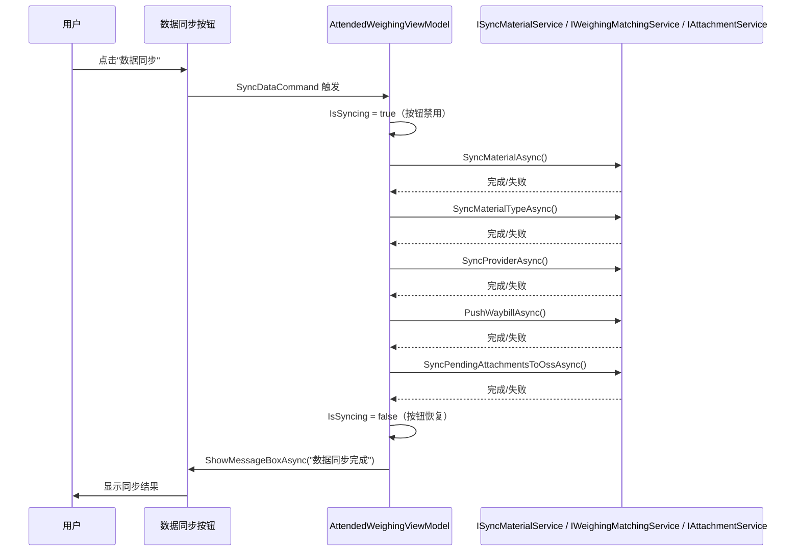

## Why

`PollingBackgroundService` 已实现物料、物料类型、供应商同步、许可证验证、运单推送和附件上传等功能，每 10 分钟自动执行一次。但用户无法通过界面主动触发同步操作，只能被动等待定时器触发。需要将"数据同步"按钮与轮询服务集成，让用户能够即时触发同步并获得操作反馈。

## What Changes

- 为 `AttendedWeighingWindow` 中的"数据同步"按钮绑定点击命令，触发同步操作
- 在 `AttendedWeighingViewModel` 中新增 `[ReactiveCommand]` 方法，调用 `PollingBackgroundService` 的同步逻辑
- 同步操作执行过程中禁用按钮，完成后通过 `ShowMessageBoxAsync` 显示结果摘要（成功/失败信息）
- 复用 `PollingBackgroundService` 中已有的 `ISyncMaterialService`、`IWeighingMatchingService`、`IAttachmentService` 等服务接口，避免重复实现同步逻辑

## Capabilities

### New Capabilities

- `manual-data-sync-trigger`: 用户通过"数据同步"按钮手动触发后台轮询服务的同步操作，包括物料/物料类型/供应商同步、运单推送、附件上传，并提供操作结果反馈

### Modified Capabilities

（无现有 spec 需要修改）

## Impact

### 代码变更表

| 文件路径 | 变更类型 | 变更原因 | 影响范围 |
|---------|---------|---------|---------|
| `MaterialClient/ViewModels/AttendedWeighingViewModel.cs` | 修改 | 新增 `SyncDataCommand` 命令和同步逻辑 | ViewModel 层 |
| `MaterialClient/Views/AttendedWeighing/AttendedWeighingWindow.axaml` | 修改 | 为"数据同步"按钮绑定 Command | View 层 |

### UI 交互原型

```
┌──────────────────────────────────────────────────────────┐
│  [Logo]  数据管理  系统设置  项目信息  [数据同步]  导出   │
│                                    ↑ 按钮               │
├──────────────────────────────────────────────────────────┤
│                                                          │
│                   称重主界面内容...                        │
│                                                          │
└──────────────────────────────────────────────────────────┘

交互状态：
  正常: [数据同步] — 白色文字，可点击
  同步中: [数据同步] — 禁用状态（灰色），防止重复触发
  完成后: 弹出 MessageBox 显示 "数据同步完成" 或失败信息
```

### 用户交互流程



### 依赖与系统影响

- **无新增外部依赖**：复用已有的 `ISyncMaterialService`、`IWeighingMatchingService`、`IAttachmentService` 服务接口
- **无 API 变更**：仅 UI 层与 ViewModel 层的交互变更
- **后台服务不受影响**：`PollingBackgroundService` 的定时轮询逻辑保持不变，手动触发为独立执行路径
