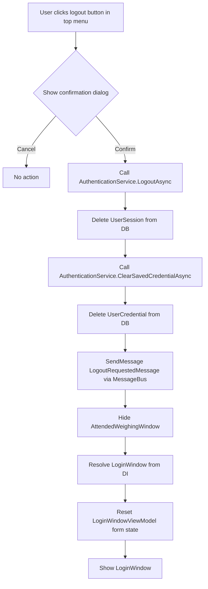
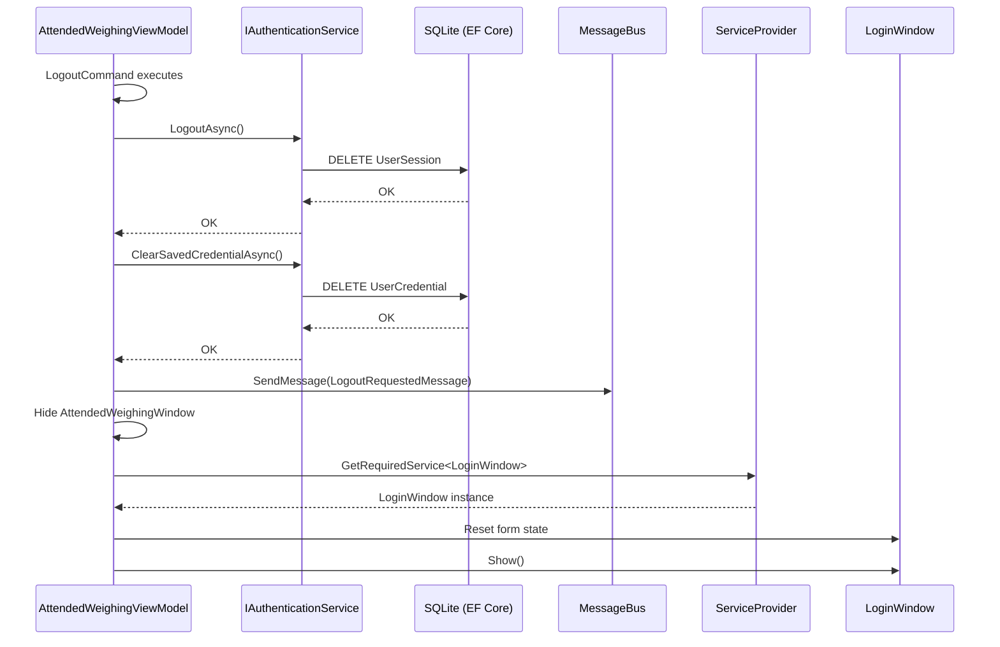

## Context

MaterialClient is an Avalonia UI desktop app for material weighing management. Authentication is handled by `IAuthenticationService` (ABP domain service) with session stored in a local SQLite database. The app startup flow is orchestrated by `StartupService`, which creates three windows (`AuthCodeWindow`, `LoginWindow`, `AttendedWeighingWindow`) and manages transitions between them.

Currently, the only way to end a session is closing the app entirely. The `ProjectInfoWindow` (opened as a modal dialog from the main window) displays project/license info and has a hidden 20-tap easter egg that clears all auth data. There is no user-facing logout button anywhere in the app.

The `AttendedWeighingWindow` has a top blue menu bar with buttons: 数据管理, 系统设置, 项目信息, 数据同步. The logout button will be added next to "数据同步" in this bar.

### Current Window Management

```
StartupService.StartupAsync()
    │
    ├─ Check license → AuthCodeWindow (if invalid)
    ├─ Check session → LoginWindow (if no active session)
    └─ Show AttendedWeighingWindow (main app)

After startup, window references are NOT retained by StartupService.
LoginWindow and AttendedWeighingWindow are resolved from DI as needed.
```

### Current Top Menu Bar Layout (AttendedWeighingWindow)

```
┌──────────────────────────────────────────────────────────────────┐
│ [Logo]  数据管理  系统设置  项目信息  数据同步                ─ □ ✕ │
└──────────────────────────────────────────────────────────────────┘
```

## Goals / Non-Goals

**Goals:**
- Add a "退出登录" button to the `AttendedWeighingWindow` top menu bar, next to the "数据同步" button
- Navigate back to `LoginWindow` after logout (soft logout — license preserved)
- Use `MessageBus` for logout event propagation (per project conventions)
- Show a confirmation dialog before executing logout

**Non-Goals:**
- Full app restart after logout (the app stays running, only the window changes)
- Hard logout (clearing license data) — the easter egg already covers this
- Multi-user concurrent sessions — the system supports one session at a time
- Auto-logout on inactivity timeout beyond the existing 24h session expiry

## Decisions

### Decision 1: Soft logout (session + credentials only, not license)

**Choice:** Call `LogoutAsync()` + `ClearSavedCredentialAsync()` — do NOT call `ClearAllAuthDataAsync()`.

**Rationale:** The user wants to switch accounts, not re-authorize the machine. License data (machine code, auth token) should persist. This is consistent with the distinction the codebase already makes between session management and license management.

**Alternative considered:** `ClearAllAuthDataAsync()` — too aggressive; would force the user through the authorization flow again, which requires network access to the licensing server.

### Decision 2: Logout button in top menu bar (not ProjectInfoWindow)

**Choice:** Add the "退出登录" button to the `AttendedWeighingWindow` top menu bar, positioned after the "数据同步" button, using the same `transparent-button` class style as other menu items.

**Rationale:** The top menu bar is the primary navigation area for the app. Placing logout here makes it always accessible without opening a separate dialog. It follows the convention of desktop apps where account/session actions are in the main toolbar. Since the button is in `AttendedWeighingWindow` itself, the logout command and window transition can be handled entirely within `AttendedWeighingViewModel` — no need for a cross-ViewModel MessageBus event.

**Alternative considered:** Placing the button inside `ProjectInfoWindow` — requires users to open a separate dialog to log out, which is an unnecessary extra step and breaks the common UX pattern.

### Decision 3: Logout command directly in AttendedWeighingViewModel

**Choice:** `AttendedWeighingViewModel` owns the `LogoutCommand`, performs the auth cleanup, and directly manages the window transition (hide `AttendedWeighingWindow`, show `LoginWindow`).

**Rationale:** Since the button is on `AttendedWeighingWindow` and `AttendedWeighingViewModel` already manages window lifecycle (resolving and showing `ProjectInfoWindow`, `SettingsWindow`, etc.), keeping the logout flow here avoids unnecessary indirection. The `LogoutRequestedMessage` is still published via `MessageBus` for any other component that may need to react to a logout event (e.g., stopping background services), but the window transition does not depend on receiving it.

**Alternative considered:** Publishing `LogoutRequestedMessage` and having a separate subscriber handle the window transition — adds complexity with no benefit since the originator can handle it directly.

### Decision 4: Confirmation dialog before logout

**Choice:** Use a simple `MessageBox.Ask()` (or equivalent Avalonia dialog) with "确认退出登录？" before executing the logout flow.

**Rationale:** Logout is a destructive, non-undoable action. A confirmation step prevents accidental logouts. This is a standard UX pattern for destructive operations.

### Decision 5: LogoutRequestedMessage as a marker class

**Choice:** `LogoutRequestedMessage` is a simple marker class with no data (same pattern as `DetailCloseRequestedMessage`).

**Rationale:** The logout action doesn't need to carry any payload. Any subscriber can get needed state from `IAuthenticationService`. Publishing via `MessageBus` allows other components (e.g., sync services, hardware services) to react to logout without tight coupling. This follows the existing event pattern in `MaterialClient.Common/Events/`.

### Decision 6: LoginWindow re-initialization for re-login

**Choice:** `AttendedWeighingViewModel` resolves `LoginWindow` from DI, shows it, and hides `AttendedWeighingWindow`. `LoginWindowViewModel` resets its input fields when shown.

**Rationale:** `StartupService` only runs once at startup and does not retain window references for re-use. The `AttendedWeighingViewModel` already resolves and shows windows (e.g., `ProjectInfoWindow`, `SettingsWindow`) — this is consistent with the existing pattern. The `LoginWindowViewModel` should clear its input fields and reset `IsLoginSuccessful` to allow a clean re-login.

## Risks / Trade-offs

| Risk | Mitigation |
|------|------------|
| `LoginWindow` resolved from DI may create a new instance each time, potentially leaking windows | Since `LoginWindow` is `ITransientDependency`, each resolve creates a new instance. The old one should be GC'd after close. Verify no event subscriptions leak. |
| `LogoutAsync()` + `ClearSavedCredentialAsync()` are separate DB operations — if one fails, state may be inconsistent | Both are `UnitOfWork`-decorated. Wrap both calls in the same logical operation. If `ClearSavedCredentialAsync()` fails, the session is already deleted — worst case the user sees the login screen with no auto-fill, which is acceptable. |
| User may have unsaved work in `AttendedWeighingWindow` when clicking logout | The confirmation dialog provides a guard. Additionally, the user must explicitly click the logout button in the menu bar — it's not an easily triggered action. |
| `MessageBus` subscription in `AttendedWeighingViewModel` needs proper lifecycle management | Must use `CompositeDisposable` + `DisposeWith()` per AGENTS.md conventions. The subscription should be set up in the constructor/activation and disposed when the ViewModel is disposed. |

## Component Architecture

```
Logout Flow - Component Interaction
├── AttendedWeighingWindow (View)
│   └── AttendedWeighingViewModel
│       ├── LogoutCommand (ReactiveCommand)
│       ├── IAuthenticationService (LogoutAsync, ClearSavedCredentialAsync)
│       ├── MessageBus.SendMessage(LogoutRequestedMessage)
│       ├── IServiceProvider (resolve LoginWindow)
│       └── Window management (hide/show)
│
├── MessageBus (ReactiveUI)
│   └── LogoutRequestedMessage (event)
│
└── LoginWindow (View)
    └── LoginWindowViewModel
        └── Reset form state for re-login
```

## Data Flow



## API Call Sequence



## Detailed Code Change List

| File Path | Change Type | Description |
|-----------|-------------|-------------|
| `MaterialClient.Common/Events/LogoutRequestedMessage.cs` | Create | New marker class for MessageBus logout event |
| `MaterialClient/ViewModels/AttendedWeighingViewModel.cs` | Modify | Add `LogoutCommand` (ReactiveCommand), inject `IAuthenticationService`, implement logout logic with confirmation dialog, publish `LogoutRequestedMessage`, handle window transition to `LoginWindow` |
| `MaterialClient/Views/AttendedWeighing/AttendedWeighingWindow.axaml` | Modify | Add "退出登录" button next to "数据同步" in the top menu bar, bind to `LogoutCommand` |
| `MaterialClient/ViewModels/LoginWindowViewModel.cs` | Modify | Add method to reset login form state for re-login scenario |
