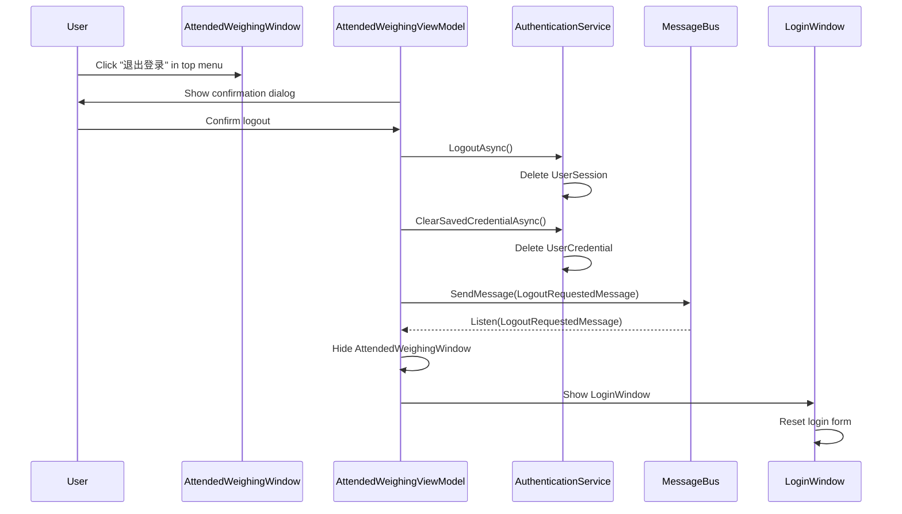

## Why

Users have no way to end their current session without closing the entire application. This prevents account switching and breaks the expected interaction pattern for authenticated desktop apps. The authentication service already exposes `LogoutAsync()` and `ClearAllAuthDataAsync()`, but no UI triggers them.

## What Changes

- Add a "退出登录" (Logout) button to the `AttendedWeighingWindow` top menu bar, positioned next to the "数据同步" button
- On click, perform a "soft logout": clear the user session and saved credentials, then navigate back to `LoginWindow`
- Introduce a `LogoutRequestedMessage` event via `MessageBus` so `AttendedWeighingViewModel` can coordinate the window transition
- Add a confirmation dialog before executing logout to prevent accidental clicks

## Capabilities

### New Capabilities
- `user-logout`: User-initiated logout from the main window top menu bar — clears session, clears saved credentials, and navigates back to the login screen via MessageBus event

### Modified Capabilities
_None — no existing spec-level requirements change._

## Impact

| File Path | Change Type | Reason |
|-----------|-------------|--------|
| `MaterialClient/ViewModels/AttendedWeighingViewModel.cs` | Modify | Add `LogoutCommand` that calls `IAuthenticationService.LogoutAsync()` + `ClearSavedCredentialAsync()` and publishes `LogoutRequestedMessage`, then handles window transition |
| `MaterialClient/Views/AttendedWeighing/AttendedWeighingWindow.axaml` | Modify | Add "退出登录" button next to "数据同步" in the top menu bar |
| `MaterialClient.Common/Events/LogoutRequestedMessage.cs` | Create | New MessageBus event class for logout notification |
| `MaterialClient/ViewModels/LoginWindowViewModel.cs` | Modify | Expose a way to re-initialize the login form for re-login scenario |

### UI Prototype

```
┌──────────────────────────────────────────────────────────────────────┐
│ [Logo]  数据管理  系统设置  项目信息  数据同步  退出登录        ─ □ ✕ │
├──────────────────────────────────────────────────────────────────────┤
│                                                                      │
│                        (Main content area)                           │
│                                                                      │
└──────────────────────────────────────────────────────────────────────┘
                                                    ↑
                                            New button here
                                      (next to 数据同步, same style)
```

### User Interaction Flow


