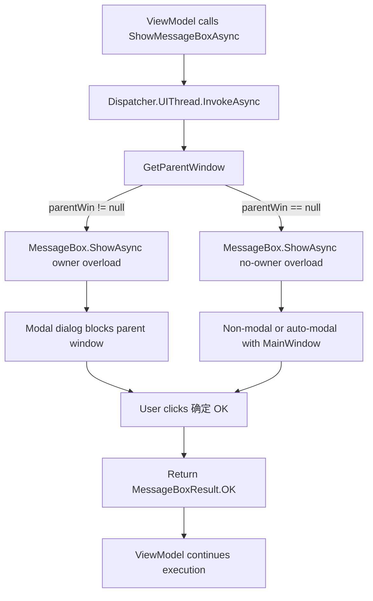
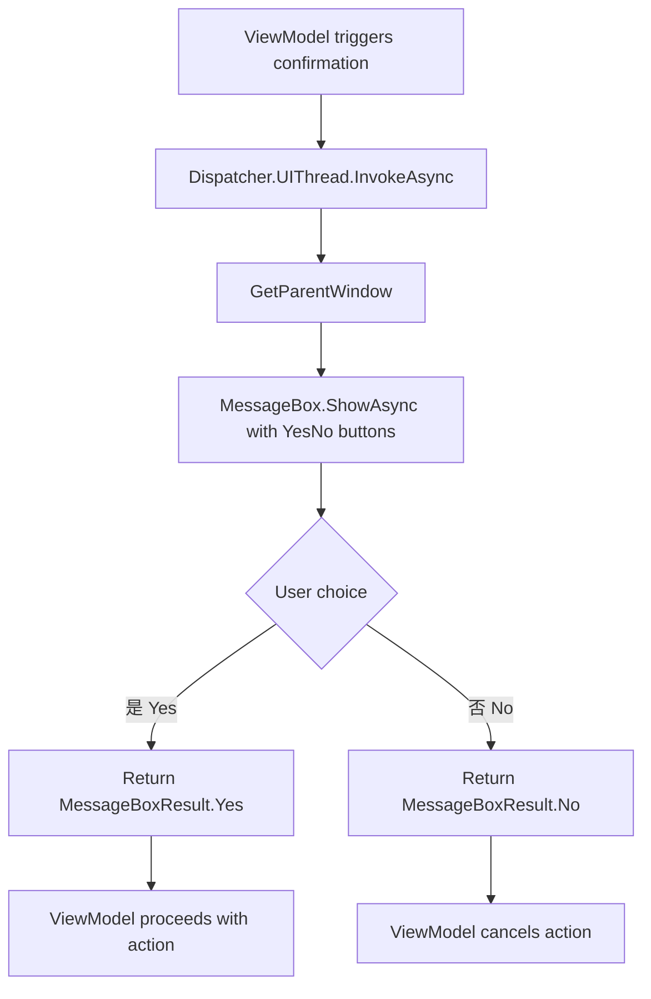
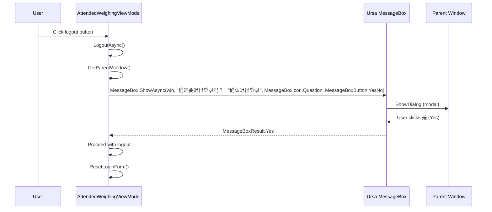

## Context

MaterialClient uses `MessageBox.Avalonia` (namespace `MsBox.Avalonia`) for message dialogs across two ViewModel files. The project already depends on `Irihi.Ursa` and `Irihi.Ursa.Themes.Semi`, which provide a modern `MessageBox` component with built-in localization. The Ursa.Semi theme is already configured with `Locale="zh-CN"` in `App.axaml`, so Chinese button labels (OK/Yes/No/Cancel) will display automatically.

**Current state:**
- 2 source files use `MessageBoxManager.GetMessageBoxStandard()`: `AttendedWeighingViewModel.cs` and `AttendedWeighingDetailViewModelBase.cs`
- Helper methods `ShowMessageBoxAsync` and `ShowMessageBoxAsyncWithoutBlocking` in the base class wrap the old API
- `AttendedWeighingViewModel.cs` also has its own local `ShowMessageBoxAsync` helper and `GetParentWindow` method
- `MessageBox.Avalonia` NuGet package is a direct dependency in `MaterialClient.csproj`
- 3 additional ViewModels call the helpers indirectly but require no code changes

**Ursa.Avalonia MessageBox architecture (from vault source):**

```
MessageBox (static API)
├── MessageBoxWindow (Window implementation)
│   ├── Modal window display via ShowDialog<T>()
│   ├── Native window decorations
│   └── Full lifecycle management
└── MessageBoxControl (Control implementation — used by OverlayMessageBox)
    ├── Overlay display via OverlayDialogHost
    ├── Lightweight implementation
    └── Integrated into existing UI
```

Ursa.Avalonia provides two MessageBox variants:
- **`MessageBox.ShowAsync()`** — Standard window-based dialog, suitable for desktop apps (our target). Supports owner-window modal behavior.
- **`OverlayMessageBox.ShowAsync()`** — Overlay-based dialog using `OverlayDialogHost`. Lighter weight but requires an `OverlayDialogHost` in the visual tree. Not needed for this migration since MaterialClient is Windows-only desktop.

**API mapping (old → new):**

| MsBox.Avalonia | Ursa.Avalonia |
|---|---|
| `MessageBoxManager.GetMessageBoxStandard(title, message, ButtonEnum, Icon)` | `MessageBox.ShowAsync(owner, message, title, MessageBoxIcon, MessageBoxButton)` |
| `ButtonEnum.Ok` | `MessageBoxButton.OK` |
| `ButtonEnum.YesNo` | `MessageBoxButton.YesNo` |
| `Icon.None` | `MessageBoxIcon.None` |
| `Icon.Question` | `MessageBoxIcon.Question` |
| `.ShowWindowDialogAsync(window)` | `MessageBox.ShowAsync(window, ...)` (overload with owner) |
| `.ShowAsync()` | `MessageBox.ShowAsync(message, title, ...)` (overload without owner) |
| `ButtonResult.Yes` / `ButtonResult.Ok` | `MessageBoxResult.Yes` / `MessageBoxResult.OK` |

**Ursa.Avalonia MessageBox overloads:**

```csharp
// Without owner (non-modal / auto-modal with MainWindow)
Task<MessageBoxResult> ShowAsync(
    string message, string? title = null,
    MessageBoxIcon icon = MessageBoxIcon.None,
    MessageBoxButton button = MessageBoxButton.OK,
    string? styleClass = null)

// With owner (modal dialog)
Task<MessageBoxResult> ShowAsync(
    Window owner, string message, string title,
    MessageBoxIcon icon = MessageBoxIcon.None,
    MessageBoxButton button = MessageBoxButton.OK,
    string? styleClass = null)
```

**Ursa.Avalonia enums:**

| Enum | Values |
|---|---|
| `MessageBoxButton` | `OK`, `OKCancel`, `YesNo`, `YesNoCancel` |
| `MessageBoxIcon` | `None`, `Asterisk`, `Error`, `Exclamation`, `Hand`, `Information`, `Question`, `Stop`, `Warning`, `Success` |
| `MessageBoxResult` | `None`, `OK`, `Cancel`, `Yes`, `No` |

**Localization system architecture (from vault source):**

```
UrsaSemiTheme (theme management)
├── LocaleToResource dictionary
│   ├── zh-CN → zh_cn.axaml  (default + fallback)
│   ├── en-US → en_us.axaml
│   ├── de-DE → de_de.axaml
│   ├── fr-FR → fr_fr.axaml
│   ├── ru-RU → ru_ru.axaml
│   ├── pl-PL → pl_pl.axaml
│   └── cs-CZ → cs_cz.axaml
├── DefaultResource (zh-CN, used when locale is null or unsupported)
├── OverrideLocaleResources(Application, CultureInfo) — global switch
└── OverrideLocaleResources(StyledElement, CultureInfo) — per-control switch
```

**Resource keys for MessageBox buttons:**

| Resource Key | zh-CN | en-US | Used By |
|---|---|---|---|
| `STRING_MENU_DIALOG_OK` | 确定 | OK | `MessageBoxButton.OK` / `OKCancel` |
| `STRING_MENU_DIALOG_CANCEL` | 取消 | Cancel | `MessageBoxButton.OKCancel` / `YesNoCancel` |
| `STRING_MENU_DIALOG_YES` | 是 | Yes | `MessageBoxButton.YesNo` / `YesNoCancel` |
| `STRING_MENU_DIALOG_NO` | 否 | No | `MessageBoxButton.YesNo` / `YesNoCancel` |
| `STRING_MENU_DIALOG_CLOSE` | 关闭 | Close | Window close button (hidden for `YesNo`) |

**Localization behavior characteristics:**
- **Default language**: If no locale is set, zh-CN is used automatically
- **Fallback mechanism**: Unsupported cultures silently fall back to zh-CN
- **DynamicResource binding**: Button labels use `{DynamicResource STRING_MENU_DIALOG_*}` in XAML styles, so they update automatically when locale changes
- **Runtime switching**: Available via `UrsaSemiTheme.OverrideLocaleResources()` — not needed for this migration but documented for future extensibility

**Keyboard behavior (from vault source):**

| Button Config | Default Focus | ESC Key Result | Close Button Visible |
|---|---|---|---|
| `OK` | OK button | `MessageBoxResult.OK` | Yes |
| `OKCancel` | Cancel button | `MessageBoxResult.Cancel` | Yes |
| `YesNo` | Yes button | _No action_ | **No** |
| `YesNoCancel` | Cancel button | `MessageBoxResult.Cancel` | Yes |

## Goals / Non-Goals

**Goals:**
- Replace all `MessageBox.Avalonia` usage with `Ursa.Avalonia.Controls.MessageBox`
- Ensure Chinese localization for MessageBox button labels via existing Semi theme locale
- Remove the `MessageBox.Avalonia` NuGet package dependency
- Maintain identical UX behavior (blocking for confirmations, non-blocking for info messages)

**Non-Goals:**
- Changing the visual style or layout of message dialogs beyond what Ursa.Avalonia provides by default
- Adding new localization languages beyond the already-configured zh-CN
- Refactoring the helper method signatures or introducing a MessageBox service abstraction
- Modifying any View (.axaml) files
- Adding unit tests or documentation (per user request)
- Using `OverlayMessageBox` — window-based `MessageBox` is appropriate for this Windows-only desktop app

## Decisions

### D1: Direct API replacement over abstraction layer

**Decision:** Replace `MessageBoxManager.GetMessageBoxStandard()` calls directly with `MessageBox.ShowAsync()` rather than introducing an `IMessageBoxService` abstraction.

**Rationale:** The MessageBox API surface is minimal (2 files, 2 helpers). An abstraction would add complexity without clear benefit since there is only one consumer library. The Ursa.Avalonia MessageBox is already well-tested and stable. If future needs require mocking in tests, an abstraction can be introduced then.

### D2: Preserve helper method structure

**Decision:** Keep `ShowMessageBoxAsync` and `ShowMessageBoxAsyncWithoutBlocking` in `AttendedWeighingDetailViewModelBase` but update their internals to call `MessageBox.ShowAsync()`. Also keep the local `ShowMessageBoxAsync` in `AttendedWeighingViewModel`.

**Rationale:** These helpers encapsulate owner-window resolution (`GetParentWindow()`) and thread dispatch logic (`Dispatcher.UIThread`). Removing them would force all callers to handle these concerns. The helpers are used by 3+ subclasses — changing their signatures would be a larger refactor with no value.

### D3: Use owner-window overload for modal behavior

**Decision:** When `GetParentWindow()` returns a non-null window, use `MessageBox.ShowAsync(Window owner, string message, string title, ...)` to maintain modal (window-blocking) behavior. When null, use the parameterless-owner overload.

**Rationale:** The old code used `ShowWindowDialogAsync(parentWin)` for modal behavior. Ursa.Avalonia's owner-based overload provides the same modal semantics via `ShowDialog<T>()`. The fallback to non-modal display when no parent is found preserves existing behavior.

### D4: Leverage existing Semi theme locale

**Decision:** No additional locale configuration needed. The `zh-CN` locale is already set in `App.axaml` via `<semi:SemiTheme Locale="zh-CN" />` and `<u-semi:SemiTheme Locale="zh-CN" />`.

**Rationale:** Ursa.Avalonia MessageBox reads the Semi theme's locale for button text labels via dynamic resources (`STRING_MENU_DIALOG_OK`, `STRING_MENU_DIALOG_YES`, etc.). The configuration is already in place and will automatically display Chinese labels.

### D5: Use MessageBox (window-based) over OverlayMessageBox

**Decision:** Use `MessageBox.ShowAsync()` (window-based `MessageBoxWindow`) rather than `OverlayMessageBox.ShowAsync()` (overlay-based `MessageBoxControl`).

**Rationale:** MaterialClient is a Windows-only desktop application targeting 24/7 industrial operation. The window-based `MessageBox` provides native modal behavior via `ShowDialog<T>()` which is consistent with the existing `ShowWindowDialogAsync()` pattern. `OverlayMessageBox` requires an `OverlayDialogHost` in the visual tree and is designed for scenarios where window management is undesirable (web, mobile, or multi-overlay contexts). This does not apply here.

## Architecture

### Component Hierarchy

```
MaterialClient
├── Views/
│   └── AttendedWeighingWindow.axaml (unchanged)
├── ViewModels/
│   ├── AttendedWeighingViewModel.cs
│   │   ├── ShowMessageBoxAsync() (local helper — rewrite internals)
│   │   ├── GetParentWindow() (local — unchanged)
│   │   ├── LogoutAsync() (direct MessageBox call — rewrite)
│   │   └── PrintXXXAsync() (callers of helper — unchanged)
│   ├── AttendedWeighingDetailViewModelBase.cs
│   │   ├── ShowMessageBoxAsync() (helper — rewrite internals)
│   │   ├── ShowMessageBoxAsyncWithoutBlocking() (helper — rewrite internals)
│   │   ├── GetParentWindow() (unchanged)
│   │   └── AbolishOrderAsync() (direct MessageBox call — rewrite)
│   ├── StandardWeighingDetailViewModel.cs (inherits helpers — no changes)
│   └── SolidWasteWeighingDetailViewModel.cs (inherits helpers — no changes)
└── App.axaml
    ├── <semi:SemiTheme Locale="zh-CN" /> (unchanged — provides locale)
    └── <u-semi:SemiTheme Locale="zh-CN" /> (unchanged — provides locale)
```

### Data Flow — Info Message



### Data Flow — Confirmation Dialog



### API Call Sequence — Logout Confirmation



## Detailed Code Changes

| File Path | Change Type | Change Description | Impact Module |
|---|---|---|---|
| `MaterialClient/ViewModels/AttendedWeighingDetailViewModelBase.cs` | Import replace | Remove `using MsBox.Avalonia` and `using MsBox.Avalonia.Enums`, add `using Ursa.Avalonia.Controls` | Base ViewModel |
| `MaterialClient/ViewModels/AttendedWeighingDetailViewModelBase.cs` | Method rewrite | Rewrite `ShowMessageBoxAsync`: replace `MessageBoxManager.GetMessageBoxStandard(...)` + `ShowWindowDialogAsync`/`ShowAsync` with `MessageBox.ShowAsync(parentWin, message, "提示", MessageBoxIcon.None, MessageBoxButton.OK)` or no-owner fallback | All subclasses |
| `MaterialClient/ViewModels/AttendedWeighingDetailViewModelBase.cs` | Method rewrite | Rewrite `ShowMessageBoxAsyncWithoutBlocking`: same API replacement as above | StandardWeighing, SolidWaste |
| `MaterialClient/ViewModels/AttendedWeighingDetailViewModelBase.cs` | Call site update | Replace abolish confirmation call (~line 536): `MessageBoxManager.GetMessageBoxStandard("确认废单", ...)` → `MessageBox.ShowAsync(parentWin, "确定要废除此单吗？", "确认废单", MessageBoxIcon.Question, MessageBoxButton.YesNo)`, check `MessageBoxResult.Yes` | Abolish order flow |
| `MaterialClient/ViewModels/AttendedWeighingViewModel.cs` | Import replace | Remove `using MsBox.Avalonia` and `using MsBox.Avalonia.Enums`, add `using Ursa.Avalonia.Controls` | AttendedWeighing |
| `MaterialClient/ViewModels/AttendedWeighingViewModel.cs` | Method rewrite | Rewrite local `ShowMessageBoxAsync`: replace `MessageBoxManager.GetMessageBoxStandard(...)` + `ShowWindowDialogAsync`/`ShowAsync` with `MessageBox.ShowAsync(parentWin, message, "提示", ...)` or no-owner fallback | Print & info dialogs |
| `MaterialClient/ViewModels/AttendedWeighingViewModel.cs` | Call site update | Replace logout confirmation (~line 2246): use `MessageBox.ShowAsync(parentWin, "确定要退出登录吗？", "确认退出登录", MessageBoxIcon.Question, MessageBoxButton.YesNo)`, check `MessageBoxResult.Yes` | Logout flow |
| `MaterialClient/MaterialClient.csproj` | Dependency remove | Remove `<PackageReference Include="MessageBox.Avalonia" />` | Build |

## Risks / Trade-offs

- **[Risk] MessageBox visual difference** → Ursa.Avalonia MessageBox has a different visual style compared to MessageBox.Avalonia. Users may notice the change. Mitigation: The new style is more modern and consistent with the rest of the Ursa-based UI.

- **[Risk] Return type difference** → MsBox returns `ButtonResult` (Ok, Yes, No, Cancel, None); Ursa returns `MessageBoxResult` (OK, Yes, No, Cancel, None). The mapping is straightforward but callers checking results must use the new enum. Mitigation: Only 2 call sites check results (logout and abolish confirmations), both use Yes/No pattern which maps directly.

- **[Risk] Transitive dependency removal** → Removing `MessageBox.Avalonia` may break other packages that depend on it transitively. Mitigation: Only this project references it directly; grep confirms no other package in .csproj depends on it.

## Reference

- Ursa.Avalonia MessageBox docs: `C:\Users\77162\Documents\CodeRefs\ursa.avalonia\docs\` (MessageBox快速参考.md, MessageBox本地化使用指南.md, MessageBox本地化技术参考.md, MessageBox本地化调研总览.md)
- Ursa.Avalonia MessageBox source: `src/Ursa/Controls/MessageBox/` (MessageBox.cs, MessageBoxWindow.cs, MessageBoxControl.cs, OverlayMessageBox.cs)
- Ursa.Avalonia localization source: `src/Ursa.Themes.Semi/UrsaSemiTheme.axaml.cs` and `src/Ursa.Themes.Semi/Locale/`
- Ursa.Avalonia MessageBox styles: `src/Ursa.Themes.Semi/Controls/MessageBox.axaml`
