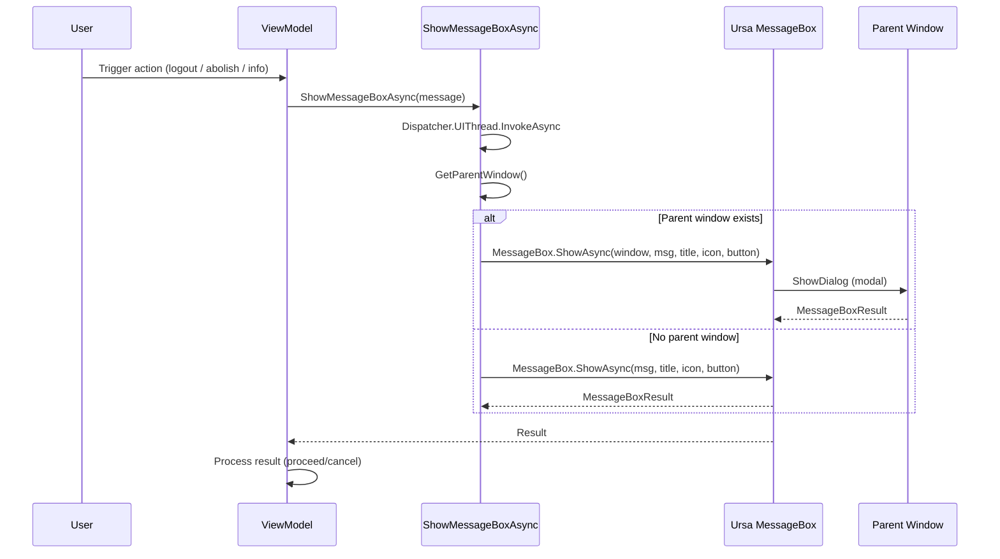

## Why

MaterialClient currently uses `MessageBox.Avalonia` (MsBox.Avalonia) for all message dialogs, while Ursa.Avalonia is already a project dependency and provides its own modern MessageBox component. This creates UI inconsistency and lacks Chinese localization for button labels (OK/Yes/No/Cancel are shown in English). Migrating to Ursa.Avalonia MessageBox unifies the component library and leverages its built-in zh-CN locale support.

**Localization system (from Ursa.Avalonia vault reference):** Ursa.Avalonia's Semi theme provides a comprehensive localization system via `UrsaSemiTheme` with 7 supported languages (zh-CN, en-US, de-DE, fr-FR, ru-RU, pl-PL, cs-CZ). zh-CN is the default language and also the fallback for unsupported cultures. Button labels are resolved through Avalonia `DynamicResource` bindings (keys: `STRING_MENU_DIALOG_OK` → "确定", `STRING_MENU_DIALOG_YES` → "是", `STRING_MENU_DIALOG_NO` → "否", `STRING_MENU_DIALOG_CANCEL` → "取消", `STRING_MENU_DIALOG_CLOSE` → "关闭"). Runtime language switching is available via `UrsaSemiTheme.OverrideLocaleResources()`.

## What Changes

- **BREAKING**: Replace all `MessageBoxManager.GetMessageBoxStandard()` calls with `MessageBox.ShowAsync()` from `Ursa.Avalonia.Controls`
- **BREAKING**: Replace `MsBox.Avalonia.Enums.ButtonEnum` with `Ursa.Avalonia.Controls.MessageBoxButton`
- **BREAKING**: Replace `MsBox.Avalonia.Enums.Icon` with `Ursa.Avalonia.Controls.MessageBoxIcon`
- Remove `MessageBox.Avalonia` NuGet package dependency
- Remove `using MsBox.Avalonia` and `using MsBox.Avalonia.Enums` imports
- Update `ShowMessageBoxAsync` and `ShowMessageBoxAsyncWithoutBlocking` helper methods in `AttendedWeighingDetailViewModelBase` to use Ursa.Avalonia API
- Update `ShowMessageBoxAsync` helper method in `AttendedWeighingViewModel` to use Ursa.Avalonia API
- Update direct `MessageBoxManager` calls in `AttendedWeighingViewModel` to use Ursa.Avalonia API
- Leverage existing `SemiTheme Locale="zh-CN"` in App.axaml for Chinese button label localization

## Capabilities

### New Capabilities

- `ursa-messagebox-migration`: Migration from MessageBox.Avalonia to Ursa.Avalonia MessageBox across all ViewModels, including API adaptation and Chinese locale configuration

### Modified Capabilities

_None — this change is purely an internal API swap; no spec-level behavioral requirements change._

## Impact

### UI Before/After Comparison

**Before (MessageBox.Avalonia — English labels):**
```
┌──────────────────────────────────────────┐
│ 提示                                [×]  │
├──────────────────────────────────────────┤
│                                          │
│  车牌号不符合规范请修改                    │
│                                          │
│                         [OK]             │
└──────────────────────────────────────────┘
```

**After (Ursa.Avalonia — Chinese labels via zh-CN locale):**
```
┌──────────────────────────────────────────┐
│ 提示                                [×]  │
├──────────────────────────────────────────┤
│                                          │
│  车牌号不符合规范请修改                    │
│                                          │
│                        [确定]            │
└──────────────────────────────────────────┘
```

**Confirmation dialog before/after:**
```
 Before                                After
┌──────────────────────┐              ┌──────────────────────┐
│ 确认退出登录      [×] │              │ 确认退出登录      [×] │
├──────────────────────┤              ├──────────────────────┤
│                      │              │                      │
│ 确定要退出登录吗？    │              │ 确定要退出登录吗？    │
│                      │              │                      │
│     [Yes]   [No]     │              │     [是]   [否]      │
└──────────────────────┘              └──────────────────────┘
```

### User Interaction Flow



### Affected Files

| File Path | Change Type | Change Reason | Impact Scope |
|---|---|---|---|
| `MaterialClient/ViewModels/AttendedWeighingDetailViewModelBase.cs` | Modify | Replace MsBox imports, rewrite 2 helpers, update 3 direct calls | All detail subclasses |
| `MaterialClient/ViewModels/AttendedWeighingViewModel.cs` | Modify | Replace MsBox imports, update 1 helper, update 2 direct calls | Logout & info dialogs |
| `MaterialClient/MaterialClient.csproj` | Modify | Remove MessageBox.Avalonia PackageReference | Build dependencies |

### Indirect Callers (no code changes needed)

| File | Usage |
|---|---|
| `StandardWeighingDetailViewModel.cs` | Calls `ShowMessageBoxAsyncWithoutBlocking` (inherited) |
| `SolidWasteWeighingDetailViewModel.cs` | Calls `ShowMessageBoxAsync` and `ShowMessageBoxAsyncWithoutBlocking` (inherited) |
| `AttendedWeighingViewModel.cs` | Calls `ShowMessageBoxAsync` in base class (via helpers) |

### Reference

- Ursa.Avalonia MessageBox docs: `C:\Users\77162\Documents\CodeRefs\ursa.avalonia\docs\` (MessageBox快速参考.md, MessageBox本地化使用指南.md, MessageBox本地化技术参考.md, MessageBox本地化调研总览.md)
- Ursa.Avalonia MessageBox source: `src/Ursa/Controls/MessageBox/` (MessageBox.cs, MessageBoxWindow.cs, MessageBoxControl.cs, OverlayMessageBox.cs)
- Ursa.Avalonia localization source: `src/Ursa.Themes.Semi/UrsaSemiTheme.axaml.cs` and `src/Ursa.Themes.Semi/Locale/`
