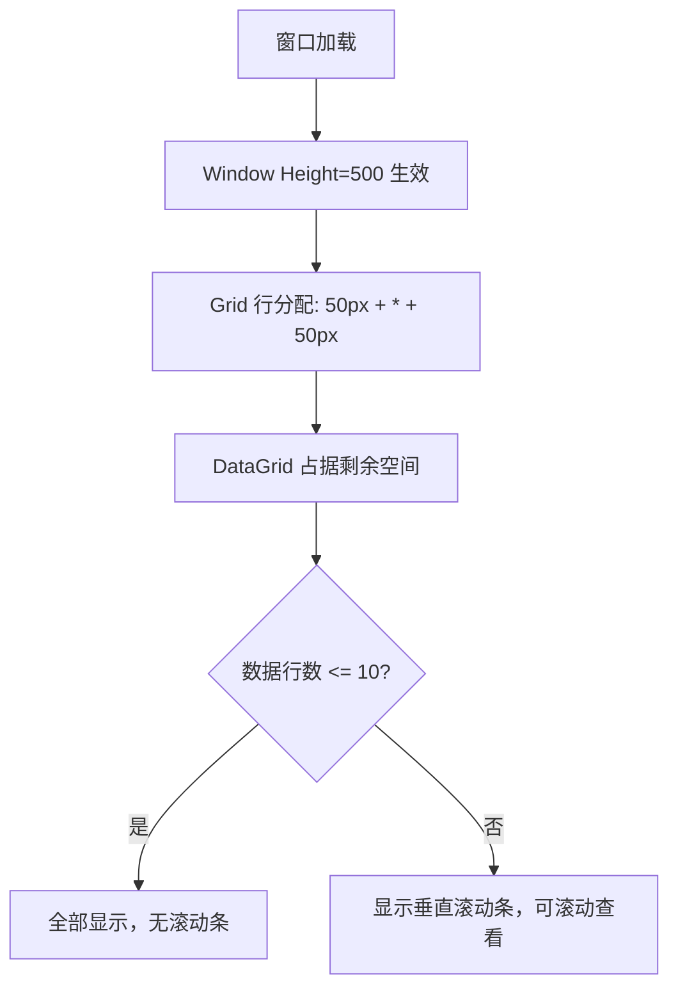

## Context

三个管理窗口（台账管理 `DataManagementDialogWindow`、材料管理 `MaterialManagementWindow`、供应商管理 `ProviderManagementWindow`）当前使用 `SizeToContent="Height"` 使窗口高度随 DataGrid 行数动态增长，且 DataGrid 的 `VerticalScrollBarVisibility` 设为 `Disabled`。

当前布局结构（三个窗口一致）：

```
Window (SizeToContent="Height")
└── Border (Thickness=1)
    └── Grid (3 rows: 50, Auto, 50)
        ├── Row 0 (50px): 标题栏（标题文字 + 关闭按钮）
        ├── Row 1 (Auto): 内容区
        │   └── Grid (2 rows: Auto, Auto)
        │       ├── Sub-row 0 (Auto): 搜索栏（输入框 + 按钮, 高度~50px）
        │       └── Sub-row 1 (Auto): DataGrid (RowHeight=30, 无滚动条)
        └── Row 2 (50px): 分页/按钮区
```

目标：固定窗口高度为恰好容纳 10 行数据的值，DataGrid 多余行通过滚动查看。

## Goals / Non-Goals

**Goals:**
- 三个窗口高度固定，一页可完整显示 10 个列表项
- 超过 10 项时 DataGrid 可滚动
- 三个窗口保持一致的外观结构

**Non-Goals:**
- 不改变窗口宽度
- 不改变 DataGrid 列定义或数据绑定逻辑
- 不修改 ViewModel 或业务逻辑

## Decisions

### 决策 1：固定高度值选择 500px

**选择**：三个窗口统一设置 `Height="500"`。

**理由**：
- 标题栏 50px + 搜索栏 ~50px + DataGrid（表头 30px + 10行×30px = 300px + margin 5px）+ 底栏 50px + Border 2px ≈ 487px
- 取整为 500px，留有少量呼吸空间
- 三个窗口结构一致，可使用相同高度值

**替代方案**：
- 按窗口分别计算精确值 → 增加维护复杂度，收益极小
- 使用 `MinHeight` + `MaxHeight` 限制范围 → 用户描述明确要求"固定高度"

### 决策 2：将 Auto 行改为 * 行以填充剩余空间

**选择**：将外层 Grid 的 Row 1 从 `Auto` 改为 `*`，内层 Grid 的 DataGrid 行从 `Auto` 改为 `*`。

**理由**：
- 固定窗口高度后，Auto 行不会自动扩展填充空间
- 使用 `*` 让 DataGrid 区域自动占据剩余高度
- 当数据行不足 10 行时，DataGrid 区域仍保持相同高度（空白区域为 DataGrid 背景色）

### 决策 3：启用 DataGrid 垂直滚动条

**选择**：将 DataGrid 的 `VerticalScrollBarVisibility` 从 `Disabled` 改为 `Auto`。

**理由**：
- 固定高度后，当数据超过 10 行时用户需要滚动查看
- `Auto` 仅在内容溢出时显示滚动条，视觉更干净

### 决策 4：移除 SizeToContent="Height"

**选择**：从 Window 元素中移除 `SizeToContent="Height"` 属性。

**理由**：
- 与固定 `Height` 属性冲突——同时存在时 `SizeToContent` 会覆盖固定高度
- 必须移除才能使固定高度生效

## Risks / Trade-offs

| 风险 | 缓解措施 |
|------|---------|
| 数据行不足 10 行时窗口底部留白 | 可接受，保持固定高度的一致性更重要 |
| 固定高度在低分辨率屏幕上可能超出可视区域 | 500px 在主流分辨率（1080p+）上无问题 |
| DataGrid 行高未来若调整，10 行可能不完全适配 | 可通过微调 Height 值解决，影响范围小 |

## 代码变更清单

| 文件路径 | 变更类型 | 变更说明 | 影响模块 |
|---------|---------|---------|---------|
| `Views/AttendedWeighing/DataManagementDialogWindow.axaml` | 属性修改 | 移除 `SizeToContent="Height"`，添加 `Height="500"`，Grid Row 1 改为 `*`，内层 Grid DataGrid 行改为 `*`，DataGrid `VerticalScrollBarVisibility` 改为 `Auto` | 台账管理窗口 |
| `Views/AttendedWeighing/MaterialManagementWindow.axaml` | 属性修改 | 同上 | 材料管理窗口 |
| `Views/AttendedWeighing/ProviderManagementWindow.axaml` | 属性修改 | 同上 | 供应商管理窗口 |

## 组件架构

```
Window (Height=500, CanResize=False)
└── Border (Thickness=1)
    └── Grid (3 rows: 50, *, 50)        ← Row 1: Auto → *
        ├── Row 0 (50px): 标题栏
        ├── Row 1 (*): 内容区
        │   └── Grid (2 rows: Auto, *)  ← DataGrid 行: Auto → *
        │       ├── Sub-row 0 (Auto): 搜索栏
        │       └── Sub-row 1 (*): DataGrid (VerticalScrollBarVisibility=Auto)
        └── Row 2 (50px): 分页/按钮区
```

## 数据流


