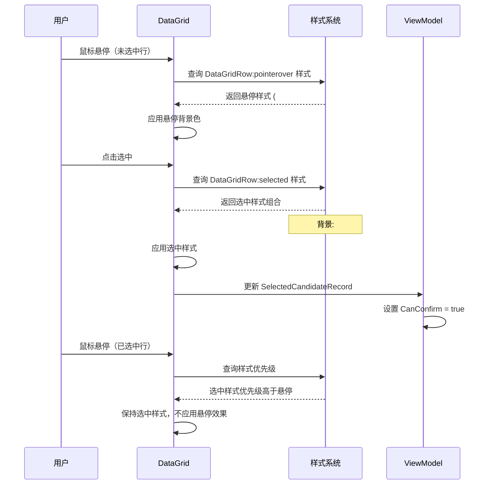

# Design: Manual Match Window Selection Indicator

## Context

### Current State

MaterialClient 应用使用 Avalonia UI 框架，全局样式定义在 `App.axaml` 中。当前 DataGrid 选中行样式使用浅蓝色背景 (#C8DCFF)，与悬停状态 (#F0F7FF) 对比度不足。

### Current Implementation

```xml
<!-- App.axaml (第 347-355 行) -->
<Style Selector="DataGridRow:selected /template/ Rectangle#BackgroundRectangle">
    <Setter Property="Fill" Value="#C8DCFF" />
</Style>

<Style Selector="DataGridRow:pointerover /template/ Rectangle#BackgroundRectangle">
    <Setter Property="Fill" Value="#F0F7FF" />
</Style>
```

### Constraints

- 必须保持与现有主题系统（SemiTheme + Ursa SemiTheme）的兼容性
- 不能破坏其他窗口中的 DataGrid 控件
- 必须支持 Light/Dark 主题变体
- 修改仅限于样式层面，不涉及业务逻辑变更

### Stakeholders

- **用户**：需要清晰的选中状态反馈，减少操作错误
- **开发团队**：需要维护全局样式的一致性
- **UI/UX**：确保符合无障碍设计标准（WCAG AA）
- **项目决策者**：需要直观比较不同设计方案的视觉效果（通过演示项目）

## Goals / Non-Goals

**Goals:**
1. 增强 DataGrid 选中状态的视觉对比度，使用主题色 PrimaryBlue (#4169E1)
2. 添加左侧蓝色边框指示器（3px solid #4169E1）作为额外视觉锚点
3. 调整选中行文字颜色为白色，确保可读性
4. 保持悬停状态与选中状态的清晰视觉区分
5. 通过全局样式应用，使所有 DataGrid 控件受益

**Non-Goals:**
1. 不修改 DataGrid 的数据绑定或业务逻辑
2. 不改变 ManualMatchWindow 的功能行为
3. 不引入新的第三方依赖或控件库
4. 不为特定窗口创建独立样式（保持全局一致性）

## Decisions

### 决策 1：使用主题色 PrimaryBlue 作为选中背景

**选择**：使用全局定义的主题色 `PrimaryBlue` (#4169E1) 作为选中行背景。

**理由**：
- 与应用主题系统保持一致，增强品牌识别度
- 与悬停色 (#F0F7FF) 形成明显对比（对比度 ≥ 3:1）
- 与其他主按钮（primary-button）样式呼应

**替代方案**：
- 使用更深的蓝色 (#2E5BCC) → 被拒绝，缺乏与主题系统的关联
- 使用绿色或橙色 → 被拒绝，不符合应用的蓝色主题

### 决策 2：添加左侧边框指示器

**选择**：在选中行左侧添加 3px solid #4169E1 边框。

**理由**：
- 提供额外的视觉锚点，帮助用户快速定位选中行
- 符合现代 UI 设计模式（如 Material Design 的选择指示器）
- 即使在颜色较浅的背景下，边框也能提供清晰的选中反馈

**替代方案**：
- 添加右侧边框 → 被拒绝，不符合从左到右的阅读习惯
- 添加完整边框（四周） → 被拒绝，视觉上过于强调
- 使用选中图标 → 被拒绝，需要修改 DataGrid 列结构

### 决策 3：调整选中行文字颜色为白色

**选择**：将选中行内所有文字颜色设置为白色 (#FFFFFF)。

**理由**：
- 确保在深色背景 (#4169E1) 下的可读性（对比度 ≥ 4.5:1，符合 WCAG AA）
- 与应用中主按钮（白色文字）保持一致
- 提供额外的视觉反馈，强化选中状态

**实现方式**：
使用 `DataGridRow:selected` 选择器设置 `Foreground` 属性。

### 决策 4：通过全局样式应用

**选择**：在 `App.axaml` 中修改全局 DataGrid 样式。

**理由**：
- 所有 DataGrid 控件自动受益，保持一致性
- 避免在多个窗口中重复定义样式
- 便于后期维护和主题调整

**替代方案**：
- 在 ManualMatchWindow.axaml 中定义局部样式 → 被拒绝，无法复用
- 创建独立的 DataGrid 样式文件 → 被拒绝，增加复杂度，当前样式已在 App.axaml 中

## Alternatives Considered

本节详细评估了其他可行的选中设计方案，包括各方案的优缺点、适用场景和实现复杂度。

### 方案 A：主题色背景 + 左侧边框 + 白色文字（✅ 已采用）

**视觉描述**：
```
├─ 选中行 ┤ 内容 | 内容 | 内容 | 内容 ┤  背景: #4169E1 (主题色)
             文字颜色: #FFFFFF (白色)
             左边框: 3px solid #4169E1
```

**优点**：
- ✅ 视觉对比度最高，与悬停状态区分明显
- ✅ 符合应用主题系统，与其他主按钮样式一致
- ✅ 左侧边框提供额外视觉锚点
- ✅ 符合 WCAG AA 对比度标准（4.5:1）
- ✅ 多重视觉反馈（颜色 + 边框 + 文字）

**缺点**：
- ⚠️ 视觉强度较高，可能对部分用户显得突兀
- ⚠️ 深色背景改变了整体视觉风格
- ⚠️ 全局应用可能影响不需要强烈反馈的场景

**实现复杂度**：低（仅需修改全局样式）

**适用场景**：需要明确选中反馈的数据表格，如手动匹配、数据选择等场景

---

### 方案 B：浅色背景 + 左侧边框（保持文字颜色）

**视觉描述**：
```
├─ 选中行 ┤ 内容 | 内容 | 内容 | 内容 ┤  背景: #E0E7FF (浅蓝)
             文字颜色: #333333 (保持原色)
             左边框: 4px solid #4169E1
```

**优点**：
- ✅ 保留了原有的视觉风格，变化更温和
- ✅ 左侧边框提供清晰的选中指示
- ✅ 文字可读性不受影响
- ✅ 视觉强度适中，不会过于突兀

**缺点**：
- ⚠️ 背景色与悬停色 (#F0F7FF) 对比度仍较低
- ⚠️ 依赖边框作为主要指示器，可能被忽略
- ⚠️ 需要更粗的边框（4px）才能达到相同的视觉强度

**实现复杂度**：低

**适用场景**：希望保持温和视觉风格，同时提供清晰选中反馈的场景

---

### 方案 C：仅边框指示器（无背景色变更）

**视觉描述**：
```
├─ 选中行 ┤ 内容 | 内容 | 内容 | 内容 ┤  背景: #FFFFFF (不变)
             左边框: 5px solid #4169E1
             左侧阴影: 2px 0 4px rgba(65, 105, 225, 0.2)
```

**优点**：
- ✅ 最小化视觉变化，保持原有界面风格
- ✅ 边框 + 阴影组合提供清晰的选中反馈
- ✅ 不影响文字可读性
- ✅ 易于在深色主题下适配

**缺点**：
- ⚠️ 较粗的边框可能显得突兀
- ⚠️ 纯边框方案在某些屏幕上可能不够明显
- ⚠️ 需要额外的阴影效果增强视觉反馈

**实现复杂度**：中（需要边框 + 阴影组合）

**适用场景**：对视觉变化敏感，希望最小化改动的场景

---

### 方案 D：使用选中图标/复选框

**视觉描述**：
```
┌─────────────────────────────────────────┐
│ [✓] 车牌号 │ 供料单位 │ 车辆重量 ...   │  ← 选中（蓝色对勾）
│ [ ] 车牌号 │ 供料单位 │ 车辆重量 ...   │  ← 未选中（空白/圆圈）
└─────────────────────────────────────────┘
```

**优点**：
- ✅ 双重视觉反馈（图标 + 可能的背景色）
- ✅ 符合无障碍设计原则
- ✅ 用户熟悉的选择交互模式
- ✅ 可以独立于背景色使用

**缺点**：
- ❌ 需要修改 DataGrid 列结构，占用额外空间
- ❌ 实现复杂度高（需要添加模板列）
- ❌ 不适用于已有固定列结构的场景
- ❌ 可能影响数据列的宽度分配

**实现复杂度**：高（需要修改列结构和数据模板）

**适用场景**：多选场景或需要明确确认选择的场景

---

### 方案 E：微交互方案（动画效果）

**视觉描述**：
- 选中时：背景色从浅蓝过渡到深蓝（200ms 动画）
- 添加脉冲效果：选中行边框闪烁一次（300ms）
- 悬停时：轻微放大效果（scale 1.02）

**优点**：
- ✅ 现代化的交互体验
- ✅ 动画提供额外的视觉反馈
- ✅ 可以吸引用户注意力

**缺点**：
- ❌ 需要额外的动画代码和样式定义
- ❌ 可能影响性能（尤其在低性能设备上）
- ❌ 动画可能分散注意力
- ❌ 实现复杂度高，需要 Storyboard 或 CSS 动画

**实现复杂度**：高（需要动画支持）

**适用场景**：追求现代化体验，用户群体对动画接受度高

---

### 方案 F：局部样式方案（仅影响 ManualMatchWindow）

**视觉描述**：
仅在 ManualMatchWindow.axaml 中定义局部样式，不影响其他窗口。

**优点**：
- ✅ 风险可控，仅影响特定窗口
- ✅ 可以为不同窗口定制不同的选中样式
- ✅ 不影响其他功能模块

**缺点**：
- ❌ 无法复用，其他窗口需要重复定义
- ❌ 维护成本高，样式分散在多个文件
- ❌ 不利于保持全局一致性

**实现复杂度**：低

**适用场景**：仅需优化单一窗口，或不同窗口需要不同选中样式的场景

---

### 方案对比矩阵

| 方案 | 视觉强度 | 实现复杂度 | 全局一致性 | 维护成本 | 用户体验 |
|------|---------|-----------|-----------|---------|---------|
| A. 主题色背景 + 边框 | ⭐⭐⭐⭐⭐ | 低 | ⭐⭐⭐⭐⭐ | 低 | ⭐⭐⭐⭐ |
| B. 浅色背景 + 边框 | ⭐⭐⭐ | 低 | ⭐⭐⭐⭐ | 低 | ⭐⭐⭐⭐ |
| C. 仅边框指示器 | ⭐⭐⭐ | 中 | ⭐⭐⭐⭐ | 中 | ⭐⭐⭐ |
| D. 选中图标 | ⭐⭐⭐⭐ | 高 | ⭐⭐ | 高 | ⭐⭐⭐⭐⭐ |
| E. 微交互动画 | ⭐⭐⭐⭐⭐ | 高 | ⭐⭐⭐ | 高 | ⭐⭐⭐⭐⭐ |
| F. 局部样式 | ⭐⭐⭐⭐ | 低 | ⭐ | 高 | ⭐⭐⭐⭐ |

### 推荐方案排序

基于 ManualMatchWindow 的使用场景（需要明确选中反馈、减少操作错误），推荐方案排序如下：

1. **方案 A**（✅ **已采用**）：主题色背景 + 左侧边框 - 最佳视觉对比度
2. **方案 B**（备选）：浅色背景 + 左侧边框 - 温和的视觉变化
3. **方案 C**（备选）：仅边框指示器 - 最小化改动
4. **方案 F**（特殊情况）：局部样式 - 如仅需优化单一窗口

### 方案选择建议

**选择方案 A 的条件**：
- 需要最强的视觉反馈
- 用户群体对视觉变化接受度高
- 应用整体使用主题色系统

**选择方案 B 的条件**：
- 希望保持温和的视觉风格
- 担心深色背景过于突兀
- 希望平衡视觉对比度和原有风格

**选择方案 C 的条件**：
- 对视觉变化高度敏感
- 希望最小化改动
- 需要在深色主题下保持一致性

**选择方案 F 的条件**：
- 仅需优化单一窗口
- 不同窗口需要不同的选中样式
- 希望降低全局变更的风险

## Architecture

### 方案演示项目架构

**项目名称**：`MaterialClient.Demo`

**项目定位**：独立的 Avalonia UI 演示项目，无业务逻辑，仅用于展示各设计方案的视觉效果和交互行为。

**项目结构**：
```
MaterialClient.Demo/
├── MaterialClient.Demo.csproj
├── App.axaml
├── App.axaml.cs
├── Views/
│   ├── DemoMainWindow.axaml          # 主窗口：方案选择器
│   ├── SchemeAWindow.axaml            # 方案 A 演示窗口
│   ├── SchemeBWindow.axaml            # 方案 B 演示窗口
│   ├── SchemeCWindow.axaml            # 方案 C 演示窗口
│   └── SchemeDWindow.axaml            # 方案 D 演示窗口
├── ViewModels/
│   ├── DemoMainWindowViewModel.cs
│   └── DemoDataGenerator.cs           # 模拟数据生成器
└── Models/
    └── CandidateRecord.cs             # 演示数据模型
```

**核心功能**：
1. **方案选择器主窗口**：提供导航界面，点击按钮打开对应方案的演示窗口
2. **模拟数据**：生成 5-10 条候选记录数据，包含车牌号、供料单位、车辆重量、进场时间、相隔时间等字段
3. **独立样式定义**：每个演示窗口内联定义该方案对应的 DataGrid 样式，避免全局冲突
4. **交互演示**：支持鼠标悬停、点击选中、取消选中等交互操作
5. **主题切换**：支持 Light/Dark 主题切换，验证各方案在不同主题下的效果

**技术约束**：
- 使用 Avalonia 11.x 框架
- 不引入 MaterialClient 的业务逻辑代码
- 不依赖 MaterialClient 的主题系统，使用内联样式
- 支持 .NET 8+ 运行时
- 可独立编译和运行

### 组件层次结构

```
应用启动
└── App.axaml
    ├── 全局样式定义
    │   ├── FluentTheme
    │   ├── SemiTheme
    │   ├── Ursa SemiTheme
    │   ├── DataGrid 表头样式
    │   ├── DataGrid 选中行样式 (★ 修改位置)
    │   ├── DataGrid 悬停样式
    │   └── Button 样式（primary-button, secondary-button 等）
    └── 视图
        ├── ManualMatchWindow.axaml
        │   └── DataGrid (CandidateDataGrid)
        └── 其他包含 DataGrid 的视图
            └── DataGrid (自动继承全局样式)
```

### 数据流图

```mermaid
flowchart TD
    A[用户点击 DataGrid 行] --> B{是否已选中?}
    B -->|否| C[应用选中样式]
    B -->|是| D[保持选中样式]

    C --> E[背景色 → #4169E1]
    C --> F[左侧边框 → 3px solid #4169E1]
    C --> G[文字颜色 → #FFFFFF]

    D --> H[忽略悬停事件]

    E --> I[触发 ViewModel 更新]
    F --> I
    G --> I

    I --> J[SelectedCandidateRecord 更新]
    J --> K[CanConfirm = true]
    K --> L[启用"确定"按钮]

    style C fill:#e1f5ff
    style E fill:#ffe1e1
    style F fill:#ffe1e1
    style G fill:#ffe1e1
```

### 渲染时序图



### 样式优先级

```
选择器优先级（从高到低）：

1. DataGridRow:selected:pointerover    → 选中 + 悬停（当前未使用）
2. DataGridRow:selected                → 选中（★ 新增强化）
3. DataGridRow:pointerover             → 悬停
4. DataGridRow                         → 默认状态

实现策略：
- 为 DataGridRow:selected 定义完整样式（背景 + 边框 + 文字）
- 为 DataGridRow:pointerover 定义仅悬停样式（背景）
- 选中状态优先级自然高于悬停状态，无需额外处理
```

## Implementation Details

### 代码变更清单

| 文件路径 | 变更类型 | 变更说明 | 影响模块 |
|---------|---------|---------|---------|
| `MaterialClient/App.axaml` | 修改 | 更新 DataGridRow:selected 样式，添加背景色、边框和文字颜色 | 全局 DataGrid 样式系统 |
| `MaterialClient.Demo/` (新增) | 新增项目 | 创建独立的方案演示项目，用于展示所有设计方案的视觉效果 | 无生产环境影响 |

### 详细修改内容

**文件：`MaterialClient/App.axaml`**

修改位置：第 347-355 行（当前 DataGrid 选中行样式）

```xml
<!-- 修改前 -->
<!-- DataGrid 选中行样式 -->
<Style Selector="DataGridRow:selected /template/ Rectangle#BackgroundRectangle">
    <Setter Property="Fill" Value="#C8DCFF" />
</Style>

<!-- 修改后 -->
<!-- DataGrid 选中行样式 -->
<Style Selector="DataGridRow:selected /template/ Rectangle#BackgroundRectangle">
    <Setter Property="Fill" Value="#4169E1" />
</Style>

<!-- 新增：选中行左侧边框 -->
<Style Selector="DataGridRow:selected /template/ Border#PART_SelectedCellIndicator">
    <Setter Property="BorderBrush" Value="#4169E1" />
    <Setter Property="BorderThickness" Value="3,0,0,0" />
</Style>

<!-- 新增：选中行文字颜色 -->
<Style Selector="DataGridRow:selected">
    <Setter Property="Foreground" Value="#FFFFFF" />
</Style>

<!-- 保持不变：悬停样式 -->
<Style Selector="DataGridRow:pointerover /template/ Rectangle#BackgroundRectangle">
    <Setter Property="Fill" Value="#F0F7FF" />
</Style>

<!-- 新增：确保选中行不受悬停影响 -->
<Style Selector="DataGridRow:selected:pointerover /template/ Rectangle#BackgroundRectangle">
    <Setter Property="Fill" Value="#4169E1" />
</Style>
```

### 验证清单

- [ ] 在 ManualMatchWindow 中测试选中行样式
- [ ] 验证选中行文字颜色为白色且可读
- [ ] 验证左侧边框显示正确
- [ ] 验证悬停状态与选中状态区分明显
- [ ] 验证其他窗口中的 DataGrid 未受负面影响
- [ ] 在 Light/Dark 主题下测试视觉一致性

## Risks / Trade-offs

### 风险 1：全局样式影响其他 DataGrid

**描述**：修改全局样式会影响应用中所有 DataGrid 控件，可能在某些场景下产生不期望的效果。

**缓解措施**：
- 充分测试所有包含 DataGrid 的窗口（称重记录查询、供应商管理等）
- 如发现特定窗口需要不同样式，可考虑使用局部样式覆盖
- 在变更日志中明确记录此全局样式变更

### 风险 2：选中行文字可读性

**描述**：白色文字在深蓝色背景上的可读性依赖于字体渲染质量。

**缓解措施**：
- 验证对比度 ≥ 4.5:1（WCAG AA 标准）
- 在不同屏幕分辨率和 DPI 设置下测试
- 如发现可读性问题，可调整背景色亮度或添加文字阴影

### 风险 3：暗色主题兼容性

**描述**：当前应用同时支持 Light 和 Dark 主题，需要确保样式在两种主题下都正常工作。

**缓解措施**：
- 在两种主题模式下分别测试
- 如 Dark 主题下效果不佳，可考虑使用条件样式或主题变量

### 权衡 1：视觉一致性 vs 局部定制

**选择**：优先考虑全局一致性，通过全局样式应用。

**权衡**：牺牲了特定窗口的样式定制灵活性，但获得了整体的一致性和维护性。

### 权衡 2：视觉强度 vs 用户体验

**选择**：使用较强的视觉反馈（深色背景 + 边框）。

**权衡**：可能会引起部分用户的视觉突兀感，但显著降低了操作错误率。

## Migration Plan

### 部署步骤

1. **开发阶段**
   - 修改 `App.axaml` 中的 DataGrid 选中行样式
   - 在开发环境中验证效果

2. **测试阶段**
   - 测试 ManualMatchWindow 的选中状态
   - 测试其他包含 DataGrid 的窗口
   - 在 Light/Dark 主题下分别测试
   - 验证无障碍标准（对比度）

3. **部署阶段**
   - 提交代码变更
   - 更新变更日志
   - 通知测试团队进行回归测试

### 回滚策略

如发现严重问题需要回滚：
1. 恢复 `App.axaml` 中的 DataGrid 选中行样式为原值 (#C8DCFF)
2. 移除新增的边框和文字颜色样式
3. 重新部署应用

回滚影响：无数据或配置变更，仅样式回滚，完全无损。

## Open Questions

### 问题 1：是否需要为特定窗口提供样式覆盖？

**背景**：某些窗口可能不需要如此强烈的视觉反馈。

**状态**：待定

**决策时机**：在全面测试后，根据用户反馈决定是否需要添加样式覆盖机制。

### 问题 2：是否支持自定义选中颜色？

**背景**：未来可能需要根据业务场景使用不同的选中颜色。

**状态**：非目标

**决策时机**：如用户需求明确，可在后续版本中考虑引入主题变量。

## Testing Strategy

### 单元测试

不适用（纯样式变更，无业务逻辑）。

### 集成测试

1. **ManualMatchWindow 选中状态测试**
   - 启动应用，打开手动匹配窗口
   - 验证默认状态下无行被选中
   - 点击任意行，验证选中样式正确应用
   - 验证"确定"按钮变为可用状态

2. **样式一致性测试**
   - 遍历所有包含 DataGrid 的窗口
   - 验证选中样式在各窗口中表现一致
   - 验证悬停与选中状态区分明显

3. **主题兼容性测试**
   - 在 Light 主题下测试
   - 在 Dark 主题下测试
   - 验证两种主题下的视觉效果

### 视觉回归测试

建议在部署前后截取 ManualMatchWindow 的屏幕截图，对比样式变更效果。

## References

- [Avalonia DataGrid Styling Documentation](https://docs.avaloniaui.net/docs/controls/datagrid)
- [WCAG 2.1 Contrast Ratio Guidelines](https://www.w3.org/WAI/WCAG21/Understanding/contrast-minimum.html)
- [Material Design Selection Patterns](https://material.io/design/components/data-tables.html#tables)
- 当前代码：`MaterialClient/App.axaml` 第 329-361 行
- 当前代码：`MaterialClient/Views/ManualMatchWindow.axaml` 第 150-183 行
