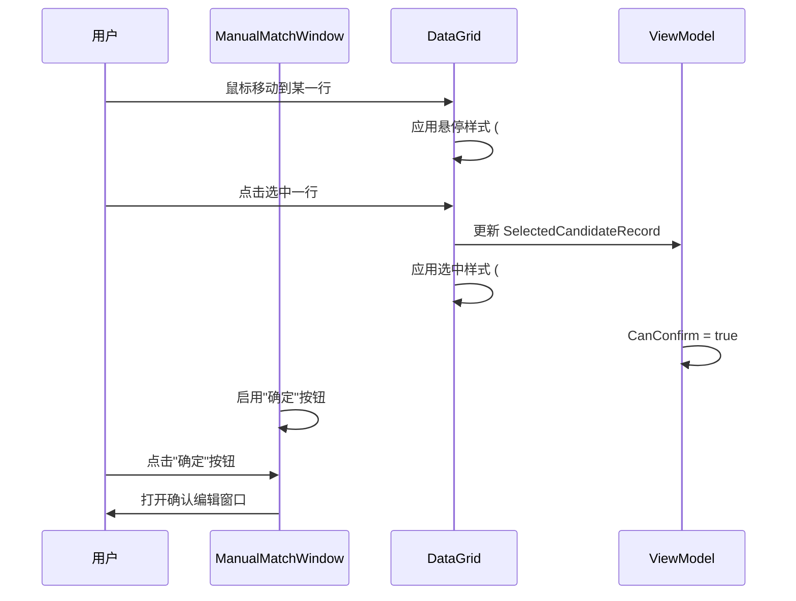

# Proposal: Manual Match Window Selection Indicator

## Why

在 MaterialClient 应用的手动匹配流程中，用户需要从可匹配订单列表中单选一个订单进行匹配。当前实现中，DataGrid 的选中行背景色（#C8DCFF）与悬停背景色（#F0F7FF）对比度不足，导致用户难以清晰识别当前选中的行，尤其在列表包含多个相似数据项时更为明显。这增加了操作错误的风险，降低了匹配效率和用户体验。

## What Changes

**已选择方案：方案 A - 主题色背景 + 左侧边框 + 白色文字**

增强 DataGrid 选中行的视觉对比度，使用主题色 PrimaryBlue (#4169E1) 作为选中背景
- 添加左侧蓝色边框指示器（3px solid #4169E1），提供额外的视觉锚点
- 调整选中行的文字颜色为白色，确保在深色背景下的可读性
- 保持悬停状态与选中状态的清晰视觉区分
- 确保所有主题变体（Light/Dark）下的视觉一致性

**新增：方案演示项目**
创建一个独立的 Avalonia 演示项目，用于可视化展示所有设计方案（A、B、C、D）的 UI 渲染效果和交互行为，便于方案评审和决策验证。

> **方案选择说明**：经过方案对比评估（详见 design.md），选择方案 A 以获得最佳视觉对比度和用户体验。该方案提供多重视觉反馈（颜色 + 边框 + 文字），符合 WCAG AA 无障碍标准，并与应用主题系统保持一致。

## UI 原型

### 当前状态

```
┌─────────────────────────────────────────────────────────────────┐
│ 可匹配订单信息                                                   │
├─────────────────────────────────────────────────────────────────┤
│ 车牌号 │ 供料单位 │ 车辆重量（吨） │ 进场时间 │ 相隔时间 │ 操作   │
├─────────────────────────────────────────────────────────────────┤
│ 粤B12345 │ XX建材  │ 25.50        │ 10:30   │ 5分钟   │ [查看] │  ← 悬停 #F0F7FF
│ 粤B12345 │ XX建材  │ 25.50        │ 10:25   │ 10分钟  │ [查看] │  ← 选中 #C8DCFF
│ 粤B12345 │ XX建材  │ 25.50        │ 10:20   │ 15分钟  │ [查看] │
└─────────────────────────────────────────────────────────────────┘
       ↑ 选中色与悬停色对比度不足，难以区分
```

### 改进后状态

```
┌─────────────────────────────────────────────────────────────────┐
│ 可匹配订单信息                                                   │
├─────────────────────────────────────────────────────────────────┤
│ 车牌号 │ 供料单位 │ 车辆重量（吨） │ 进场时间 │ 相隔时间 │ 操作   │
├─────────────────────────────────────────────────────────────────┤
│ 粤B12345 │ XX建材  │ 25.50        │ 10:30   │ 5分钟   │ [查看] │  ← 悬停 #F0F7FF
├粤B12345 │ XX建材  │ 25.50        │ 10:25   │ 10分钟  │ [查看] │┤  ← 选中 #4169E1 + 左边框 + 白色文字
│ 粤B12345 │ XX建材  │ 25.50        │ 10:20   │ 15分钟  │ [查看] │
└─────────────────────────────────────────────────────────────────┘
       ↑ 明显的视觉对比，清晰识别选中状态
```

## 用户交互流程



## 代码变更表

| 文件路径 | 变更类型 | 变更原因 | 影响范围 |
|---------|---------|---------|---------|
| `MaterialClient/App.axaml` | 修改 | 更新全局 DataGrid 选中行样式 | 所有使用 DataGrid 的窗口 |
| `MaterialClient/Views/ManualMatchWindow.axaml` | 无需修改 | 使用全局样式 | 仅影响此窗口的 DataGrid |
| `MaterialClient.Demo/` (新增) | 新增项目 | 方案演示项目，展示所有设计方案的视觉效果 | 仅用于演示和评审 |

## Capabilities

### New Capabilities
- `datagrid-selection-indicator`: 定义 DataGrid 选中状态的视觉规范，包括背景色、边框指示器和文字颜色的组合使用

### Modified Capabilities
- 无现有能力需要修改

## Impact

**影响范围**：
- **代码变更**：仅需修改 `App.axaml` 中的全局 DataGrid 样式定义
- **向后兼容性**：完全兼容，不破坏现有功能
- **性能影响**：无，仅修改样式渲染
- **用户体验**：显著提升手动匹配流程中的交互清晰度
- **依赖变更**：无需新增依赖

**风险**：
- 选中行使用深色背景需要确保文字颜色调整为白色以保持可读性
- 需要验证在暗色主题下的视觉效果
- 全局样式变更会影响应用中所有 DataGrid 控件，需要确保通用性
