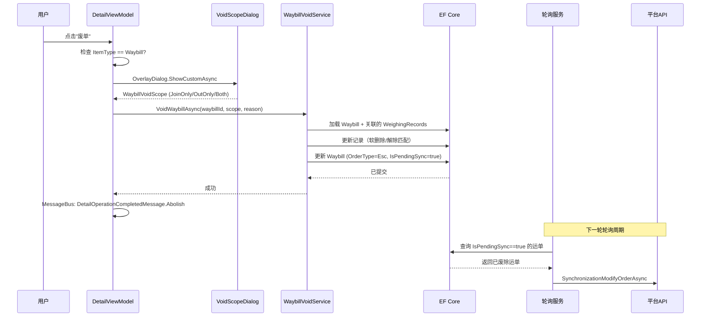

## Context

有人值守称重详情视图（`AttendedWeighingDetailView.axaml`）显示两种类型的列表项：
- **WeighingRecord**（未匹配，`MatchedId == null`）：等待配对的单次称重记录。
- **Waybill**（已匹配，`OrderType` 为 `FirstWeight` 或 `Completed`）：已配对的进场+出场记录集。

当前"废单"按钮始终可见，调用 `AttendedWeighingDetailViewModelBase` 中的 `AbolishAsync()`。该方法存在两个问题：

1. **运单使用了错误的仓储**：调用 `_weighingRecordRepository.DeleteAsync(_listItem.Id)`。当 `_listItem.ItemType == WeighingListItemType.Waybill` 时，ID 是运单 ID 而非称重记录 ID —— 删除操作指向了错误的表。
2. **无范围选择**：执行单一的硬删除，无法选择性地只废除配对中的一侧。

匹配流程（`CreateWaybillAsync`）双向关联记录：
- `joinRecord.MatchAsJoin(outRecord.Id, waybillId)` → 设置 `MatchedId`、`WaybillId`、`MatchedType=Join`
- `outRecord.MatchAsOut(joinRecord.Id, waybillId)` → 设置 `MatchedId`、`WaybillId`、`MatchedType=Out`

列表查询（`GetListItemsAsync`）通过 `MatchedId == null` 筛选未匹配记录，因此清除保留记录上的这些字段会使其自动重新出现在未匹配列表中。

```
当前按钮可见性（废单无 IsVisible 绑定）：
┌──────────────────────────────────────────────────────────┐
│  [保存]  [下一个]  [完成本次收货]    [匹配]  [废单]      │
│   always   always  Waybill+!Completed  !Waybill  always  │
└──────────────────────────────────────────────────────────┘

变更后目标按钮可见性：
┌──────────────────────────────────────────────────────────┐
│  [保存]  [下一个]  [完成本次收货]    [匹配]  [废单]      │
│   always   always  Waybill+!Completed  !Waybill  !Comp  │
└──────────────────────────────────────────────────────────┘
  废单隐藏条件: ItemType == Waybill && OrderType == Completed
```

## Goals / Non-Goals

**Goals:**
- 修复现有 `AbolishAsync`，使其正确处理 WeighingRecord 和 Waybill 两种列表项类型。
- 运单废除时新增范围选择对话框（OverlayDialog），提供 JoinOnly / OutOnly / Both 选项。
- 实现部分废除：废除一条记录，解除另一条的匹配使其重新进入未匹配池。
- 通过现有轮询同步机制（`IsPendingSync = true` + `SynchronizationModifyOrderAsync`）将已废除运单同步到平台。
- 使用 Ursa.Avalonia `OverlayDialog.ShowCustomAsync` 实现选择对话框，与项目现有对话框模式一致。

**Non-Goals:**
- 更改现有的 WeighingRecord 级别废除流程（单条未匹配记录删除）。
- 在 `AbortReason` 已有功能之外添加废除原因或审计日志。
- 修改轮询/同步基础设施。
- 实现废除操作的撤销/回滚。

## Decisions

### Decision 1: 范围选择仅适用于 FirstWeight 运单

**选择**：范围选择对话框仅在 `_listItem.ItemType == WeighingListItemType.Waybill && _listItem.OrderType == OrderTypeEnum.FirstWeight` 时显示。对于 WeighingRecord 列表项，保留现有的单条删除行为。已完成运单（`OrderType == Completed`）不可废除 —— "废单"按钮隐藏。

**理由**：只有 FirstWeight 运单代表正在进行中、可能需要纠正的配对。已完成运单已定稿并同步到平台；废除它们会导致数据不一致。WeighingRecord 没有 Join/Out 区分 —— 它是单次称重。

**考虑的替代方案：**
- 两种类型都显示对话框（WeighingRecord 加单选项） —— 增加不必要的操作摩擦。
- 允许带额外确认地废除已完成运单 —— 风险过高，已完成运单已同步。
- 移除 WeighingRecord 的废除按钮 —— 影响太大，操作员依赖此功能。

### Decision 2: 使用 Ursa.Avalonia OverlayDialog（非 Window）

**选择**：将范围选择实现为 `UserControl` + `ViewModel` 对，通过 `OverlayDialog.ShowCustomAsync<WaybillVoidScopeSelectionDialog, WaybillVoidScopeSelectionViewModel, WaybillVoidScope?>` 显示。

**理由**：项目已使用 Ursa.Avalonia（MessageBox、Semi 主题）。OverlayDialog 提供模态覆盖行为，无需管理独立 Window 的生命周期。现有的 `ConfirmTextDialog` 使用独立 Window 模式，但 Ursa 参考文档推荐 OverlayDialog 用于此类选择交互。

**考虑的替代方案：**
- 独立 Window（如现有 `ConfirmTextDialog`） —— 更重，z-order 和生命周期管理更复杂。
- 带自定义按钮的 MessageBox —— 无法满足 3 选项+描述的选择需求。

### Decision 3: 在领域层新增 WaybillVoidScope 枚举

**选择**：在 `MaterialClient.Common/Entities/Enums/` 中定义 `WaybillVoidScope` 领域枚举：
```csharp
public enum WaybillVoidScope
{
    JoinOnly = 0,  //废除进场记录，解除出场记录匹配
    OutOnly = 1,   //废除出场记录，解除进场记录匹配
    Both = 2       //同时废除两条记录和运单
}
```

**理由**：枚举位于领域层，因为废除逻辑是领域关注点。ViewModel 和对话框消费它但不定义它。

### Decision 4: 为 WeighingRecord 新增 Unmatch() 方法

**选择**：在 `WeighingRecord` 上新增领域方法 `Unmatch()`，清除 `MatchedId`、`WaybillId` 和 `MatchedType`。

**理由**：遵循 AGENTS.md 中的信息专家和富领域模型原则。记录拥有其匹配状态，应封装解除匹配的行为。

### Decision 5: 为 Waybill 新增 AbortWaybill() 方法

**选择**：在 `Waybill` 上新增领域方法 `AbortWaybill(string reason)`，设置 `OrderType = Esc` 和 `AbortReason = reason`。

**理由**：与 Decision 4 相同 —— 运单实体拥有其生命周期状态。这与现有的 `OrderTypeFirstWeight()` 和 `OrderTypeCompleted()` 方法一致。

### Decision 6: 创建 WaybillVoidService 领域服务

**选择**：创建新的 `WaybillVoidService`（实现 `IWaybillVoidService, ITransientDependency`），编排选择性废除逻辑，包括加载关联的 WeighingRecord、调用领域方法和持久化变更。

**理由**：废除操作跨越多个实体（Waybill + 2 条 WeighingRecord），需要事务一致性。专用服务将逻辑从 ViewModel 中分离，同时遵循 ABP 服务注册模式。

### Decision 7: 通过现有同步机制同步已废除运单

**选择**：废除运单后，在其上调用 `SetPendingSync()` 设置 `IsPendingSync = true`。现有的轮询服务 `PushUpdatedWaybillsAsync` 会自动检测到该运单，并通过 `SynchronizationModifyOrderAsync` 将更新后的状态（`OrderType = Esc`）同步到平台。无需新增 API 端点。

**理由**：`SynchronizationModifyOrderAsync` 已支持修改订单信息，废除后运单的 `OrderType` 变为 `Esc`，只需标记待同步即可由现有轮询机制推送。避免新增端点，减少 API 层变更和平台侧的适配成本。

**考虑的替代方案：**
- 新增 `CancelOrderAsync` 端点 —— 需要平台侧同步开发和部署，改动更大。
- 完全不同步 —— 导致平台状态不一致。

### Decision 8: 在详情 ViewModel 中注入 IWaybillRepository

**选择**：在 `AttendedWeighingDetailViewModelBase` 中注入 `IRepository<Waybill, long>`，与现有的 `_weighingRecordRepository` 并列。

**理由**：当前 `AbolishAsync` 对 Waybill ID 错误地使用了 `_weighingRecordRepository`。添加运单仓储修复了此问题并支持新的废除流程。

## Risks / Trade-offs

**[风险] 废除操作中途中断导致数据不一致** → 缓解措施：`WaybillVoidService` 方法使用 `[UnitOfWork]` 装饰，确保原子提交。操作失败时所有变更回滚。

**[风险] 部分废除后保留的记录可能没有有效的匹配候选** → 缓解措施：保留的记录以 `MatchedId == null` 重新进入未匹配池。可通过现有 `ManualMatchAsync` 流程（minWeightDiff = 0.1）进行手动匹配。不尝试自动匹配 —— 操作员必须手动找到新的配对。

**[风险] 平台同步延迟** → 缓解措施：废除运单设置 `IsPendingSync = true`，轮询服务按现有周期推送。同步延迟期间平台可能显示运单为活动状态，但本地状态已正确更新。

## Component Architecture

```
组件层次结构
├── AttendedWeighingViewModel (列表视图)
│   ├── AttendedWeighingDetailViewModelBase (详情视图)
│   │   ├── StandardWeighingDetailViewModel
│   │   └── SolidWasteWeighingDetailViewModel
│   └── MessageBus (DetailOperationCompletedMessage)
│
├── WaybillVoidScopeSelectionDialog (OverlayDialog UserControl)
│   └── WaybillVoidScopeSelectionViewModel (选择状态)
│
├── WaybillVoidService (领域服务)
│   ├── IRepository<Waybill, long>
│   └── IRepository<WeighingRecord, long>
│
└── PollingBackgroundService (现有)
    └── PushUpdatedWaybillsAsync → SynchronizationModifyOrderAsync (现有)
```

## Data Flow

```mermaid
flowchart TD
    A[用户点击"废单"] --> B{ItemType?}
    B -->|WeighingRecord| C[确认 MessageBox]
    C -->|是| D[DeleteAsync 称重记录]
    D --> E[发送 DetailOperationCompletedMessage.Abolish]
    E --> F[刷新列表，选择下一个未匹配项]

    B -->|Waybill| G{OrderType?}
    G -->|FirstWeight| H[显示 WaybillVoidScopeSelectionDialog]
    G -->|Completed| I[按钮已隐藏，不可达]

    H -->|JoinOnly| J[VoidWaybillAsync JoinOnly]
    H -->|OutOnly| K[VoidWaybillAsync OutOnly]
    H -->|Both| L[VoidWaybillAsync Both]
    H -->|取消| M[无操作]

    J --> N[软删除进场记录，解除出场记录匹配，废除运单，SetPendingSync]
    K --> O[软删除出场记录，解除进场记录匹配，废除运单，SetPendingSync]
    L --> P[软删除两条记录，废除运单，SetPendingSync]

    N --> Q[发送 DetailOperationCompletedMessage.Abolish]
    O --> Q
    P --> Q
    Q --> F

    Q -.->|轮询服务| R[PushUpdatedWaybillsAsync → SynchronizationModifyOrderAsync]
```

## API Call Sequence



## Detailed Code Changes

| 文件路径 | 变更类型 | 变更说明 | 影响模块 |
|---------|---------|---------|---------|
| `MaterialClient.Common/Entities/Enums/WaybillVoidScope.cs` | 新增 | 枚举：JoinOnly, OutOnly, Both | Domain |
| `MaterialClient.Common/Entities/WeighingRecord.cs` | 修改 | 新增 `Unmatch()` 方法 | Domain |
| `MaterialClient.Common/Entities/Waybill.cs` | 修改 | 新增 `AbortWaybill(string reason)` 方法 | Domain |
| `MaterialClient.Common/Services/WaybillVoidService.cs` | 新增 | 选择性废除编排的领域服务 | Domain Service |
| `MaterialClient/ViewModels/AttendedWeighingDetailViewModelBase.cs` | 修改 | 注入 WaybillRepository，重写 AbolishAsync 加入范围选择 | ViewModel |
| `MaterialClient/Views/Dialogs/WaybillVoidScopeSelectionDialog.axaml` | 新增 | 范围选择的 OverlayDialog UserControl | UI |
| `MaterialClient/Views/Dialogs/WaybillVoidScopeSelectionDialog.axaml.cs` | 新增 | Code-behind | UI |
| `MaterialClient/ViewModels/WaybillVoidScopeSelectionViewModel.cs` | 新增 | 对话框 ViewModel | ViewModel |

## Dialog Layout Design

废除范围选择对话框以 Ursa.Avalonia OverlayDialog 居中显示在父窗口上方。采用紧凑布局，包含标题、三个单选按钮选项和操作按钮。

```
┌──────────────────────────────────────────────────────┐
│  废单 - 选择废除范围                              [×] │
├──────────────────────────────────────────────────────┤
│                                                      │
│  ○ 进场称重记录                                      │
│    仅废除进场称重记录，出场记录将恢复为待匹配状态     │
│                                                      │
│  ○ 出场称重记录                                      │
│    仅废除出场称重记录，进场记录将恢复为待匹配状态     │
│                                                      │
│  ○ 全部废除                                          │
│    同时废除进出场称重记录和运单                      │
│                                                      │
├──────────────────────────────────────────────────────┤
│                              [取消]  [确认(禁用)]    │
└──────────────────────────────────────────────────────┘
                          ↑ 未选择任何选项时"确认"按钮禁用
```

**布局说明：**
- 每个单选项使用 `RadioButton`，包含标题文本和描述用的次级 `TextBlock`。
- 默认不选中任何选项 —— 用户必须显式选择废除范围，防止误操作。
- "确认"按钮在未选择任何选项时处于禁用状态（`IsEnabled` 绑定到 `SelectedScope != null`）。
- "确认"按钮使用 `Classes="Primary"`；"取消"为普通按钮。
- 对话框宽度固定约 420px（与现有 `ConfirmTextDialog` 宽度一致）。
- `CanLightDismiss = false` —— 用户必须显式选择操作。

**XAML 结构：**

```
UserControl (WaybillVoidScopeSelectionDialog)
└── StackPanel (Spacing="16", Margin="24")
    ├── TextBlock (标题/说明文本)
    ├── StackPanel (RadioButton 组, Spacing="12")
    │   ├── RadioButton (JoinOnly, GroupName=VoidScope)
    │   │   └── StackPanel
    │   │       ├── TextBlock "进场称重记录"
    │   │       └── TextBlock (描述, Foreground="#666", FontSize="12")
    │   ├── RadioButton (OutOnly, GroupName=VoidScope)
    │   │   └── StackPanel
    │   │       ├── TextBlock "出场称重记录"
    │   │       └── TextBlock (描述, Foreground="#666", FontSize="12")
    │   └── RadioButton (Both, GroupName=VoidScope)
    │       └── StackPanel
    │           ├── TextBlock "全部废除"
    │           └── TextBlock (描述, Foreground="#666", FontSize="12")
    └── StackPanel (HorizontalAlignment="Right", Spacing="8")
        ├── Button "取消" (Command=CancelCommand)
        └── Button "确认" (Command=ConfirmCommand, Classes="Primary"
                         IsEnabled={Binding HasSelection})
```

## Open Questions

无 —— 所有关键决策已确定。
