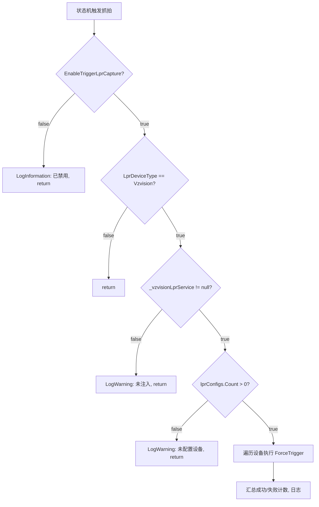

## Context

`AttendedWeighingService.TriggerVzvisionCaptureForAllAsync` 是称重状态机中触发 LPR 抓拍的核心方法，在三个阶段被调用：`WaitingForStability`、`WeightStabilized`、`OffScale`。当前方法开头有硬编码的 `LogWarning` + `return`，使后续约 55 行完整抓拍逻辑成为不可达死代码。

配置体系中没有 `LprSettings` 类。LPR 相关配置分散在 `SystemSettings`（`LprDeviceType`）和 `LicensePlateRecognitionConfig`（设备列表）中。功能开关作为系统级属性，放置在 `SystemSettings` 中与 `LprDeviceType` 同级，语义最自然。

该方法当前命名为 `TriggerVzvisionCaptureForAllAsync`，但抓拍逻辑应通用化以支持未来海康等设备，因此重命名为 `TriggerLprCaptureForAllAsync`。

## Goals / Non-Goals

**Goals:**

- 将方法重命名为 `TriggerLprCaptureForAllAsync`，体现通用 LPR 语义
- 移除硬编码限制，恢复方法的完整执行路径
- 新增 `EnableTriggerLprCapture` 配置属性作为通用 LPR 主动抓拍功能总开关，默认 `false`
- 在设置窗口提供 UI 开关

**Non-Goals:**

- 不改变抓拍逻辑本身的实现（设备遍历、错误处理、日志等）
- 不修改 `VzvisionLprService` 或 `IVzvisionLprService` 接口
- 不改变 `LicensePlateRecognitionConfig` 数据模型
- 本次不实现海康设备的主动抓拍（仅预留通用命名和开关）

## Decisions

### 1. 功能开关放在 `SystemSettings` 而非 `LicensePlateRecognitionConfig`

**选择**: 在 `SystemSettings` 中新增 `EnableTriggerLprCapture` 属性。

**替代方案**: 在 `LicensePlateRecognitionConfig` 中新增，实现每设备粒度控制。

**理由**: 这是系统级总开关，控制"是否执行 LPR 主动抓拍"这一行为，而非"某台设备是否参与抓拍"。与 `LprDeviceType` 同级，语义一致。若未来需要每设备控制，可在 `LicensePlateRecognitionConfig` 中单独添加。

### 2. 通用化命名：`TriggerLprCaptureForAllAsync`

**选择**: 将方法从 `TriggerVzvisionCaptureForAllAsync` 重命名为 `TriggerLprCaptureForAllAsync`。

**替代方案**: 保持原名称，仅在配置开关处通用化。

**理由**: 抓拍功能应覆盖所有 LPR 设备类型（Vzvision、海康等）。方法名通用化后，未来扩展海康抓拍时无需再次重命名，避免调用方（三个状态转换方法）的连锁修改。配置开关对应命名为 `EnableTriggerLprCapture`。

### 3. 默认值 `false`

**选择**: `EnableTriggerLprCapture` 默认 `false`。

**理由**: 当前功能处于禁用状态，默认 `false` 保持行为不变（安全迁移）。运维确认设备就绪后，在设置中手动启用。

### 4. 禁用时使用信息级日志

**选择**: 禁用时记录 `LogInformation` 而非 `LogWarning`。

**理由**: 禁用是正常配置状态，不是异常或警告。当前的 `LogWarning` 是临时开发调试用的，不应保留到生产。

### 5. 守卫位置：方法最前面

**选择**: 在方法体第一行检查 `EnableTriggerLprCapture`，早于现有的 `LprDeviceType` 检查。

**理由**: 功能开关是最高优先级的守卫。即使设备类型已选、服务已注入、设备已配置，若总开关关闭也不应执行任何逻辑。

## Risks / Trade-offs

- **[启用后无设备]** → 已有守卫：`_vzvisionLprService == null` 和 `lprConfigs.Count == 0` 会拦截，不会异常
- **[老配置文件无该字段]** → JSON 反序列化自动使用默认值 `false`，无迁移问题
- **[误启用导致频繁抓拍]** → 可通过设置窗口快速关闭，无需改代码或重启服务
- **[方法重命名影响]** → 三个内部调用方（`TriggerCaptureOnWaitingForStabilityAsync`、`TriggerCaptureOnWeightStabilizedAsync`、`TriggerCaptureOnOffScaleAsync`）均为 private 方法，影响范围可控

```
调用链守卫顺序
├── TriggerLprCaptureForAllAsync(phase)
│   ├── [NEW] EnableTriggerLprCapture? ── No → LogInformation, return
│   ├── LprDeviceType == Vzvision? ── No → return
│   ├── _vzvisionLprService != null? ── No → LogWarning, return
│   ├── lprConfigs.Count > 0? ── No → LogWarning, return
│   └── 执行抓拍逻辑 (VzLPRClient_ForceTrigger)
```


