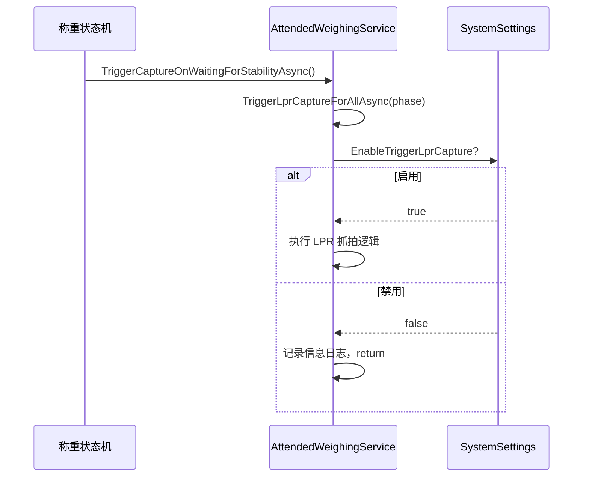

## Why

`TriggerVprCaptureForAllAsync` 方法中存在硬编码的 `return` 阻断，使整个 LPR 抓拍逻辑（约 55 行）变为不可达死代码。同时，该功能是否启用完全硬编码，无法通过配置灵活控制——运维或部署时若需临时禁用抓拍，必须修改代码并重新编译。该功能应通用化，不仅限于 Vzvision，未来需支持海康等设备的主动抓拍。

## What Changes

- 将 `TriggerVzvisionCaptureForAllAsync` 重命名为 `TriggerLprCaptureForAllAsync`，体现通用 LPR 语义
- 移除方法中的硬编码限制代码（`LogWarning` + `return`）
- 在 `SystemSettings` 中新增 `EnableTriggerLprCapture` 布尔属性作为通用 LPR 主动抓拍功能总开关
- 在方法入口处添加基于该配置的条件守卫，禁用时记录信息日志并提前返回
- 在设置窗口的"车牌识别设置"区域添加对应的 UI 开关

## Capabilities

### New Capabilities

_无新能力——本次变更是对现有行为的启用与配置化。_

### Modified Capabilities

- `vzvision-lpr-sdk`: 新增 `EnableTriggerLprCapture` 功能开关作为主动抓拍的前置条件
- `system-configuration`: `SystemSettings` 新增 `EnableTriggerLprCapture` 属性

## Impact

| 文件路径 | 变更类型 | 变更原因 | 影响范围 |
|---------|---------|---------|---------|
| `MaterialClient.Common/Configuration/SystemSettings.cs` | 修改 | 新增 `EnableTriggerLprCapture` 属性 | 配置层 |
| `MaterialClient.Common/Services/AttendedWeighingService.cs` | 修改 | 重命名方法、移除硬编码限制、添加配置守卫 | 业务逻辑 |
| `MaterialClient/Views/SettingsWindow.axaml` | 修改 | 添加 UI 开关 | 设置界面 |
| `MaterialClient/Views/SettingsWindow.axaml.cs` | 修改 | 绑定新属性 | 设置界面 |

无 API 变更，无新依赖，无数据库迁移。现有配置文件缺少该字段时使用默认值（`false`），向后兼容。

