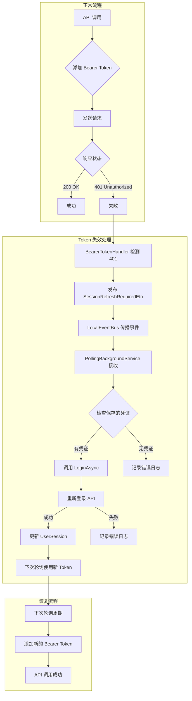
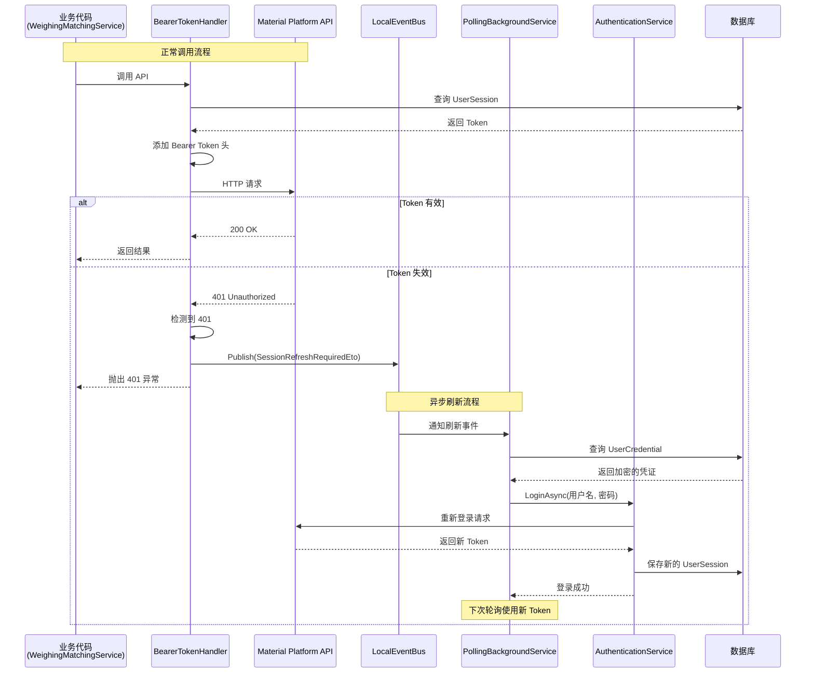

## Context

### 当前状态

材料客户端使用 Refit API 调用材料平台接口，通过 `MaterialPlatformBearerTokenHandler` 在每个请求中添加 Bearer Token。当 token 因超时失效后，API 返回 401 Unauthorized 错误，当前实现直接抛出异常，导致同步运单等后台任务失败，无法自动恢复。

### 约束条件

1. **非侵入式设计**：授权失败检查不应入侵业务代码，如 `WeighingMatchingService.SyncNewWaybillAsync`
2. **允许任务失败**：当前轮询任务允许失败，不阻塞后台任务队列
3. **异步恢复**：期望在下次轮询时获得正确授权，而非同步重试
4. **项目约定**：必须遵循 AGENTS.md 中的编码规范

## Goals / Non-Goals

**Goals:**
- 自动检测 API 401 响应并触发会话刷新机制
- 通过 ABP LocalEventBus 发送异步事件，解耦认证失败检测与处理逻辑
- 后台轮询服务订阅事件并自动重新登录
- 当前请求正常失败，不影响系统稳定性

**Non-Goals:**
- 不在 API 调用方（如 `WeighingMatchingService`）中添加重试逻辑
- 不同步阻塞等待重新登录完成
- 不修改现有业务代码的异常处理逻辑

## Decisions

### 1. 在 Bearer Token Handler 中检测 401 响应

**决策**：在 `MaterialPlatformBearerTokenHandler.SendAsync` 方法中检测 401 响应，而非在业务代码中检测。

**理由**：
- **非侵入式**：业务代码无需修改，所有 API 调用自动受益
- **统一处理**：所有使用 `IMaterialPlatformApi` 的调用都会被覆盖
- **符合单一职责原则**：认证相关逻辑集中在 Token Handler 中

**替代方案考虑**：
- *在业务代码中检测*：会导致代码重复，违反 DRY 原则
- *使用 Refit 的异常过滤器*：Refit 本身不提供内置的异常过滤器机制

### 2. 使用 ABP LocalEventBus 发送异步事件

**决策**：创建 `SessionRefreshRequiredEto` 事件，通过 ABP 的 `ILocalEventBus` 发布。

**理由**：
- **ABP 框架集成**：项目已使用 ABP 框架，LocalEventBus 是内置的事件总线
- **解耦设计**：检测方和处理方完全解耦，符合事件驱动架构
- **异步非阻塞**：发布事件不等待处理完成，当前请求正常失败
- **依赖注入支持**：可直接注入 `ILocalEventBus` 使用

**替代方案考虑**：
- *同步调用 AuthenticationService*：会导致阻塞，违反"允许任务失败"的原则
- *使用 ReactiveUI MessageBus*：适用于 ViewModel 间通信，对于后台服务事件，ABP LocalEventBus 更合适

### 3. 当前请求正常失败，不进行同步重试

**决策**：401 响应正常传播到调用方，不进行同步重试或拦截。

**理由**：
- **简化错误处理**：调用方可以继续使用现有的异常处理逻辑
- **避免级联问题**：同步重试可能导致长时间阻塞或死锁
- **渐进式恢复**：下次轮询时自然恢复，符合后台任务的设计模式

### 4. 后台轮询服务订阅事件并自动重新登录

**决策**：在 `PollingBackgroundService` 中订阅 `SessionRefreshRequiredEto`，收到后调用 `AuthenticationService.LoginAsync`。

**理由**：
- **现有基础设施**：项目已有轮询服务，是处理周期性任务的理想位置
- **自动恢复**：无需人工干预，系统自动获取新 token
- **利用保存的凭证**：`AuthenticationService` 已经支持从 `UserCredential` 读取保存的用户名和密码

**技术细节**：
```csharp
// 在 PollingBackgroundService 中
public override Task StartAsync(CancellationToken cancellationToken)
{
    _eventBus.Subscribe<SessionRefreshRequiredEto>(async eventData =>
    {
        var credential = await _authenticationService.GetSavedCredentialAsync();
        if (credential.HasValue)
        {
            await _authenticationService.LoginAsync(
                credential.Value.username,
                credential.Value.password,
                rememberMe: true);
        }
    });
    return base.StartAsync(cancellationToken);
}
```

## Architecture

### 组件架构图

```
Token Refresh Architecture
│
├── Infrastructure Layer (基础设施层)
│   ├── MaterialPlatformBearerTokenHandler
│   │   ├── 添加 Bearer Token 到请求头
│   │   └── 检测 401 响应并发布事件
│   │
│   └── PollingBackgroundService (ABP BackgroundWorker)
│       ├── 执行周期性同步任务
│       ├── 订阅 SessionRefreshRequiredEto
│       └── 处理重新登录逻辑
│
├── Event Layer (事件层 - ABP LocalEventBus)
│   └── SessionRefreshRequiredEto
│       ├── ApiEndpoint (string)
│       ├── StatusCode (int)
│       └── OccurredAtUtc (DateTime)
│
├── Domain Layer (领域层)
│   ├── UserSession (Entity)
│   ├── UserCredential (Entity)
│   └── AuthenticationService
│       ├── LoginAsync()
│       ├── GetSavedCredentialAsync()
│       └── HasActiveSessionAsync()
│
└── Application Layer (应用层)
    └── WeighingMatchingService
        ├── SyncNewWaybillAsync() (无需修改)
        └── PushWaybillAsync() (无需修改)
```

### 数据流图



### API 调用时序图



## Risks / Trade-offs

### [Risk] 频繁的重新登录可能导致 API 限流

**缓解措施**：
- 添加刷新间隔限制（如 5 分钟内只刷新一次）
- 记录详细的日志，包括刷新频率统计

### [Risk] 保存的凭证可能已失效（如用户密码已更改）

**缓解措施**：
- 重新登录失败时记录错误日志
- 考虑添加通知机制（如显示 Toast 提示用户重新登录）

### [Trade-off] 当前请求失败 vs. 同步重试

**权衡**：
- **优点**：简化实现，避免阻塞和死锁
- **缺点**：当前操作会失败，用户体验略有下降
- **结论**：对于后台轮询任务，这是可接受的权衡

## Migration Plan

### 部署步骤

1. **添加事件 ETO 类**：创建 `MaterialClient.Common/Events/SessionRefreshRequiredEto.cs`
2. **修改 Bearer Token Handler**：在 `MaterialPlatformBearerTokenHandler.SendAsync` 中检测 401 并发布事件
3. **修改轮询服务**：添加对 `SessionRefreshRequiredEto` 的订阅和处理
4. **测试**：
   - 模拟 token 失效场景
   - 验证事件正确发布和接收
   - 确认重新登录成功后后续请求正常

### 回滚策略

如果出现问题，可以通过以下步骤回滚：
1. 移除 `MaterialPlatformBearerTokenHandler` 中的 401 检测代码
2. 移除轮询服务中的事件订阅
3. 删除 `SessionRefreshRequiredEto` 文件

## Open Questions

1. **刷新频率限制**：是否需要添加最小刷新间隔（如 5 分钟）防止频繁刷新？
   - **建议**：初始实现不添加，根据生产环境反馈再决定

2. **用户通知**：重新登录失败时是否需要通知用户？
   - **建议**：初始实现仅记录日志，后续可考虑添加 UI 通知

3. **轮询服务重启**：如果轮询服务重启，是否会丢失正在处理的刷新请求？
   - **建议**：由于设计为异步非阻塞，丢失单个请求是可以接受的

## 详细代码变更清单

| 文件路径 | 变更类型 | 变更说明 | 影响模块 |
|---------|---------|---------|---------|
| `MaterialClient.Common/Events/SessionRefreshRequiredEto.cs` | 新增 | 创建认证失败事件 ETO 类，包含 ApiEndpoint、StatusCode、OccurredAtUtc 属性 | 事件系统 |
| `MaterialClient.Common/Api/MaterialPlatformBearerTokenHandler.cs` | 修改 | 1. 注入 ILocalEventBus<br/>2. 在 SendAsync 中添加 401 检测逻辑<br/>3. 检测到时发布 SessionRefreshRequiredEto | HTTP 客户端 |
| `MaterialClient/Backgrounds/PollingBackgroundService.cs` | 修改 | 1. 注入 ILocalEventBus<br/>2. 在 StartAsync 中订阅 SessionRefreshRequiredEto<br/>3. 添加重新登录处理方法 | 后台任务 |
| `MaterialClient.Common.Tests/Services/AuthenticationServiceTests.cs` | 新增 | 添加自动重新登录的集成测试 | 测试覆盖 |
