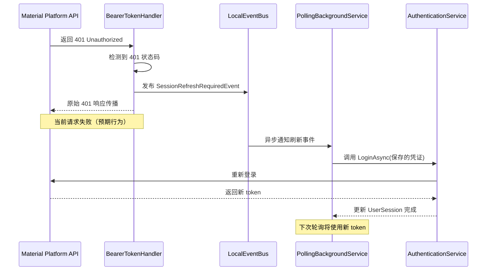

## Why

当前材料客户端在调用材料平台 API 时，当 token 因超时失效后返回 401 Unauthorized 错误，系统直接抛出异常而无法自动恢复。这导致同步运单等关键操作频繁失败，影响业务连续性。

## What Changes

- **新增**：Token 失效检测与自动刷新机制
  - 捕获 API 调用中的 401 Unauthorized 异常
  - 发送异步刷新 Session 的事件通知
  - 允许当前轮询任务失败，不阻塞后台任务队列
  - 期望在下次轮询时获得有效授权

- **非侵入式设计**：授权失败检查不应入侵业务代码，通过通用机制处理

- **风险控制**：设置重试次数限制防止无限循环

## Capabilities

### New Capabilities
- `token-refresh-on-auth-failure`: 当 API 调用返回 401 Unauthorized 时，自动触发 token 刷新机制，允许后台任务在下个轮询周期恢复执行

### Modified Capabilities
None

## Impact

**Affected Code**:
- `MaterialClient.Common.Services.WeighingMatchingService.SyncNewWaybillAsync`
- `MaterialClient.Common.Services.IMaterialPlatformApi` 及其实现
- 需要新增认证失败事件和 Session 刷新处理逻辑

**Dependencies**:
- Refit API 异常处理
- ABP LocalEventBus 用于事件通信

**Systems**:
- 材料平台 API 调用层
- 后台轮询任务调度系统
- Session 管理

## 用户交互流程

当 token 失效时，系统自动处理重新登录，用户无需任何操作：

## 代码变更表

| 文件路径 | 变更类型 | 变更原因 | 影响范围 |
|---------|---------|---------|---------|
| `MaterialClient.Common/Events/SessionRefreshRequiredEvent.cs` | 新增 | 定义认证失败事件（ABP Event） | 事件系统 |
| `MaterialClient.Common/Api/MaterialPlatformBearerTokenHandler.cs` | 修改 | 添加 401 检测和事件发布 | 所有 API 调用 |
| `MaterialClient/Backgrounds/PollingBackgroundService.cs` | 修改 | 添加事件订阅和重新登录逻辑 | 后台任务恢复 |
