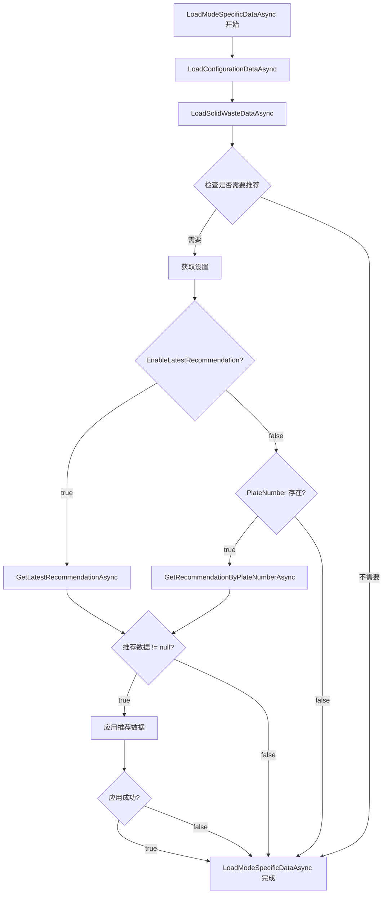
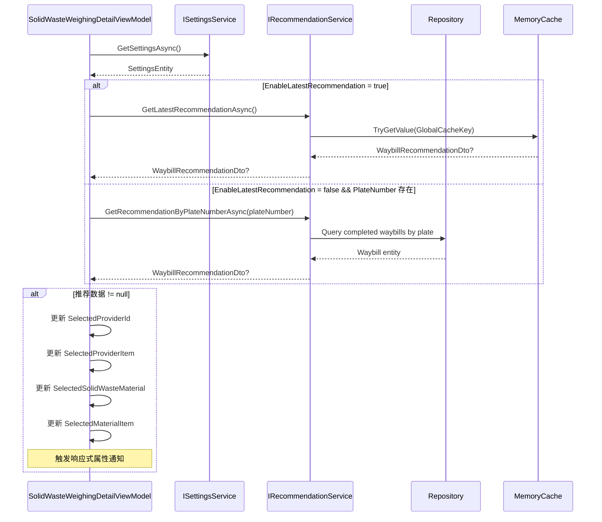

# Design: Solid Waste Waybill Recommendation

## Context

### Current State

标准称重模式（`StandardWeighingDetailViewModel`）已实现运单自动推荐功能，该功能：
- 读取 `SystemSettings.EnableLatestRecommendation` 配置
- 根据配置选择推荐数据源（缓存或数据库查询）
- 在 `LoadModeSpecificDataAsync()` 中应用推荐数据填充缺失字段

固废称重模式（`SolidWasteWeighingDetailViewModel`）目前：
- 继承自 `AttendedWeighingDetailViewModelBase`
- 在 `LoadModeSpecificDataAsync()` 中仅加载配置数据和 ExtraProperties
- 没有集成推荐服务

### Architecture Overview

```
AttendedWeighingDetailViewModelBase (抽象基类)
├── StandardWeighingDetailViewModel (已实现推荐)
│   ├── IRecommendationService (已注入)
│   └── ISettingsService (已注入)
└── SolidWasteWeighingDetailViewModel (待实现推荐)
    ├── IRecommendationService (待注入)
    └── ISettingsService (待注入)
```

### Existing Services

- **`IRecommendationService`**:
  - `GetRecommendationByPlateNumberAsync(string plateNumber)`: 根据车牌号查询数据库
  - `GetLatestRecommendationAsync()`: 从全局缓存读取最新推荐
  - `UpdateRecommendationCache(Waybill waybill)`: 更新缓存（由其他服务调用）

- **`ISettingsService`**:
  - `GetSettingsAsync()`: 返回包含 `SystemSettings.EnableLatestRecommendation` 的配置

### Data Model

```csharp
public record WaybillRecommendationDto(
    int? MaterialId,
    int? ProviderId,
    int? MaterialUnitId,
    decimal? WaybillQuantity
);
```

## Goals / Non-Goals

**Goals:**
- 在固废称重中实现与标准称重一致的推荐体验
- 复用现有的推荐服务和配置机制
- 最小化代码变更，遵循现有架构模式
- 确保 UI 响应式属性正确更新

**Non-Goals:**
- 不修改推荐服务的核心逻辑
- 不更改推荐配置的结构
- 不影响标准称重的现有推荐功能
- 不添加新的推荐数据源

## Decisions

### Decision 1: 复用 StandardWeighingDetailViewModel 的推荐模式

**Rationale:**
- `StandardWeighingDetailViewModel` 中的推荐实现已经过验证
- 相同的模式便于维护和理解
- 遵循 DRY 原则，避免重复代码

**Implementation:**
- 在 `SolidWasteWeighingDetailViewModel` 的构造函数中注入 `IRecommendationService` 和 `ISettingsService`
- 在 `LoadModeSpecificDataAsync()` 中添加与标准称重相同的推荐逻辑

**Alternative Considered:**
- 在基类 `AttendedWeighingDetailViewModelBase` 中实现推荐逻辑
- **Rejected**: 两种模式的数据加载逻辑差异较大（标准称重使用 `WeighingListItemMaterialDto`，固废称重使用 ExtraProperties），基类实现会增加复杂度

### Decision 2: 推荐数据应用策略

**Rationale:**
固废称重的字段映射与标准称重不同：
- 标准称重：直接设置 `SelectedProviderId` 和 `MaterialItemRow` 属性
- 固废称重：需要更新 `SelectedProviderItem`、`SelectedMaterialItem`、`SelectedStreetItem` 等选择器项

**Implementation:**
- 推荐数据仅用于填充缺失字段（非覆盖已有数据）
- 更新响应式属性以触发 UI 更新
- 对于固废特定的字段（如 `SelectedStreet`），不使用推荐数据（推荐服务不提供此信息）

**Field Mapping:**
| 推荐字段 | 固废称重属性 | 条件 |
|---------|-------------|------|
| `ProviderId` | `SelectedProviderId`, `SelectedProviderItem` | 原值为 null |
| `MaterialId` | `SelectedSolidWasteMaterial`, `SelectedMaterialItem` | 原值为 null |
| `MaterialUnitId` | `MaterialItems[0].SelectedMaterialUnit` | 原值为 null 且材料已选择 |
| `WaybillQuantity` | `GoodsWeight` (通过响应式链) | 原值为 null |

### Decision 3: 推荐时机

**Rationale:**
- `LoadModeSpecificDataAsync()` 是数据加载的扩展点，在此处集成推荐符合模板方法模式
- 在加载 ExtraProperties 之后应用推荐，确保推荐不覆盖已有的用户数据

**Implementation:**
```csharp
protected override async Task LoadModeSpecificDataAsync()
{
    // 1. 加载配置数据 (现有逻辑)
    await LoadConfigurationDataAsync();

    // 2. 加载 ExtraProperties (现有逻辑)
    await LoadSolidWasteDataAsync();

    // 3. 应用推荐 (新增逻辑)
    await ApplyRecommendationAsync();
}
```

### Decision 4: 错误处理

**Rationale:**
- 推荐失败不应阻塞数据加载流程
- 用户应能手动输入数据，即使推荐不可用

**Implementation:**
- 使用 try-catch 包裹推荐逻辑
- 记录错误日志但不抛出异常
- 推荐为 null 时静默跳过应用步骤

## Data Flow



## API Call Sequence



## Component Architecture

```
SolidWasteWeighingDetailViewModel
│
├── Dependencies (注入)
│   ├── IServiceProvider
│   ├── ILogger
│   ├── IOptions<StreetsConfig>
│   ├── IOptions<SolidWasteTypeConfig>
│   ├── IMaterialService (继承自基类)
│   ├── IProviderService (继承自基类)
│   ├── IRecommendationService (新增)
│   └── ISettingsService (新增)
│
├── Private Fields
│   ├── _recommendationService (新增)
│   └── _settingsService (新增)
│
└── Methods
    ├── Constructor (修改：注入新依赖)
    ├── LoadModeSpecificDataAsync (修改：添加推荐逻辑)
    ├── ApplyRecommendationAsync (新增)
    ├── LoadConfigurationDataAsync (不变)
    ├── LoadSolidWasteDataAsync (不变)
    └── ... 其他方法 (不变)
```

## Risks / Trade-offs

### Risk 1: 推荐数据与固废特定字段冲突

**Risk**: 推荐服务不提供固废特定字段（如 `Street`、`SolidWasteType`、`SolidWasteOrderNumber`），导致部分字段仍需手动输入。

**Mitigation**:
- 文档中明确说明推荐仅适用于通用字段
- UI 仍需支持手动输入固废特定字段

### Risk 2: 材料单位自动选择失败

**Risk**: 如果推荐了 `MaterialId` 但材料单位加载失败，可能导致数据不一致。

**Mitigation**:
- 在应用推荐后调用 `LoadMaterialUnitsForRowAsync()`
- 使用现有的材料自动选择逻辑（当材料变更时自动选择第一个单位）

### Risk 3: 响应式属性更新时序

**Risk**: 更新 `SelectedProviderId` 和 `SelectedProviderItem` 的顺序可能导致中间状态不一致。

**Mitigation**:
- 遵循现有代码的模式：先设置 ID，再设置选择器项
- 利用 ReactiveUI 的 `WhenAnyValue` 链确保最终一致性

### Risk 4: ExtraProperties 数据与推荐数据竞争

**Risk**: `LoadSolidWasteDataAsync()` 从 ExtraProperties 加载数据，推荐逻辑可能在之后覆盖这些数据。

**Mitigation**:
- 推荐逻辑仅在字段原值为 null 时应用（检查 `SelectedProviderId.HasValue`）
- ExtraProperties 加载在推荐之前执行

## Migration Plan

### Phase 1: 代码实现
1. 修改 `SolidWasteWeighingDetailViewModel` 构造函数
2. 添加 `ApplyRecommendationAsync()` 私有方法
3. 修改 `LoadModeSpecificDataAsync()` 集成推荐调用

### Phase 2: 规格更新
1. 更新 `openspec/specs/recommendation-settings/spec.md`
2. 添加固废称重模式的推荐场景

### Phase 3: 测试
1. 单元测试：验证推荐逻辑在固废称重中的行为
2. 集成测试：验证 UI 属性正确更新
3. 手动测试：验证端到端用户体验

### Rollback Strategy
- 代码变更集中在单个文件，易于回滚
- 推荐逻辑有错误处理，失败时不会影响现有功能
- 通过配置 `EnableLatestRecommendation = false` 可禁用推荐

## Open Questions

### Q1: 是否需要推荐固废特定字段？

**Context**: 当前推荐服务不提供 `Street`、`SolidWasteType`、`SolidWasteOrderNumber`。

**Options**:
1. 扩展 `WaybillRecommendationDto` 包含固废字段
2. 保持当前设计，仅推荐通用字段

**Decision**: 选择选项 2（保持当前设计）。固废字段变化频繁且高度依赖具体业务场景，推荐价值较低。

### Q2: 推荐失败是否需要用户通知？

**Context**: 推荐服务可能返回 null 或抛出异常。

**Options**:
1. 显示通知告知用户推荐失败
2. 静默失败，用户需手动输入

**Decision**: 选择选项 2（静默失败）。与标准称重的行为保持一致，避免通知疲劳。

## Detailed Code Changes

### File: MaterialClient/ViewModels/SolidWasteWeighingDetailViewModel.cs

| 位置 | 变更类型 | 说明 |
|------|---------|------|
| 类字段区 | 添加 | `private readonly IRecommendationService _recommendationService;` |
| 类字段区 | 添加 | `private readonly ISettingsService _settingsService;` |
| 构造函数参数 | 添加 | `IRecommendationService recommendationService` |
| 构造函数参数 | 添加 | `ISettingsService settingsService` |
| 构造函数体 | 添加 | 字段赋值 |
| LoadModeSpecificDataAsync | 修改 | 在末尾添加 `await ApplyRecommendationAsync();` |
| 新方法 | 添加 | `private async Task ApplyRecommendationAsync()` |

### File: openspec/specs/recommendation-settings/spec.md

| 位置 | 变更类型 | 说明 |
|------|---------|------|
| "需求：明细 ViewModel 中的数据源选择" | 修改 | 标题改为"需求：明细 ViewModel 中的数据源选择" |
| 场景部分 | 添加 | 添加固废称重模式的推荐场景 |
| "需求：构造注入" | 修改 | 添加 `SolidWasteWeighingDetailViewModel` |

## Implementation Notes

### ApplyRecommendationAsync() 实现

```csharp
private async Task ApplyRecommendationAsync()
{
    // 检查是否需要推荐
    var hasProviderId = SelectedProviderId.HasValue;
    var hasMaterialId = SelectedSolidWasteMaterial != null;
    var needsRecommendation = !hasProviderId || !hasMaterialId;

    WaybillRecommendationDto? recommendation = null;
    if (needsRecommendation)
    {
        try
        {
            var settings = await _settingsService.GetSettingsAsync();
            var enableLatestRecommendation = settings.SystemSettings.EnableLatestRecommendation;

            if (enableLatestRecommendation)
            {
                recommendation = await _recommendationService.GetLatestRecommendationAsync();
            }
            else if (!string.IsNullOrWhiteSpace(PlateNumber))
            {
                recommendation = await _recommendationService.GetRecommendationByPlateNumberAsync(PlateNumber);
            }

            if (recommendation != null)
            {
                Logger?.LogInformation(
                    "获取到推荐数据: MaterialId={MaterialId}, ProviderId={ProviderId}, MaterialUnitId={MaterialUnitId}",
                    recommendation.MaterialId, recommendation.ProviderId, recommendation.MaterialUnitId);
            }
        }
        catch (Exception ex)
        {
            Logger?.LogError(ex, "获取推荐数据失败");
        }
    }

    // 应用推荐数据
    if (recommendation != null)
    {
        if (!hasProviderId && recommendation.ProviderId.HasValue)
        {
            SelectedProviderId = recommendation.ProviderId.Value;
            _listItem.ProviderId = recommendation.ProviderId.Value;

            var provider = Providers.FirstOrDefault(p => p.Id == recommendation.ProviderId.Value);
            if (provider != null)
            {
                SelectedProviderItem = SelectionItem.FromProvider(new ProviderDto
                {
                    Id = provider.Id,
                    ProviderName = provider.ProviderName
                });
            }
        }

        if (!hasMaterialId && recommendation.MaterialId.HasValue)
        {
            var material = SolidWasteMaterials.FirstOrDefault(m => m.Id == recommendation.MaterialId.Value);
            if (material != null)
            {
                SelectedSolidWasteMaterial = material;
                SelectedMaterialItem = SelectionItem.FromMaterial(material);

                // 材料变更会触发自动单位选择（通过现有 WhenAnyValue 订阅）
            }
        }
    }
}
```

### 规格更新示例

在 `recommendation-settings/spec.md` 中添加：

```markdown
#### 场景：固废称重模式使用最新推荐
- **当** `EnableLatestRecommendation` 为 `true`
- **且** `SolidWasteWeighingDetailViewModel.LoadModeSpecificDataAsync()` 执行
- **则** ViewModel 须调用 `IRecommendationService.GetLatestRecommendationAsync()` 从全局缓存读取

#### 场景：固废称重模式使用车牌号查询
- **当** `EnableLatestRecommendation` 为 `false`
- **且** `SolidWasteWeighingDetailViewModel.LoadModeSpecificDataAsync()` 执行
- **且** 当前车牌号非空
- **则** ViewModel 须调用 `IRecommendationService.GetRecommendationByPlateNumberAsync(plateNumber)` 查询数据库

#### 场景：固废称重构造注入
- **当** 构造 `SolidWasteWeighingDetailViewModel`
- **则** 须通过构造注入接收 `IRecommendationService` 和 `ISettingsService`
```
