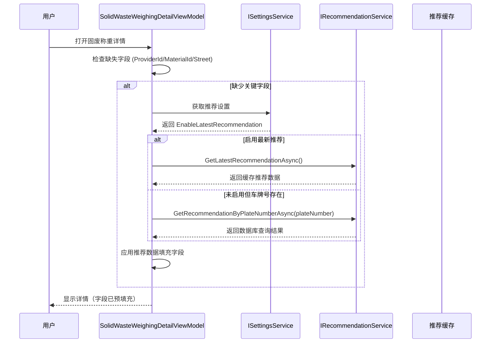

# Proposal: Solid Waste Waybill Recommendation

## Why

固废称重用户当前需要手动选择供应商、材料和镇街等信息，而标准称重模式已经支持自动推荐功能，可以根据历史数据或全局缓存自动填充这些信息。这种功能不一致导致固废称重用户的操作效率较低，用户体验不统一。通过在固废称重中集成相同的推荐功能，可以提升操作效率并统一两种模式的用户体验。

## What Changes

- 在 `SolidWasteWeighingDetailViewModel` 中注入 `IRecommendationService` 和 `ISettingsService`
- 在 `SolidWasteWeighingDetailViewModel.LoadModeSpecificDataAsync()` 中添加推荐逻辑
- 根据推荐数据自动填充供应商、材料、材料单位和镇街信息
- 更新 `recommendation-settings` 规格以涵盖固废称重模式

## Capabilities

### New Capabilities
无新增能力。本变更复用现有的推荐服务基础设施。

### Modified Capabilities

- `recommendation-settings`: 扩展规格以包含固废称重模式的推荐行为。当前规格仅涵盖标准称重模式（`StandardWeighingDetailViewModel`），需要添加 `SolidWasteWeighingDetailViewModel` 的推荐场景。

## Impact

### Affected Code

| 文件路径 | 变更类型 | 变更原因 | 影响范围 |
|---------|---------|---------|---------|
| `MaterialClient/ViewModels/SolidWasteWeighingDetailViewModel.cs` | 修改 | 添加推荐服务依赖和推荐逻辑 | 固废称重详情视图 |
| `openspec/specs/recommendation-settings/spec.md` | 修改 | 添加固废称重模式推荐场景 | 推荐设置规格 |

### Dependencies

- `IRecommendationService` (现有)
- `ISettingsService` (现有)
- `WaybillRecommendationDto` (现有)

### Systems

- 固废称重模块的数据加载流程
- 推荐缓存更新流程（无变更，复用现有机制）

## UI Changes

本变更主要影响数据加载逻辑，UI 界面本身无显著变化。用户将体验到：
- 打开固废称重详情时，供应商、材料、镇街字段可能已被自动填充
- 减少手动输入和选择的工作量

## User Interaction Flow

## Code Change Summary

| 文件 | 变更类型 | 说明 |
|------|---------|------|
| `SolidWasteWeighingDetailViewModel.cs` | 添加字段 | `_recommendationService`, `_settingsService` |
| `SolidWasteWeighingDetailViewModel.cs` | 修改构造函数 | 注入新依赖 |
| `SolidWasteWeighingDetailViewModel.cs` | 修改方法 | 更新 `LoadModeSpecificDataAsync()` 添加推荐逻辑 |
| `recommendation-settings/spec.md` | 添加场景 | 固废称重推荐行为规范 |
