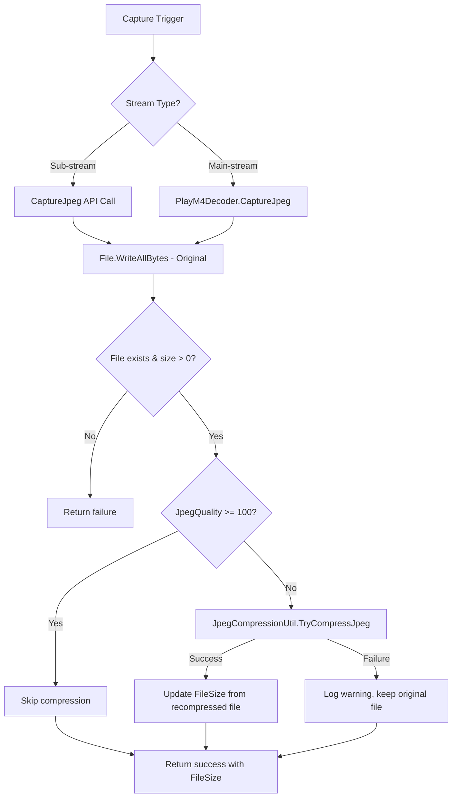
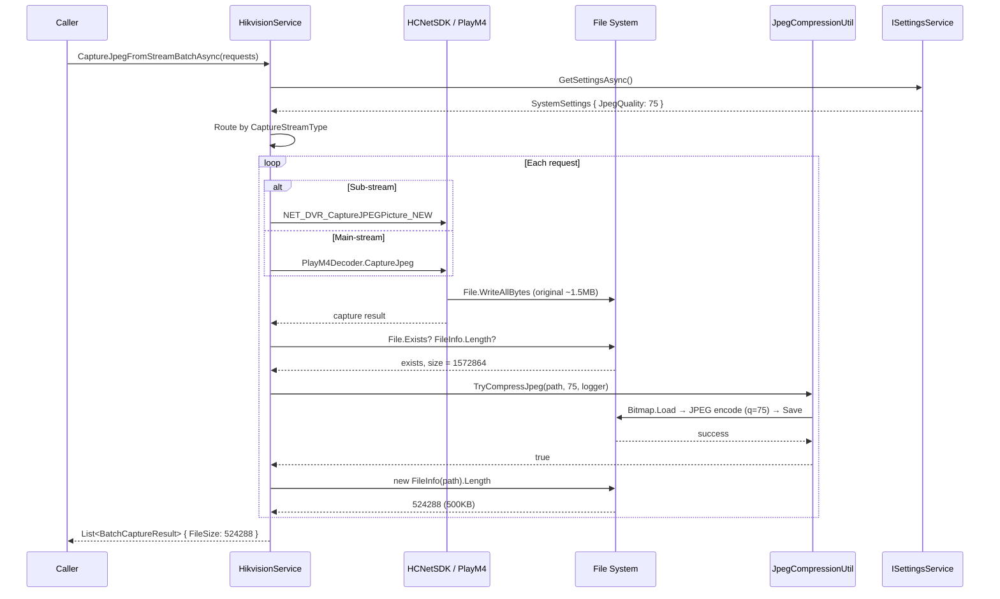

## Context

The Hikvision camera capture pipeline produces uncompressed JPEG files (1-2MB) because quality parameters are hardcoded at the SDK/decoder level:
- `PlayM4Decoder.CaptureJpeg`: quality = 100 (main stream path)
- `HikvisionService.CaptureJpeg`: quality = 90 default (sub stream path)

The project already references `System.Drawing.Common` (in `MaterialClient.Common.csproj`). The settings system follows a clear pattern: `SystemSettings` POCO → `SettingsWindowViewModel` reactive properties → AXAML binding → save/load via `ISettingsService`.

Capture has two paths that both need compression integration:
1. **Sub-stream** (direct API): `CaptureJpeg` → `File.WriteAllBytes` → return
2. **Main-stream** (decoder): `CaptureJpegFromStream` → `PlayM4Decoder.CaptureJpeg` → `File.WriteAllBytes` → return

Both paths converge in `CaptureJpegFromStreamBatchAsync`, which routes based on `CaptureStreamType`.

## Goals / Non-Goals

**Goals:**
- Reduce JPEG capture file sizes by 50-75% via post-capture re-encoding
- Provide user-configurable quality setting (1-100) with sensible default (75)
- Integrate compression transparently into all capture success paths
- Preserve original files when compression fails (fail-safe)

**Non-Goals:**
- Modifying SDK-level quality parameters (decoder/service layer separation)
- Compressing LPR (license plate recognition) captures
- Real-time compression during video streaming
- Resizing or format conversion (JPEG-to-PNG, etc.)

## Decisions

### Decision 1: Post-capture re-encoding over SDK parameter tuning

**Choice**: Add compression after SDK writes the file, using `System.Drawing.Bitmap` → JPEG encoder.

**Alternatives considered**:
- Lower SDK `wPicQuality` directly: Would require modifying `PlayM4Decoder` and `CaptureJpeg` signatures. The SDK quality parameter behavior varies by firmware. Post-processing gives consistent, predictable results.
- Use a third-party library (ImageSharp, Magick.NET): Unnecessary dependency when `System.Drawing.Common` is already available and adequate for JPEG re-encoding.

**Rationale**: Separation of concerns — the SDK/decoder layer handles capture, the service layer handles optimization. Post-processing is deterministic and testable.

### Decision 2: Static utility class over service injection

**Choice**: `JpegCompressionUtil` as a static class with `TryCompressJpeg(string filePath, int quality, ILogger? logger)`.

**Rationale**: The utility has no state, no dependencies beyond `System.Drawing`, and is used synchronously in capture paths. A static method avoids modifying constructor signatures of `HikvisionService` (which uses `[AutoConstructor]`).

### Decision 3: Quality >= 100 as skip condition

**Choice**: When `JpegQuality >= 100`, skip compression entirely — zero method calls, zero allocations.

**Rationale**: Backward compatibility. Existing behavior is preserved without any overhead path.

### Decision 4: Fail-safe with original file preservation

**Choice**: If `TryCompressJpeg` encounters any exception, log and return `false`. The original SDK-captured file remains on disk.

**Rationale**: Capture is a critical business operation. A compression failure should never break the capture flow.

## Risks / Trade-offs

- **[Performance]** Re-encoding adds latency per capture (~50-200ms for 1080p JPEG) → Acceptable for batch captures which are already synchronous; individual captures add minimal delay
- **[Quality loss]** Re-encoding a JPEG at lower quality introduces generation loss → Mitigated by default 75 which is the well-known JPEG sweet spot; users can adjust up to 100
- **[System.Drawing on non-Windows]** `System.Drawing.Common` has limited support on Linux/macOS → Not a concern: MaterialClient is Windows-only (uses Hikvision Windows SDK)
- **[Disk I/O]** Read + write cycle doubles disk operations per capture → Negligible for single captures; batch captures are sequential anyway

## Component Architecture

```
HikvisionService (capture orchestrator)
├── CaptureJpeg() ────────────────────── sub-stream direct API
│   └── File.WriteAllBytes()
│   └── JpegCompressionUtil.TryCompressJpeg()  ← NEW
├── CaptureJpegFromStream() ──────────── main-stream via decoder
│   └── PlayM4Decoder.CaptureJpeg()     (quality=100, UNCHANGED)
│   └── File.WriteAllBytes()
│   └── JpegCompressionUtil.TryCompressJpeg()  ← NEW
└── CaptureJpegFromStreamBatchAsync() ── batch orchestrator
    ├── reads JpegQuality from SystemSettings
    ├── routes to sub-stream or main-stream path
    └── updates FileSize after compression

JpegCompressionUtil (NEW - static utility)
└── TryCompressJpeg(filePath, quality, logger)
    ├── quality >= 100 → skip (return true)
    ├── Bitmap.Load → JPEG Encoder → Save
    └── exception → log + return false

SystemSettings (configuration)
└── JpegQuality = 75  ← NEW property

SettingsWindowViewModel
└── JpegQuality (ReactiveUI binding)  ← NEW
```

## Data Flow



## API Call Sequence (Batch Capture)



## Detailed Code Changes

| File Path | Change Type | Description | Module |
|-----------|------------|-------------|--------|
| `MaterialClient.Common/Utils/JpegCompressionUtil.cs` | New | Static `TryCompressJpeg` method using `System.Drawing.Bitmap` + `ImageCodecInfo` JPEG encoder | Utils |
| `MaterialClient.Common/Configuration/SystemSettings.cs` | Modify | Add `public int JpegQuality { get; set; } = 75;` | Configuration |
| `MaterialClient.Common/Services/Hikvision/HikvisionService.cs` | Modify | Read `JpegQuality` in batch method; pass to internal methods; call `TryCompressJpeg` after file write in all 4 capture paths; update `FileSize` after compression | Hikvision |
| `MaterialClient/ViewModels/SettingsWindowViewModel.cs` | Modify | Add `[Reactive] private int _jpegQuality = 75;`; save/load in `SaveAsync`/`LoadSettingsAsync` | Settings |
| `MaterialClient/Views/SettingsWindow.axaml` | Modify | Add `Slider` (1-100, step 5) + `TextBlock` below stream type selector | Settings UI |
