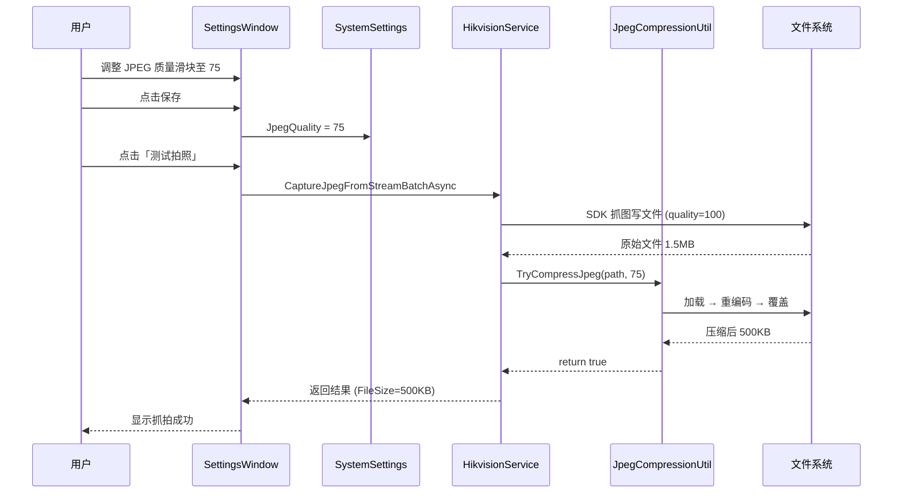

## Why

Hikvision camera captures produce JPEG files of 1-2MB each due to hardcoded quality settings (main stream: 100, sub stream: 90). With continuous capture operations, this creates significant storage bloat and network transfer overhead. A post-capture re-encoding compression layer is needed to reduce file sizes by 50-75% without modifying the SDK capture pipeline.

## What Changes

- Introduce a `JpegCompressionUtil` static utility for safe JPEG re-encoding via `System.Drawing.Common` (already referenced)
- Add a configurable `JpegQuality` setting (default 75) to `SystemSettings`
- Integrate compression calls into all capture success paths in `HikvisionService` (both sub-stream and main-stream batch flows, plus direct `CaptureJpeg` / `CaptureJpegFromStream` methods)
- Add a quality Slider control (1-100, step 5) to the Settings window under the stream type selector
- Compression is transparent: quality >= 100 skips entirely (zero overhead), failures preserve the original file

## Capabilities

### New Capabilities
- `jpeg-capture-compression`: Post-capture JPEG re-encoding with configurable quality, integrated into all Hikvision capture paths

### Modified Capabilities
- `system-configuration`: Add `JpegQuality` property to system settings with UI binding in the settings window

## Impact

| File Path | Change Type | Reason | Scope |
|-----------|------------|--------|-------|
| `MaterialClient.Common/Utils/JpegCompressionUtil.cs` | New | Compression utility | Common layer |
| `MaterialClient.Common/Configuration/SystemSettings.cs` | Modify | Add `JpegQuality` property | Configuration |
| `MaterialClient.Common/Services/Hikvision/HikvisionService.cs` | Modify | Integrate compression into capture flows | Hikvision capture |
| `MaterialClient/ViewModels/SettingsWindowViewModel.cs` | Modify | Add reactive property + save/load | Settings UI |
| `MaterialClient/Views/SettingsWindow.axaml` | Modify | Add Slider + TextBlock control | Settings UI |

**Not modified**: `PlayM4Decoder.cs` (compression at service layer), `HikvisionLprService.cs` (LPR captures unaffected), NuGet packages (`System.Drawing.Common` already referenced).

### UI Prototype

```
┌──────────────────────────────────────────────────┐
│ 摄像头设置                                       │
├──────────────────────────────────────────────────┤
│                                                  │
│  拍照码流类型:  [子码流          ▼] [测试拍照]    │
│                                                  │
│  JPEG压缩质量:                                   │
│  ┌──────────────────────────────────────────┐    │
│  │ 1 ═══════●════════════════════════ 100   │    │
│  └──────────────────────────────────────────┘    │
│  当前值: 75 (推荐: 75)                           │
│  提示: 质量越低文件越小，100为不压缩               │
│                                                  │
└──────────────────────────────────────────────────┘
```

### User Interaction Flow


