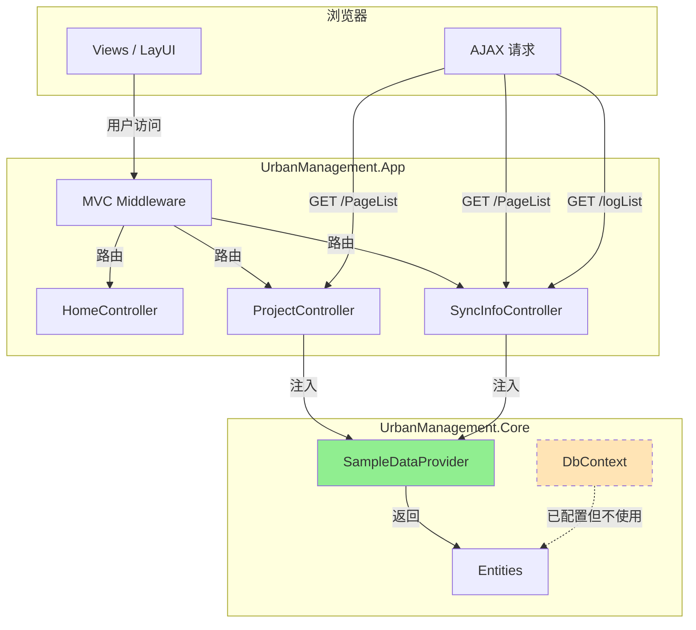
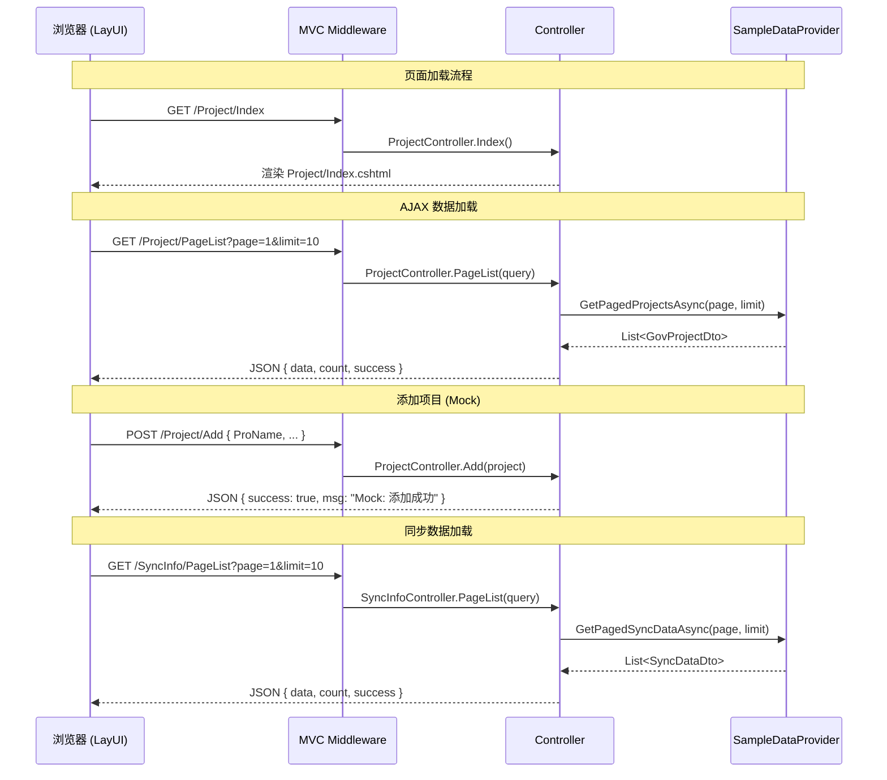

## Context

UrbanManagement 是 FdSoft.MaterialSys.Gov.XiaoShanServe 的迁移重构项目。原项目是一个 ASP.NET Core 6.0 MVC 应用，使用 SqlSugar ORM + SQLite，包含称重数据采集、政府平台同步、项目管理等完整业务逻辑。项目前端基于 LayUI 框架构建，包含 4 个主要页面。

迁移目标：仅保留前端渲染代码和实体定义，使用 dotnet-fluent-architecture 的 FluentSample ABP 模板（.NET 10 + ABP 10）重新初始化项目结构，创建一个最小可用的 ABP 前后端不分离项目。前端通过静态 sample 数据独立渲染，不依赖任何后端业务服务。

约束条件：
- 遵循 AGENTS.md 中的编码规范（file-scoped namespace, record, AutoConstructor, 英文标识符等）
- 使用 ABP 隐式服务注册 + AutoConstructor 模式
- 项目命名从 FluentSample → UrbanManagement
- FluentSample 模板为 Console App，需适配为 Web App

## Goals / Non-Goals

**Goals:**
- 建立符合 FluentSample 模板规范的 ABP 项目骨架（App + Core 两项目）
- App 项目改为 ASP.NET Core MVC Web 宿主，支持 Razor 视图和静态文件
- Core 项目包含迁移后的实体定义和 EF Core DbContext
- 迁移全部 4 个 LayUI 前端页面，保持原有 UI 布局和交互模式
- 提供 sample 数据服务，前端可独立渲染无需数据库
- 项目可编译运行，访问各页面看到渲染效果

**Non-Goals:**
- 不实现任何后端业务逻辑（数据同步、API 调用、后台服务等）
- 不迁移 ApiController（设备数据接收接口）
- 不迁移 ExplortStatisticBgService（后台同步服务）
- 不实现真实的 CRUD 操作（Project/Add POST 仅返回 mock 成功）
- 不实现数据库迁移（EF Core 仅配置 DbContext，使用 EnsureCreated 或内存模式）
- 不实现身份认证/授权
- 不迁移 Fdsoft.Weight.GovClient 的代码（该参考项目为 WinForms，仅作为领域模型参考）

## Decisions

### Decision 1: App 项目使用 WebApplication 而非 Generic Host

**选择**: 使用 `WebApplication.CreateBuilder()` 而非 FluentSample 的 `Host.CreateApplicationBuilder()`

**替代方案**:
- (A) 保持 Generic Host + 手动添加 Kestrel — 复杂且非标准
- (B) WebApplication.CreateBuilder — ASP.NET Core 标准 Web 宿主模式 ✓

**理由**: 项目需要 MVC + Razor + 静态文件 + HTTP 中间件管道，`WebApplication` 是标准选择。ABP 完全支持 `WebApplication` 模式，通过 `builder.Services.AddAbp<>()` 注册模块。

### Decision 2: Sample 数据使用内存静态集合

**选择**: 创建 `ISampleDataProvider` 服务，返回硬编码的 `List<T>` 数据

**替代方案**:
- (A) SQLite + EF Core Seed Data — 过度工程化，偏离"仅前端展示"目标
- (B) JSON 文件加载 — 增加不必要的 IO 复杂度
- (C) 硬编码静态集合 — 简单直接，满足渲染需求 ✓

**理由**: 项目定位为前端展示，sample 数据仅为支撑渲染。硬编码集合最简单、最透明，后续需要真实数据时替换实现即可。

### Decision 3: Controller 直接注入 ISampleDataProvider

**选择**: Controller 通过 DI 注入 `ISampleDataProvider`，在 Action 中调用获取数据

**替代方案**:
- (A) 通过 ABP Application Service 层 — 对纯展示项目过度分层
- (B) Controller 直接调用静态方法 — 不利于测试和替换
- (C) DI 注入 ISampleDataProvider — 平衡简洁和可测试性 ✓

**理由**: 当前无需 Application Service 层。DI 注入保持可替换性，后续添加真实服务时只需更换实现。

### Decision 4: 实体使用 ABP Entity\<Guid\> 而非原 SqlSugar 模型

**选择**: 所有实体继承 `Entity<Guid>`（GovProject）或 `Entity<int>`（GovSyncData、GovLog），属性名改为英文

**替代方案**:
- (A) 保持原 SqlSugar 模型 + SqlSugar ORM — 违反 ABP 架构规范
- (B) 使用 ABP Entity + EF Core — 符合 FluentSample 模板 ✓

**理由**: 遵循 FluentSample 模板模式，ABP Entity 提供审计字段、软删除等基础能力。属性名改为英文符合 AGENTS.md 编码规范。

### Decision 5: LayUI 静态资源迁移至 wwwroot/public/

**选择**: 原项目的 `/public/` 目录（LayUI 框架、自定义样式）整体迁移至 `wwwroot/public/`

**替代方案**:
- (A) 使用 npm/libman 管理前端依赖 — 增加构建复杂度
- (B) 直接复制静态文件至 wwwroot — 简单可靠 ✓

**理由**: 原项目已有完整的 LayUI 静态文件，直接复制最可靠。后续需要升级前端时再考虑包管理。

### Decision 6: 视图内 AJAX 路径保持不变

**选择**: 视图中的 AJAX URL（如 `/Project/PageList`、`/SyncInfo/PageList`）保持原路径不变

**替代方案**:
- (A) 改为 API 风格路径（`/api/project/list`）— 不必要的大规模视图修改
- (B) 保持原路径 — 零改动迁移 ✓

**理由**: Controller 和 Action 名称保持与原项目一致（ProjectController、SyncInfoController），视图无需修改路径。

## Component Architecture

```
UrbanManagement.App (Web 宿主)
├── Program.cs                          # WebApplication + ABP 模块注册
├── UrbanManagementAppModule.cs         # ABP App 模块 (MVC + StaticFiles)
├── Controllers/
│   ├── HomeController.cs               # GET /Home/Index, /Home/Privacy
│   ├── ProjectController.cs            # GET /Project/Index, /Project/Add, AJAX /Project/PageList
│   └── SyncInfoController.cs           # GET /SyncInfo/Index, AJAX /SyncInfo/PageList, /SyncInfo/logList
├── Views/
│   ├── Shared/_Layout.cshtml           # Bootstrap 导航布局
│   ├── Home/Index.cshtml               # 仪表盘（ECharts + 统计卡片 + 动态列表）
│   ├── Project/Index.cshtml            # 项目管理表格（LayUI table）
│   ├── Project/Add.cshtml              # 项目添加/编辑表单（LayUI form）
│   └── SyncInfo/Index.cshtml           # 同步数据管理表格（LayUI table + 图片查看 + 日志弹窗）
├── wwwroot/
│   ├── public/                         # LayUI 框架 + 自定义样式
│   │   ├── layui/
│   │   └── style/
│   ├── lib/                            # Bootstrap, jQuery
│   ├── css/
│   └── js/
└── appsettings.json

UrbanManagement.Core (领域层)
├── UrbanManagementCoreModule.cs        # ABP Core 模块 (EF Core + Services)
├── Entities/
│   ├── GovProject.cs                   # 项目实体
│   ├── GovSyncData.cs                  # 同步数据实体
│   ├── GovLog.cs                       # 同步日志实体
│   └── Enums/
│       └── SyncStatus.cs              # 同步状态枚举
├── EntityFrameworkCore/
│   └── UrbanManagementDbContext.cs     # EF Core DbContext
├── Services/
│   └── SampleDataProvider.cs           # ISampleDataProvider + 实现
└── Configuration/
    └── AppSettings.cs                  # 应用配置
```

## Data Flow



## API Call Sequence



## Detailed Code Changes

| 文件路径 | 变更类型 | 变更说明 | 影响模块 |
|---------|---------|---------|---------|
| `Directory.Build.props` | 新增 | 统一构建配置（net10.0, Nullable, ImplicitUsings, AutoConstructor） | 全解决方案 |
| `Directory.Packages.props` | 新增 | CPM：ABP 10, EF Core 10, Serilog, AutoConstructor, AspNetCore.Mvc | 全解决方案 |
| `UrbanManagement.sln` | 新增 | 解决方案文件，包含 App + Core 两个项目 | 全解决方案 |
| `src/UrbanManagement.Core/UrbanManagement.Core.csproj` | 新增 | Core 项目文件，引用 ABP + EF Core 包 | Core |
| `src/UrbanManagement.Core/UrbanManagementCoreModule.cs` | 新增 | ABP Core 模块，配置 DbContext 和服务 | Core |
| `src/UrbanManagement.Core/Entities/GovProject.cs` | 新增 | 项目实体（Entity\<Guid\>），英文属性名 | Core |
| `src/UrbanManagement.Core/Entities/GovSyncData.cs` | 新增 | 同步数据实体（Entity\<int\>） | Core |
| `src/UrbanManagement.Core/Entities/GovLog.cs` | 新增 | 同步日志实体（Entity\<int\>） | Core |
| `src/UrbanManagement.Core/Entities/Enums/SyncStatus.cs` | 新增 | 同步状态枚举（Pending/Success/Failed） | Core |
| `src/UrbanManagement.Core/EntityFrameworkCore/UrbanManagementDbContext.cs` | 新增 | ABP DbContext，Fluent API 实体配置 | Core |
| `src/UrbanManagement.Core/Services/SampleDataProvider.cs` | 新增 | ISampleDataProvider 接口 + 静态数据实现 | Core |
| `src/UrbanManagement.Core/Configuration/AppSettings.cs` | 新增 | 应用配置类 | Core |
| `src/UrbanManagement.App/UrbanManagement.App.csproj` | 新增 | Web 项目文件，引用 Core + ABP AspNetCore.Mvc | App |
| `src/UrbanManagement.App/Program.cs` | 新增 | WebApplication 启动，ABP 模块注册 | App |
| `src/UrbanManagement.App/UrbanManagementAppModule.cs` | 新增 | ABP App 模块，配置 MVC + 静态文件 | App |
| `src/UrbanManagement.App/Controllers/HomeController.cs` | 新增 | 首页 Controller（Index + Privacy） | App |
| `src/UrbanManagement.App/Controllers/ProjectController.cs` | 新增 | 项目管理 Controller（Index + Add + PageList + SetStatus + Del） | App |
| `src/UrbanManagement.App/Controllers/SyncInfoController.cs` | 新增 | 同步信息 Controller（Index + PageList + LogList） | App |
| `src/UrbanManagement.App/Views/Shared/_Layout.cshtml` | 迁移 | Bootstrap 导航布局，微调链接 | App |
| `src/UrbanManagement.App/Views/Home/Index.cshtml` | 迁移 | 仪表盘视图，sample 硬编码数据 | App |
| `src/UrbanManagement.App/Views/Project/Index.cshtml` | 迁移 | 项目管理表格，AJAX 路径不变 | App |
| `src/UrbanManagement.App/Views/Project/Add.cshtml` | 迁移 | 项目添加表单，model 改为 ABP 实体 | App |
| `src/UrbanManagement.App/Views/SyncInfo/Index.cshtml` | 迁移 | 同步数据表格，AJAX 路径不变 | App |
| `src/UrbanManagement.App/wwwroot/public/` | 复制 | LayUI 框架 + 自定义样式 | App |
| `src/UrbanManagement.App/appsettings.json` | 新增 | 应用配置（连接字符串、日志等） | App |

## Risks / Trade-offs

| Risk | Impact | Mitigation |
|------|--------|------------|
| LayUI 版本兼容性 | 原项目使用的 LayUI 版本可能与新版 ASP.NET Core 静态文件中间件有路径差异 | 直接迁移 wwwroot 目录结构，保持 `/public/` 路径一致 |
| 视图中硬编码数据 | MainPage/Index.cshtml 中仪表盘数据为硬编码 HTML | 先保持原样，后续通过 AJAX 动态化 |
| EF Core DbContext 已配置但不实际使用 | 增加了不必要的复杂度 | 保留作为后续真实数据接入的基础设施，SampleDataProvider 作为过渡方案 |
| 视图中中文注释和提示 | 符合业务需求，但 AGENTS.md 要求代码中无中文 | 视图文件（用户可见文本）例外，代码文件严格遵守英文标识符规则 |
| 原项目属性名如 `snapTime`、`goodsWeight` 不符合 C# 命名规范 | 迁移时需要同时更新实体属性名和视图中的字段引用 | 实体使用 PascalCase（`SnapTime`、`GoodsWeight`），视图 JSON 返回时使用 camelCase 保持兼容 |

## Open Questions

- MainPage/Index.cshtml 的 ECharts 图表是否需要工作？原视图中 ECharts 为内联硬编码，可在 sample 数据中提供模拟图表数据
- Project/Add POST 操作是否需要返回具体 mock 数据（如生成的 ProId），还是仅返回 success 即可？假设：返回 `success: true` + mock ProId
- `FileViewerController`（图片查看）是否迁移？假设：不迁移，sample 数据中图片字段填入占位文本
