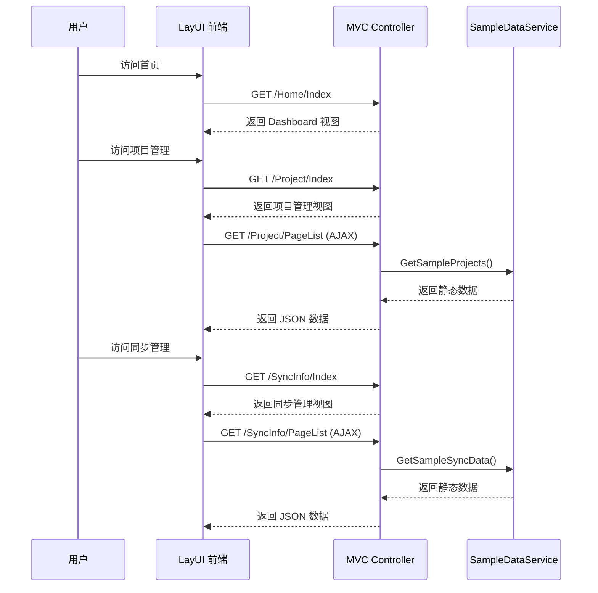

## Why

FdSoft.MaterialSys.Gov.XiaoShanServe 是一个完整的 ASP.NET Core 6.0 MVC 业务系统（称重数据管理+政府平台同步），现需将其迁移重构为 UrbanManagement 项目：仅保留前端渲染代码和实体定义，移除所有后端业务逻辑，使用 dotnet-fluent-architecture 的 FluentSample ABP 模板重新初始化项目结构。目标是获得一个最小可用的 ABP 前后端不分离项目，前端可通过 sample 数据独立渲染。

## What Changes

- **新建 ABP 项目结构**：基于 FluentSample 模板（.NET 10 + ABP 10），创建 `UrbanManagement.App`（Web 宿主）+ `UrbanManagement.Core`（领域层）两项目结构
- **迁移前端视图**：从原项目迁移 4 个 LayUI 页面（首页仪表盘、项目管理列表、项目添加/编辑表单、同步信息管理），保留 LayUI 框架和交互逻辑
- **迁移实体定义**：将 GovProject、GovSyncData、GovLog 从 SqlSugar 注解迁移为 ABP Entity（继承 `Entity<T>`），适配 EF Core Fluent API 配置
- **迁移枚举**：SyncStatus（待同步/同步成功/同步失败）从中文枚举迁移为英文枚举
- **创建 Sample 数据服务**：提供静态/内存示例数据，替代原 SqlSugar 数据库查询，支撑前端表格、表单、仪表盘的渲染
- **简化 Controller**：Controller 仅返回 View + sample JSON 数据，不含任何业务逻辑或数据库访问
- **移除后端业务代码**：ApiController（设备数据接收）、ExplortStatisticBgService（后台同步服务）、DbHelper（SqlSugar ORM）、HttpHelper（政府平台 API 调用）全部不迁移
- **适配 Web 宿主**：FluentSample 模板为 Console App，需改为 ASP.NET Core Web App（`WebApplication.CreateBuilder`），添加 MVC 中间件、静态文件支持、Razor 视图编译

## Capabilities

### New Capabilities

- `abp-project-init`: ABP 项目基础结构初始化 — 基于 FluentSample 模板创建 `UrbanManagement.App` + `UrbanManagement.Core` 两项目结构，配置 .NET 10、ABP 10、EF Core SQLite、Autofac DI、Directory.Build.props/Directory.Packages.props
- `web-host-setup`: Web 宿主配置 — 将 FluentSample Console App 模式改为 ASP.NET Core MVC Web 宿主，配置 Kestrel、MVC 中间件、静态文件、Razor 视图引擎、路由
- `entity-migration`: 实体迁移与 EF Core 配置 — 将 GovProject、GovSyncData、GovLog 从 SqlSugar 迁移为 ABP Entity，创建 UrbanManagementDbContext，配置 Fluent API 映射和 SQLite 连接
- `view-migration`: 前端视图迁移 — 迁移 LayUI 视图文件（_Layout、MainPage/Index、Project/Index、Project/Add、SyncInfo/Index），适配 ABP Controller 路由和静态资源路径
- `sample-data`: 示例数据服务 — 创建静态 sample 数据提供者，为前端表格、表单、仪表盘提供渲染数据，替代原 SqlSugar 数据库查询

### Modified Capabilities

_(无现有 capability 需要修改 — 这是全新初始化)_

## Impact

### 代码影响

| 文件/目录 | 变更类型 | 变更原因 | 影响范围 |
|-----------|---------|---------|---------|
| `src/UrbanManagement.App/` | 新增 | ABP Web 宿主项目 | Program.cs, AppModule, appsettings.json, Controllers/, Views/, wwwroot/ |
| `src/UrbanManagement.Core/` | 新增 | ABP 领域层项目 | CoreModule, Entities/, EntityFrameworkCore/, Enums/ |
| `Directory.Build.props` | 新增 | 统一构建属性（net10.0, Nullable, ImplicitUsings） | 全解决方案 |
| `Directory.Packages.props` | 新增 | Central Package Management（ABP 10, EF Core 10, Serilog, AutoConstructor） | 全解决方案 |
| `UrbanManagement.sln` | 新增 | 解决方案文件 | 全解决方案 |

### 依赖变化

| 原项目依赖 | 新项目处理 |
|-----------|-----------|
| SqlSugar ORM | → 移除，替换为 ABP EF Core |
| Microsoft.EntityFrameworkCore 6.0 | → 升级为 EF Core 10.0 + ABP 集成 |
| LayUI 前端框架 | → 保留，迁移至 wwwroot/public/ |
| bootstrap 5 (MainPage layout) | → 保留，迁移至 wwwroot/lib/ |
| Swashbuckle (Swagger) | → 移除（非 API 项目） |
| NLog | → 替换为 Serilog（与 FluentSample 一致） |
| IPTools.China | → 移除（无 IP 定位需求） |

### 页面迁移映射

| 原视图 | 新位置 | 交互模式 |
|-------|--------|---------|
| Views/Shared/_Layout.cshtml (Bootstrap) | Views/Shared/_Layout.cshtml | 保留 Bootstrap 导航布局 |
| Views/MainPage/Index.cshtml | Views/Home/Index.cshtml | LayUI 仪表盘，改为 sample 数据 |
| Views/Project/Index.cshtml | Views/Project/Index.cshtml | LayUI 表格，AJAX 改为 sample 数据 |
| Views/Project/Add.cshtml | Views/Project/Add.cshtml | LayUI 表单，POST 改为前端 mock |
| Views/SyncInfo/Index.cshtml | Views/SyncInfo/Index.cshtml | LayUI 表格+弹窗，改为 sample 数据 |

### 用户交互流程



### UI 布局原型

**首页仪表盘 (MainPage/Index)**
```
┌──────────────────────────────────────────────────────────┐
│  FdSoft_Gov_XiaoShan          Home | Privacy             │
├──────────────────────────────────────────────────────────┤
│                                                          │
│  ┌─────────────────────────┐  ┌────────────────────┐    │
│  │     今日数据 (ECharts)   │  │  统计卡片           │    │
│  │     折线图/柱状图         │  │  ┌──┐ ┌──┐ ┌──┐   │    │
│  │                         │  │  │ 1│ │22│ │28│   │    │
│  │                         │  │  └──┘ └──┘ └──┘   │    │
│  └─────────────────────────┘  └────────────────────┘    │
│                               ┌────────────────────┐    │
│                               │  最新动态           │    │
│                               │  • 黄杰 进门 14h前  │    │
│                               └────────────────────┘    │
└──────────────────────────────────────────────────────────┘
```

**项目管理 (Project/Index)**
```
┌──────────────────────────────────────────────────────────┐
│  [+添加]                    [搜索项目名称/对接码] [🔍]    │
├──────────────────────────────────────────────────────────┤
│  项目名称 │ 对接码 │ 凡东对接码 │ 同步 │ 最后同步 │ 操作  │
│  ──────── │ ───── │ ───────── │ ──── │ ─────── │ ────  │
│  项目A    │ CD001 │ FD-xxx    │ [开] │ 05-12   │ 编辑删│
│  项目B    │ CD002 │ FD-yyy    │ [关] │ 05-11   │ 编辑删│
├──────────────────────────────────────────────────────────┤
│                       < 1 2 3 >                          │
└──────────────────────────────────────────────────────────┘
```
