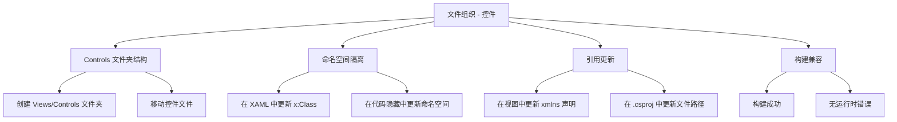

# 规范：文件组织 - 控件

## 目的

本规范定义将控件相关 XAML 文件组织到独立 `Views/Controls` 文件夹、并做好命名空间隔离的需求，以提升代码可维护性与项目结构。

---

## 需求

### 需求：Controls 文件夹结构存在

项目应维护 `Views/Controls` 文件夹结构，将控件相关 XAML 与视图文件分开存放。

#### 场景：迁移后文件夹存在
- **当** 开发人员进入 Views 文件夹
- **则** 应存在 Controls 子文件夹，且其中包含所有控件相关 XAML 文件

#### 场景：Controls 文件夹仅含控件
- **当** 开发人员列出 Views/Controls 中的文件
- **则** 所有文件应为控件相关（UserControl、CustomControl 或控件模板）

### 需求：控件文件使用正确命名空间

所有控件相关 XAML 及其代码隐藏文件应使用命名空间 `MaterialClient.Views.Controls`。

#### 场景：控件 XAML 的 x:Class 正确
- **当** 开发人员打开 Views/Controls 中的控件 XAML 文件
- **则** x:Class 属性应使用 `MaterialClient.Views.Controls.<控件名>`

#### 场景：控件代码隐藏使用正确命名空间
- **当** 开发人员打开控件代码隐藏文件（.axaml.cs）
- **则** 命名空间应为 `MaterialClient.Views.Controls`

### 需求：视图文件以正确命名空间引用控件

使用控件的视图文件应通过 `Controls` 命名空间前缀引用控件。

#### 场景：视图文件声明 Controls 命名空间
- **当** 开发人员打开使用控件的视图 XAML 文件
- **则** 文件应包含 `xmlns:Controls="using:MaterialClient.Views.Controls"`

#### 场景：视图文件使用 Controls 前缀
- **当** 在视图 XAML 中引用控件
- **则** 应使用 `Controls:` 前缀引用控件（例如 `<Controls:DataGridControl />`）

### 需求：项目文件反映正确文件路径

项目文件（.csproj）应以 Views/Controls 下的新相对路径引用所有已移动的 XAML 文件。

#### 场景：项目文件列出控件的新路径
- **当** 开发人员打开 .csproj 文件
- **则** 控件文件条目应引用 Views/Controls/<文件名>.axaml

#### 场景：项目能成功构建
- **当** 开发人员构建项目
- **则** 构建应成功，且无文件未找到错误

### 需求：不引入行为变更

迁移应保持现有功能与行为不变，不引入破坏性变更。

#### 场景：应用程序能正常运行
- **当** 开发人员运行应用程序
- **则** 应用程序应能启动，且无与文件位置或命名空间相关的错误

#### 场景：控件正确渲染
- **当** 用户查看包含控件的页面
- **则** 所有控件渲染效果应与迁移前一致

---

## 能力模型

## 需求摘要

| 需求 ID | 描述 | 优先级 |
|---------|------|--------|
| FR-FOC-01 | Controls 文件夹结构存在 | 高 |
| FR-FOC-02 | 控件文件使用正确命名空间 | 高 |
| FR-FOC-03 | 视图文件以正确命名空间引用控件 | 高 |
| FR-FOC-04 | 项目文件反映正确文件路径 | 高 |
| FR-FOC-05 | 不引入行为变更 | 关键 |

## 测试考虑

- **构建测试**：确保迁移后项目能无错误构建
- **运行时测试**：验证应用程序能启动且所有控件正确渲染
- **引用测试**：验证所有使用控件的 XAML 文件均正确引用控件
- **命名空间测试**：验证所有已移动文件使用正确命名空间
