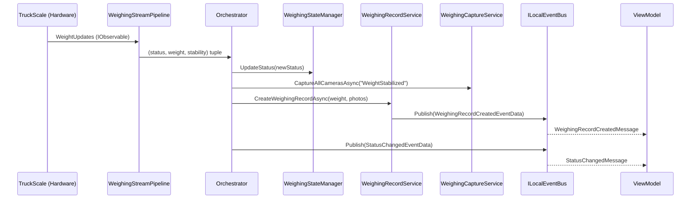

## Context

AttendedWeighingService.cs is a 1539-line singleton service in a C# Avalonia desktop application (MaterialClient) that manages the attended weighing workflow for material receiving/sending. It currently handles all concerns in one class:

- **Rx stream processing**: Constructs weight, stability, and combined status streams using System.Reactive
- **State machine**: Manages 4-state lifecycle (OffScale → WaitingForStability → WeightStabilized → WaitingForDeparture → OffScale) with implicit transition logic embedded in Rx CombineLatest
- **Plate number cache**: ConcurrentDictionary with priority-based selection, locked-at semantics, and color filtering
- **Camera capture**: Hikvision JPEG batch capture + Vzvision LPR trigger at various flow phases
- **Persistence**: WeighingRecord CRUD, photo attachment saving via ABP repositories + UnitOfWork
- **Event bus**: Publishes/subscribes to 7+ event types on ABP ILocalEventBus
- **Lifecycle**: Start/Stop/Dispose with async operation tracking (ConcurrentBag + Subject<Func<Task>>)

The ViewModel (AttendedWeighingViewModel) consumes IAttendedWeighingService and subscribes to events via ReactiveUI MessageBus. Tests exist but many are skipped due to timing sensitivity.

## Goals / Non-Goals

**Goals:**
- Split into 6 focused services, each independently testable with minimal Rx timing dependency
- Preserve the existing IAttendedWeighingService interface contract (no breaking changes to callers)
- Enable unit testing of state transitions, plate selection, and persistence without real Rx streams
- Keep all services within the same DI scope (singleton) — no new DI scoping complexity
- Maintain identical runtime behavior — this is a pure refactor, zero functional changes

**Non-Goals:**
- Adding new features or changing existing behavior
- Changing the event types or event bus contracts
- Modifying the ViewModel or UI layer
- Introducing new external dependencies or frameworks
- Changing the threading/concurrency model (keep Rx-based)

## Decisions

### Decision 1: Facade pattern — Orchestrator implements IAttendedWeighingService

The new `AttendedWeighingOrchestrator` implements `IAttendedWeighingService` directly, delegating to extracted services. This means `AttendedWeighingViewModel` and `StartAllDevicesAsync()` require zero changes.

**Alternative considered**: Introduce a new interface. Rejected because it forces ViewModel changes with no functional benefit.

### Decision 2: Service decomposition by cohesion, not by layer

```
Service Decomposition
├── AttendedWeighingOrchestrator (IAttendedWeighingService)
│   ├── WeighingStateManager
│   │   └── Manages: status transitions, BehaviorSubject<AttendedWeighingStatus>
│   ├── PlateNumberService
│   │   └── Manages: ConcurrentDictionary cache, priority selection, locked-at
│   ├── WeighingStreamPipeline
│   │   └── Constructs: weight stream, stability stream, status stream
│   ├── WeighingCaptureService
│   │   └── Orchestrates: Hikvision batch capture + Vzvision LPR trigger
│   ├── WeighingRecordService
│   │   └── Handles: CRUD, plate rewrite, photo save, TryMatch publish
│   └── [ILocalEventBus] — shared event bus for inter-service communication
```

Services are grouped by **business cohesion** (state, plate, stream, capture, record), not by technical layer. Each service owns its own state and exposes a clear API. The orchestrator wires them together.

### Decision 3: Keep Rx streams inside WeighingStreamPipeline

The weight/stability/status stream construction is tightly coupled to Rx operators (Buffer, CombineLatest, DistinctUntilChanged). Extracting these into a separate class allows the pipeline to be tested by injecting a mock `ITruckScaleWeightService` and verifying output observables.

The pipeline publishes status changes to `WeighingStateManager` (via callback or direct method call), not via ILocalEventBus — avoiding serialization overhead for high-frequency stream data.

```
Data Flow (Rx Pipeline)

  ITruckScaleWeightService.WeightUpdates (IObservable<decimal>)
      │
      ▼
  ┌──────────────────────────┐
  │  WeighingStreamPipeline   │
  │  ├── weightStream         │──┐
  │  ├── stabilityStream      │──┤  CombineLatest
  │  └── statusStream         │──┘
  └──────────┬───────────────┘
             │ (status + weight + stability tuple)
             ▼
  Orchestrator.OnWeightAndStatusChanged()
      ├── WeighingStateManager.UpdateStatus()
      ├── WeighingRecordService.CreateIfStabilized()
      ├── WeighingCaptureService.CaptureAtPhase()
      └── ILocalEventBus.Publish(StatusChangedEventData)
```

### Decision 4: Plate number logic extracted as PlateNumberService

The plate number cache (ConcurrentDictionary<string, PlateNumberCacheRecord>), priority selection logic (high/low priority by color + time window), locked-at semantics, and RecommendPlateNumberService integration form a cohesive unit. This is the most testable extraction — pure input/output logic with no Rx dependency.

### Decision 5: Async operation queue stays in Orchestrator

The async operation queue (Subject<Func<Task>> with Merge(5) concurrency) is lifecycle management, not business logic. It stays in the Orchestrator alongside Start/Stop/Dispose. Individual services expose simple async methods — the Orchestrator decides whether to enqueue them.

### Decision 6: No inter-service event bus for internal communication

Services communicate via direct method calls from the Orchestrator, not via ILocalEventBus. ILocalEventBus is only used for external events (to/from ViewModel and other components). This keeps the internal flow explicit and debuggable.

```
Communication Architecture

  ┌─────────────────────────────────────────────────┐
  │                 Orchestrator                      │
  │  (subscribes to ILocalEventBus external events)  │
  │                                                   │
  │  OnPlateRecognized() ──► PlateNumberService       │
  │  OnWeightStatusChange() ► StateManager            │
  │                          ► RecordService           │
  │                          ► CaptureService          │
  │                                                   │
  │  [ILocalEventBus.Publish] ──► ViewModel (external)│
  └─────────────────────────────────────────────────┘
```



### Decision 7: DI registration strategy

All new services register as `ISingletonDependency` (ABP auto-registration). The Orchestrator takes all others via constructor injection. No factory pattern needed — single-instance services.

### Decision 8: Migration strategy — parallel existence

1. Create all new service files in `Services/AttendedWeighing/` folder
2. Create Orchestrator implementing `IAttendedWeighingService`
3. Remove old `AttendedWeighingService` class (but keep interface)
4. ABP DI automatically resolves `IAttendedWeighingService` to Orchestrator
5. ViewModel requires no changes (same interface)

## Detailed Code Change List

| File Path | Change Type | Description | Module |
|-----------|-------------|-------------|--------|
| `Common/Services/AttendedWeighing/WeighingStateManager.cs` | New | State machine with BehaviorSubject, transition rules, status query | State |
| `Common/Services/AttendedWeighing/PlateNumberService.cs` | New | ConcurrentDictionary cache, priority selection, locked-at, ghost session | Plate |
| `Common/Services/AttendedWeighing/WeighingStreamPipeline.cs` | New | Weight/stability/status Rx stream construction | Stream |
| `Common/Services/AttendedWeighing/WeighingCaptureService.cs` | New | Hikvision batch capture + Vzvision LPR trigger | Capture |
| `Common/Services/AttendedWeighing/WeighingRecordService.cs` | New | WeighingRecord CRUD, plate rewrite, photo save, UoW | Record |
| `Common/Services/AttendedWeighing/AttendedWeighingOrchestrator.cs` | New | Lifecycle, event bus subscription, async queue, delegation | Orchestrator |
| `Common/Services/AttendedWeighingService.cs` | Remove | Replaced by above services | — |
| `Common/Services/IAttendedWeighingService.cs` | Keep | Interface unchanged | — |
| `Common/Records/PlateNumberCacheRecord.cs` | Move | Move out of AttendedWeighingService.cs | Plate |
| `Common/Records/WeightStabilityInfo.cs` | Move | Move out of AttendedWeighingService.cs | Stream |
| `Tests/WeighingStateManagerTests.cs` | New | Unit tests for state transitions | State |
| `Tests/PlateNumberServiceTests.cs` | New | Unit tests for plate selection logic | Plate |
| `Tests/WeighingStreamPipelineTests.cs` | New | Unit tests for stream construction | Stream |
| `Tests/WeighingCaptureServiceTests.cs` | New | Unit tests for capture orchestration | Capture |
| `Tests/WeighingRecordServiceTests.cs` | New | Unit tests for persistence | Record |
| `Tests/AttendedWeighingOrchestratorTests.cs` | New | Integration tests for full flow | Orchestrator |

## Risks / Trade-offs

| Risk | Impact | Mitigation |
|------|--------|------------|
| Behavior drift during extraction | Subtle state transition differences | Keep existing test suite running throughout; add characterization tests before extraction |
| DI constructor parameter explosion | Orchestrator has 6+ service dependencies | Acceptable — it's a coordinator; services themselves have few deps |
| Rx stream subscription timing | Status stream depends on multiple BehaviorSubjects being initialized | Initialize all subjects in constructors, subscribe in StartAsync |
| Record types (PlateNumberCacheRecord, WeightStabilityInfo) move | Breaking if other code references them from original namespace | Search codebase for references; move to shared namespace |
| Test migration effort | Existing 1876-line test file needs splitting | Migrate incrementally — old tests pass with Orchestrator, new tests cover individual services |

## Open Questions

- Should WeighingStreamPipeline be IDisposable (owns Rx subscriptions)? → Lean toward no: Orchestrator manages subscription lifetime and disposes the top-level subscription.
- Should PlateNumberService expose IObservable for plate changes, or keep fire-and-forget via ILocalEventBus? → Keep ILocalEventBus — consistent with existing pattern, no behavioral change.
