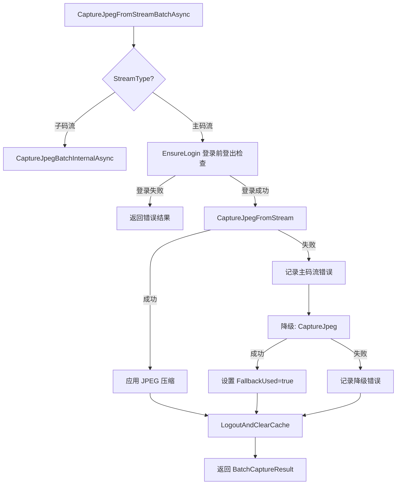

## Context

`HikvisionService`（单例，`ISingletonDependency`）通过两个代码路径管理海康威视设备抓拍：

1. **设备侧 JPEG**（`CaptureJpeg`）：直接调用设备端 `NET_DVR_CaptureJPEGPicture_NEW`。可靠，分辨率较低。
2. **主码流抓拍**（`CaptureJpegFromStream`）：通过 `NET_DVR_RealPlay_V40` 开启实时码流，使用 PlayM4 解码帧，从解码帧中抓取 JPEG。画质更高但容易出现 `PlayM4Error=32`（解码器初始化超时）。

批量编排器 `CaptureJpegFromStreamBatchAsync` 根据 `StreamType` 设置路由请求。选择 `StreamType.Mainstream` 时，主码流抓拍失败后直接返回错误，不进行重试。登录会话保存在 `ConcurrentDictionary<string, int> deviceKeyToUserId` 中，从不驱逐。

当前架构：
```
CaptureJpegFromStreamBatchAsync
├── StreamType.Substream → CaptureJpegBatchInternalAsync → CaptureJpeg (设备侧)
└── StreamType.Mainstream → CaptureJpegFromStream (RealPlay + PlayM4)
                               └── 失败时: 返回错误 (无降级)
```

目标架构：
```
CaptureJpegFromStreamBatchAsync
├── StreamType.Substream → CaptureJpegBatchInternalAsync → CaptureJpeg (设备侧)
└── StreamType.Mainstream → CaptureJpegFromStream (RealPlay + PlayM4)
                               ├── 成功: LogoutAndClearCache → 返回
                               └── 失败: CaptureJpeg (设备侧, 降级)
                                            ├── 成功: LogoutAndClearCache → 返回
                                            └── 失败: LogoutAndClearCache → 返回错误
```

## Goals / Non-Goals

**目标：**
- PlayM4 失败时透明降级到设备侧 JPEG 抓拍
- 每次抓拍尝试后保证登录会话清理（`NET_DVR_Logout` + 缓存驱逐）
- 登录前检查并驱逐缓存的 userId，防止失效会话被复用

**非目标：**
- 修改 `IHikvisionService` 公共接口（不新增公共方法）
- 重试逻辑（降级前多次尝试主码流）
- 修改子码流抓拍行为（已直接使用 `CaptureJpeg`）
- 修改 PlayM4 解码器内部实现或超时配置
- 增加熔断器或持久化设备健康追踪

## Decisions

### D1: 降级在 `CaptureJpegFromStreamBatchAsync` 层触发，而非 `CaptureJpegFromStream` 内部

**选择**：`CaptureJpegFromStreamBatchAsync` 中的主码流批量处理器包装 `CaptureJpegFromStream` 调用，失败时为同一请求调用 `CaptureJpeg`。

**理由**：`CaptureJpegFromStream` 是一个复杂方法（RealPlay + PlayM4 + 回调 + GCHandle 生命周期）。在其中增加降级会增加复杂度和耦合。批量处理器已拥有降级所需的请求上下文（config、channel、saveFullPath、jpegQuality）。

**备选方案**：
- *在 `CaptureJpegFromStream` 内部降级*：需要通过方法签名传递 `jpegQuality`（参数已有）。因方法已约 240 行，予以否决。
- *在 `WeighingCaptureService` 中降级*：会将海康内部降级细节泄露给调用方。予以否决。

### D2: `BatchCaptureResult` 扩展 `FallbackUsed` 标志

**选择**：为 `BatchCaptureResult` 添加 `bool FallbackUsed` 属性，表示抓拍通过降级而非主码流成功。

**理由**：调用方（日志、诊断）需要区分主码流成功和降级成功。仅数据变更，无接口影响。

**备选方案**：
- *无指示器*：否决 — 运维人员需要了解降级频率以判断主码流配置是否可行。
- *独立结果类型*：对单个布尔值过度设计。

### D3: 通过主码流批量处理器中的 `try/finally` 进行会话清理

**选择**：将主码流抓拍 + 可选降级包装在 `try/finally` 中，`finally` 调用新私有方法 `LogoutAndClearCache(HikvisionDeviceConfig)`。

**理由**：无论成功、失败或异常，均保证清理。简单且可预测。

**备选方案**：
- *RAII/IDisposable 包装器*：为 3 行操作增加一个类。过度设计。
- *调用方清理*：需要所有调用方记得清理。脆弱。

### D4: 通过增强 `EnsureLogin` 实现登录前登出

**选择**：在 `EnsureLogin` 中，调用 `Login` 前检查缓存的 userId 是否有效（>= 0）。如是，则调用 `NET_DVR_Logout` 并驱逐缓存条目，然后进行全新登录。

**理由**：当前 `EnsureLogin` 复用缓存的 userId 而不验证其是否仍然有效。失效会话（如设备重启）会导致后续所有抓拍静默失败。强制刷新确保有效会话。

**备选方案**：
- *基于 TTL 的缓存驱逐*：增加定时器复杂度。不必要 — 登录开销低（< 1 秒）。
- *每次抓拍都登录（不缓存）*：可行但会加倍往返次数。缓存对批量操作中同一设备的多次抓拍仍有价值。

### D5: 降级使用设置中相同的 `jpegQuality`

**选择**：在 `CaptureJpegFromStreamBatchAsync` 开始时从设置中读取 `jpegQuality`（已实现），并传递给降级的 `CaptureJpeg` 调用。

**理由**：确保无论抓拍路径如何，输出图像质量一致。

## Data Flow



## Code Change Inventory

| 文件路径 | 变更类型 | 变更描述 | 影响模块 |
|-----------|----------|----------|----------|
| `Services/Hikvision/HikvisionService.cs` | 修改 | 主码流批量处理器：失败时增加 `CaptureJpeg` 降级 | 抓拍流程 |
| `Services/Hikvision/HikvisionService.cs` | 修改 | 新增 `LogoutAndClearCache` 私有方法 | 会话生命周期 |
| `Services/Hikvision/HikvisionService.cs` | 修改 | `EnsureLogin`：调用 `Login` 前增加登录前登出检查 | 会话生命周期 |
| `Services/Hikvision/HikvisionService.cs` | 修改 | `CaptureJpegBatchInternalAsync`：在 finally 块中增加 `LogoutAndClearCache` | 会话生命周期 |
| `BatchCaptureResult`（同文件） | 修改 | 新增 `FallbackUsed` 属性 | 数据模型 |
| `Tests/HikvisionServiceTests.cs` | 修改 | 增加降级、会话清理、登录前登出的测试 | 测试套件 |

## Risks / Trade-offs

- **[风险] 降级图像质量差异**：主码流抓取更高分辨率帧；设备侧 JPEG 可能产生较低质量图像。→ **缓解**：`FallbackUsed` 标志使运维人员能够监控降级频率，必要时调整设备配置。
- **[风险] `NET_DVR_Logout` 阻塞**：根据 AGENTS.md，SDK P/Invoke 调用可能阻塞。→ **缓解**：`LogoutAndClearCache` 在抓拍流程中同步调用（每设备串行），登出时不持有锁，无死锁风险。如登出耗时过长，可在后续版本中增加超时保护。
- **[风险] 登录前登出增加延迟**：每次抓拍现在执行登出 + 登录而非复用缓存。→ **缓解**：登录通常 < 1 秒。可靠性的权衡是值得的。批量操作中同一设备的多次抓拍仍可受益于缓存。
- **[权衡] 降级前不重试**：瞬时 PlayM4 超时不会被重试。→ **可接受**：设备侧 JPEG 是可靠的降级方案；重试 PlayM4 增加复杂度但收益不确定。

## Open Questions

无 — 实施范围明确且自包含。
