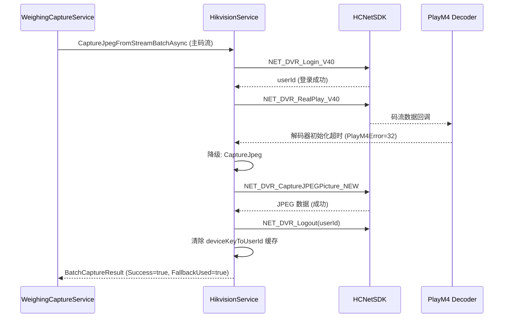

## Why

主码流抓拍（`CaptureJpegFromStream`，基于 RealPlay + PlayM4）频繁出现解码器初始化超时（`PlayM4Error=32`），但此时 HCNetSDK 登录仍然成功（`HCNetSDK=0`）。当前实现直接返回失败，未尝试设备侧 JPEG 接口（`CaptureJpeg` / `NET_DVR_CaptureJPEGPicture_NEW`），而该接口已实现且可靠。此外，登录会话缓存在 `deviceKeyToUserId` 中但从未清理，导致失效会话被复用和潜在资源泄漏。

## What Changes

- 主码流抓拍失败时自动降级为 `CaptureJpeg`，保持相同的通道、保存路径和 `jpegQuality` 参数
- 每次抓拍操作完成后（成功、失败或降级成功），无条件调用 `NET_DVR_Logout` 并清理本地缓存（`deviceKeyToUserId`）
- 登录前登出检查：如果缓存中已存在有效的 `userId`，在重新登录前先调用 `NET_DVR_Logout`，防止资源泄漏
- 记录降级事件日志，包含双路错误码（HCNetSDK + PlayM4），便于运维观测

## Capabilities

### New Capabilities
- `mainstream-capture-fallback`: 主码流抓拍失败时自动降级为设备侧 JPEG 抓拍
- `hikvision-session-lifecycle`: 登录会话生命周期管理，包括登录前登出检查、抓拍后会话清理和缓存清除

### Modified Capabilities
<!-- 无已有规范需要修改 -->

## Impact

**代码变更：**

| 文件路径 | 变更类型 | 变更原因 | 影响范围 |
|-----------|----------|----------|----------|
| `Services/Hikvision/HikvisionService.cs` | 修改 | 主码流批量路径增加降级逻辑；抓拍方法增加登出/缓存清理；`EnsureLogin` 增加登录前登出检查 | 核心抓拍流程 |
| `Services/Hikvision/HikvisionService.cs` | 修改 | `EnsureLogin` 需检查已有 userId 并在重新登录前执行登出 | 登录生命周期 |
| `Tests/HikvisionServiceTests.cs` | 修改 | 增加降级行为和会话清理的测试用例 | 测试套件 |

**API：** `IHikvisionService` 公共接口无变更 — 降级和清理均为内部实现细节。

**依赖：** 无新增依赖。使用已有的 `NET_DVR_Logout` 和 `CaptureJpeg` 代码路径。

**抓拍降级流程：**

