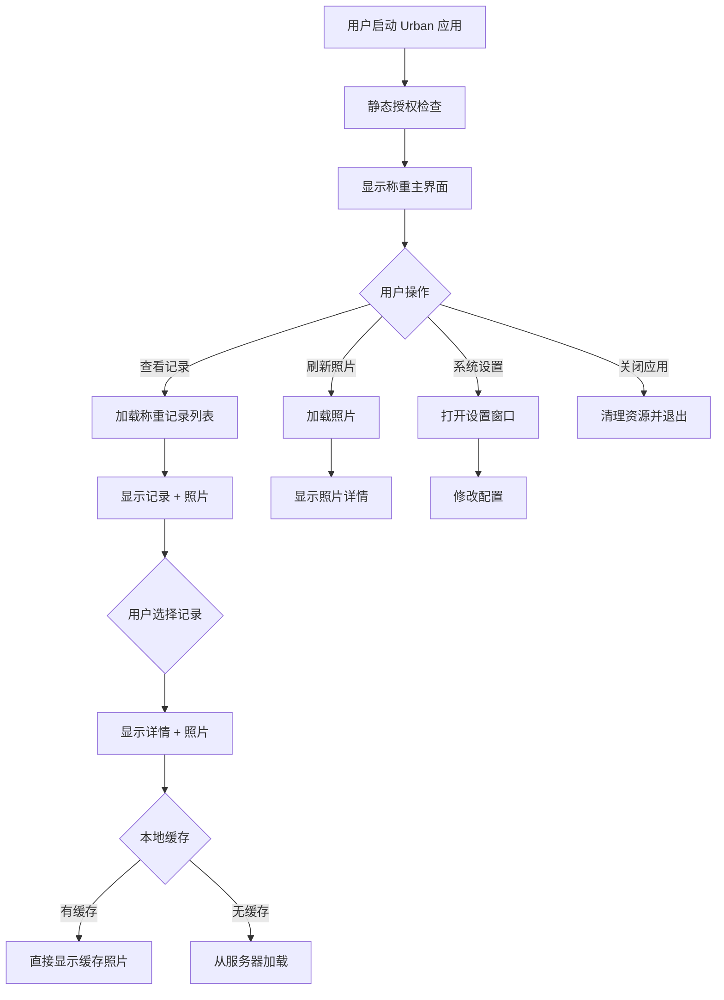
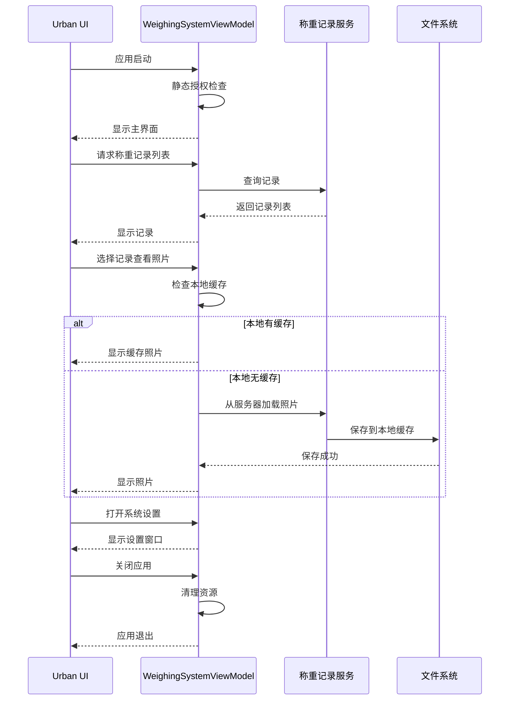

## Context

MaterialClient 主程序为多页面 + 登录架构。Urban 为单窗口桌面端，UI 已有 Demo 视觉草稿（`MaterialClient.Demo/Views/WeighingSystemWindow.axaml`）。

### 当前状态
- MaterialClient 使用标准模式（Standard = 0）和固废模式（SolidWaste = 1）
- Urban 需要独立的桌面客户端，无登录/授权流程

### 约束条件
- .NET 10 框架，使用 Avalonia UI
- 必须遵循 MaterialClient 编码规范（ReactiveUI、AutoConstructor、IAsyncDisposable）
- UI 布局必须与 Demo 保持一致（1280×800）

### 利益相关者
- UrbanManagement：城市管理业务方
- MaterialClient：桌面客户端开发团队
- 运维团队：部署和维护

## Goals / Non-Goals

**Goals:**
- 创建独立的 MaterialClient.Urban Avalonia 可执行项目
- 实现 UrbanMode = 201 单窗口桌面应用，启动即进入称重主界面
- 实现静态授权检查，无 UI 暴露
- 迁移 Demo UI 布局到 Urban 项目

**Non-Goals:**
- 登录页、授权页、第二业务窗口
- 完整业务绑定（slice 02）、上传（slice 03）
- 实时预览功能
- 向后兼容性（新功能独立模块）

## Decisions

### 1. 应用类型：单窗口 Avalonia 应用

**选择：** `AppBuilder.Configure<App>().UsePlatformDetect()` + Avalonia `ApplicationLifetime` 单主窗

**理由：**
- 与现有 MaterialClient 架构一致，便于维护
- Avalonia 原生支持单窗口场景
- 无需引入额外的窗口管理复杂性

**替代方案：**
- 多窗口 MDI 架构：过于复杂，不符合 Urban 单界面需求
- Web 技术栈：与现有桌面技术栈不一致

### 2. 主视图：迁移 Demo 布局

**选择：** 复制并调整 `WeighingSystemWindow.axaml` → `MaterialClient.Urban/Views/`

**理由：**
- Demo 布局已通过视觉验证，减少 UI 设计工作
- 保持与 MaterialClient 一致的用户体验
- 可复用 Demo 中定义的样式（`tab-btn`、`search-btn`、DataGrid 等）

**替代方案：**
- 全新设计 UI：增加设计成本，可能与主产品不一致
- 使用第三方 UI 库：引入新依赖，学习成本

### 3. 启动路由：直接打开主窗口

**选择：** `OnFrameworkInitializationCompleted` → `desktop.MainWindow = new WeighingSystemWindow()`；**无** `ShowLogin()`

**理由：**
- Urban 无登录需求，直接进入主界面简化启动流程
- 减少应用启动时间
- 避免与 MaterialClient 登录模块耦合

**替代方案：**
- 保留登录流程但跳过：增加不必要的代码路径
- 使用新的启动模式：增加架构复杂性

### 4. 授权：静态授权后台检查

**选择：** `StaticAuthChecker` 在模块 `OnApplicationInitialization` 调用；不向 UI 暴露状态（可选仅 Debug 状态栏文案）

**实现说明：**
- **TODO**：当前实现默认返回成功，后续完善实际授权逻辑
- 首期实现仅记录日志到文件，不进行实际授权验证
- 为后续授权机制预留接口和配置

**理由：**
- Urban 部署环境可控，静态授权满足需求
- 后台检查不干扰用户操作流程
- Debug 模式显示状态便于开发调试
- 首期聚焦核心功能，授权机制后续完善

**替代方案：**
- 完整授权 UI：与 Urban 简洁定位不符
- 云端授权验证：增加网络依赖和复杂性

### 5. 顶栏菜单：精简功能入口

**选择：** Demo 中「系统设置/项目信息/数据同步/退出登录」— Urban 首期隐藏或仅保留设置入口，**禁止**「退出登录」

**理由：**
- Urban 首期聚焦核心称重功能
- 避免用户误操作退出应用
- 后续可根据需求逐步开放功能

**替代方案：**
- 保留所有菜单项：增加用户困惑，不符合 Urban 定位
- 完全移除菜单栏：失去系统设置入口

### 6. 样式：复用 Demo 样式

**选择：** 复用 Demo 中已定义 `Style`（`tab-btn`、`search-btn`、DataGrid 等）或抽到 Urban `App.axaml` Resources

**理由：**
- 保持视觉一致性
- 减少样式定义重复
- 便于后续样式维护

**替代方案：**
- 全新定义样式：增加维护成本
- 使用第三方样式库：引入新依赖

### 7. Lrp 附件类型：Urban 专用车牌识别图片

**选择：** 新增 `AttachType.Lrp` 枚举值，仅 UrbanMode = 201 保存车牌识别图片，支持海康威视和 Vzvision 设备

**理由：**
- Urban 需要保留车牌识别图片用于监管追溯
- 仅 Urban 需要此功能，不影响其他模式
- Lrp 图片经过压缩处理，减少存储空间
- 与现有附件管理机制兼容

**实现要点：**
- 修改 `MaterialClient.Common/Entities/Attachment.cs` 添加 `Lrp = 5` 枚举值
- HikvisionLprService 和 VzvisionLprService 检查当前 WeighingMode
- 仅当 WeighingMode == UrbanMode (201) 时保存 Lrp 附件
- Lrp 图片使用 `JpegCompressionUtil.TryCompressJpegBytes` 压缩
- 复用现有 Attachment 保存和管理逻辑

**替代方案：**
- 使用现有 Photo 类型：无法区分 Lpr 和普通照片
- 为 Urban 创建独立附件表：增加维护复杂度

## 组件架构

```
MaterialClient.Urban (Avalonia Application)
├── App.axaml
│   └── OnFrameworkInitializationCompleted()
│       ├── StaticAuthChecker (后台授权检查)
│       └── MainWindow = new WeighingSystemWindow()
├── Views/
│   └── WeighingSystemWindow.axaml (主界面)
│       ├── 标题栏 (系统设置入口)
│       ├── 重量显示区
│       ├── 记录列表 + 照片侧栏
│       └── 设备状态栏
└── ViewModels/
    └── WeighingSystemViewModel.cs
        ├── 称重记录管理
        ├── 照片显示
        └── 设备状态监控

MaterialClient.Common (共享库)
├── Entities/Enums/
│   ├── WeighingMode.cs (+ UrbanMode = 201)
│   ├── ProductCode.cs (+ Urban = 5030)
│   └── Attachment.cs (+ Lrp = 5)
├── Services/
│   ├── Hikvision/
│   │   └── HikvisionLprService.cs (+ UrbanMode 检查 + Lrp 保存)
│   └── Vzvision/
│       └── VzvisionLprService.cs (+ UrbanMode 检查 + Lrp 保存)
├── Utils/
│   └── JpegCompressionUtil.cs (+ Lrp 图片压缩)
└── Configuration/
    └── SystemSettings.cs (+ Urban 配置)
```

## 数据流设计



## API 调用序列



## 详细代码变更清单

| 文件路径 | 变更类型 | 变更描述 | 影响模块 | 优先级 |
|---------|---------|---------|---------|-------|
| `MaterialClient.Urban/MaterialClient.Urban.csproj` | 新增 | Urban 项目定义，引用 Avalonia、ReactiveUI、MaterialClient.Common | 项目结构 | P0 |
| `MaterialClient.Urban/App.axaml` | 新增 | 应用定义，包含全局样式和资源 | 应用启动 | P0 |
| `MaterialClient.Urban/App.axaml.cs` | 新增 | 应用启动逻辑，静态授权检查，主窗口初始化 | 应用启动 | P0 |
| `MaterialClient.Urban/Views/WeighingSystemWindow.axaml` | 新增 | 主界面布局（迁移自 Demo） | UI 展示 | P0 |
| `MaterialClient.Urban/Views/WeighingSystemWindow.axaml.cs` | 新增 | 主界面 Code-behind，事件处理 | UI 交互 | P0 |
| `MaterialClient.Urban/ViewModels/WeighingSystemViewModel.cs` | 新增 | 主界面视图模型，业务逻辑，ReactiveUI 数据绑定 | 业务逻辑 | P0 |
| `MaterialClient.Common/Entities/Enums/WeighingMode.cs` | 修改 | 添加 `UrbanMode = 201` 枚举值 | 枚举定义 | P0 |
| `MaterialClient.Common/Entities/Enums/ProductCode.cs` | 修改 | 添加 `Urban = 5030` 枚举值 | 枚举定义 | P0 |
| `MaterialClient.Common/Entities/Attachment.cs` | 修改 | 添加 `AttachType.Lrp = 5` 枚举值 | 附件类型 | P0 |
| `MaterialClient.Common/Services/Hikvision/HikvisionLprService.cs` | 修改 | UrbanMode = 201 时保存 Lrp 附件 | 车牌识别服务 | P0 |
| `MaterialClient.Common/Services/Vzvision/VzvisionLprService.cs` | 修改 | UrbanMode = 201 时保存 Lrp 附件 | 车牌识别服务 | P0 |
| `MaterialClient.Common/Utils/JpegCompressionUtil.cs` | 修改 | Lrp 图片压缩处理 | 图片压缩 | P1 |
| `MaterialClient.Common/Configuration/SystemSettings.cs` | 修改 | 添加 `UrbanMode` 相关配置项 | 配置系统 | P1 |
| `MaterialClient.sln` | 修改 | 添加 `MaterialClient.Urban` 项目到解决方案 | 解决方案 | P0 |
| `MaterialClient.Common/MaterialClient.Common.csproj` | 无变更 | 现有项目引用保持不变 | 项目定义 | - |

## 配置变更

### SystemSettings 新增配置项

```csharp
public class SystemSettings
{
    // 现有配置...
    
    // ========== Urban 配置 ==========
    /// <summary>
    /// Urban 模式标识
    /// </summary>
    public bool IsUrbanMode { get; set; } = false;
    
    /// <summary>
    /// Urban 产品代码（5030）
    /// </summary>
    public int UrbanProductCode { get; set; } = 5030;
    
    /// <summary>
    /// 静态授权文件路径
    /// </summary>
    public string LicenseFilePath { get; set; } = "license.lic";
}
```

## 风险与缓解

| 风险 | 缓解 |
|------|------|
| **Demo 与生产项目结构不同** | 仅迁移 AXAML + 样式；ViewModel 接正式服务；代码审查验证 |
| **误加登录流程** | Code review + 无 Account 模块依赖；单元测试验证启动流程 |
| **配置错误** | 配置验证；默认值保守；详细错误日志 |
| **应用关闭时资源未清理** | `App.OnApplicationExit` 显式清理；超时保护；日志记录 |

## 迁移计划

### 阶段 1：基础设施（第 1-2 周）
1. 创建 `MaterialClient.Urban` 项目
2. 配置项目引用和依赖
3. 实现 `StaticAuthChecker`
4. 设置应用启动流程

### 阶段 2：UI 实现（第 3-4 周）
1. 迁移 `WeighingSystemWindow.axaml` 布局
2. 实现 `WeighingSystemViewModel`
3. 实现设备状态监控
4. 实现照片显示功能

### 阶段 3：测试与优化（第 5-6 周）
1. 单元测试（Urban 应用）
2. 集成测试（真实环境）
3. 性能测试
4. 用户验收测试

### 部署策略
1. **灰度发布**：先在 1-2 个站点试运行
2. **监控指标**：
   - 应用启动时间
   - 应用崩溃率
   - 资源使用（内存）
3. **回滚计划**：保留原 MaterialClient 作为备份

## 开放问题

1. **Urban 部署环境**：Urban 部署在什么环境？是否有特殊的硬件或网络限制？
2. **照片存储策略**：照片存储在本地还是服务器？存储容量限制？
3. **数据同步**：Urban 与 UrbanManagement 如何同步称重记录？
4. **离线模式**：Urban 是否需要离线工作？

## 非功能需求

### 性能
- 应用启动时间 < 3 秒
- 内存占用 < 200 MB（空闲）
- 照片加载响应时间 < 1 秒

### 可靠性
- 应用崩溃率 < 0.1%（每日）
- 资源泄漏率 = 0%

### 可维护性
- 代码遵循 MaterialClient 编码规范
- 关键决策记录在代码注释和文档中
- 错误日志包含足够的调试信息
- 单元测试覆盖率 ≥ 70%

### 安全性
- 静态授权检查不暴露敏感信息
- 照片文件访问权限控制
- 日志脱敏处理

## 测试策略

### 单元测试
- `StaticAuthChecker` 测试
- `WeighingSystemViewModel` 测试

### 集成测试
- 真实环境测试
- UI 交互测试

### UI 测试
- 应用启动流程测试
- 照片显示功能测试
- 设备状态更新测试
- 错误提示展示测试

## 依赖项

### 新增依赖
- 无（复用现有 MaterialClient 依赖）

### 现有依赖
- Avalonia (> 11.0.0)
- ReactiveUI (> 20.0.0)
- MaterialClient.Common (共享库)

### 开发依赖
- xUnit (单元测试)
- Moq (Mock 框架)
- FluentAssertions (断言库)
