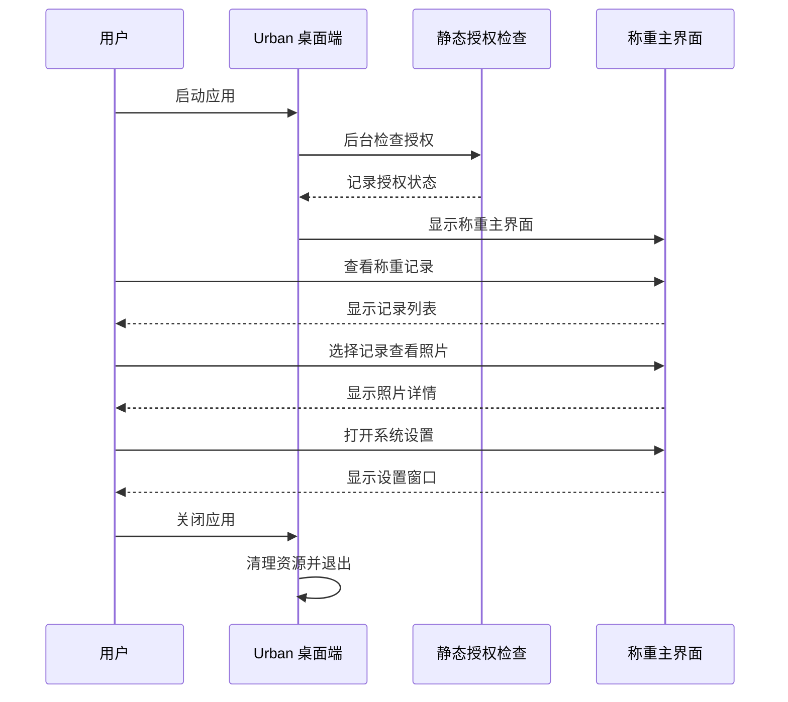

## Why

城市管理需要专用的 UrbanMode = 201 Avalonia 桌面客户端：启动即进入唯一称重主界面，配置与 MaterialClient 类似，无登录/授权页面，静态授权仅在启动时后台打日志。

## What Changes

### 新增功能
- **MaterialClient.Urban 项目**：新增 Avalonia 可执行项目（.NET 10），引用共享 Domain/Application/Infrastructure
- **UrbanMode 配置**：新增 `UrbanMode = 201` 枚举值，默认 `ProductCode = 5030`
- **静态授权检查**：实现 `IStaticLicenseChecker`（**TODO**：当前实现默认返回成功，后续完善实际授权逻辑），启动时读 `LicenseFilePath`，仅日志输出，无授权 UI
- **单窗口应用**：启动后直接打开唯一主窗口，无 LoginWindow/LicenseWindow/页面导航壳
- **UI 布局迁移**：从 `MaterialClient.Demo/Views/WeighingSystemWindow.axaml` 迁移布局到 Urban 项目
- **Lrp 附件类型**：新增 `AttachType.Lrp` 图片格式，用于保存车牌识别（LPR）识别出的图片，仅 UrbanMode = 201 保存，支持海康威视和 Vzvision 设备，Lrp 图片经过压缩处理

### 修改内容
- **WeighingMode 枚举**：增加 `UrbanMode = 201`（需要 delta spec）
- **ProductCode 枚举**：增加 `Urban = 5030`（需要 delta spec）
- **AttachType 枚举**：增加 `Lrp` 附件类型，用于存储车牌识别图片（需要 delta spec）
- **附件保存逻辑**：UrbanMode = 201 时保存 Lrp 图片，其他模式不保存

### 移除内容
- Urban 首期不包含登录页、授权页、第二业务窗口
- Urban 顶栏菜单移除「退出登录」等与登录相关项

## Capabilities

### New Capabilities
- `materialclient-urban-desktop`: Urban 桌面端、单主界面、UI 草稿落地、ProductCode 5030/WeighingMode 201、静态授权启动日志

### Modified Capabilities
- 无

## Impact

| 范围 | 说明 |
|------|------|
| **子仓库** | MaterialClient（主要）、UrbanManagement（配置参考） |
| **目录** | `MaterialClient.Urban/`（Views、ViewModels、App.axaml）、解决方案项 |
| **参考** | `MaterialClient.Demo/Views/WeighingSystemWindow.axaml` |
| **依赖** | Avalonia、ReactiveUI（与主客户端一致） |
| **配置** | SystemSettings 增加 UrbanMode 相关配置 |
| **向后兼容** | 不考虑向后兼容性（新功能独立模块） |

## UI 布局原型

```
┌──────────────────────────────────────────────────────────────────────┐
│ 凡 凡东城管地磅系统 FINDONG MATERIAL SYSTEM        [─] [✕]         │
├──────────────────────────────────────────────────────────────────────┤
│ ┌────────────┐                                                        │
│ │            │          0.00 吨           称重已结束                 │
│ │            │                                                        │
│ └────────────┘                                                        │
├──────────────────────────────────────────────────────────────────────┤
│ [全部记录] [正常] [异常]                                               │
│ ┌──────────────────────────────────────────────────────────────────┐ │
│ │ 称重时间 [__________] [__________]                               │ │
│ │ 车牌号码 [______________________] [搜索] [重置]                   │ │
│ └──────────────────────────────────────────────────────────────────┘ │
│ 车牌        | 称重时间        | 重量    | 状态  | 操作                │
│ 京A12345    | 2026-05-20 11:30| 12.50吨 | [正常]| [审批]              │
│ 京B67890    | 2026-05-20 11:25| 8.30吨  | [正常]| [审批]              │
│ ...                                                   [上一页][下一页]│
├──────────────────────────────────────┬─────────────────────────────────┤
│ 照片                                │ 车牌识别抓拍          16:30:30  │
│ ┌─────────────────────────────────┐ │ ┌─────────────────────────────┐ │
│ │              🚛                 │ │ │              🚛               │ │
│ │                                 │ │ │                             │ │
│ └─────────────────────────────────┘ │ └─────────────────────────────┘ │
│ ┌─────────────────────────────────┐ │ 摄像头抓拍            16:37:50  │
│ │              🚛                 │ │ ┌─────────────────────────────┐ │
│ │                                 │ │ │              🚛               │ │
│ └─────────────────────────────────┘ │ └─────────────────────────────┘ │
├──────────────────────────────────────────────────────────────────────┤
│ ● 地磅设备 在线  ● 摄像头1 在线  ● 摄像头2 在线  ● 车牌识别 在线     │
└──────────────────────────────────────────────────────────────────────┘
```

## 用户交互流程



## 代码变更清单

| 文件路径 | 变更类型 | 变更原因 | 影响范围 |
|---------|---------|---------|---------|
| `MaterialClient.Urban/MaterialClient.Urban.csproj` | 新增 | Urban 桌面端项目 | 新项目 |
| `MaterialClient.Urban/App.axaml` | 新增 | 应用启动配置 | 应用启动 |
| `MaterialClient.Urban/Views/WeighingSystemWindow.axaml` | 新增 | 主界面布局 | UI 展示 |
| `MaterialClient.Urban/ViewModels/WeighingSystemViewModel.cs` | 新增 | 主界面视图模型 | 业务逻辑 |
| `MaterialClient.Common/Entities/Enums/WeighingMode.cs` | 修改 | 增加 UrbanMode = 201 | 枚举定义 |
| `MaterialClient.Common/Entities/Enums/ProductCode.cs` | 修改 | 增加 Urban = 5030 | 枚举定义 |
| `MaterialClient.Common/Entities/Attachment.cs` | 修改 | 增加 AttachType.Lrp 枚举值 | 附件类型 |
| `MaterialClient.Common/Configuration/SystemSettings.cs` | 修改 | 增加 Urban 相关配置 | 配置系统 |
| `MaterialClient.Common/Services/Hikvision/HikvisionLprService.cs` | 修改 | UrbanMode = 201 时保存 Lrp 图片 | 车牌识别服务 |
| `MaterialClient.Common/Services/Vzvision/VzvisionLprService.cs` | 修改 | UrbanMode = 201 时保存 Lrp 图片 | 车牌识别服务 |
| `MaterialClient.Common/Utils/JpegCompressionUtil.cs` | 修改 | Lrp 图片压缩处理 | 图片压缩工具 |
| `MaterialClient.sln` | 修改 | 添加 Urban 项目 | 解决方案 |
