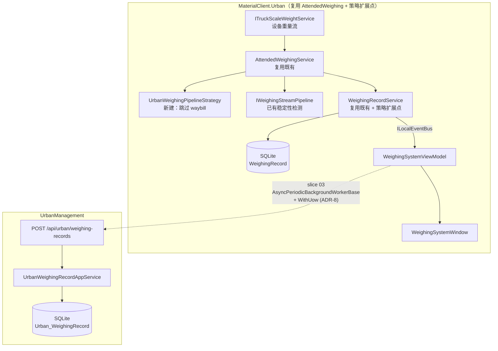
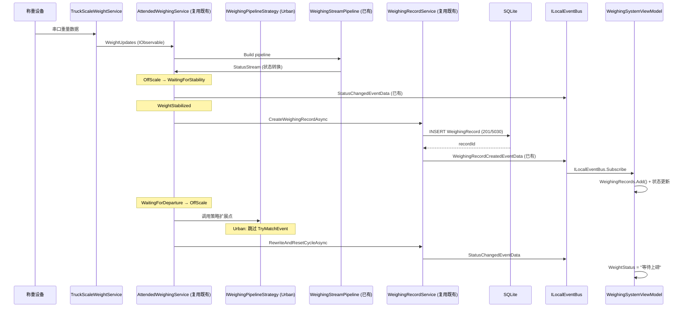

## Context

主界面已存在（slice 01 `materialclient-urban-desktop`），`WeighingSystemViewModel` 当前使用 mock 数据。称重设备层（`ITruckScaleWeightService`、`IWeighingStreamPipeline`）已在 MaterialClient 共享层实现。本切片将这两层连接起来：设备重量事件 → 稳定性检测 → 创建 WeighingRecord → 驱动 UI。

**以 `MaterialClient.Common` 的 AttendedWeighing 既有实现为基线**（ADR-5），Urban 仅做注册、配置与 UrbanMode 分支扩展。新增代码优先放在**扩展点**（如 `IWeighingPipelineStrategy`、Urban 专用模块配置）；确需改 Common 时保持对有人值守行为的回归测试。

UrbanManagement 侧已有 ABP + EF Core SQLite 基础架构（`GovSyncData` 等实体），需新建接收称重记录的 API 端点和实体。

**约束**：
- MaterialClient.Urban 无 Generic Host、无 ABP 容器，服务注册在 `App.axaml.cs` 手动构造
- Urban 不做 waybill 匹对（ADR-5）
- `WeighingMode = UrbanMode (201)`、`ProductCode = 5030`
- 同步状态字段仅预留，上传逻辑由 slice 03 实现（ADR-8）
- 设备 ID 通过 `IDeviceIdentityProvider` 注入（ADR-9，首期固定配置 `Guid`）
- `Urban_WeighingRecord` 表结构以 MaterialClient 本地 `WeighingRecord` 为蓝本（OQ-4），不在本文件逐列定稿

## Goals / Non-Goals

**Goals**

- 重量稳定 → SQLite 一条 WeighingRecord（Mode=201, ProductCode=5030）→ 列表刷新
- 重量区实时显示（绑定 `CurrentWeight`，通过 `WhenAnyValue` 驱动）
- 状态文案联动（"等待上磅" / "正在称重" / "称重已结束"）
- 列表 Tab 筛选（全部/正常/异常）、称重时间与车牌查询、本地分页
- SyncStatus 字段（Pending/Synced/Failed）预留，供 slice 03 `AsyncPeriodicBackgroundWorkerBase` + `WithUow` 消费（ADR-8）
- UrbanManagement 提供 `POST /api/urban/weighing-records` 接收端点及 `GET` 查询

**Non-Goals**

- Waybill 匹对
- HTTP 上传逻辑（slice 03）
- 设备遥测心跳（slice 04）
- 用户认证/授权

## Decisions

### D1：复用 AttendedWeighing 既有逻辑 + 策略扩展点（ADR-5）

**决策**：Urban 宿主注册并启动 `AttendedWeighing` 与主程序相同或子集的 ABP 模块依赖；称重记录创建走 Common 既有服务/事件。若 UrbanMode 需跳过运单，在 **策略接口**（`IWeighingPipelineStrategy`）或 **`WeighingMode == UrbanMode` 守卫** 处短路，而非复制 `AttendedWeighingService` 主体。

**具体扩展点**：
- `AttendedWeighingService.ProcessStatusTransition`：在现有流程中注入 `IWeighingPipelineStrategy` 调用点，Urban 策略实现跳过 `RewriteAndResetCycleAsync` 中的 `TryMatchEvent`
- `WeighingRecordService.TryReWritePlateNumberAsync`：在扩展点调用策略或 WeighingMode 守卫，UrbanMode 跳过 `TryMatchEvent` 发布
- `AttendedWeighingService.GetStatusAudioText`：可通过策略返回 Urban 专用音频文案（如有需要）

**扩展边界**：新增代码优先放在 **扩展点**（如 `IWeighingPipelineStrategy`、Urban 专用 `UrbanWeighingModule` 配置）；确需改 Common 时保持对有人值守行为的回归测试。

**备选方案**：直接在 `AttendedWeighingService` 内部加入 `WeighingMode` 条件分支 → 可接受但非首选，因为增加共享层耦合度；或新建 `UrbanWeighingService` 独立实现管线 → 拒绝，重复约 600 行管线逻辑。

### D2：复用 IWeighingStreamPipeline 做稳定性检测

**决策**：复用 MaterialClient 共享层的 `IWeighingStreamPipeline`（`WeighingStreamPipeline`），`AttendedWeighingService` 已在 `StartAsync` 中构建并订阅其组合状态流，无需额外操作。

**理由**：稳定性检测算法（Buffer + sliding window + range check）已完整实现且经过测试。Urban 与 Attended 模式使用相同的物理设备，稳定性标准一致。

### D3：ViewModel 通过 ILocalEventBus 接收称重管线事件

**决策**：`WeighingSystemViewModel` 通过 `ILocalEventBus` 订阅已有的 `WeighingRecordCreatedEventData` 和 `StatusChangedEventData`，不新建 MessageBus 消息类型。

**理由**：`WeighingRecordService` 已通过 `ILocalEventBus.PublishAsync(new WeighingRecordCreatedEventData(...))` 发布记录创建事件（见 `WeighingRecordService.cs:103`）。`WeighingStateManager` 已通过 `UpdateStatusAndNotify` 发布 `StatusChangedEventData`（见 `WeighingStateManager.cs:112-116`）。ViewModel 直接订阅这些已有事件即可，无需新建消息类型。

### D4：WeighingRecord 新增 SyncStatus 列

**决策**：在共享 `WeighingRecord` 实体上新增 `SyncStatus` 枚举字段（默认 `Pending`），不新建独立的同步队列表。

**理由**：SyncStatus 是记录本身的属性（Pending → Synced/Failed），与记录 1:1 关系。单表查询更简单，SQLite 列级筛选性能足够。slice 03 的 `AsyncPeriodicBackgroundWorkerBase` + `WithUow` Worker 扫描 `Pending` 记录并上传（ADR-8）。

### D5：UrbanManagement 新建 UrbanWeighingRecord 实体（OQ-4）

**决策**：在 UrbanManagement.Core 新建 `UrbanWeighingRecord` 实体（非复用 MaterialClient 的 WeighingRecord），映射到 `Urban_WeighingRecord` 表。**列级设计不在本文件定稿**——实现阶段在 OpenSpec 中从 `repos/MaterialClient` 定位 `WeighingRecord` 实体及 EF 配置，复制列定义策略（PascalCase、类型、可空性）；允许增加 `ReceivedAt`（服务端 UTC）、`RawJson`（可选）、`DeviceId`（与 `IDeviceIdentityProvider` 一致）。保留 `ClientRecordId`（客户端 `WeighingRecord.Id`）唯一索引做幂等。

**理由**：两个系统有不同的持久化需求（OQ-4）。字段集合不同（UrbanManagement 不需要 MaterialsJson 等物料字段，但需要服务端元数据）。

### D6：UI 线程安全——ObserveOn(RxApp.MainThreadScheduler)

**决策**：所有从 Rx 管线到 ViewModel 的数据推送必须使用 `ObserveOn(RxApp.MainThreadScheduler)`。

**理由**：设备回调在后台线程，直接更新 `ObservableCollection` 会抛跨线程异常。AGENTS.md 明确要求此模式。

### D7：列表数据源——本地 SQLite 仓储

**决策**：列表数据从本地 SQLite 通过 `IRepository<WeighingRecord, long>` 查询，ViewModel 不直接持有设备数据。

**理由**：与 AttendedWeighing 模式一致，数据持久化后再查询 UI，保证数据一致性。

### D8：设备 ID 通过 IDeviceIdentityProvider 注入（ADR-9）

**决策**：请求与遥测中的 `DeviceId` 均通过 `IDeviceIdentityProvider` 注入。首期实现 `FixedConfigurationDeviceIdentityProvider`：从 `Urban:FixedDeviceGuid` 读取固定 `Guid` 字符串并返回。

**理由**：OQ-3 首期降低设计面；先打通协议与 UrbanManagement。多安装点共用同一配置为已知局限，未来另开 change 实现机器指纹/持久化 ID（见 PRD FR-1.5 未来缓解）。

## Risks / Trade-offs

| 风险 | 缓解 |
|------|------|
| UI 线程与设备回调竞争 | `ObserveOn(RxApp.MainThreadScheduler)` 强制所有 UI 更新在主线程 |
| WeighingStreamPipeline 单例共享 | `Publish().RefCount()` 已在 pipeline 内部实现，多订阅者安全 |
| SyncStatus 列迁移（新增列） | SQLite `ALTER TABLE ADD COLUMN` 支持，无需数据迁移 |
| UrbanManagement 接收重复记录 | DTO 包含 ClientRecordId 做幂等键，服务端去重 |
| ViewModel 状态文案与实际称重状态不同步 | ViewModel 同时订阅状态流和记录事件，状态流为单一数据源 |
| 扩展点对 Common 的改动影响有人值守 | 保持 Common 改动最小；扩展点默认实现兼容现有行为；回归测试覆盖 |
| 固定 Guid 多客户端 ID 冲突 | 已知首期局限（ADR-9）；部署时按现场区分配置 |

## Architecture

```
Component Hierarchy (MaterialClient.Urban — 复用 AttendedWeighing + 策略扩展点)
├── App.axaml.cs (服务注册入口)
│   ├── IAttendedWeighingService → AttendedWeighingService (复用既有，注入策略)
│   │   ├── IWeighingPipelineStrategy → UrbanWeighingPipelineStrategy (新建，跳过waybill)
│   │   ├── IWeighingStreamPipeline (已有稳定性检测)
│   │   ├── ITruckScaleWeightService (已有设备重量数据源)
│   │   ├── WeighingStateManager (已有状态机)
│   │   ├── WeighingRecordService (复用既有，扩展点调用策略)
│   │   │   └── TryReWritePlateNumberAsync: 策略/守卫 → UrbanMode 跳过 TryMatchEvent
│   │   ├── ProcessStatusTransition: 策略/守卫 → UrbanMode 跳过 waybill
│   │   └── IWeighingCaptureService (已有抓拍服务)
│   ├── IDeviceIdentityProvider → FixedConfigurationDeviceIdentityProvider (ADR-9)
│   └── WeighingSystemViewModel (UI 绑定)
│       ├── ILocalEventBus ← WeighingRecordCreatedEventData (已有)
│       ├── ILocalEventBus ← StatusChangedEventData (已有)
│       ├── CurrentWeight (绑定重量区)
│       ├── WeightStatus (绑定状态文案)
│       └── WeighingRecords (绑定列表 DataGrid)

Component Hierarchy (UrbanManagement)
├── UrbanWeighingRecordController (API 入口)
│   └── IUrbanWeighingRecordAppService (业务逻辑)
│       └── IRepository<UrbanWeighingRecord> (EF Core 持久化)
└── UrbanWeighingRecord (实体，OQ-4 原则)
```





## Detailed Code Change Inventory

| 文件路径 | 变更类型 | 变更描述 | 影响模块 |
|----------|----------|----------|----------|
| `MaterialClient.Urban/Services/UrbanWeighingPipelineStrategy.cs` | 新建 | `IWeighingPipelineStrategy` 的 Urban 实现：跳过 waybill 匹对、跳过 TryMatchEvent | Urban 称重扩展 |
| `MaterialClient.Urban/Services/UrbanWeighingService.cs` | 新建 | `IUrbanWeighingService`（或等价）：保证 WeighingMode=UrbanMode, ProductCode=5030 的协调服务 | Urban 称重协调 |
| `MaterialClient.Common/Services/AttendedWeighing/AttendedWeighingService.cs` | 修改 | 注入 `IWeighingPipelineStrategy`；在 `ProcessStatusTransition` 扩展点调用策略；保持默认行为兼容 | 共享称重层（最小改动） |
| `MaterialClient.Common/Services/AttendedWeighing/WeighingRecordService.cs` | 修改 | 在 `TryReWritePlateNumberAsync` 扩展点调用策略或 WeighingMode 守卫；保持默认行为兼容 | 共享称重层（最小改动） |
| `MaterialClient.Urban/ViewModels/WeighingSystemViewModel.cs` | 修改 | 移除 mock 数据，通过 ILocalEventBus 订阅 WeighingRecordCreatedEventData 和 StatusChangedEventData | Urban UI |
| `MaterialClient.Urban/App.axaml.cs` | 修改 | 注册 `IWeighingPipelineStrategy` → `UrbanWeighingPipelineStrategy`；解析并启动 `IAttendedWeighingService.StartAsync()` | Urban 启动 |
| `MaterialClient.Common/Entities/WeighingRecord.cs` | 修改 | 新增 SyncStatus 属性 | 共享域层 |
| `MaterialClient.Common/Entities/Enums/SyncStatus.cs` | 新建 | 同步状态枚举 | 共享域层 |
| `UrbanManagement.Core/Entities/UrbanWeighingRecord.cs` | 新建 | 服务端称重记录实体（OQ-4 原则，列定义在 OpenSpec 中对照 MaterialClient 源定稿） | 服务端域层 |
| `UrbanManagement.Core/EntityFrameworkCore/UrbanManagementDbContext.cs` | 修改 | 添加 UrbanWeighingRecord DbSet | 服务端数据层 |
| `UrbanManagement.Core/Services/UrbanWeighingRecordAppService.cs` | 新建 | 称重记录业务逻辑（接收、去重、查询） | 服务端应用层 |
| `UrbanManagement.App/Controllers/UrbanWeighingRecordController.cs` | 新建 | API 控制器（POST 接收、GET 查询） | 服务端 API 层 |
