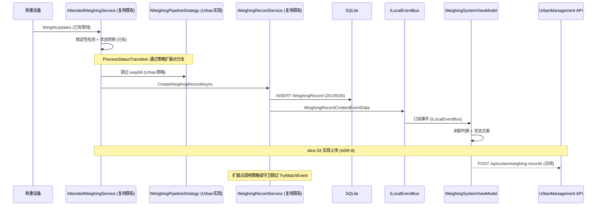

## Why

Urban 桌面端主界面已存在（slice 01），但称重设备事件尚未接入。需要建立从设备重量事件到 UI 的完整称重记录管线，并以 `MaterialClient.Common` 的 **AttendedWeighing 既有逻辑**为基线（ADR-5），通过 **策略接口或 WeighingMode 守卫**（如 `IWeighingPipelineStrategy`）处理 Urban 与有人值守的差异（跳过 waybill 匹对），避免在 Urban 中平行实现称重状态机。

重量稳定后创建 WeighingRecord（Mode=201, ProductCode=5030）、驱动 UI 列表刷新与状态文案联动，并将同步状态字段（Pending/Synced/Failed）预留供 slice 03 上传使用（ADR-8：`AsyncPeriodicBackgroundWorkerBase` + `IUnitOfWorkManager` 周期扫描 Pending）。

## What Changes

- **复用 AttendedWeighing 既有逻辑**（ADR-5）：Urban 宿主注册并启动 `AttendedWeighing` 与主程序相同或子集的 ABP 模块依赖；称重记录创建走 Common 既有服务/事件。仅在 Urban 与有人值守差异处**扩展**（策略、条件分支或薄适配层），不复制 `AttendedWeighingService` 主体。
- **`IWeighingPipelineStrategy` Urban 实现**（或 `WeighingMode == UrbanMode` 守卫）：在 `ProcessStatusTransition` 和记录创建流程中，通过策略接口或模式守卫跳过 waybill 匹对（`TryMatchEvent`），而非直接修改 `AttendedWeighingService` 内部逻辑。新增代码优先放在**扩展点**（Urban 专用模块或 `IWeighingPipelineStrategy` 实现）；确需改 Common 时保持对有人值守行为的回归测试。
- **`IUrbanWeighingService`**（或等价）：在 AttendedWeighing 产出路径上保证 `WeighingMode = UrbanMode`、`ProductCode = 5030`。
- **WeighingSystemViewModel 绑定**：通过 `ILocalEventBus` 订阅已有的 `WeighingRecordCreatedEventData` 和 `StatusChangedEventData`，刷新 `ObservableCollection<WeighingRecord>`、绑定 `CurrentWeight` 实时显示、状态文案联动。
- **列表筛选与分页**：Tab 筛选（全部/正常/异常）、称重时间与车牌查询、数据来自本地 SQLite。
- **同步状态字段**：WeighingRecord 新增 `SyncStatus`（Pending/Synced/Failed），供 slice 03 上传管线消费（ADR-8：`AsyncPeriodicBackgroundWorkerBase` + `WithUow` 周期上传 Pending 记录）。
- **设备 ID**：请求与遥测中的 `DeviceId` 均通过 `IDeviceIdentityProvider` 注入（ADR-9：首期 `FixedConfigurationDeviceIdentityProvider` 返回配置固定 `Guid`）。
- **UrbanManagement API 接收端**：新建 `UrbanWeighingRecord` 实体和 `POST /api/urban/weighing-records` 接口（表结构以 MaterialClient 本地 `WeighingRecord` 为蓝本，OQ-4）。此部分与 slice 03 上传 API 协调实现。

```
┌─ MaterialClient.Urban 主界面 ──────────────────────────────┐
│ ┌─ 标题栏 (48px) ────────────────────────────────────────┐ │
│ │ Logo  凡东城管地磅系统                    [设置] [×]    │ │
│ └────────────────────────────────────────────────────────┘ │
│ ┌─ 重量区 (72px) ────────────────────────────────────────┐ │
│ │  [ 12,500 kg ]    称重已结束 ●                         │ │
│ └────────────────────────────────────────────────────────┘ │
│ ┌─ 记录列表 + 照片侧栏 ─────┬─ 照片区 ─────────────────┐ │
│ │ [全部] [正常] [异常]       │ 车牌识别抓拍             │ │
│ │ ┌─────┬──────┬────┬────┐  │ ┌────────────────────┐   │ │
│ │ │车牌 │时间  │重量│状态│  │ │   [车牌照片]       │   │ │
│ │ ├─────┼──────┼────┼────┤  │ └────────────────────┘   │ │
│ │ │京A..│10:30 │12t │待传│  │ 摄像头抓拍               │ │
│ │ │京B..│10:15 │ 8t │已传│  │ ┌────────────────────┐   │ │
│ │ └─────┴──────┴────┴────┘  │ │   [现场照片]       │   │ │
│ │ [< 1 2 3 >]               │ └────────────────────┘   │ │
│ └────────────────────────────┴──────────────────────────┘ │
│ ┌─ 设备状态栏 (36px) ────────────────────────────────────┐ │
│ │ ● 地磅在线  ● 摄像头1在线  ● 车牌识别在线             │ │
│ └────────────────────────────────────────────────────────┘ │
└────────────────────────────────────────────────────────────┘
```



## Capabilities

### New Capabilities
- `urban-weighing-record-pipeline`: MaterialClient 侧——复用 `AttendedWeighing` 既有逻辑，通过 `IWeighingPipelineStrategy` 或 WeighingMode 守卫跳过 waybill 匹对；ViewModel 通过 `ILocalEventBus` 订阅已有事件驱动列表/重量/状态 UI。
- `urban-weighing-record-reception`: UrbanManagement 侧称重记录接收——API 端点、实体持久化（OQ-4：以 MaterialClient `WeighingRecord` 为蓝本）、记录查询。

### Modified Capabilities
- `attended-weighing`：在扩展点（`IWeighingPipelineStrategy` 或 WeighingMode 守卫）处为 UrbanMode 提供分支——跳过 `TryMatchEvent`；保持对有人值守行为的回归兼容。
- `weighing-device-capture`：UrbanMode 下设备事件接入方式确认（复用现有 `ITruckScaleWeightService`，无需新增接口）。
- `materialclient-urban-desktop`：ViewModel 从 mock 数据切换为真实称重管线驱动的数据绑定。

## Impact

| 仓库 | 影响范围 |
|------|----------|
| **MaterialClient** | 复用 `AttendedWeighing` 既有逻辑驱动 UrbanMode 称重；通过 `IWeighingPipelineStrategy` 或 WeighingMode 守卫跳过 waybill；修改 `WeighingSystemViewModel` 订阅 `ILocalEventBus` 事件绑定真实数据；修改 `App.axaml.cs` 启动称重服务；WeighingRecord 新增 SyncStatus 字段 |
| **UrbanManagement** | 新建 `UrbanWeighingRecord` 实体（OQ-4：以 MaterialClient `WeighingRecord` 为蓝本）、DbContext 配置、API Controller；新建 `POST /api/urban/weighing-records` 端点 |
| **依赖** | 直接复用 `IAttendedWeighingService`、`WeighingRecordService`、`WeighingStateManager`、`IWeighingStreamPipeline`、`ITruckScaleWeightService`、`ILocalEventBus`、`IDeviceIdentityProvider`（ADR-9） |
| **数据库** | MaterialClient SQLite：WeighingRecord 表新增 SyncStatus 列；UrbanManagement SQLite：新建 UrbanWeighingRecord 表（列定义在 OpenSpec 中对照 MaterialClient 源定稿，OQ-4） |

| 文件路径 | 变更类型 | 变更原因 | 影响范围 |
|----------|----------|----------|----------|
| `MaterialClient.Urban/Services/UrbanWeighingPipelineStrategy.cs` | 新建 | `IWeighingPipelineStrategy` 的 Urban 实现：跳过 waybill 匹对 | Urban 称重扩展 |
| `MaterialClient.Urban/Services/UrbanWeighingService.cs` | 新建 | `IUrbanWeighingService`（或等价）：保证 WeighingMode=UrbanMode, ProductCode=5030 | Urban 称重协调 |
| `MaterialClient.Common/Services/AttendedWeighing/AttendedWeighingService.cs` | 修改 | 注入 `IWeighingPipelineStrategy`；在 `ProcessStatusTransition` 扩展点调用策略 | 共享称重层（最小改动） |
| `MaterialClient.Common/Services/AttendedWeighing/WeighingRecordService.cs` | 修改 | 在 `TryReWritePlateNumberAsync` 扩展点调用策略或 WeighingMode 守卫 | 共享称重层（最小改动） |
| `MaterialClient.Urban/ViewModels/WeighingSystemViewModel.cs` | 修改 | 从 mock 切换为 ILocalEventBus 事件绑定 | Urban 主界面 |
| `MaterialClient.Urban/App.axaml.cs` | 修改 | 注册策略实现并启动称重服务 | Urban 启动 |
| `MaterialClient.Common/Entities/WeighingRecord.cs` | 修改 | 新增 SyncStatus 字段 | 共享层 |
| `UrbanManagement.Core/Entities/UrbanWeighingRecord.cs` | 新建 | 服务端称重记录实体（OQ-4 原则） | 服务端 |
| `UrbanManagement.App/Controllers/UrbanWeighingRecordController.cs` | 新建 | 称重记录接收 API | 服务端 |
