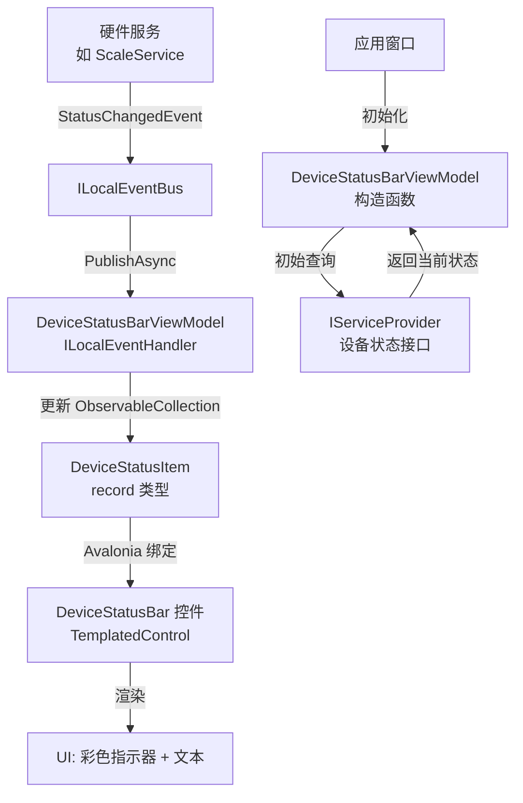
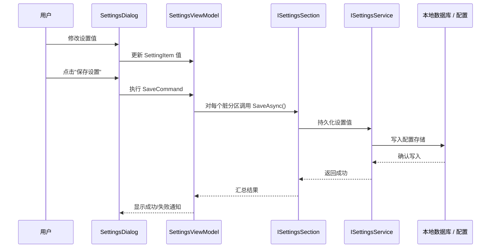

## Context

MaterialClient 是基于 Avalonia UI 的桌面应用（.NET 10），包含多个产品变体：
- **MaterialClient**（主应用）— 全功能称重系统，含登录、设置、多模块支持
- **MaterialClient.Urban** — 城管精简变体，无登录，单窗口
- **MaterialClient.Demo** — 演示/原型变体

所有变体共享 `MaterialClient.Common` 用于服务、实体和事件。`MaterialClient.UI` 目录已存在但没有 `.csproj`——是一个空壳。

**当前重复热点：**
- 设备状态指示器在 `AttendedWeighingWindow.axaml`（647行）和 `UrbanAttendedWeighingWindow.axaml`（312行）中内联出现
- 设置基础设施仅存在于主应用（`SettingsWindow.axaml` 840行 + `SettingsWindowViewModel.cs` 940行）；Urban 只有一个无功能的"系统设置"按钮
- 标题栏、窗口控件和导航模式在窗口间复制粘贴
- 颜色资源按应用独立定义：Urban 使用 `DynamicResource`，主应用使用硬编码十六进制值

**约束（来自 AGENTS.md）：**
- ReactiveUI 用于所有数据绑定（不使用 CommunityToolkit.Mvvm）
- 使用 `[Reactive]` 源生成器特性，不手写 `RaiseAndSetIfChanged`
- ABP 隐式注册（`ITransientDependency` + `[AutoConstructor]`）
- `.NET 10`、`Nullable enable`、`ImplicitUsings enable`
- MessageBus 用于 ViewModel 间通信

## Goals / Non-Goals

**目标：**
- 建立 MaterialClient.UI 为可构建的 Avalonia 类库，被 MaterialClient 和 MaterialClient.Urban 共同消费
- 将设备状态栏提取为带 ReactiveUI 绑定的可复用控件
- 创建可扩展的设置对话框框架，两个应用可以各自填充自己的分区
- 将共享颜色资源和样式类集中到单一主题资源字典
- 将 Urban 的"系统设置"按钮连接到功能性的设置对话框

**非目标：**
- 重构整个 AttendedWeighingWindow 或 UrbanAttendedWeighingWindow 的布局（仅提取状态栏和设置）
- 创建超出这两个应用需求的通用组件库
- Web UI（LayUI 管理后台）变更——属于独立关注点
- 迁移 MaterialClient.Demo（超出本变更范围）
- 更改现有 ABP 模块注册模式

## Decisions

### 决策 1：MaterialClient.UI 作为 Avalonia 类库

**选择：** 创建 `MaterialClient.UI.csproj` 作为 `<EnableAvaloniaXamlCompilation>true</EnableAvaloniaXamlCompilation>` 类库，目标框架 `net10.0`。

**备选方案：**
- *在各项目中保持控件内联：* 已否决——无法解决重复问题
- *将控件放入 MaterialClient.Common：* 已否决——Common 用于非 UI 服务/实体，混入 UI 关注点违反 SRP
- *为 UI 库创建独立仓库：* 已否决——对同一解决方案中的两个消费者来说过度工程化

**理由：** MaterialClient.UI 已作为占位目录存在。将其变为真正项目是最低摩擦路径。它引用 Avalonia + ReactiveUI 包和 MaterialClient.Common 获取服务接口。

### 决策 2：DeviceStatusBar 作为 TemplatedControl + DeviceStatusItemViewModel

**选择：** 创建 `DeviceStatusBar` 作为 Avalonia `TemplatedControl`，带有可配置的 `ItemsSource` 绑定到 `ObservableCollection<DeviceStatusItem>`。

```
组件层次结构
├── MaterialClient.UI
│   ├── Controls/
│   │   ├── DeviceStatusBar.axaml          (TemplatedControl)
│   │   │   └── DeviceStatusItem           (数据模型: record 类型)
│   │   ├── SettingsDialog.axaml           (Window)
│   │   │   ├── SettingsNavigationPanel    (侧边栏)
│   │   │   └── SettingsContentPanel       (内容区)
│   │   └── SettingItems/
│   │       ├── ToggleSettingItem.axaml
│   │       ├── DropdownSettingItem.axaml
│   │       ├── SliderSettingItem.axaml
│   │       └── TextSettingItem.axaml
│   ├── ViewModels/
│   │   ├── DeviceStatusBarViewModel.cs    (管理设备状态)
│   │   ├── SettingsViewModel.cs           (基础: 导航 + 保存)
│   │   └── SettingItemViewModel.cs        (基础: key, label, value)
│   ├── Styles/
│   │   └── SharedTheme.axaml              (颜色、按钮类)
│   └── MaterialClient.UI.csproj
├── MaterialClient (引用 UI)
│   └── Views/Settings/                    (应用特定分区)
├── MaterialClient.Urban (引用 UI)
│   └── Views/Settings/                    (Urban 特定分区)
```

**备选方案：**
- *使用固定布局的 UserControl：* 更简单但不够灵活——不同应用显示不同设备集合
- *各窗口内联模板：* 当前状态，正是需要解决的问题

**理由：** `TemplatedControl` 配合 `ItemsSource` 让各应用可以配置显示哪些设备及其名称，同时控件统一处理布局和样式。

### 决策 3：设置对话框采用分区注册模式

**选择：** `SettingsDialog` 暴露 `Sections` 集合。各消费应用通过 ABP 约定（`ITransientDependency`）注册其 `ISettingsSection` 实现。对话框打开时自动发现所有分区并构建导航侧边栏。

**备选方案：**
- *单一设置视图：* 已否决——无法在不同设置的应用间共享
- *从配置模式驱动设置生成：* 已否决——过早泛化
- *各应用手动维护分区列表：* 更简单但失去扩展性

**理由：** ABP 的 `ITransientDependency` 约定已在全项目使用。各应用的模块注册自己的设置分区。对话框框架负责导航、渲染类型化项和编排加载/保存。

### 决策 4：SharedTheme.axaml 作为集中式资源字典

**选择：** 将命名颜色（`PrimaryBlue`、`LightBlue`、`BackgroundGray`）和样式类（`primary-button`、`titlebar-close-button`、`card-border` 等）合并到 MaterialClient.UI 的 `Styles/SharedTheme.axaml` 中。

**备选方案：**
- *在各 App.axaml 中保留样式：* 当前状态——会导致漂移
- *使用第三方主题库：* 已否决——项目已有自定义设计令牌

**理由：** 最近的 `urban-materialclient-style-consistency-sync` 变更已确立 Urban 必须使用 MaterialClient 的共享样式类。将那些类迁移到 MaterialClient.UI 可创建单一来源。

## 数据流 — 设备状态更新



## API 调用时序 — 设置保存



## 详细代码变更清单

| 文件路径 | 变更类型 | 变更描述 | 受影响模块 |
|-----------|----------|----------|------------|
| `MaterialClient.UI/MaterialClient.UI.csproj` | 新增 | Avalonia 类库，含 ReactiveUI + Common 引用 | 构建系统 |
| `MaterialClient.UI/Controls/DeviceStatusBar.axaml` | 新增 | TemplatedControl：状态指示器 ItemsControl | MaterialClient, Urban |
| `MaterialClient.UI/Controls/DeviceStatusBar.axaml.cs` | 新增 | 含 ItemsSource 依赖属性的代码隐藏文件 | MaterialClient, Urban |
| `MaterialClient.UI/Models/DeviceStatusItem.cs` | 新增 | `record DeviceStatusItem(string Name, bool IsOnline)` | MaterialClient.UI |
| `MaterialClient.UI/ViewModels/DeviceStatusBarViewModel.cs` | 新增 | 查询设备服务、处理 StatusChanged 事件、填充 Items | MaterialClient.UI |
| `MaterialClient.UI/Controls/SettingsDialog.axaml` | 新增 | 含导航侧边栏 + 内容面板 + 保存按钮的 Window | MaterialClient, Urban |
| `MaterialClient.UI/Controls/SettingsDialog.axaml.cs` | 新增 | Window 代码隐藏文件，连线逻辑 | MaterialClient.UI |
| `MaterialClient.UI/ViewModels/SettingsViewModel.cs` | 新增 | 基础 VM：Sections 集合、SelectedSection、SaveCommand | MaterialClient.UI |
| `MaterialClient.UI/Abstractions/ISettingsSection.cs` | 新增 | 接口：Name、Icon、CreateView()、LoadAsync()、SaveAsync() | MaterialClient.UI |
| `MaterialClient.UI/Controls/SettingItems/ToggleSettingItem.axaml` | 新增 | 开关切换设置行 | MaterialClient.UI |
| `MaterialClient.UI/Controls/SettingItems/DropdownSettingItem.axaml` | 新增 | ComboBox 设置行 | MaterialClient.UI |
| `MaterialClient.UI/Controls/SettingItems/SliderSettingItem.axaml` | 新增 | Slider 设置行 | MaterialClient.UI |
| `MaterialClient.UI/Controls/SettingItems/TextSettingItem.axaml` | 新增 | TextBox 设置行 | MaterialClient.UI |
| `MaterialClient.UI/Styles/SharedTheme.axaml` | 新增 | 颜色资源 + 按钮类 + card-border + 状态样式 | 所有消费者 |
| `MaterialClient.Urban/Views/Settings/` | 新增 | Urban 特定设置分区（ScaleSection 等） | Urban |
| `MaterialClient/Views/Settings/` | 新增 | 主应用设置分区（从 SettingsWindow 提取） | 主应用 |
| `MaterialClient.Urban/Views/UrbanAttendedWeighingWindow.axaml` | 修改 | 用 `<ui:DeviceStatusBar>` 替换内联状态栏 | Urban |
| `MaterialClient.Urban/ViewModels/UrbanAttendedWeighingViewModel.cs` | 修改 | 使用共享 DeviceStatusBarViewModel | Urban |
| `MaterialClient.Urban/App.axaml` | 修改 | 导入 SharedTheme.axaml | Urban |
| `MaterialClient/Views/AttendedWeighing/AttendedWeighingWindow.axaml` | 修改 | 用 `<ui:DeviceStatusBar>` 替换内联状态栏 | 主应用 |
| `MaterialClient/Views/SettingsWindow.axaml` | 修改 | 重构为使用 SettingsDialog 分区 | 主应用 |
| `MaterialClient/ViewModels/SettingsWindowViewModel.cs` | 修改 | 将分区逻辑提取为 ISettingsSection 实现 | 主应用 |
| `MaterialClient/App.axaml` | 修改 | 导入 SharedTheme.axaml，移除重复样式 | 主应用 |
| `MaterialClient.Urban/MaterialClient.Urban.csproj` | 修改 | 添加对 MaterialClient.UI 的项目引用 | Urban |
| `MaterialClient/MaterialClient.csproj` | 修改 | 添加对 MaterialClient.UI 的项目引用 | 主应用 |
| `MaterialClient.sln` | 修改 | 添加 MaterialClient.UI 项目 | 解决方案 |

## Risks / Trade-offs

- **[风险] 循环依赖——如果 UI 引用了引用 UI 的服务** → 缓解：MaterialClient.UI 仅引用 `MaterialClient.Common`（无 UI 依赖）。服务保留在 Common 中；UI 仅消费接口。
- **[风险] 设置迁移破坏现有设置持久化** → 缓解：设置数据层（`ISettingsService`）保留在 Common 不变。仅 UI 层变更。
- **[风险] SharedTheme.axaml 破坏现有各应用的样式覆盖** → 缓解：App.axaml 先导入 SharedTheme，然后可以覆盖特定资源。资源解析顺序保持不变。
- **[权衡] ISettingsSection 接口需要前期设计** → 可接受：接口很小（5 个方法）且遵循现有模式。
- **[权衡] 此变更后两个应用都必须引用 MaterialClient.UI** → 可接受：这正是目标——共享依赖。

## Migration Plan

1. 创建 MaterialClient.UI.csproj，添加到解决方案，验证构建
2. 创建 SharedTheme.axaml，包含提取的颜色资源和样式类
3. 创建 DeviceStatusBar 控件 + ViewModel
4. 创建 SettingsDialog 框架 + ISettingsSection 接口
5. 重构 Urban 以消费 DeviceStatusBar 并连接设置
6. 重构主 MaterialClient 以消费 DeviceStatusBar 和设置框架
7. 端到端测试两个应用

**回滚：** 每一步都是增量式的。回滚时恢复 .csproj 引用和原始内联 XAML 即可。

## Open Questions

- DeviceStatusBarViewModel 应该按窗口注入还是共享单例？（倾向于按窗口注入，因为设备集合不同）
- Urban 可能需要比主应用更少的设置分区——空分区是否可接受？（倾向是，只注册需要的）
