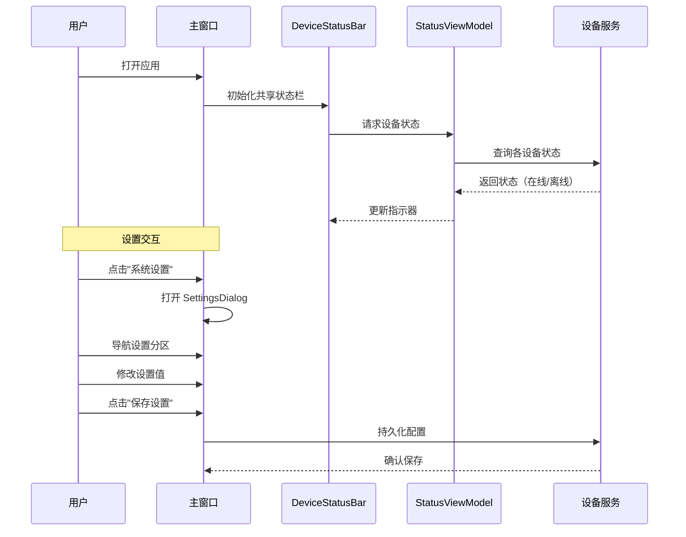

## Why

MaterialClient 和 MaterialClient.Urban 共享几乎相同的 UI 模式——标题栏、设备状态栏和设置基础设施——但各自独立实现，样式逐渐分化（硬编码颜色 vs 命名资源、不同的按钮方案）。MaterialClient.UI 已存在但只是一个占位目录，没有 .csproj 或控件。Urban 目前暴露了"系统设置"按钮却没有功能实现。将这些共享模式提取为真正的组件库，可以消除重复、强制一致性，并解锁 Urban 的设置功能。

## What Changes

- 创建正式的 Avalonia 类库项目 `MaterialClient.UI`（含 .csproj），添加到解决方案
- 实现共享**设备状态栏**控件（`DeviceStatusBar`），显示地磅、摄像头、车牌识别、打印机、音频设备的在线/离线指示器
- 实现共享**设置框架**（`SettingsDialog`），包含导航侧边栏、分区面板和通用设置项类型（开关、下拉选择、滑块、文本框）
- 将命名颜色资源和共享样式（按钮类、卡片边框、状态指示器）迁移到 `MaterialClient.UI` 作为集中式主题资源字典
- 重构 `MaterialClient.Urban` 以引用 `MaterialClient.UI` 并使用共享状态栏
- 重构 `MaterialClient` 主应用以引用 `MaterialClient.UI` 并使用共享状态栏
- 将 Urban 的"系统设置"按钮连接到共享设置对话框

## Capabilities

### New Capabilities

- `shared-ui-project`: MaterialClient.UI Avalonia 类库——项目搭建、主题资源字典及解决方案构建集成
- `device-status-bar`: 可复用的 DeviceStatusBar 控件，支持颜色编码的在线/离线指示器、可配置设备列表和 ReactiveUI 数据绑定
- `settings-ui`: 可复用的 SettingsDialog 框架，包含导航侧边栏、类型化设置项（开关、下拉选择、滑块、文本框）及自定义分区的扩展点

### Modified Capabilities

- `materialclient-urban-desktop`: Urban 主窗口将从 MaterialClient.UI 消费共享的 DeviceStatusBar 和 SettingsDialog，替代内联实现
- `button-style-normalization`: 共享按钮样式类和命名颜色资源迁移到 MaterialClient.UI 主题字典作为单一来源

## Impact

**受影响的代码：**
- `MaterialClient.UI/` — 新增 .csproj、Controls/、Styles/、Themes/
- `MaterialClient.Urban/Views/UrbanAttendedWeighingWindow.axaml` — 用共享控件替换内联状态栏
- `MaterialClient.Urban/ViewModels/UrbanAttendedWeighingViewModel.cs` — 绑定到共享 DeviceStatusBar ViewModel
- `MaterialClient/Views/AttendedWeighing/AttendedWeighingWindow.axaml` — 用共享控件替换内联状态栏
- `MaterialClient/Views/SettingsWindow.axaml` — 迁移到共享设置框架
- `MaterialClient/ViewModels/SettingsWindowViewModel.cs` — 适配共享设置 ViewModel 模式
- `MaterialClient.sln` — 添加 MaterialClient.UI 项目

**依赖关系：**
- MaterialClient.UI 引用 MaterialClient.Common（用于服务接口、事件类型）
- MaterialClient.UI 引用 Avalonia 包（Avalonia、ReactiveUI）
- MaterialClient 和 MaterialClient.Urban 均引用 MaterialClient.UI

**API：** 无外部 API 变更。可能引入内部 ViewModel 接口。

---

### UI 原型 — DeviceStatusBar

```
┌──────────────────────────────────────────────────────────────────┐
│ ● 地磅:在线  ● 摄像头:在线  ● USB摄像头:离线  ● 打印机:在线  │
│ ● 音频设备:在线  ● 车牌识别:离线                               │
└──────────────────────────────────────────────────────────────────┘

状态说明：
  ● 在线  = 绿色填充 (#22C55E)
  ● 离线  = 红色填充 (#EF4444)
  ◌ 加载中 = 灰色填充脉冲动画
```

### UI 原型 — SettingsDialog

```
┌─────────────────────────────────────────────────────────────────┐
│ 系统设置                                                   [×] │
├──────────────┬──────────────────────────────────────────────────┤
│              │                                                  │
│  > 地磅设置  │  地磅串口                                        │
│    称重设置  │  ┌──────────────────────────────────────────┐    │
│    摄像头    │  │ COM1                                    ▼ │    │
│    车牌识别  │  └──────────────────────────────────────────┘    │
│    系统      │                                                  │
│    音频设备  │  波特率                                          │
│    打印机    │  ┌──────────────────────────────────────────┐    │
│              │  │ 9600                                    ▼ │    │
│              │  └──────────────────────────────────────────┘    │
│              │                                                  │
│              │  自动归零                                        │
│              │  [═════════●          ]  开启                    │
│              │                                                  │
│              │  ─────────────────────────────────────────────   │
│              │                                                  │
│              │              [ 保存设置 ]                        │
└──────────────┴──────────────────────────────────────────────────┘
```

### 用户交互流程



### 代码变更表

| 文件路径 | 变更类型 | 变更原因 | 影响范围 |
|-----------|----------|----------|----------|
| `MaterialClient.UI/MaterialClient.UI.csproj` | 新增 | 创建 Avalonia 类库项目 | 构建系统 |
| `MaterialClient.UI/Controls/DeviceStatusBar.axaml` | 新增 | 共享设备状态指示器控件 | MaterialClient, Urban |
| `MaterialClient.UI/Controls/DeviceStatusBar.axaml.cs` | 新增 | 状态栏代码隐藏文件 | MaterialClient, Urban |
| `MaterialClient.UI/Controls/SettingsDialog.axaml` | 新增 | 共享设置对话框外壳 | MaterialClient, Urban |
| `MaterialClient.UI/Controls/SettingsDialog.axaml.cs` | 新增 | 设置对话框代码隐藏文件 | MaterialClient, Urban |
| `MaterialClient.UI/ViewModels/DeviceStatusBarViewModel.cs` | 新增 | 设备状态 ReactiveViewModel | MaterialClient, Urban |
| `MaterialClient.UI/ViewModels/SettingsViewModel.cs` | 新增 | 带导航的基础设置 ViewModel | MaterialClient, Urban |
| `MaterialClient.UI/Styles/SharedStyles.axaml` | 新增 | 集中主题：颜色、按钮类 | 所有消费者 |
| `MaterialClient.Urban/Views/UrbanAttendedWeighingWindow.axaml` | 修改 | 用共享控件替换内联状态栏 | Urban 模块 |
| `MaterialClient/Views/AttendedWeighing/AttendedWeighingWindow.axaml` | 修改 | 用共享控件替换内联状态栏 | 主应用 |
| `MaterialClient/Views/SettingsWindow.axaml` | 修改 | 迁移到共享设置框架 | 主应用 |
| `MaterialClient.sln` | 修改 | 添加 MaterialClient.UI 项目引用 | 解决方案 |
