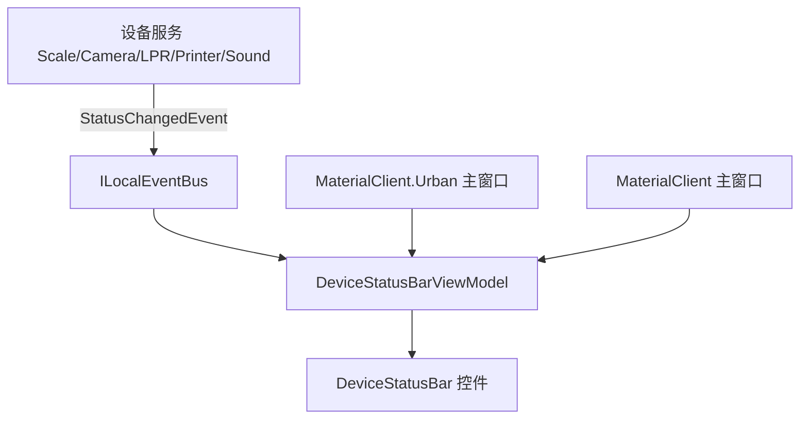

## Context

`2026-05-22-materialclient-urban-shared-ui-components-library` 已交付 `MaterialClient.UI` 共享框架：主应用 7 个 `ISettingsSection`、Urban 4 个 Urban 专用 Section，以及按应用区分的 `DeviceStatusBar` 设备集合。用户现要求 Urban 的设置对话框与设备状态栏与 MaterialClient 主应用**功能完全对等**（相同分区、相同设备项、相同加载/保存与状态更新行为）。

Urban 仍保持无登录、顶栏仅「系统设置」等产品差异；本变更仅对齐设置与状态栏能力。

**约束：** ReactiveUI、`[Reactive]`、ABP `ITransientDependency` + `[AutoConstructor]`、`.NET 10`、OpenSpec 工件仅在 MaterialMonospec 主仓库。

## Goals / Non-Goals

**Goals:**

- Urban `SettingsDialog` 显示与主应用相同的 7 个分区，字段与持久化键一致
- Urban `DeviceStatusBar` 显示与主应用相同的设备类型与更新逻辑
- 单一实现来源，消除 Urban/主应用双份 Section 维护

**Non-Goals:**

- 不改变 Urban 登录/顶栏菜单/窗口布局/称重主流程
- 不修改 UrbanManagement Web
- 不迁移 MaterialClient.Demo
- 不在此变更中重构 `AttendedWeighingWindow` 整体布局

## Decisions

### 决策 1：将设置分区迁至 `MaterialClient.UI/Settings/Sections/`

**选择：** 把主应用 `MaterialClient/Views/Settings/` 下 7 个 `ISettingsSection` 实现迁移到 `MaterialClient.UI/Settings/Sections/`，两应用均通过 ABP 自动发现同一批 Section。

**备选：**

- *Urban 复制主应用 Section 代码：* 否决 — 双倍维护，易漂移
- *Urban 项目引用主应用程序集：* 否决 — 错误依赖方向（Urban 不应依赖 MaterialClient exe 项目）
- *新建 MaterialClient.Settings 类库：* 可行但增加项目数；UI 已引用 Common，Section 放 UI 内摩擦更低

**理由：** Section 仅依赖 `MaterialClient.UI` 抽象 + `MaterialClient.Common` 服务，与既有 UI 库边界一致。Urban 删除 `Views/Settings/` 下 4 个重复实现。

### 决策 2：统一 `DeviceStatusBarViewModel` 设备发现逻辑

**选择：** 将设备列表构建逻辑集中到 `MaterialClient.UI`（例如 `IDeviceStatusCatalog` 或 `DeviceStatusBarViewModel` 内单一方法），主应用与 Urban 共用，不再在 Urban 侧硬编码子集。

**备选：**

- *Urban 窗口内重复配置 ItemsSource：* 否决 — 无法保证一致
- *按 ProductCode 分支隐藏设备：* 否决 — 与用户「完全一致」要求冲突

**理由：** 主应用与 Urban 现场外设相同；统一 catalog 保证名称、顺序、事件订阅一致。

### 决策 3：Urban ABP 模块补齐设备服务注册

**选择：** 审计 `MaterialClient.Urban` 模块，确保打印机、音频、称重相关服务与主应用同级注册（或已通过 Common 模块共享注册）。

**理由：** UI 对等但服务未注册会导致状态栏恒离线、设置保存失败。

### 决策 4：规范 delta 覆盖三份既有 spec

**选择：** 修改 `settings-ui`、`device-status-bar`、`materialclient-urban-desktop` 的 REQUIREMENTS，移除 Urban 子集表述。

## 数据流 — 对齐后设备状态

两应用共用同一 VM 与 catalog，仅窗口实例不同（`ITransientDependency` 每窗口）。

## 详细代码变更清单

| 文件路径 | 变更类型 | 描述 |
|----------|----------|------|
| `MaterialClient.UI/Settings/Sections/*.cs` | 新增/迁移 | 7 个共享 ISettingsSection |
| `MaterialClient/Views/Settings/` | 删除/瘦身 | 移除已迁移 Section，保留入口若有 |
| `MaterialClient.Urban/Views/Settings/` | 删除 | 移除 Urban 专用 4 Section |
| `MaterialClient.UI/ViewModels/DeviceStatusBarViewModel.cs` | 修改 | 统一设备 catalog |
| `MaterialClient.Urban/*Module*.cs` | 修改 | 补齐服务注册（若缺） |
| `openspec/specs/*.md` | 修改 | 归档时合并 delta |

## Risks / Trade-offs

- **[风险] Urban 现场无打印机/音频时显示离线** → 可接受：与主应用一致；运维可识别未连接设备
- **[风险] Section 迁移引入回归** → 缓解：主应用先验证 7 分区 load/save，再删 Urban 副本
- **[风险] UI 项目膨胀** → 可接受：Section 本属 UI 关注点；后续可再拆 `MaterialClient.Settings`
- **[权衡] 失去 Urban「精简设置」** → 符合用户显式需求

## Migration Plan

1. 迁移 7 个 Section 至 `MaterialClient.UI`，主应用构建通过
2. 统一 `DeviceStatusBarViewModel` catalog，主应用状态栏回归测试
3. 删除 Urban 专用 Section，确认 Urban DI 发现 7 分区
4. 审计并补齐 Urban 模块服务注册
5. Urban 端到端：设置 load/save、设备插拔状态更新
6. 归档 OpenSpec change，合并 spec delta

**回滚：** 恢复 Urban `Views/Settings/` 与旧 VM 配置；revert UI 迁移 commit。

## Open Questions

- 主应用 `SettingsWindow.axaml` 是否仍保留为遗留入口，或已 100% 使用 `SettingsDialog`？（实施时确认并删除死代码）
- USB 摄像头在 Urban 是否始终部署？（默认与主应用一致显示，无则离线）
