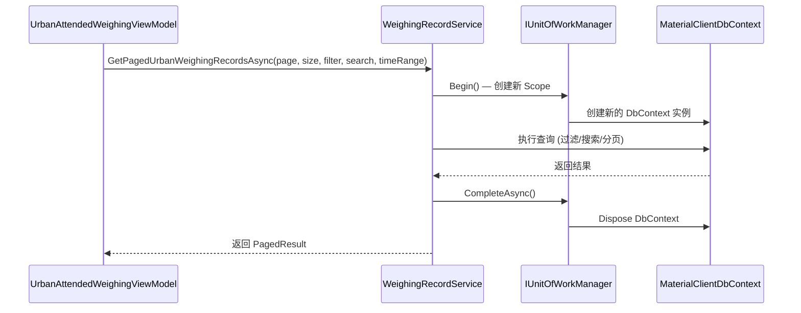

## Why

`UrbanAttendedWeighingViewModel.ReloadRecordsAsync()` 抛出 `System.ObjectDisposedException`（`MaterialClientDbContext` 已被释放），原因是 ViewModel 直接注入了 `IRepository<WeighingRecord, long>`，而该 Repository 封装的 Scoped DbContext 在 DI 容器释放原始 Scope 后被 dispose，但 ViewModel 仍持有该引用。这违反了 AGENTS.md 中的架构约束："ViewModels 不得直接使用 Repository，必须通过 Service 层访问数据"。现有的 `IWeighingRecordService` 仅覆盖写操作（创建、照片保存、车牌重写），缺少面向 ViewModel 的分页查询能力。

## What Changes

- 在 `IWeighingRecordService` 接口中新增分页查询方法 `GetPagedUrbanWeighingRecordsAsync`，封装当前的过滤、搜索、分页逻辑
- 在 `WeighingRecordService` 实现中通过 `IUnitOfWorkManager` 为每次查询创建独立的 UnitOfWork Scope，确保 DbContext 生命周期正确管理
- 将 `UrbanAttendedWeighingViewModel` 中的 `IRepository<WeighingRecord, long>` 依赖替换为 `IWeighingRecordService`
- 将 `ReloadRecordsAsync()` 中的内联 LINQ 查询逻辑迁移到 Service 层
- 移除 ViewModel 中对 `Volo.Abp.Domain.Repositories` 和 `Microsoft.EntityFrameworkCore` 的直接引用

## Capabilities

### New Capabilities

（无新能力）

### Modified Capabilities

- `attended-weighing`: IWeighingRecordService 接口新增分页查询方法，支持 ViewModel 的记录列表加载需求
- `materialclient-urban-desktop`: UrbanAttendedWeighingViewModel 移除直接 Repository 依赖，改用 IWeighingRecordService 进行数据查询

## Impact

### 文件变更清单

| 文件 | 变更类型 | 说明 |
|------|----------|------|
| `MaterialClient.Common/Services/AttendedWeighing/WeighingRecordService.cs` | 修改 | 新增分页查询接口方法和实现 |
| `MaterialClient.Urban/ViewModels/UrbanAttendedWeighingViewModel.cs` | 修改 | 移除 Repository 依赖，改用 Service |

### API 变更

- `IWeighingRecordService` 新增方法：`Task<PagedResult<WeighingRecord>> GetPagedUrbanWeighingRecordsAsync(...)` 
  - 参数：页码、页大小、标签过滤、搜索关键词、时间范围
  - 返回：分页结果（记录列表 + 总数）

### 架构影响

```
修复前：ViewModel → IRepository (Scoped DbContext) → ❌ ObjectDisposedException
修复后：ViewModel → IWeighingRecordService (Singleton) → IUnitOfWorkManager → 新 Scope → DbContext ✓
```

### 数据流



### 不影响范围

- 不影响其他 ViewModel 或 Service
- 不影响 `IWeighingRecordService` 现有的写操作方法
- 不影响数据库结构或 Entity 定义
- 不影响 UI/XAML 绑定
