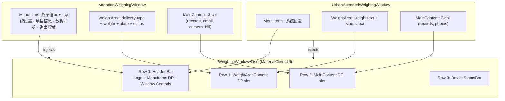

## Why

`AttendedWeighingWindow.axaml` and `UrbanAttendedWeighingWindow.axaml` share an identical 4-row layout skeleton (header bar, weight/status area, content grid, status bar) but duplicate ~80 lines of XAML for the chrome. Any visual tweak to the header or status bar must be applied in two places, causing style drift and maintenance overhead.

## What Changes

- Create a new `WeighingWindowBase` UserControl in `MaterialClient.UI/Controls/` that provides the shared 4-row layout shell:
  - **Row 0**: PrimaryBlue header bar with parameterized logo/title, menu items slot, and window control buttons (minimize/close).
  - **Row 1**: `WeightAreaContent` dependency-property slot — each window fills its own weight display.
  - **Row 2**: `MainContent` dependency-property slot — each window fills its own content grid.
  - **Row 3**: Shared `DeviceStatusBar` region with parameterized data bindings.
- Refactor `AttendedWeighingWindow` to use `WeighingWindowBase` as its content, injecting menu items, weight area, and 3-column main grid.
- Refactor `UrbanAttendedWeighingWindow` to use `WeighingWindowBase` as its content, injecting single menu item, simplified weight area, and 2-column main grid.
- Normalize the Urban header to use the same `PrimaryBlue` color and consistent button styles as MaterialClient (no more inline hard-coded colors).

### Non-goals
- No ViewModel refactoring — only XAML layout extraction.
- No new tests or documentation.
- No backward compatibility.

## Capabilities

### New Capabilities
- `weighing-window-base-control`: A shared UserControl in MaterialClient.UI providing the 4-row chrome layout (header bar, weight area slot, main content slot, status bar) for weighing windows.

### Modified Capabilities
- (none — no existing spec requirements change; this is a structural refactor)

## Impact

### Code Change Map

| File Path | Change Type | Change Reason | Impact Scope |
|-----------|-------------|---------------|--------------|
| `MaterialClient.UI/Controls/WeighingWindowBase.axaml` | **New** | Shared chrome layout | MaterialClient.UI |
| `MaterialClient.UI/Controls/WeighingWindowBase.axaml.cs` | **New** | DPs: HeaderContent, MenuItems, WeightAreaContent, MainContent, DeviceStatuses, CameraStatusDetails | MaterialClient.UI |
| `MaterialClient/Views/AttendedWeighing/AttendedWeighingWindow.axaml` | **Modify** | Replace 4-row layout with `WeighingWindowBase` wrapper | MaterialClient |
| `MaterialClient/Views/AttendedWeighing/AttendedWeighingWindow.axaml.cs` | **Modify** | Move header event handlers to base or keep as forwarding | MaterialClient |
| `MaterialClient.Urban/Views/UrbanAttendedWeighingWindow.axaml` | **Modify** | Replace 4-row layout with `WeighingWindowBase` wrapper | MaterialClient.Urban |
| `MaterialClient.Urban/Views/UrbanAttendedWeighingWindow.axaml.cs` | **Modify** | Move header event handlers to base or keep as forwarding | MaterialClient.Urban |

### Dependencies
- `MaterialClient.UI` (existing shared UI project) — new control lives here.
- Both `MaterialClient` and `MaterialClient.Urban` already reference `MaterialClient.UI`.

### Interaction Flow — Window Composition



### UI Prototype — WeighingWindowBase Shell

```
┌──────────────────────────────────────────────────────────────┐
│ Row 0: ┌────────┐  [MenuItems DP]              [─] [✕]     │  ← PrimaryBlue #4169E1
│        │ Logo   │  ← injected by consumer                    │
│        └────────┘                                              │
├──────────────────────────────────────────────────────────────┤
│ Row 1: [WeightAreaContent DP]                                 │  ← Blue gradient #4A85F9
│        ← consumer fills weight display                        │
├──────────────────────────────────────────────────────────────┤
│ Row 2: [MainContent DP]                                       │  ← White background
│        ← consumer fills main grid                             │
├──────────────────────────────────────────────────────────────┤
│ Row 3: DeviceStatusBar  ○ LPR  ○ Camera  ○ Scale  ○ Gate   │  ← #F5F5F5
└──────────────────────────────────────────────────────────────┘
```

### AttendedWeighingWindow — After Refactor

```
┌──────────────────────────────────────────────────────────────┐
│ ┌────────┐ 数据管理▾ · 系统设置 · 项目信息 · 数据同步 · 退出  [─][✕] │
├──────────────────────────────────────────────────────────────┤
│ ┌────────┐ [收料/发料]  ████ 12.34 吨  ████               │
│ │ plate  │                              Loading...         │
├──────────────────────────────────────────────────────────────┤
│ ┌──────────┐ ┌──────────────────┐ ┌──────────────────────┐ │
│ │ Record   │ │ Detail / Main    │ │ Camera  │ Bill Scan  │ │
│ │ List     │ │ View             │ │ Photos  │            │ │
│ │ (280px)  │ │ (*)              │ │ (360px) │            │ │
│ └──────────┘ └──────────────────┘ └──────────────────────┘ │
├──────────────────────────────────────────────────────────────┤
│ ○ LPR  ○ Camera  ○ Scale                                     │
└──────────────────────────────────────────────────────────────┘
```

### UrbanAttendedWeighingWindow — After Refactor

```
┌──────────────────────────────────────────────────────────────┐
│ ┌──┐ 凡东城管地磅系统                    系统设置         [─][✕] │
├──────────────────────────────────────────────────────────────┤
│                    12.34 吨                         稳定     │
├──────────────────────────────────────────────────────────────┤
│ ┌────────────────────────────────┐ ┌──────────────────────┐ │
│ │ Vehicle Records + Tabs/Filters │ │ Photo Sidebar        │ │
│ │ (*)                            │ │ (360px)              │ │
│ └────────────────────────────────┘ └──────────────────────┘ │
├──────────────────────────────────────────────────────────────┤
│ ○ LPR  ○ Camera  ○ Scale                                     │
└──────────────────────────────────────────────────────────────┘
```
