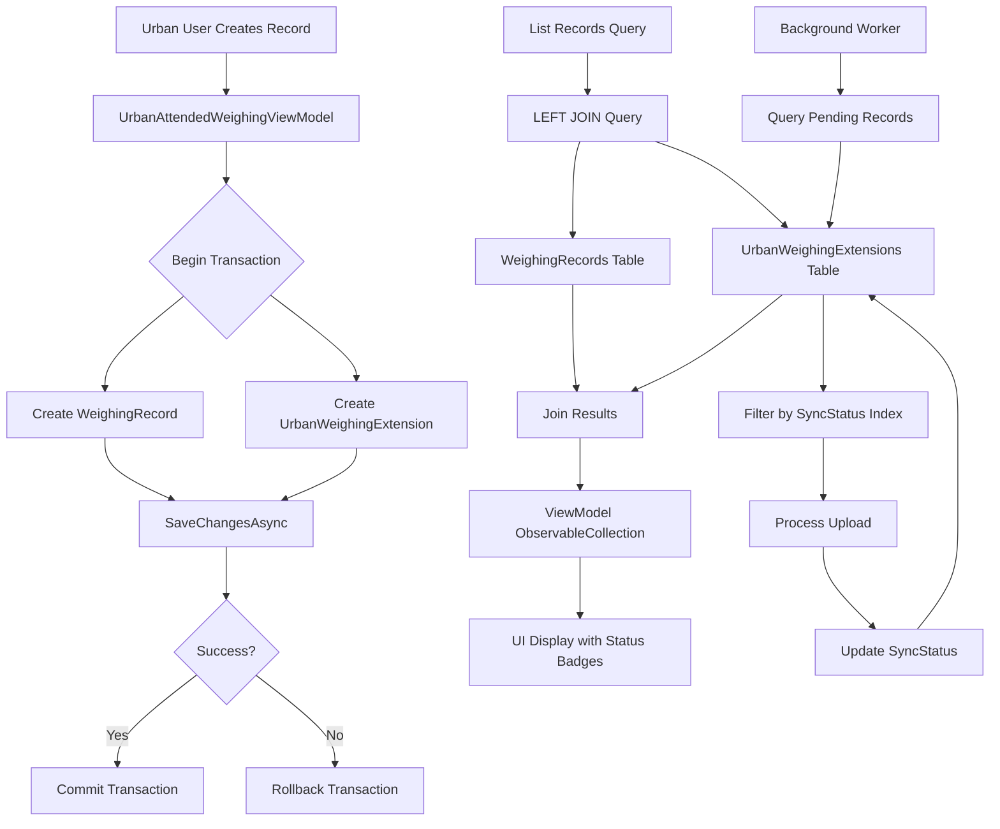

## Context

The MaterialClient project uses ABP framework with EF Core and SQLite as the database. The `WeighingRecord` entity in `MaterialClient.Common` currently contains a `SyncStatus` property that is exclusively used by the Urban variant for background synchronization pipeline, list tab filtering, and status badges. Standard and SolidWaste variants never use this field. SQLite limitations prevent dropping columns, requiring backward compatibility strategies.

Current implementation:
- `WeighingRecord.SyncStatus` property directly on shared entity
- `SyncStatus` enum in `Entities/Enums/` (appropriate location, unchanged)
- Direct property access in `UrbanAttendedWeighingViewModel` queries
- XAML binding directly to `WeighingRecord.SyncStatus`

## Goals / Non-Goals

**Goals:**
- Remove Urban-specific concerns from shared `WeighingRecord` entity
- Establish extensible pattern for variant-specific weighing record extensions
- Maintain type safety and query performance via SQL indexes
- Provide clear separation through folder organization (`Entities/Urban/`)
- Preserve backward compatibility with existing SQLite databases

**Non-Goals:**
- Changing the `SyncStatus` enum location (stays in `Entities/Enums/`)
- Creating separate MaterialClient.Urban domain layer project
- Modifying Standard or SolidWaste variant behavior
- Breaking existing Urban variant functionality

## Decisions

### 1:0..1 Extension Table Pattern vs ExtraProperties

**Decision:** Use explicit 1:0..1 extension table (`UrbanWeighingExtension`) instead of ABP `ExtraProperties`.

**Rationale:**
- **Query Performance**: SQL indexes on `SyncStatus` enable efficient background worker scanning (`WHERE SyncStatus = Pending`). ExtraProperties (JSON) cannot be indexed.
- **Type Safety**: Strong typing at compile-time vs runtime string dictionary access
- **EF Core Tracking**: Explicit entities tracked independently, simpler relationship management
- **Future Extensibility**: Other variants (SolidWaste) can follow same pattern with their own extension tables

**Alternatives Considered:**
- ExtraProperties: Rejected due to no SQL indexing potential and lack of type safety
- Separate Urban project: Rejected as over-engineering; Urban business logic belongs in Urban UI layer, not domain layer
- Table per Hierarchy (TPH): Rejected as over-complex for simple 1:0..1 extension

### Folder Organization: Common/Urban/ vs MaterialClient.Urban Domain Project

**Decision:** Place Urban-specific entities in `MaterialClient.Common/Entities/Urban/` folder.

**Rationale:**
- **DbContext Unity**: Single `MaterialClientDbContext` manages all entities without `ReplaceDbContext`
- **Namespace Isolation**: `MaterialClient.Common.Entities.Urban` provides clear ownership boundaries
- **Proportionality**: Urban-specific business logic is minimal (mostly UI layer), doesn't warrant separate domain project
- **ABP Conventions**: Follows ABP's module organization patterns with feature-based folders

**Alternatives Considered:**
- Separate `MaterialClient.Domain.Urban` project: Rejected as disproportionate to current needs
- Inline in `Entities/` root: Rejected as doesn't provide clear isolation

### SQLite Backward Compatibility Strategy

**Decision:** Preserve `SyncStatus` column in `WeighingRecords` table during migration, deprecate in code.

**Rationale:**
- **SQLite Limitation**: Cannot drop columns (ALTER TABLE DROP COLUMN unsupported)
- **Zero Downtime**: Existing databases continue working immediately after migration
- **Gradual Migration**: Code can switch to extension table incrementally

**Implementation:**
- EF Core migration creates `UrbanWeighingExtensions` table
- Data migration copies `SyncStatus` values for Urban mode records
- Old `SyncStatus` column remains in schema but ignored in code
- Future major schema version can remove via table rebuild

### Relationship Configuration: Optional vs Required

**Decision**: Configure 1:0..1 as optional (navigation property nullable).

**Rationale:**
- **WeighingRecord** remains independent of extension
- Standard/SolidWaste records have no extension row (no wasted storage)
- Navigation property `UrbanExtension` nullable on `WeighingRecord`

## Architecture

### Component Hierarchy

```
MaterialClient.Common (Shared Domain Layer)
├── Entities/
│   ├── WeighingRecord.cs                    (Base weighing record - variant agnostic)
│   ├── Enums/
│   │   └── SyncStatus.cs                    (Generic sync status enum - shared)
│   └── Urban/                               (Urban-specific extension isolation)
│       └── UrbanWeighingExtension.cs        (1:0..1 extension entity)
└── EntityFrameworkCore/
    └── MaterialClientDbContext.cs           (Unified DbContext with all DbSets)

MaterialClient.Urban (Urban UI/Application Layer)
├── ViewModels/
│   └── UrbanAttendedWeighingViewModel.cs   (LEFT JOIN queries)
└── Views/
    └── UrbanAttendedWeighingWindow.axaml    (XAML bindings to extension)
```

### Data Flow Diagram



## Detailed Code Change Inventory

| File Path | Change Type | Change Description | Affected Module | Dependencies |
|-----------|-------------|-------------------|-----------------|--------------|
| `src/MaterialClient.Common/Entities/WeighingRecord.cs` | Property Removal | Remove `public SyncStatus SyncStatus { get; set; } = SyncStatus.Pending;` property (line ~110) | Shared Domain Entity | Breaking change for Urban variant |
| `src/MaterialClient.Common/Entities/Urban/UrbanWeighingExtension.cs` | File Creation | New entity with `WeighingRecordId` (FK), `SyncStatus`, `RetryCount`, `LastErrorTime` properties. Implements `Entity<long>` | Urban Extension Entity | New file, ABP Entity base |
| `src/MaterialClient.Common/EntityFrameworkCore/MaterialClientDbContext.cs` | DbSet Addition | Add `public DbSet<UrbanWeighingExtension> UrbanWeighingExtensions { get; set; }` | DbContext Configuration | DbSet registration |
| `src/MaterialClient.Common/EntityFrameworkCore/MaterialClientDbContext.cs` | Fluent API | Configure 1:0..1 relationship, unique index on `WeighingRecordId`, composite index on `(SyncStatus, WeighingRecordId)` for worker queries | DbContext Configuration | EF Core relationship API |
| `src/MaterialClient.Urban/ViewModels/UrbanAttendedWeighingViewModel.cs` | Query Modification | Change `query.Where(r => r.SyncStatus != SyncStatus.Failed)` to LEFT JOIN pattern: `.Join(...)` or `.Include(wr => wr.UrbanExtension).Where(extension => extension.SyncStatus != SyncStatus.Failed)` | Urban Business Logic | LINQ query rewrite |
| `src/MaterialClient.Urban/ViewModels/UrbanAttendedWeighingViewModel.cs` | Creation Logic | Add extension creation after WeighingRecord creation in transaction | Urban Business Logic | Transactional consistency |
| `src/MaterialClient.Urban/Views/UrbanAttendedWeighingWindow.axaml` | Binding Update | Change `{Binding SyncStatus}` to `{Binding UrbanExtension.SyncStatus}` or use DTO projection | Urban UI Layer | XAML binding path update |
| `src/MaterialClient.Common/Migrations/` | Migration Creation | New migration file creating `UrbanWeighingExtensions` table with indexes + data migration from `WeighingRecords.SyncStatus` | Database Schema | EF Core migration |
| `src/MaterialClient.Common/Services/` (Future) | Service Update | Background sync worker queries updated to use extension table index | Background Services | Query optimization |

## Risks / Trade-offs

### [Risk] Data Migration Complexity

**Risk**: Existing Urban databases have `SyncStatus` values that must be migrated correctly.

**Mitigation**:
- EF Core migration includes data step: `INSERT INTO UrbanWeighingExtensions (WeighingRecordId, SyncStatus) SELECT Id, SyncStatus FROM WeighingRecords WHERE WeighingMode = 201`
- Transaction wrapper ensures atomic migration
- Preserve old column for rollback capability

### [Risk] Query Performance Regression

**Risk**: LEFT JOIN may add overhead compared to direct property access.

**Mitigation**:
- New composite index on `(SyncStatus, WeighingRecordId)` covers worker queries
- 1:0..1 relationship ensures single row JOIN, negligible overhead
- Benchmark before/after to validate performance parity

### [Risk] XAML Binding Null Reference

**Risk**: `UrbanExtension` navigation property may be null for non-Urban records.

**Mitigation**:
- Use value converter or null-safe binding syntax in XAML
- ViewModel queries ensure extension loaded via `.Include()`
- Fallback display logic for missing extension

### [Trade-off] Storage Overhead

**Trade-off**: Extension table adds storage overhead per Urban record (~50 bytes).

**Rationale**: Acceptable trade-off for type safety, query performance, and clean architecture. Overhead minimal relative to record size.

## Migration Plan

### Phase 1: Database Migration (Zero Downtime)
1. Create EF Core migration adding `UrbanWeighingExtensions` table
2. Run data migration: Copy `SyncStatus` from `WeighingRecords` for Urban mode records
3. Apply migration to all environments (SQLite file replacement or migration script)

### Phase 2: Code Migration (Incremental)
1. Update `MaterialClientDbContext` configuration and DbSet
2. Create `UrbanWeighingExtension` entity
3. Update `UrbanAttendedWeighingViewModel` queries to LEFT JOIN
4. Update XAML bindings with null-safe access
5. Remove `SyncStatus` property from `WeighingRecord`

### Phase 3: Validation
1. Unit tests for extension entity and relationship
2. Integration tests for query translation
3. Manual testing: Record creation, list filtering, status badges
4. Background worker query performance validation

### Rollback Strategy
- **Database**: Revert migration using `Down()` migration method (restores old `SyncStatus` column behavior)
- **Code**: Git revert to pre-migration commit
- **Data**: Old `SyncStatus` column preserved until validated, enabling quick rollback

## Open Questions

1. **Should we add a unique constraint** on `WeighingRecordId` in `UrbanWeighingExtensions` table, or rely on application logic?
   - **Recommendation**: Add unique constraint via Fluent API for data integrity at database level

2. **What happens** if a non-Urban record somehow gets an extension row?
   - **Recommendation**: Add validation in domain service or repository to prevent mismatched creation

3. **Should we implement** a generic extension base class for future variants?
   - **Recommendation**: Defer until second variant (SolidWaste) needs extension pattern to avoid over-engineering
