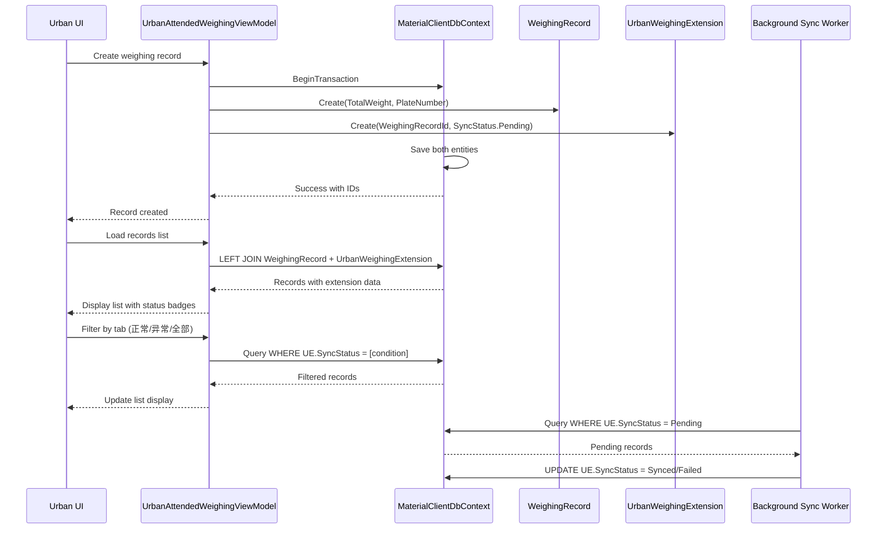

## Why

The `WeighingRecord` entity in `MaterialClient.Common` currently contains `SyncStatus` property that is exclusively used by the Urban variant for list tab filtering and status badges. This Urban-specific concern leaking into the shared entity violates Single Responsibility Principle, prevents compile-time type safety for other variants, and creates an unsustainable pattern as Urban features grow. The refactoring is needed now to establish a clean extension pattern before more Urban-specific fields accumulate.

## What Changes

- **BREAKING**: Remove `SyncStatus` property from `WeighingRecord` entity in `MaterialClient.Common`
- Create new `UrbanWeighingExtension` entity in `MaterialClient.Common/Entities/Urban/` with 1:0..1 relationship to `WeighingRecord`
- Add `DbSet<UrbanWeighingExtension>` and Fluent API configuration in `MaterialClientDbContext`
- Update `UrbanAttendedWeighingViewModel` query to use LEFT JOIN pattern instead of direct property access
- Update XAML data bindings to access `SyncStatus` through extension relationship or DTO projection
- Create EF Core migration for new `UrbanWeighingExtensions` table
- Update record creation logic to create extension row when Urban mode records are created

## Capabilities

### New Capabilities
- `urban-weighing-extension`: Urban-specific weighing record extension management including sync status tracking, retry counting, and error timestamping for background synchronization pipeline

### Modified Capabilities
None. This is an internal refactoring that doesn't change user-facing requirements or API contracts.

## Impact

### Affected Components
- `MaterialClient.Common/Entities/WeighingRecord.cs` — Remove SyncStatus property
- `MaterialClient.Common/Entities/Urban/UrbanWeighingExtension.cs` — New extension entity
- `MaterialClient.Common/EntityFrameworkCore/MaterialClientDbContext.cs` — Add DbSet and Fluent API
- `MaterialClient.Urban/ViewModels/UrbanAttendedWeighingViewModel.cs` — LEFT JOIN queries
- `MaterialClient.Urban/Views/UrbanAttendedWeighingWindow.axaml` — XAML binding updates
- Database schema — New `UrbanWeighingExtensions` table, preserved `SyncStatus` column

### Migration Requirements
- EF Core migration to create `UrbanWeighingExtensions` table with indexes
- Extension table initialized with default SyncStatus values for new Urban mode records

### Performance Impact
- Positive: Enabled SQL index on `SyncStatus` for efficient background worker scanning
- Neutral: LEFT JOIN adds negligible overhead for Urban queries (single row per record)

## Code Change Map

| File Path | Change Type | Change Reason | Impact Scope |
|-----------|-------------|---------------|--------------|
| `src/MaterialClient.Common/Entities/WeighingRecord.cs` | Remove property | Remove Urban-specific SyncStatus property | Shared entity layer |
| `src/MaterialClient.Common/Entities/Urban/UrbanWeighingExtension.cs` | Add file | New extension entity for Urban-specific fields | Urban functionality isolation |
| `src/MaterialClient.Common/EntityFrameworkCore/MaterialClientDbContext.cs` | Modify | Add DbSet and Fluent API configuration | Data layer |
| `src/MaterialClient.Urban/ViewModels/UrbanAttendedWeighingViewModel.cs` | Modify | Change queries to LEFT JOIN pattern | Urban business logic |
| `src/MaterialClient.Urban/Views/UrbanAttendedWeighingWindow.axaml` | Modify | Update XAML bindings for extension access | Urban UI layer |
| `src/MaterialClient.Common/Migrations/` | Add | New migration for extension table | Database schema |

## Urban Weighing Record Lifecycle Flow

