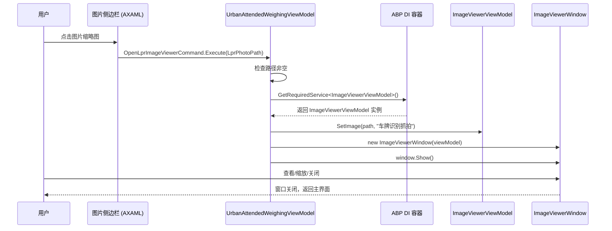

## Context

MaterialClient.Urban（城管地磅系统）使用双列布局：左侧车辆记录列表 + 右侧 360px 图片侧边栏。当前侧边栏用静态 `Image` 控件展示车牌识别抓拍和摄像头抓拍两张照片，不支持点击查看大图。

MaterialClient 主项目中已有完整的图片查看方案：`ImageViewerWindow`（支持缩放、拖拽、最大化）+ `ImageViewerViewModel`。但这两个组件位于 `MaterialClient` 项目中，而 `MaterialClient.Urban` 仅引用 `MaterialClient.UI` 和 `MaterialClient.Common`，无法直接使用。

项目依赖关系：

```
                MaterialClient.Common
                /                  \
               ↑                    ↑
      MaterialClient.UI      (also from Common)
           ↑       ↑
           |       |
  MaterialClient   MaterialClient.Urban
```

## Goals / Non-Goals

**Goals:**

- 将 `ImageViewerWindow` 和 `ImageViewerViewModel` 迁移到 `MaterialClient.UI` 共享项目，使 MaterialClient 和 MaterialClient.Urban 均可使用
- 在 Urban 图片侧边栏中为图片添加点击交互，打开全屏图片查看器
- 图片查看器传入语义化标题（如"车牌识别抓拍"、"摄像头抓拍"）

**Non-Goals:**

- 不修改图片加载逻辑（`UpdatePhotoPathsAsync`、`IAttachmentService`）
- 不修改 `ImageViewerWindow` 的功能行为（缩放、拖拽、最大化保持不变）
- 不添加图片缩略图优化（当前直接使用 `CarNullOrEmptyImageConverter` 加载原图）
- 不支持多图轮播或左右切换

## Decisions

### Decision 1: 将 ImageViewerWindow 迁移到 MaterialClient.UI

**选择**: 将 `ImageViewerWindow.axaml`、`ImageViewerWindow.axaml.cs`、`ImageViewerViewModel.cs` 从 `MaterialClient` 迁移到 `MaterialClient.UI`。

**理由**:
- `MaterialClient.UI` 是两个应用共享的 UI 库，已包含 Avalonia + ReactiveUI + ABP 依赖
- `MaterialClient.UI` 已有 `Views/` 和 `ViewModels/` 目录结构，且已有其他窗口（`SettingsWindow`、`AddCameraDialog`）
- `ImageViewerViewModel` 仅依赖 `ReactiveUI.SourceGenerators` 和 `Volo.Abp.DependencyInjection`，均在 UI 项目中可用
- 两个项目有完全相同的 `ViewModelBase` 类（`MaterialClient.ViewModels.ViewModelBase` 和 `MaterialClient.UI.ViewModels.ViewModelBase`），无需额外适配
- `CarNullOrEmptyImageConverter`（ImageViewerWindow 的 XAML 中引用的转换器）已注册在 `SharedConverters.axaml`（属于 MaterialClient.UI）

**备选方案**:
- 在 MaterialClient.Urban 中重新实现一个简化版图片查看器 → 代码重复，长期维护成本高
- 新建 MaterialClient.SharedViews 项目 → 仅为了一个组件新建项目，过度设计

### Decision 2: Urban 侧边栏使用 Button 包裹 Image

**选择**: 在 XAML 中用 `Button`（透明背景、无边框）包裹每个 `Image` 控件，绑定 `Command` 到 ViewModel 的 `OpenImageViewerCommand`。

**理由**:
- 与 MaterialClient 主项目中 `PhotoGridView` 的实现模式一致（同样使用 `Button` 包裹 `Image`）
- `Button` 天然支持键盘焦点和可访问性
- 命令绑定方式与 MVVM 模式一致，无需 code-behind 事件处理

**备选方案**:
- 使用 `Border` + `PointerPressed` 事件 → 需要额外的 code-behind 逻辑，不如命令绑定简洁

### Decision 3: Command 传入图片路径和标题

**选择**: 使用 `ReactiveCommand` 接收一个包含路径和标题的元组参数（或分别传入路径参数，标题从固定映射获取）。

**理由**:
- 当前侧边栏有两张固定位置的图片（车牌识别抓拍、摄像头抓拍），标题可从上下文确定
- 简化实现——Command 参数为图片路径字符串，标题由 ViewModel 根据图片类型推断

### Decision 4: 窗口图标处理

**选择**: 从迁移后的 `ImageViewerWindow.axaml` 中移除 `Icon="/Assets/fd-ico.ico"` 属性。

**理由**:
- `ImageViewerWindow` 使用 `SystemDecorations="None"`（无系统标题栏），图标仅在任务栏显示
- `fd-ico.ico` 存在于 `MaterialClient` 和 `MaterialClient.Urban` 各自的 `Assets/` 目录，但不存在于 `MaterialClient.UI/Assets/`
- 窗口会继承宿主进程的应用图标，无需显式指定

## Risks / Trade-offs

| 风险 | 缓解措施 |
|------|---------|
| 迁移 ImageViewerWindow 后，MaterialClient 主项目需更新命名空间引用 | 更新 `PhotoGridViewModel` 和 `AttendedWeighingViewModel` 中的 `using` 语句，改动仅涉及 2 个文件的 import |
| `CarNullOrEmptyImageConverter` 在 `SharedConverters.axaml` 中注册，两个 App 均已包含此资源 | 已验证两个 App.axaml 均引用 `SharedConverters.axaml`，无风险 |
| ABP DI 自动注册 `ITransientDependency`，迁移命名空间后注册仍有效 | `ImageViewerViewModel` 和 `ImageViewerWindow` 均标注了 `ITransientDependency`，ABP 扫描程序集时自动注册 |

## 详细代码变更清单

| 文件路径 | 变更类型 | 变更描述 | 所属模块 |
|---------|----------|---------|---------|
| `MaterialClient.UI/Views/ImageViewerWindow.axaml` | 新增（迁移） | 从 MaterialClient 迁移，命名空间改为 `MaterialClient.UI.Views`，`xmlns:vm` 改为 `MaterialClient.UI.ViewModels`，移除 Icon 属性 | UI 共享层 |
| `MaterialClient.UI/Views/ImageViewerWindow.axaml.cs` | 新增（迁移） | 命名空间改为 `MaterialClient.UI.Views`，`using` 改为 `MaterialClient.UI.ViewModels` | UI 共享层 |
| `MaterialClient.UI/ViewModels/ImageViewerViewModel.cs` | 新增（迁移） | 命名空间改为 `MaterialClient.UI.ViewModels`，继承 `MaterialClient.UI.ViewModels.ViewModelBase` | UI 共享层 |
| `MaterialClient/Views/ImageViewerWindow.axaml` | 删除 | 已迁移到 MaterialClient.UI | MaterialClient |
| `MaterialClient/Views/ImageViewerWindow.axaml.cs` | 删除 | 已迁移到 MaterialClient.UI | MaterialClient |
| `MaterialClient/ViewModels/ImageViewerViewModel.cs` | 删除 | 已迁移到 MaterialClient.UI | MaterialClient |
| `MaterialClient/ViewModels/PhotoGridViewModel.cs` | 修改 | `using` 从 `MaterialClient.Views`/`MaterialClient.ViewModels` 改为 `MaterialClient.UI.Views`/`MaterialClient.UI.ViewModels` | MaterialClient |
| `MaterialClient/ViewModels/AttendedWeighingViewModel.cs` | 修改 | 同上，更新 `using` 引用 | MaterialClient |
| `MaterialClient.Urban/Views/UrbanAttendedWeighingWindow.axaml` | 修改 | 图片区域：`Image` 外层包裹 `Button`，绑定 `OpenLprImageViewerCommand` / `OpenCameraImageViewerCommand` | Urban |
| `MaterialClient.Urban/ViewModels/UrbanAttendedWeighingViewModel.cs` | 修改 | 新增 `OpenLprImageViewerCommand` 和 `OpenCameraImageViewerCommand`，通过 DI 打开 ImageViewerWindow | Urban |

## 组件架构图

```
MaterialClient.UI (共享层)
├── Views/
│   ├── SettingsWindow.axaml
│   ├── ImageViewerWindow.axaml          ← 迁移至此
│   └── Dialogs/
│       ├── AddCameraDialog.axaml
│       └── AddLprDialog.axaml
├── ViewModels/
│   ├── ViewModelBase.cs
│   ├── ImageViewerViewModel.cs          ← 迁移至此
│   └── ...
├── Converters/
│   └── CarNullOrEmptyImageConverter.cs  ← 已有，ImageViewerWindow XAML 引用
└── Styles/
    └── SharedConverters.axaml           ← 已有，注册了 CarNullOrEmptyImageConverter

MaterialClient (主项目)
├── ViewModels/
│   ├── PhotoGridViewModel.cs            ← 更新 using
│   └── AttendedWeighingViewModel.cs     ← 更新 using
└── Views/Controls/
    └── PhotoGridView.axaml              ← 不变

MaterialClient.Urban (城管项目)
├── ViewModels/
│   └── UrbanAttendedWeighingViewModel.cs  ← 新增 OpenImageViewer 命令
└── Views/
    └── UrbanAttendedWeighingWindow.axaml   ← 图片可点击
```

## API 调用时序


