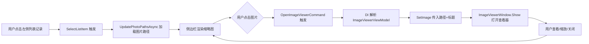

## Why

城管地磅系统（MaterialClient.Urban）的 `UrbanAttendedWeighingWindow` 页面右侧 360px 图片侧边栏当前仅以静态 `Image` 控件展示车牌识别抓拍和摄像头抓拍两张图片，**不支持点击查看大图详情**。用户在左侧列表选中记录后，虽然图片路径能正确加载到侧边栏，但无法放大查看图片细节（如车牌号码、车辆特征），影响异常审核效率。

需要参考 MaterialClient 主项目中已有的 `PhotoGridView` + `ImageViewerWindow` 实现模式，为 Urban 图片侧边栏补充"点击查看图片详情"交互，使图片可点击打开全屏查看器。

## What Changes

- **将 ImageViewerWindow 提升到共享项目**：`ImageViewerWindow` 和 `ImageViewerViewModel` 当前位于 `MaterialClient` 项目，但 `MaterialClient.Urban` 不引用 `MaterialClient`（仅引用 `MaterialClient.UI` 和 `MaterialClient.Common`）。需将这两个文件迁移到 `MaterialClient.UI` 共享项目，使两个应用均可使用
- **图片侧边栏照片可点击**：将 Urban 窗口中的静态 `Image` 控件包裹在可点击的 `Button` 容器中，点击时打开 `ImageViewerWindow` 全屏查看器
- **参考 PhotoGridView 的交互模式**：参照 `PhotoGridView.OpenImageViewerCommand` 的实现方式——通过 DI 解析 `ImageViewerViewModel`，调用 `SetImage(path, title)` 后 `new ImageViewerWindow(viewModel).Show()`
- **图片标题语义化**：打开图片查看器时传入有意义的标题（如"车牌识别抓拍"、"摄像头抓拍"），而非通用的"图片查看"

## Capabilities

### New Capabilities

- `photo-sidebar-viewer`: 图片侧边栏点击查看详情功能——在 Urban 图片侧边栏中，将静态图片展示升级为可交互模式，支持点击打开全屏图片查看器

### Modified Capabilities

（无需修改已有 spec，本次变更仅涉及 UI 交互增强和组件位置迁移，不改变 `IAttachmentService`、`PathManager` 等已有组件的行为要求）

## Impact

### 代码变更影响表

| 文件/模块 | 变更类型 | 说明 |
|---|---|---|
| `MaterialClient.UI/Views/ImageViewerWindow.axaml` | **新增（迁移）** | 从 MaterialClient 迁移，更新命名空间为 `MaterialClient.UI.Views` |
| `MaterialClient.UI/Views/ImageViewerWindow.axaml.cs` | **新增（迁移）** | 从 MaterialClient 迁移，更新命名空间和 ViewModel 引用 |
| `MaterialClient.UI/ViewModels/ImageViewerViewModel.cs` | **新增（迁移）** | 从 MaterialClient 迁移，继承 `MaterialClient.UI.ViewModels.ViewModelBase` |
| `MaterialClient/Views/ImageViewerWindow.axaml` | **删除** | 迁移到 MaterialClient.UI 后删除原文件 |
| `MaterialClient/Views/ImageViewerWindow.axaml.cs` | **删除** | 迁移到 MaterialClient.UI 后删除原文件 |
| `MaterialClient/ViewModels/ImageViewerViewModel.cs` | **删除** | 迁移到 MaterialClient.UI 后删除原文件 |
| `MaterialClient/ViewModels/PhotoGridViewModel.cs` | 修改 | 更新 `using` 引用指向 `MaterialClient.UI.Views` 和 `MaterialClient.UI.ViewModels` |
| `MaterialClient/ViewModels/AttendedWeighingViewModel.cs` | 修改 | 更新 `using` 引用指向 `MaterialClient.UI.Views` 和 `MaterialClient.UI.ViewModels` |
| `MaterialClient.Urban/Views/UrbanAttendedWeighingWindow.axaml` | 修改 | 图片侧边栏的 `Image` 外层包裹 `Button`，绑定点击命令 |
| `MaterialClient.Urban/ViewModels/UrbanAttendedWeighingViewModel.cs` | 修改 | 新增 `OpenImageViewerCommand`，通过 DI 解析 `ImageViewerViewModel` 并打开查看窗口 |

### 项目依赖关系

```
                MaterialClient.Common
                /                  \
               ↑                    ↑
      MaterialClient.UI      (also from Common)
           ↑       ↑
           |       |
  MaterialClient   MaterialClient.Urban

ImageViewerWindow/ImageViewerViewModel 迁移到 MaterialClient.UI 后，
两个应用均可直接使用，无需引入额外的项目引用。
```

### 交互流程



### UI 原型

```
┌──────────────────────────────────────┬──────────────────────────┐
│          车辆记录列表 (*)              │    照片侧边栏 (360px)     │
│                                      │ ┌──────────────────────┐ │
│  ┌────────────────────────────────┐  │ │ 照片                 │ │
│  │ 全部记录 | 正常 | 异常          │  │ ├──────────────────────┤ │
│  ├────────────────────────────────┤  │ │ 车牌识别抓拍  14:30:22│ │
│  │ 称重时间: [____] ~ [____]      │  │ │ ┌──────────────────┐ │ │
│  │ 车牌号码: [____] [搜索] [重置]  │  │ │ │  📷 可点击查看    │ │ │
│  ├────────────────────────────────┤  │ │ └──────────────────┘ │ │
│  │ 车牌 | 称重时间 | 重量 | 状态   │  │ │                      │ │
│  │ 京A123 | 2026-05... | 1.5t |正常│  │ │ 摄像头抓拍  14:30:22│ │
│  │ 京B456 | 2026-05... | 2.3t |正常│  │ │ ┌──────────────────┐ │ │
│  │ ...                             │  │ │ │  📷 可点击查看    │ │ │
│  ├────────────────────────────────┤  │ │ └──────────────────┘ │ │
│  │ 共 50 条  第 1/3 页  [上一页][下一页]│ └──────────────────────┘ │
│  └────────────────────────────────┘  │                          │
└──────────────────────────────────────┴──────────────────────────┘
                                         点击图片后 ↓

                              ┌─────────────────────────────┐
                              │ 图片查看 - 车牌识别抓拍  [⛶][✕]│
                              │                              │
                              │         ┌───────────┐        │
                              │         │           │        │
                              │         │  全屏图片  │        │
                              │         │ 支持缩放   │        │
                              │         │ 支持拖拽   │        │
                              │         │           │        │
                              │         └───────────┘        │
                              │                              │
                              └─────────────────────────────┘
```
