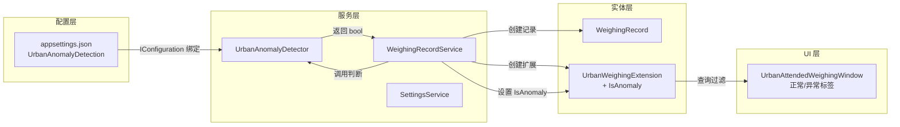
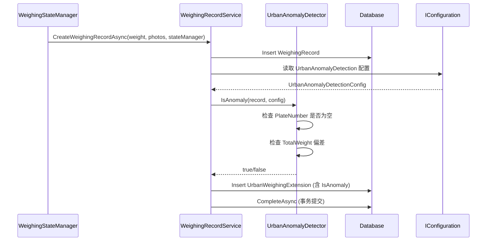
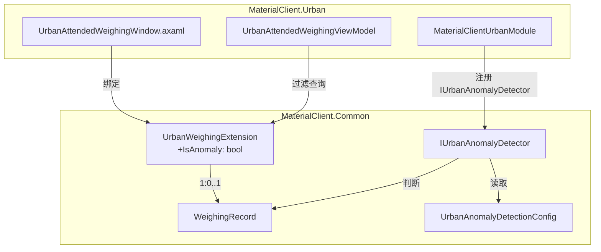

## Context

MaterialClient Urban 模块是一个 .NET 10 / Avalonia UI 桌面应用，用于城管称重验收。当前异常数据的识别仅通过 `SyncStatus.Failed`（上传同步失败）来判断，缺少对数据本身质量的自动检测。

### 当前架构
- **实体层**：`WeighingRecord`（称重记录）+ `UrbanWeighingExtension`（Urban 扩展，1:0..1 关系）
- **服务层**：`WeighingRecordService` 负责创建称重记录和 Urban 扩展
- **配置层**：`WeighingConfiguration` + `SystemSettings` 通过 `SettingsEntity`（JSON 序列化）持久化到 SQLite
- **应用配置**：`appsettings.json` 提供静态配置（街道列表、固废类型等）
- **UI 层**：`UrbanAttendedWeighingWindow.axaml` 使用 `SyncStatusMatchConverter` 做"正常/异常"标签过滤

### 约束
- 数据库为 SQLite，不支持 DROP COLUMN
- 不考虑向后兼容
- 不需要文档和单元测试
- 提案使用中文

## Goals / Non-Goals

**Goals:**
- 在 `UrbanWeighingExtension` 上新增 `IsAnomaly` 字段，自动标记数据异常
- 实现两条异常判断规则：车牌号为空、重量偏差超限
- 配置参数（上限、下限、偏差百分比）从 `appsettings.json` 读取
- UI "正常/异常"标签页改为基于 `IsAnomaly` 过滤

**Non-Goals:**
- 不实现统一配置服务集成（标记为 //TODO）
- 不修改 `SyncStatus` 枚举或同步流程
- 不实现异常数据的自动修正或告警推送
- 不新增文档和单元测试

## Decisions

### Decision 1: 在 UrbanWeighingExtension 上新增 IsAnomaly 布尔字段

**选择**：在 `UrbanWeighingExtension` 实体上新增 `IsAnomaly` bool 属性（默认 `false`）。

**理由**：
- 与现有架构一致——Urban 特有字段放在 `UrbanWeighingExtension`，不污染基础 `WeighingRecord`
- 1:0..1 关系已建立，查询时通过 `Include(r => r.UrbanExtension)` 即可访问
- 异常判断是 Urban 模式独有的业务逻辑

**备选方案**：
- (A) 在 `WeighingRecord` 上新增字段 → 会被所有模式继承，违反关注点分离
- (B) 使用 `ExtraProperties` 字典存储 → 缺乏类型安全，与现有 spec（urban-weighing-extension）的"强类型属性"需求冲突

### Decision 2: 新增独立的 IUrbanAnomalyDetector 服务

**选择**：新建 `IUrbanAnomalyDetector` 接口 + `UrbanAnomalyDetector` 实现，封装异常判断逻辑。

**理由**：
- 单一职责：异常判断逻辑独立于记录创建逻辑
- 可测试：可单独替换或 mock
- 可扩展：后续新增异常规则只需修改此服务

**接口设计**：
```csharp
public interface IUrbanAnomalyDetector
{
    /// <summary>
    ///     判断称重记录是否为异常数据
    /// </summary>
    bool IsAnomaly(WeighingRecord record, UrbanAnomalyDetectionConfig config);
}
```

### Decision 3: 配置参数放在 appsettings.json 的 UrbanAnomalyDetection 节

**选择**：在 `MaterialClient.Urban/appsettings.json` 新增配置节：
```json
{
  "UrbanAnomalyDetection": {
    "UpperLimit": 30.0,
    "LowerLimit": 2.0,
    "DeviationPercentage": 10.0
  }
}
```

**理由**：
- 与现有 `Streets`、`SolidWasteTypes` 等静态配置位置一致
- 通过 `IConfiguration` 绑定读取，无需数据库存储
- //TODO 后续迁移至统一配置服务

**备选方案**：
- (A) 放入 `WeighingConfiguration` → 该类已有较多字段，且属于"称重配置"语义，异常检测属于业务规则而非称重参数
- (B) 放入 `SystemSettings` → 与系统级设置语义不符

### Decision 4: 在 CreateWeighingRecordAsync 中同步调用异常判断

**选择**：在 `WeighingRecordService.CreateWeighingRecordAsync` 中，创建 `UrbanWeighingExtension` 后立即调用 `IUrbanAnomalyDetector.IsAnomaly()`，将结果写入 `IsAnomaly` 字段。

**理由**：
- 记录创建时即可标记，无需后台扫描
- 与现有事务一致，在同一 UoW 中完成
- 异常判断为纯计算（无 IO），不影响创建性能

### Decision 5: UI 标签页过滤逻辑改为基于 IsAnomaly

**选择**：`GetPagedUrbanWeighingRecordsAsync` 中的 tab filter 从 `SyncStatus` 改为 `UrbanExtension.IsAnomaly`。UI 状态徽章同时展示异常标记和同步状态。

**理由**：
- "异常"标签页的语义应反映数据质量，而非上传状态
- 同步失败和数据异常是两个独立关注点，UI 应分别展示

### 数据流架构



### API 调用序列



### 组件架构



### 详细代码变更清单

| 文件路径 | 变更类型 | 变更描述 | 所属模块 |
| --- | --- | --- | --- |
| `MaterialClient.Common/Configuration/UrbanAnomalyDetectionConfig.cs` | **新增** | 配置模型：UpperLimit、LowerLimit、DeviationPercentage | MaterialClient.Common |
| `MaterialClient.Common/Services/IUrbanAnomalyDetector.cs` | **新增** | 异常判断接口：`bool IsAnomaly(record, config)` | MaterialClient.Common |
| `MaterialClient.Common/Services/UrbanAnomalyDetector.cs` | **新增** | 异常判断实现：车牌为空检查 + 重量偏差检查 | MaterialClient.Common |
| `MaterialClient.Common/Entities/Urban/UrbanWeighingExtension.cs` | 修改 | 新增 `IsAnomaly` bool 属性（默认 false） | MaterialClient.Common |
| `MaterialClient.Common/EntityFrameworkCore/MaterialClientDbContext.cs` | 修改 | 为 IsAnomaly 添加索引配置 | MaterialClient.Common |
| `MaterialClient.Common/Services/AttendedWeighing/WeighingRecordService.cs` | 修改 | 注入 IUrbanAnomalyDetector + IConfiguration；创建时调用异常判断；tab 过滤改为 IsAnomaly | MaterialClient.Common |
| `MaterialClient.Common/Migrations/<timestamp>_AddIsAnomalyToUrbanExtension.cs` | 用户生成 | 用户需手动执行 `dotnet ef migrations add` 生成迁移脚本 | MaterialClient.Common |
| `MaterialClient.Urban/appsettings.json` | 修改 | 新增 `UrbanAnomalyDetection` 配置节 | MaterialClient.Urban |
| `MaterialClient.Urban/MaterialClientUrbanModule.cs` | 修改 | 注册 IUrbanAnomalyDetector 为 Singleton | MaterialClient.Urban |
| `MaterialClient.Urban/Views/UrbanAttendedWeighingWindow.axaml` | 修改 | 状态徽章绑定从 SyncStatus 改为 IsAnomaly；Converter 替换 | MaterialClient.Urban |
| `MaterialClient.Urban/Converters/SyncStatusConverters.cs` | 可能修改 | 如果复用/扩展 Converter，或改用 BoolToVisibility 模式 | MaterialClient.Urban |

## Risks / Trade-offs

| 风险 | 影响 | 缓解措施 |
| --- | --- | --- |
| 新增字段需数据库迁移 | 部署时需执行迁移 | 迁移脚本简单（ADD COLUMN + 默认值），SQLite 兼容 |
| 配置值硬编码在 appsettings.json | 运行时修改需重启应用 | //TODO 后续迁移至统一配置服务 |
| 异常判断仅在创建时执行 | 已有记录不会被回溯标记 | 迁移时可选择批量更新，或标记为非目标 |
| IsAnomaly 为快照值 | 配置变更后已有记录不会重新判断 | 当前为设计意图，后续可按需提供重新判断功能 |

## Migration Plan

1. **实体变更**：完成 `UrbanWeighingExtension` 实体和 `MaterialClientDbContext` 配置修改后，用户需手动执行 EF Core 迁移命令（`dotnet ef migrations add AddIsAnomalyToUrbanExtension`）生成迁移脚本
2. **部署顺序**：先部署迁移，再部署应用代码
3. **回滚策略**：SQLite 不支持 DROP COLUMN，回滚时保留列但应用代码忽略该字段

## Open Questions

- 无（需求明确，设计决策已确定）
