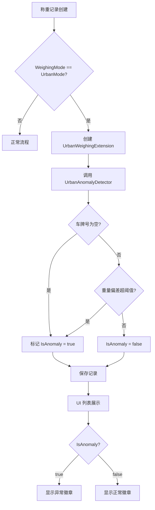

## Why

Urban 城管称重模块当前只能通过 `SyncStatus.Failed`（上传失败）来标识"异常"记录，无法自动识别数据层面的异常——例如车牌号为空、称重重量超出配置的上下限偏差阈值。下游系统因此无法有效过滤或告警此类问题数据，运营人员需手动排查。

## What Changes

- 在 `UrbanWeighingExtension` 实体上新增 `IsAnomaly` 布尔字段，用于标识该称重记录是否为异常数据
- 新增 `UrbanAnomalyDetector` 服务，封装异常判断逻辑：
  - 规则 1：`WeighingRecord.PlateNumber` 为空 → 异常
  - 规则 2：`WeighingRecord.TotalWeight` 与配置的上限/下限偏差超过配置百分比 → 异常
- 在 `appsettings.json` 中新增 `UrbanAnomalyDetection` 配置节，包含 `UpperLimit`、`LowerLimit`、`DeviationPercentage` 三个参数
- 在称重记录创建流程（`WeighingRecordService.CreateWeighingRecordAsync`）中集成异常判断，记录创建时自动标记
- 重构 UI "正常/异常"标签页过滤逻辑，改为基于 `IsAnomaly` 而非 `SyncStatus.Failed`
- 在列表状态徽章中区分"同步失败"和"数据异常"两种状态显示
- **//TODO** 后续将配置来源从 appsettings.json 迁移至统一配置服务

## Capabilities

### New Capabilities
- `urban-anomaly-detection`: Urban 称重记录数据异常自动检测与标记，包含异常判断规则引擎、配置模型、实体字段扩展及 UI 过滤逻辑

### Modified Capabilities
- `urban-weighing-extension`: 在 `UrbanWeighingExtension` 实体上新增 `IsAnomaly` 字段，需要扩展实体结构、EF Core 映射和数据库迁移

## Impact

### 代码变更

| 文件/模块 | 变更类型 | 说明 |
| --- | --- | --- |
| `MaterialClient.Common/Entities/Urban/UrbanWeighingExtension.cs` | 修改 | 新增 `IsAnomaly` 属性 |
| `MaterialClient.Common/EntityFrameworkCore/MaterialClientDbContext.cs` | 修改 | EF Core 映射更新 |
| `MaterialClient.Common/Services/AttendedWeighing/WeighingRecordService.cs` | 修改 | 创建记录时调用异常判断 |
| `MaterialClient.Common/Configuration/` | 新增 | `UrbanAnomalyDetectionConfig` 配置模型 |
| `MaterialClient.Common/Services/` | 新增 | `IUrbanAnomalyDetector` 接口及实现 |
| `MaterialClient.Urban/appsettings.json` | 修改 | 新增 `UrbanAnomalyDetection` 配置节 |
| `MaterialClient.Urban/Views/UrbanAttendedWeighingWindow.axaml` | 修改 | 状态徽章逻辑更新 |
| `MaterialClient.Urban/ViewModels/UrbanAttendedWeighingViewModel.cs` | 修改 | 标签页过滤逻辑更新 |
| `MaterialClient.Common/Migrations/` | 用户生成 | 用户需手动执行 EF Core 迁移命令生成迁移脚本 |

### UI 状态徽章变更原型

**变更前**（基于 SyncStatus）：
```
┌──────────────────────────────────────────────────────────────┐
│ [全部记录]  [正常]  [异常]                                     │
├──────────┬──────────────┬────────┬────────┬─────────────────┤
│ 车牌     │ 称重时间      │ 重量   │ 状态   │ 操作            │
├──────────┼──────────────┼────────┼────────┼─────────────────┤
│ 浙A12345 │ 05-25 14:30  │ 8.5吨  │ [正常] │ [审批]          │  ← SyncStatus != Failed
│ 浙A67890 │ 05-25 13:15  │ 6.2吨  │ [异常] │ [审批]          │  ← SyncStatus == Failed
│ (空)     │ 05-25 12:00  │ 3.8吨  │ [正常] │ [审批]          │  ← 车牌为空但仍显示正常!
└──────────┴──────────────┴────────┴────────┴─────────────────┘
```

**变更后**（基于 IsAnomaly）：
```
┌──────────────────────────────────────────────────────────────┐
│ [全部记录]  [正常]  [异常]                                     │
├──────────┬──────────────┬────────┬────────┬─────────────────┤
│ 车牌     │ 称重时间      │ 重量   │ 状态   │ 操作            │
├──────────┼──────────────┼────────┼────────┼─────────────────┤
│ 浙A12345 │ 05-25 14:30  │ 8.5吨  │ [正常] │ [审批]          │  ← IsAnomaly = false
│ 浙A67890 │ 05-25 13:15  │ 6.2吨  │ [正常] │ [审批]          │  ← IsAnomaly = false
│ (空)     │ 05-25 12:00  │ 3.8吨  │ [异常] │ [审批]          │  ← IsAnomaly = true (车牌为空)
│ 浙A99999 │ 05-25 11:30  │ 35.2吨 │ [异常] │ [审批]          │  ← IsAnomaly = true (超上限)
└──────────┴──────────────┴────────┴────────┴─────────────────┘
```

**徽章绑定逻辑变更**：
```
变更前: IsVisible="{Binding UrbanExtension.SyncStatus, Converter={StaticResource IsNotFailedConverter}}"
变更后: IsVisible="{Binding UrbanExtension.IsAnomaly, Converter={x:Static BoolConverters.Not}}"
```

### 依赖与风险
- 新增字段需要 EF Core 数据库迁移
- 配置参数暂存于 `appsettings.json`，后续迁移至统一配置服务
- UI 状态显示需要区分"同步失败"和"数据异常"
- 不考虑向后兼容

### 交互流程


