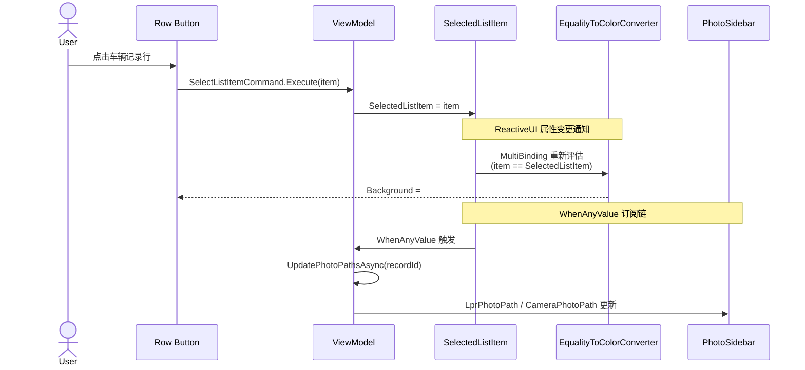

## Context

UrbanAttendedWeighingWindow 的车辆记录列表行选择当前使用 **Border + PointerPressed 事件** 实现，存在事件拦截和视觉反馈缺失两个缺陷。同项目中的 WeighingRecordListView 已有成熟的 **Button + Command + EqualityToColorConverter** 交互模式，本设计将其统一应用到 UrbanAttendedWeighingWindow。

### 当前状态（Before）

```
用户点击车辆记录行
       │
       ▼
  Border.PointerPressed
       │
       ├─ 点中"审批"Button ──→ Button 拦截事件 ──→ ❌ 选中未触发
       │
       └─ 点中其他区域 ──→ OnRecordClick(code-behind)
                               │
                               ▼
                    ViewModel.SelectListItem(item)
                               │
                               ▼
                    无视觉高亮反馈 ❌
```

### 目标状态（After）

```
用户点击车辆记录行
       │
       ▼
  Button.Command → SelectListItemCommand
       │
       ▼
  ViewModel.SelectListItem(item)
       │
       ├── SelectedListItem 赋值
       │       │
       │       ▼
       │   EqualityToColorConverter 自动计算背景色
       │       │
       │       ▼
       │   选中行 → #E3F2FD（蓝色高亮）✅
       │   未选中行 → Transparent ✅
       │
       └── WhenAnyValue → UpdatePhotoPathsAsync
               │
               ▼
           照片侧栏加载 ✅
```

## Goals / Non-Goals

**Goals:**
- 点击车辆记录行可靠触发选中操作（不受子元素影响）
- 选中行具有明显的视觉高亮反馈
- 采用与 WeighingRecordListView 一致的 MVVM Command 绑定模式
- 选中后照片侧栏正确加载

**Non-Goals:**
- 不修改照片加载链路（已正确工作）
- 不修改"审批"功能本身，仅将其从 Button 降级为 TextBlock 避免嵌套冲突
- 不修改 WeighingRecordListView 或其他已有页面

## Decisions

### D1: 行容器从 Border 改为 Button

**选择**: 使用 `Button` + `transparent-button` 样式作为行容器

**理由**: Button 的 Command 路由机制天然解决了事件拦截问题。Border 的 PointerPressed 是底层路由事件，被子元素的 Button（审批列）吞噬后不会冒泡。而 Button.Command 在 Avalonia 中通过逻辑树绑定触发，不受子元素事件路由影响。

**替代方案**:
- `e.Handled = true` 强制处理 → 破坏审批 Button 功能
- `AddHandler(PointerPressedEvent, ..., handledEventsToo: true)` → 不可靠，仍会在审批 Button 上误触发选中
- 使用 `ListBox` + `SelectedItem` 绑定 → 引入 ListBox 样式覆盖的额外复杂度

### D2: Command 绑定使用 $parent[ItemsControl] 语法

**选择**:
```xml
Command="{Binding $parent[ItemsControl].((vm:UrbanAttendedWeighingViewModel)DataContext).SelectListItemCommand}"
CommandParameter="{Binding}"
```

**理由**: 这是 DataTemplate 内部绑定到父级 DataContext 的标准 Avalonia 模式，WeighingRecordListView 已验证可行。

### D3: 选中高亮使用 EqualityToColorConverter + MultiBinding

**选择**:
```xml
<Button.Background>
    <MultiBinding Converter="{StaticResource EqualityToColorConverter}">
        <Binding Path="." />
        <Binding Path="$parent[ItemsControl].((vm:UrbanAttendedWeighingViewModel)DataContext).SelectedListItem" />
    </MultiBinding>
</Button.Background>
```

**理由**: `EqualityToColorConverter` 已在 `SharedConverters.axaml` 中全局注册为 `StaticResource`，当 item 与 SelectedListItem 引用相等时返回 `#E3F2FD`（蓝色背景），否则返回 Transparent。无需新增任何转换器。

### D4: "审批"列从 Button 降级为 TextBlock

**选择**: 将第4列的 `<Button Classes="primary-button" Content="审批" />` 替换为 `<TextBlock Text="审批" />`

**理由**: Avalonia 不支持 Button 嵌套（内层 Button 会吞噬外层 Button 的点击事件）。当前审批 Button 无 Command 绑定，仅为占位展示，降级为 TextBlock 不影响功能。

### D5: SelectListItem 添加 [ReactiveCommand] 属性

**选择**: 将 `public void SelectListItem(...)` 改为 `[ReactiveCommand] private void SelectListItem(...)`

**理由**: ReactiveUI Source Generator 会自动生成 `SelectListItemCommand` 属性，与 AXAML 中的 Command 绑定对应。这与 AttendedWeighingViewModel 的模式完全一致。

## Architecture

### 组件关系图

```mermaid
graph TB
    subgraph View Layer
        A[UrbanAttendedWeighingWindow.axaml]
        B[ItemsControl]
        C[Button row template]
        D[PhotoSidebar]
    end

    subgraph ViewModel Layer
        E[UrbanAttendedWeighingViewModel]
        F[SelectListItemCommand<br/>[ReactiveCommand]]
        G[SelectedListItem]
        H[UpdatePhotoPathsAsync]
    end

    subgraph Shared Infrastructure
        I[EqualityToColorConverter<br/>SharedConverters.axaml]
        J[transparent-button style<br/>App.axaml]
    end

    C -->|Command binding| F
    C -->|Background MultiBinding| I
    F -->|sets| G
    G -->|WhenAnyValue| H
    H -->|updates| D
    C -->|Classes| J
```

### 交互流程



## Change Map

| File | Location | Change Type | What Changes |
|---|---|---|---|
| `UrbanAttendedWeighingViewModel.cs` | `SelectListItem` method | 修改 | 添加 `[ReactiveCommand]`，访问级别 `public` → `private` |
| `UrbanAttendedWeighingWindow.axaml` | ItemsControl.ItemTemplate | 修改 | Border → Button，添加 Command/Background 绑定，审批 Button → TextBlock |
| `UrbanAttendedWeighingWindow.axaml.cs` | `OnRecordClick` method | 删除 | 移除整个方法 |

## Risks / Trade-offs

- **[Risk] "审批"列功能降级** → 当前审批 Button 无 Command 绑定，仅为展示。降级为 TextBlock 不丢失功能。未来如需审批交互，应通过行选中后在外部面板操作，而非行内 Button。
- **[Risk] Button 样式覆盖不完全** → `transparent-button` 样式仅设置 Background=Transparent 和 BorderThickness=0。需确认 Button 的默认 hover/pressed 效果不会干扰行视觉效果。已有 EqualityToColorConverter 的 MultiBinding 设置 Background 属性，会覆盖 Button 默认背景。
- **[Risk] 选中状态不持久** → 当前列表数据刷新时 SelectedListItem 可能被重置。这是既有行为，不在本次修复范围内。
