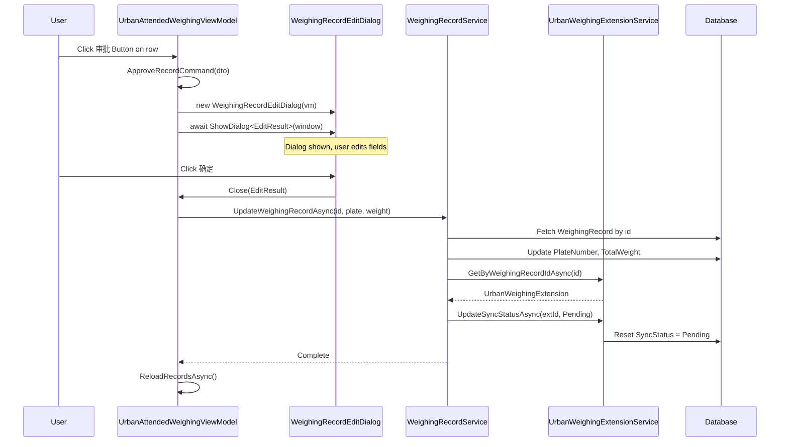

## Context

The `UrbanAttendedWeighingWindow` currently renders each vehicle record row as a `Button` inside an `ItemsControl`. This was introduced by `urban-weighing-record-click-selection-fix` to enable Command-based row selection. However, Avalonia does not allow nested `Button` elements, which means the "审批" (approval) action in column 5 must be a `TextBlock` — it cannot be a clickable button.

The business requires that clicking "审批" opens an edit dialog where the operator can modify `PlateNumber` and `TotalWeight`, after which the system resets `UrbanWeighingExtension.SyncStatus` to `Pending` so the background sync worker re-uploads the corrected record.

**Current state**: `ItemsControl` → `Button` (row) → child elements including `TextBlock` "审批"
**Target state**: `ListBox` → `ListBoxItem` (row, not a Button) → child elements including `Button` "审批"

### Existing patterns in the codebase

| Pattern | Reference | How it works |
|---|---|---|
| Dialog open/close | `AddCameraDialog` + `SettingsWindowViewModel` | ViewModel creates dialog VM → `new Dialog(vm)` → `await dialog.ShowDialog<T>(GetWindow())` → code-behind subscribes to Save/Cancel → `Close(result)` |
| GetWindow() | `SettingsWindowViewModel.GetWindow()` | `IClassicDesktopStyleApplicationLifetime.Windows.FirstOrDefault(w => w.DataContext == this)` |
| ListBox styling | `SettingsWindow.axaml` "settings-nav" | Inline `<ListBox.Styles>` to override `ListBoxItem` selected/hover backgrounds |
| Sync status reset | `IUrbanWeighingExtensionService.UpdateSyncStatusAsync` | Takes `extensionId` + `SyncStatus`, updates DB row |
| UnitOfWork | ABP `[UnitOfWork]` attribute | Automatic transaction boundary on service methods |

## Goals / Non-Goals

**Goals:**
- Replace `ItemsControl` + `Button` row wrapper with `ListBox` to eliminate nested-Button conflict
- Restore "审批" as an interactive `Button` per row
- Provide an edit dialog for modifying `PlateNumber` and `TotalWeight` during approval
- Persist edits and reset `SyncStatus` to `Pending` for re-upload
- Maintain existing photo-sidebar, tab-filter, pagination, and anomaly-detection behavior unchanged

**Non-Goals:**
- No changes to the background sync worker logic
- No changes to anomaly detection rules or the `IsAnomaly` flag
- No pagination or filter changes
- No changes to `WeighingWindowBase` or the window frame
- No new external dependencies

## Decisions

### D1: ListBox over ItemsControl + custom selection

**Choice**: Use Avalonia `ListBox` with `SelectedItem` two-way binding.

**Photo sidebar guarantee**: The current ViewModel has `this.WhenAnyValue(x => x.SelectedListItem).Subscribe(item => _ = UpdatePhotoPathsAsync(item?.WeighingRecordId))`. Since `SelectedListItem` is a `[Reactive]` property and `ListBox.SelectedItem` binds two-way to it, any row selection change writes through to `SelectedListItem`, which fires the `WhenAnyValue` subscription and loads photos for the sidebar. No additional wiring is required — the existing reactive chain works as-is.

**Alternatives considered**:
- *ItemsControl + PointerPressed*: Would work but requires manual selection state management, no native keyboard navigation, and no accessibility semantics.
- *DataGrid*: Overkill — column layout is fixed (5 columns), no sorting/editing-in-place needed, and DataGrid styling is heavier.
- *ItemsControl + Border + InputElement.Tapped*: Tapped doesn't propagate reliably with nested interactive children.

**Rationale**: `ListBox` provides native `SelectedItem` binding, keyboard navigation, and accessibility. Its container (`ListBoxItem`) is not a `Button`, so child `Button` elements work without conflict. The SettingsWindow already demonstrates custom `ListBox` styling in this codebase.

### D2: Inline ListBox styles vs. global style

**Choice**: Define custom `ListBox` styles inline within `UrbanAttendedWeighingWindow.axaml` using `<ListBox.Styles>`.

**Rationale**: The weighing record list has unique visual requirements (no border, no default chrome, row-separator via `BorderThickness`, custom selected/hover colors). Inline styles keep the override scoped. The SettingsWindow uses the same approach.

### D3: Dialog follows AddCameraDialog pattern

**Choice**: Create `WeighingRecordEditDialog` as a `Window` with a dedicated ViewModel, using code-behind to subscribe to Save/Cancel commands and call `Close(result)`.

**Rationale**: This is the established pattern. No ReactiveUI `Interaction<T>` is used anywhere in the codebase, so introducing it here would be inconsistent.

### D4: GetWindow() in ViewModel

**Choice**: Add a `GetWindow()` helper to `UrbanAttendedWeighingViewModel`, identical to `SettingsWindowViewModel.GetWindow()`.

**Rationale**: The ViewModel needs a parent `Window` reference to call `dialog.ShowDialog(parent)`. The `IClassicDesktopStyleApplicationLifetime` pattern is already proven. `UrbanAttendedWeighingWindow` is a single-instance main window, so `DataContext == this` matching is reliable.

### D5: Service method placement on IWeighingRecordService

**Choice**: Add `UpdateWeighingRecordAsync` to `IWeighingRecordService` rather than `IUrbanWeighingExtensionService`.

**Rationale**: The method updates both `WeighingRecord` fields (PlateNumber, TotalWeight) **and** resets the extension's SyncStatus. Since `WeighingRecordService` already injects both `IRepository<WeighingRecord>` and `IUrbanWeighingExtensionService`, it's the natural orchestration point. Putting it on the extension service would require injecting `IRepository<WeighingRecord>` into a domain service that currently doesn't need it.

### D6: SyncStatus reset via existing UpdateSyncStatusAsync

**Choice**: Use `IUrbanWeighingExtensionService.UpdateSyncStatusAsync(extensionId, SyncStatus.Pending)` to reset sync status, called from within `UpdateWeighingRecordAsync`.

**Rationale**: The method already exists and handles persistence. No need for a new sync-reset method.

## Architecture

```
┌──────────────────────────────────────────────────────────────┐
│  UrbanAttendedWeighingWindow.axaml                          │
│  ┌─────────────────────────────────────────────────────────┐ │
│  │  ListBox (replaces ItemsControl)                        │ │
│  │  ┌───────────────────────────────────────────────────┐  │ │
│  │  │  ListBoxItem (custom styled, no default chrome)   │  │ │
│  │  │  ┌─────┬──────────┬─────┬─────┬──────────────┐   │  │ │
│  │  │  │ 车牌 │ 称重时间  │ 重量 │ 状态 │ [审批]Button │   │  │ │
│  │  │  └─────┴──────────┴─────┴─────┴──────────────┘   │  │ │
│  │  └───────────────────────────────────────────────────┘  │ │
│  └─────────────────────────────────────────────────────────┘ │
│                                                              │
│  Bindings:                                                   │
│    SelectedItem ←→ SelectedListItem (two-way)                │
│    审批 Button.Command → ApproveRecordCommand                │
│                                                              │
│  Photo update chain (preserved):                             │
│    ListBox.SelectedItem → SelectedListItem (Reactive)        │
│    → WhenAnyValue → UpdatePhotoPathsAsync → sidebar refresh  │
└──────────────────────────────────────────────────────────────┘
                              │
                              ▼ click 审批
┌──────────────────────────────────────────────────────────────┐
│  UrbanAttendedWeighingViewModel                              │
│                                                              │
│  [Reactive] SelectedListItem  ← ListBox.SelectedItem        │
│                                                              │
│  ApproveRecordCommand(UrbanWeighingListItemDto item):        │
│    1. new WeighingRecordEditDialogViewModel(item)            │
│    2. new WeighingRecordEditDialog(vm)                       │
│    3. result = await dialog.ShowDialog<EditResult>(window)   │
│    4. if result → WeighingRecordService.UpdateAsync(...)     │
│    5. ReloadRecordsAsync()                                   │
└──────────────────────────────────────────────────────────────┘
                              │
                              ▼ step 4
┌──────────────────────────────────────────────────────────────┐
│  WeighingRecordService                                       │
│                                                              │
│  UpdateWeighingRecordAsync(id, plateNumber, totalWeight):    │
│    1. Fetch WeighingRecord by id                             │
│    2. Update PlateNumber + TotalWeight on entity             │
│    3. await _repo.UpdateAsync(record)                        │
│    4. ext = UrbanExtService.GetByWeighingRecordIdAsync(id)   │
│    5. if ext → UrbanExtService.UpdateSyncStatusAsync(        │
│         ext.Id, SyncStatus.Pending)                          │
│    6. [UnitOfWork] wraps entire operation                    │
└──────────────────────────────────────────────────────────────┘
                              │
                              ▼
┌──────────────────────────────────────────────────────────────┐
│  WeighingRecordEditDialog (Window)                           │
│  ┌─────────────────────────────────────────────────────────┐ │
│  │  Title: "审批称重记录"                                   │ │
│  │  ┌───────────────────────────────────────────────────┐  │ │
│  │  │  车牌号:  [TextBox bound to PlateNumber      ]   │  │ │
│  │  │  重量(吨): [TextBox bound to TotalWeight     ]   │  │ │
│  │  └───────────────────────────────────────────────────┘  │ │
│  │                          [取消]  [确定]                  │ │
│  └─────────────────────────────────────────────────────────┘ │
└──────────────────────────────────────────────────────────────┘
```

## API Sequence



## Risks / Trade-offs

**[Risk] ListBox scroll behavior differs from ItemsControl** → Mitigation: `ListBox` inherits from `ItemsControl` and uses the same `ScrollViewer` wrapping. Wrap in `<ScrollViewer>` if not default. Verify visually.

**[Risk] ListBox keyboard navigation may interfere with row Button** → Mitigation: `ListBoxItem` handles selection on click/Enter; the inner "审批" Button handles its own click via Command. Avalonia routes input to the most specific handler first. Test that Tab/Arrow keys navigate rows while Enter on the action Button triggers approval.

**[Risk] GetWindow() could return wrong window if multiple instances exist** → Mitigation: `UrbanAttendedWeighingWindow` is the main application window (single-instance). The `DataContext == this` match is reliable in this scenario.

**[Risk] Resetting SyncStatus to Pending triggers immediate re-upload** → Mitigation: This is the intended behavior. The background worker polls on a schedule; the record will be picked up on the next cycle. No immediate side-effect.

**[Trade-off] Inline styles over global reusable style** → Accepted. The weighing list has unique visual requirements. If a second ListBox with identical styling appears later, extract to a shared style class.

## Detailed Code Change Inventory

| File Path | Change Type | Change Description | Affected Module |
|-----------|-------------|-------------------|-----------------|
| `MaterialClient.Urban/Views/UrbanAttendedWeighingWindow.axaml` | Modify | Replace `ItemsControl` with `ListBox` at Grid.Row=3; add inline `<ListBox.Styles>` for chrome-less appearance; set `SelectedItem="{Binding SelectedListItem}"`; change row `DataTemplate` to use plain `Grid` instead of wrapping `Button`; restore "审批" as `<Button>` with `Command="{Binding #UrbanAttendedWeighingWindowRoot.DataContext.ApproveRecordCommand}"` | Urban UI |
| `MaterialClient.Urban/ViewModels/UrbanAttendedWeighingViewModel.cs` | Modify | Remove `[ReactiveCommand] SelectListItem` method; add `GetWindow()` helper; add `[ReactiveCommand] ApproveRecordAsync(UrbanWeighingListItemDto?)` method | Urban ViewModel |
| `MaterialClient.Common/Services/AttendedWeighing/WeighingRecordService.cs` | Modify | Add `UpdateWeighingRecordAsync(long id, string plateNumber, decimal totalWeight)` method; add method to `IWeighingRecordService` interface | Common Service |
| `MaterialClient.Urban/Views/Dialogs/WeighingRecordEditDialog.axaml` | Add | New dialog Window: PlateNumber TextBox, TotalWeight TextBox, Cancel/Save buttons; `x:DataType` to ViewModel | Urban Dialog |
| `MaterialClient.Urban/Views/Dialogs/WeighingRecordEditDialog.axaml.cs` | Add | Code-behind: constructor accepting ViewModel, subscribe to Save/Cancel commands, `Close(result)` | Urban Dialog |
| `MaterialClient.Urban/ViewModels/WeighingRecordEditDialogViewModel.cs` | Add | `[Reactive] PlateNumber`, `[Reactive] TotalWeight` (string for TextBox binding), `Result` property, `[ReactiveCommand] Save()`, `[ReactiveCommand] Cancel()` | Urban ViewModel |
