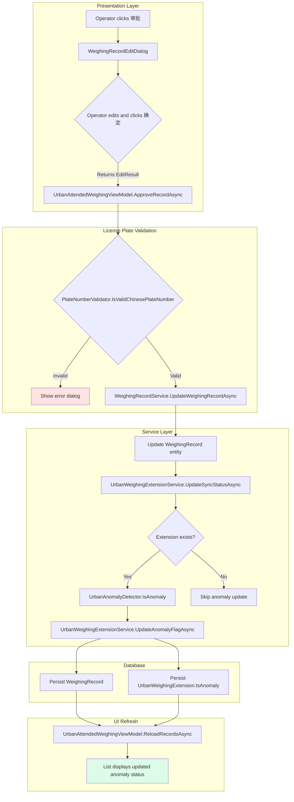
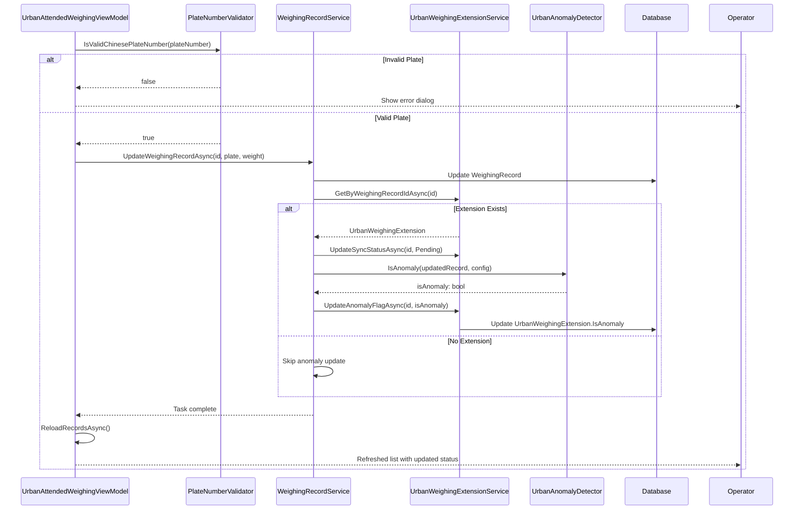

## Context

The MaterialClient codebase contains two weighing modules:
- **Material module**: Standard/SolidWaste weighing with full-attended workflow, license plate validation, and comprehensive UI controls including DateTimePicker
- **Urban module**: Urban城管 weighing with simplified workflow, missing license plate validation in approval, and basic TextBox controls for time filtering

The Urban module's approval workflow (`UrbanAttendedWeighingViewModel.ApproveRecordAsync`) calls `WeighingRecordService.UpdateWeighingRecordAsync` which updates record fields and resets sync status, but does not:
1. Validate the license plate before persisting
2. Recalculate the anomaly flag after edits

Additionally, the Urban weighing window's time filter uses plain TextBox controls instead of the DateTimePicker controls available in the Material module.

### Current State

**Approval Flow (Urban)**:
```
ApproveRecordAsync → ShowDialog → UpdateWeighingRecordAsync → Reset SyncStatus → Reload
                                                      ↓
                                              (No anomaly update)
```

**Time Filter (Urban)**:
```axaml
<TextBox Classes="filter-input" Width="130" />  <!-- Start time only -->
<TextBox Classes="filter-input" Width="130" />  <!-- End time only -->
```

### Constraints

- Cannot break existing Material module functionality
- Must maintain backward compatibility with existing Urban records
- Anomaly detection logic is in `UrbanAnomalyDetector` (already implemented)
- License plate validator exists: `PlateNumberValidator.IsValidChinesePlateNumber`

## Goals / Non-Goals

**Goals:**
- Add license plate validation to Urban approval workflow without breaking existing tests
- Integrate anomaly flag update into the approval workflow for data consistency
- Replace TextBox time filters with DateTimePicker controls for better UX
- Ensure all changes are transactionally consistent

**Non-Goals:**
- Modifying the anomaly detection algorithm itself (use existing `UrbanAnomalyDetector`)
- Changing the Material module's approval workflow
- Migrating historical data (changes apply to new approvals only)

## Decisions

### Decision 1: License Plate Validation Location

**Choice**: Validate in `UrbanAttendedWeighingViewModel.ApproveRecordAsync` before calling service layer.

**Rationale**:
- UI layer validation provides immediate feedback to the operator
- Fails fast before expensive database operations
- Consistent with existing validation patterns (e.g., `TotalWeight` validation in dialog)
- Service layer can still validate as a defense-in-depth measure

**Alternatives Considered**:
- Validate in `WeighingRecordService.UpdateWeighingRecordAsync`: Rejected because it would require throwing exceptions and rolling back transactions on validation failure
- Validate in `WeighingRecordEditDialog`: Rejected because the dialog is a reusable component and validation logic belongs in the ViewModel

### Decision 2: Anomaly Flag Update Integration

**Choice**: Call `UpdateAnomalyFlagAsync` at the end of `WeighingRecordService.UpdateWeighingRecordAsync`.

**Rationale**:
- Keeps the anomaly update transactional with the record update
- Centralizes the update logic in the service layer where `UrbanAnomalyDetector` is already accessible
- Ensures the anomaly flag is always updated when a record is modified via approval
- Consistent with the pattern in `CreateWeighingRecordAsync` (lines 118-121)

**Alternatives Considered**:
- Update in `UrbanAttendedWeighingViewModel.ApproveRecordAsync`: Rejected because it would require additional service injection and separate transaction
- Create a separate background job: Rejected because it would introduce eventual consistency and race conditions

### Decision 3: DateTimePicker Implementation

**Choice**: Use Ursa's `<u:DateTimePicker>` control with existing MaterialClient project reference.

**Rationale**:
- Ursa is already referenced in MaterialClient (used in `WeighingRecordListView.axaml`)
- Proven control with consistent styling and behavior
- No new dependencies required
- Supports both date-only and date-time selection modes

**Alternatives Considered**:
- Use Avalonia's built-in `CalendarDatePicker`: Rejected because it only supports dates, not date-times
- Build a custom control: Rejected because of development overhead and maintenance burden

### Decision 4: ViewModel Property Binding

**Choice**: Add `StartTime` and `EndTime` nullable `DateTime?` properties to `UrbanAttendedWeighingViewModel`.

**Rationale**:
- Properties already exist (lines 241-243) but are not bound to UI controls
- Direct binding eliminates manual value extraction code
- Nullable types allow for "no filter" state (null = all records)

**Code Change Inventory**

| File Path | Change Type | Change Description |
|-----------|-------------|-------------------|
| `src/MaterialClient.Urban/ViewModels/UrbanAttendedWeighingViewModel.cs` | Modify | Add license plate validation in `ApproveRecordAsync`; ensure `StartTime`/`EndTime` are bound |
| `src/MaterialClient.Common/Services/AttendedWeighing/WeighingRecordService.cs` | Modify | Add anomaly flag update to `UpdateWeighingRecordAsync` method |
| `src/MaterialClient.Urban/Views/UrbanAttendedWeighingWindow.axaml` | Modify | Add Ursa namespace; replace TextBox filters with DateTimePicker controls; bind to ViewModel properties |

## Architecture

### Component Hierarchy

```
Urban Module Architecture
├── Presentation Layer
│   ├── Views
│   │   └── UrbanAttendedWeighingWindow.axaml
│   │       ├── WeighingRecordListView (records list)
│   │       └── Filter Section (NEW: DateTimePicker controls)
│   └── ViewModels
│       └── UrbanAttendedWeighingViewModel
│           ├── ApproveRecordCommand (MODIFIED: add validation)
│           ├── StartTime property (EXISTING: now bound to UI)
│           └── EndTime property (EXISTING: now bound to UI)
├── Service Layer
│   ├── IWeighingRecordService
│   └── WeighingRecordService
│       └── UpdateWeighingRecordAsync (MODIFIED: add anomaly update)
├── Domain Services
│   ├── IUrbanWeighingExtensionService
│   │   └── UpdateAnomalyFlagAsync
│   ├── IUrbanAnomalyDetector
│   │   └── IsAnomaly
│   └── PlateNumberValidator
│       └── IsValidChinesePlateNumber
└── Entity Layer
    ├── WeighingRecord
    └── UrbanWeighingExtension
        ├── IsAnomaly flag
        └── SyncStatus
```

### Data Flow Diagram



### API Call Sequence



## Risks / Trade-offs

### Risk 1: Breaking existing approval workflow

**Risk**: Adding license plate validation could reject previously valid edits.

**Mitigation**:
- Validation uses existing `PlateNumberValidator` with well-tested patterns
- Error messages clearly indicate validation failure reasons
- Fails gracefully (dialog remains open, no data loss)

### Risk 2: Anomaly detection performance

**Risk**: Calling `UrbanAnomalyDetector.IsAnomaly` on every approval could slow down the workflow.

**Mitigation**:
- Anomaly detection is already optimized (config-based, no external calls)
- Only executes for Urban mode records (Material mode unaffected)
- Executes within same transaction (no additional round trips)

### Risk 3: DateTimePicker UX regression

**Risk**: Replacing TextBox with DateTimePicker could confuse users accustomed to the current interface.

**Mitigation**:
- DateTimePicker supports time-only input (users can ignore date)
- Display format matches current format ("MM-dd HH:mm")
- Reset button clears filters (same behavior as current)

### Trade-off 1: Validation location

**Trade-off**: UI-layer validation provides immediate feedback but service layer validation is more robust.

**Resolution**: Chose UI-layer validation for better UX, with service layer as defense-in-depth (existing patterns already validate at entity level).

### Trade-off 2: Transaction size

**Trade-off**: Adding anomaly flag update to the transaction increases its duration and lock scope.

**Resolution**: Anomaly detection is fast (in-memory calculation) and the update is a single scalar field, minimizing impact.

## Migration Plan

### Deployment Steps

1. **Deploy code changes**
   - Build MaterialClient.sln with modified files
   - Run integration tests for Urban approval workflow
   - Deploy MaterialClient.Urban executable

2. **Verify functionality**
   - Test approval with valid license plates (should succeed)
   - Test approval with invalid license plates (should fail with error)
   - Verify anomaly flag updates after approval
   - Test DateTimePicker controls for filtering

3. **Monitor for issues**
   - Check logs for validation errors
   - Monitor approval success rate
   - Gather user feedback on DateTimePicker UX

### Rollback Strategy

**Rollback triggers**:
- Increase in approval failure rate beyond baseline
- User complaints about DateTimePicker usability
- Anomaly flag update failures causing data inconsistency

**Rollback steps**:
1. Revert code changes to previous version
2. Redeploy MaterialClient.Urban executable
3. No database migration required (no schema changes)

**Rollback impact**:
- License plate validation and anomaly updates revert to manual process
- DateTimePicker reverts to TextBox (users must enter dates manually)
- No data loss (all approvals during new deployment remain valid)

## Open Questions

**Q1**: Should license plate validation allow null values for special cases (e.g., temporary vehicles)?

**A**: No. Current spec requires a valid license plate. If special cases emerge, add a flag (e.g., `IsTemporaryVehicle`) in a future change.

**Q2**: Should anomaly flag updates be applied retroactively to existing records?

**A**: No. This change only affects new approvals. Existing records with stale anomaly flags can be addressed via a separate data migration script if needed.

**Q3**: Should the DateTimePicker default to the current date when only time is selected?

**A**: Yes. The Ursa DateTimePicker control's default behavior is to use the current date when only time is modified, which aligns with user expectations for "today's records" filtering.
