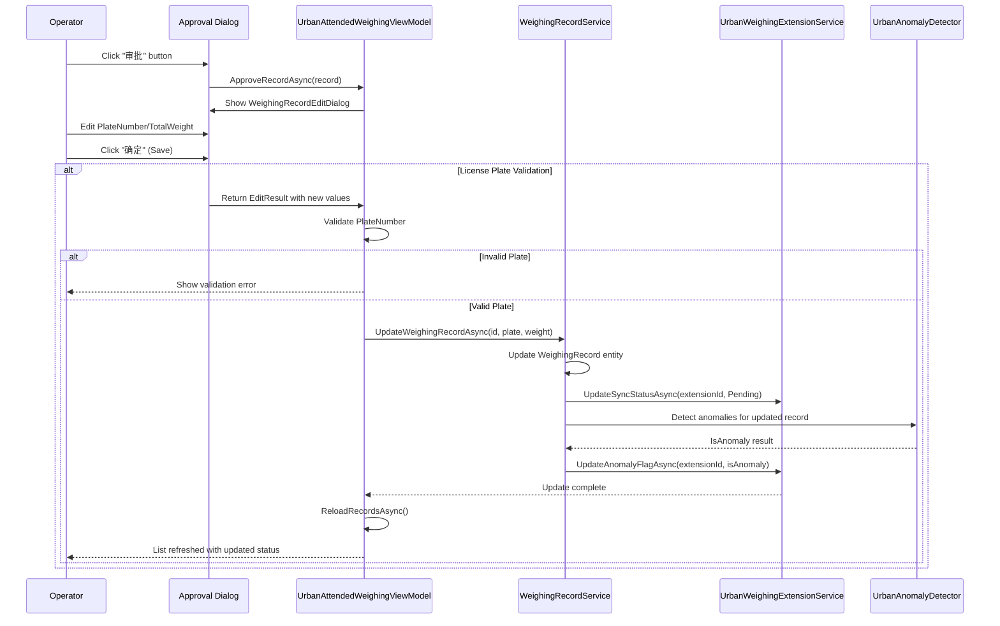
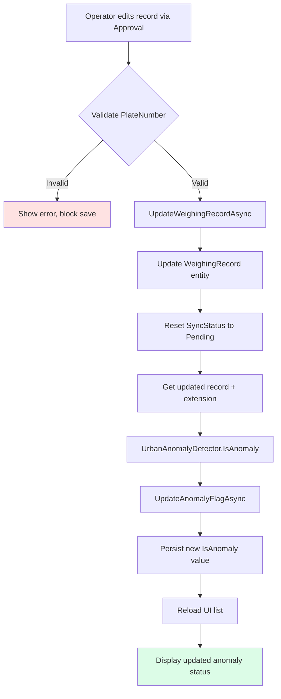

## Why

The Urban weighing module has three critical gaps in its approval workflow and UI: (1) `UpdateAnomalyFlagAsync` is not called after approval completion, leaving anomaly flags out-of-sync with edited records; (2) license plate validation is missing during approval, allowing invalid plates to be saved; (3) the weighing time filter only supports time input without date selection, limiting query flexibility. These gaps cause data inconsistency, compliance risks, and poor UX.

## What Changes

- **Add anomaly flag update after approval**: Call `UpdateAnomalyFlagAsync` in the approval workflow to recalculate and persist anomaly status after record edits
- **Add license plate validation**: Validate that edited `PlateNumber` values are valid Chinese license plates before persisting approval changes
- **Add DateTimePicker control**: Replace plain TextBoxes in the weighing time filter with `<u:DateTimePicker>` controls (from Ursa library) to support full date-time selection

## Capabilities

### New Capabilities
- `urban-weighing-approval-enhancements`: Extends the existing Urban weighing record approval workflow with license plate validation, anomaly flag updates, and enhanced date-time filtering

### Modified Capabilities
- `weighing-record-approval`: Add new requirements for license plate validation and anomaly flag updates to the existing approval workflow spec

## Impact

### Code Change Map

| File Path | Change Type | Change Reason | Impact Scope |
|-----------|-------------|---------------|--------------|
| `src/MaterialClient.Urban/ViewModels/UrbanAttendedWeighingViewModel.cs` | Modify | Add license plate validation and anomaly flag update to `ApproveRecordAsync` method | Urban module approval workflow |
| `src/MaterialClient.Common/Services/AttendedWeighing/WeighingRecordService.cs` | Modify | Add anomaly flag update to `UpdateWeighingRecordAsync` method | Common services layer |
| `src/MaterialClient.Urban/Views/UrbanAttendedWeighingWindow.axaml` | Modify | Replace TextBox filters with DateTimePicker controls, add Ursa namespace | Urban module UI |
| `src/MaterialClient.Urban/ViewModels/UrbanAttendedWeighingViewModel.cs` | Modify | Add `StartTime` and `EndTime` binding properties for date-time filters | Urban module ViewModel |

### Affected Systems
- **Urban Weighing Module**: Approval workflow and time filtering UI
- **Common Services Layer**: `WeighingRecordService` anomaly detection integration
- **Ursa UI Library**: New dependency for `<u:DateTimePicker>` control

### Dependencies
- **Ursa Avalonia Controls**: Already referenced in MaterialClient project (used in `WeighingRecordListView.axaml`)

## Interaction Flow

### Approval Workflow Enhancement



### UI Enhancement: Before and After

**Before (Current State)**:
```
┌─────────────────────────────────────────────────────┐
│ 称重时间              车牌号码                        │
│ ┌────────────┐  ┌────────────┐                     │
│ │            │  │            │  [搜索] [重置]      │
│ └────────────┘  └────────────┘                     │
│ (Plain TextBox - time only)  (No date selection)   │
└─────────────────────────────────────────────────────┘
```

**After (With DateTimePicker)**:
```
┌─────────────────────────────────────────────────────┐
│ 称重时间              车牌号码                        │
│ ┌────────────┐至┌────────────┐                     │
│ │05-27 09:00│  │05-27 18:00│  [搜索] [重置]      │
│ └────────────┘  └────────────┘                     │
│ (DateTimePicker - full date-time selection)        │
└─────────────────────────────────────────────────────┘
```

### Data Flow: Anomaly Detection Update



## Risk Assessment

- **Low Risk**: Adding license plate validation prevents data corruption; fails gracefully with error messages
- **Low Risk**: Anomaly flag update is non-breaking; adds missing synchronization step
- **Low Risk**: DateTimePicker replacement is UX enhancement; maintains backward-compatible time-only input if users don't change date
