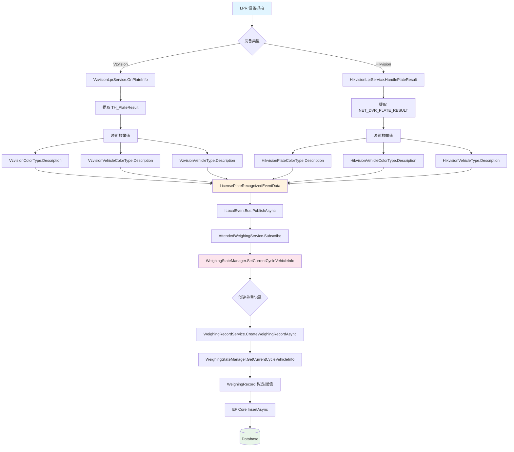
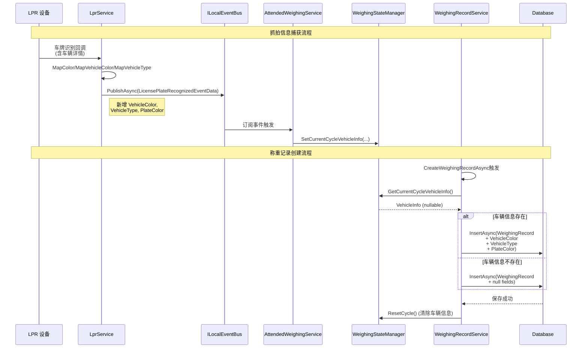

# Design: WeighingRecord 抓拍信息字段扩展

## 架构概览

```
Component Hierarchy
├── Device Layer (设备层)
│   ├── VzvisionLprService (臻识车牌识别服务)
│   │   └── VzvisionSdk (SDK P/Invoke 封装)
│   └── HikvisionLprService (海康威视车牌识别服务)
│       └── HikvisionSdk (SDK P/Invoke 封装)
│
├── Event Layer (事件层)
│   ├── LicensePlateRecognizedEventData (ABP 事件)
│   ├── LicensePlateRecognizedMessage (ReactiveUI 消息)
│   └── EventBusToMessageBusBridge (事件桥接)
│
├── State Layer (状态层)
│   ├── WeighingStateManager (称重状态管理)
│   │   ├── CurrentCycleVehicleInfo (新增: 周期内车辆信息)
│   │   └── PlateNumberService (车牌号服务)
│   └── WeighingRecordService (称重记录服务)
│
└── Entity Layer (实体层)
    ├── WeighingRecord (称重记录实体)
    └── UrbanWeighingExtension (Urban 扩展)
```

## 数据流设计



## API 序列



## 详细变更清单

### 实体层变更

| 文件 | 变更类型 | 变更描述 |
|------|---------|---------|
| `WeighingRecord.cs` | 新增属性 | `public string? VehicleColor { get; set; }` |
| `WeighingRecord.cs` | 新增属性 | `public string? VehicleType { get; set; }` |
| `WeighingRecord.cs` | 新增属性 | `public string? PlateColor { get; set; }` |

### 事件层变更

| 文件 | 变更类型 | 变更描述 |
|------|---------|---------|
| `LicensePlateRecognizedEventData.cs` | 新增属性 | `public string? VehicleColor { get; set; }` |
| `LicensePlateRecognizedEventData.cs` | 新增属性 | `public string? VehicleType { get; set; }` |
| `LicensePlateRecognizedEventData.cs` | 新增属性 | `public string? PlateColor { get; set; }` |
| `LicensePlateRecognizedMessage.cs` | 新增属性 | `public string? VehicleColor { get; set; }` |
| `LicensePlateRecognizedMessage.cs` | 新增属性 | `public string? VehicleType { get; set; }` |
| `LicensePlateRecognizedMessage.cs` | 新增属性 | `public string? PlateColor { get; set; }` |
| `EventBusToMessageBusBridge.cs` | 逻辑扩展 | 桥接三个新字段到 Message |

### Vzvision 设备集成变更

| 文件 | 变更类型 | 变更描述 |
|------|---------|---------|
| `VzvisionLprService.cs` | 新增方法 | `static string? MapVehicleColor(byte nCarColor)` |
| `VzvisionLprService.cs` | 新增方法 | `static string? MapVehicleType(int nType)` |
| `VzvisionLprService.cs` | 逻辑扩展 | `OnPlateInfo` 中提取并映射三个新字段 |
| `VzvisionVehicleColorType.cs` | 新增文件 | 车身颜色枚举 + Description 特性 |
| `VzvisionVehicleType.cs` | 新增文件 | 车型枚举 + Description 特性 |

### Hikvision 设备集成变更

| 文件 | 变更类型 | 变更描述 |
|------|---------|---------|
| `HikvisionLprService.cs` | 新增方法 | `static string? MapVehicleColor(int byColor)` |
| `HikvisionLprService.cs` | 新增方法 | `static string? MapVehicleType(int byVehicleType)` |
| `HikvisionLprService.cs` | 逻辑扩展 | `HandlePlateResult/HandleItsPlateResult` 中提取并映射 |
| `HikvisionPlateColorType.cs` | 新增文件 | 车牌颜色枚举 + Description |
| `HikvisionVehicleColorType.cs` | 新增文件 | 车身颜色枚举 + Description |
| `HikvisionVehicleType.cs` | 新增文件 | 车型枚举 + Description |

### 状态管理变更

| 文件 | 变更类型 | 变更描述 |
|------|---------|---------|
| `WeighingStateManager.cs` | 新增字段 | `private string? _currentCycleVehicleColor` |
| `WeighingStateManager.cs` | 新增字段 | `private string? _currentCycleVehicleType` |
| `WeighingStateManager.cs` | 新增字段 | `private string? _currentCyclePlateColor` |
| `WeighingStateManager.cs` | 新增方法 | `SetCurrentCycleVehicleInfo(string? vehicleColor, string? vehicleType, string? plateColor)` |
| `WeighingStateManager.cs` | 新增方法 | `(string? vehicleColor, string? vehicleType, string? plateColor) GetCurrentCycleVehicleInfo()` |
| `WeighingStateManager.cs` | 逻辑扩展 | `ResetCycle()` 中清除车辆信息 |

### 业务逻辑变更

| 文件 | 变更类型 | 变更描述 |
|------|---------|---------|
| `WeighingRecordService.cs` | 逻辑扩展 | `CreateWeighingRecordAsync` 中获取并设置车辆信息 |
| `AttendedWeighingService.cs` | 逻辑扩展 | 订阅事件中更新车辆信息到 StateManager |

## 枚举映射设计

### Vzvision 枚举定义

```csharp
// VzvisionVehicleColorType.cs
public enum VzvisionVehicleColorType
{
    [Description("未知")] Unknown = 0,
    [Description("白色")] White = 1,
    [Description("银色")] Silver = 2,
    [Description("灰色")] Gray = 3,
    [Description("黑色")] Black = 4,
    [Description("红色")] Red = 5,
    [Description("蓝色")] Blue = 6,
    [Description("黄色")] Yellow = 7,
    [Description("绿色")] Green = 8,
    [Description("棕色")] Brown = 9,
    [Description("紫色")] Purple = 10,
    [Description("其他")] Other = 99
}

// VzvisionVehicleType.cs
public enum VzvisionVehicleType
{
    [Description("未知")] Unknown = 0,
    [Description("小型车")] Small = 1,
    [Description("中型车")] Medium = 2,
    [Description("大型车")] Large = 3,
    [Description("特大型车")] ExtraLarge = 4,
    [Description("货车")] Truck = 5,
    [Description("客车")] Bus = 6,
    [Description("轿车")] Sedan = 7,
    [Description("SUV")] SUV = 8,
    [Description("MPV")] MPV = 9,
    [Description("其他")] Other = 99
}
```

### Hikvision 枚举定义

```csharp
// HikvisionVehicleType.cs (根据海康SDK文档定义)
public enum HikvisionVehicleType
{
    [Description("未知")] Unknown = 0,
    [Description("小轿车")] Sedan = 1,
    [Description("SUV")] SUV = 2,
    [Description("MPV")] MPV = 3,
    [Description("货车")] Truck = 4,
    [Description("客车")] Bus = 5,
    [Description("面包车")] Van = 6,
    [Description("皮卡")] Pickup = 7,
    [Description("其他")] Other = 99
}

// HikvisionVehicleColorType.cs
public enum HikvisionVehicleColorType
{
    [Description("未知")] Unknown = 0,
    [Description("白色")] White = 1,
    [Description("黑色")] Black = 2,
    [Description("灰色")] Gray = 3,
    [Description("银色")] Silver = 4,
    [Description("红色")] Red = 5,
    [Description("蓝色")] Blue = 6,
    [Description("黄色")] Yellow = 7,
    [Description("绿色")] Green = 8,
    [Description("棕色")] Brown = 9,
    [Description("其他")] Other = 99
}

// HikvisionPlateColorType.cs
public enum HikvisionPlateColorType
{
    [Description("未知")] Unknown = 0,
    [Description("蓝色")] Blue = 1,
    [Description("黄色")] Yellow = 2,
    [Description("黑色")] Black = 3,
    [Description("白色")] White = 4,
    [Description("绿色")] Green = 5,
    [Description("其他")] Other = 99
}
```

### 枚举映射工具方法

```csharp
// 通用 Description 读取器
public static class EnumDescriptionHelper
{
    public static string? GetDescription<T>(T value) where T : Enum
    {
        var field = value.GetType().GetField(value.ToString());
        var attr = field?.GetCustomAttribute<DescriptionAttribute>();
        return attr?.Description;
    }
}
```

## 数据库迁移

### 新增列定义

```sql
-- WeighingRecord 表新增列
ALTER TABLE WeighingRecords
ADD COLUMN VehicleColor nvarchar(50) NULL;

ALTER TABLE WeighingRecords
ADD COLUMN VehicleType nvarchar(50) NULL;

ALTER TABLE WeighingRecords
ADD COLUMN PlateColor nvarchar(50) NULL;
```

### EF Core 迁移

```csharp
// Migration: AddVehicleCaptureInfoToWeighingRecord
public partial class AddVehicleCaptureInfoToWeighingRecord : Migration
{
    protected override void Up(MigrationBuilder migrationBuilder)
    {
        migrationBuilder.AddColumn<string>(
            name: "VehicleColor",
            table: "WeighingRecords",
            type: "nvarchar(50)",
            maxLength: 50,
            nullable: true);

        migrationBuilder.AddColumn<string>(
            name: "VehicleType",
            table: "WeighingRecords",
            type: "nvarchar(50)",
            maxLength: 50,
            nullable: true);

        migrationBuilder.AddColumn<string>(
            name: "PlateColor",
            table: "WeighingRecords",
            type: "nvarchar(50)",
            maxLength: 50,
            nullable: true);
    }

    protected override void Down(MigrationBuilder migrationBuilder)
    {
        migrationBuilder.DropColumn(
            name: "VehicleColor",
            table: "WeighingRecords");

        migrationBuilder.DropColumn(
            name: "VehicleType",
            table: "WeighingRecords");

        migrationBuilder.DropColumn(
            name: "PlateColor",
            table: "WeighingRecords");
    }
}
```

## 实现要点

### 1. 可空性处理

所有新增字段均为可空 (`string?`)，原因：
- 设备可能不返回某些信息
- 不同设备型号支持的字段不同
- 确保向后兼容

### 2. 枚举映射策略

- 使用 `DescriptionAttribute` 存储显示文本
- 映射方法返回 `string?`，未知值返回 `null`
- 统一工具方法 `EnumDescriptionHelper.GetDescription`

### 3. 状态管理生命周期

```
[设备抓拍] → [StateManager.SetVehicleInfo] →
[创建记录] → [StateManager.GetVehicleInfo] →
[写入数据库] → [StateManager.ResetCycle] → [清除缓存]
```

### 4. 事件桥接完整性

`LicensePlateRecognizedEventToMessageBusBridge` 必须传递所有三个新字段，确保 UI 层能接收到完整信息。

## 测试策略

### 单元测试

- `VzvisionLprServiceTests`: 验证车辆颜色/类型映射
- `HikvisionLprServiceTests`: 验证车辆颜色/类型映射
- `WeighingStateManagerTests`: 验证车辆信息存储/获取/清除
- `WeighingRecordServiceTests`: 验证记录创建时车辆信息写入

### 集成测试

- 端到端流程: LPR 设备抓拍 → 事件发布 → 状态管理 → 记录创建

### 数据验证

- 数据库列长度约束 (nvarchar(50))
- 枚举值范围验证
- Description 特性完整性
