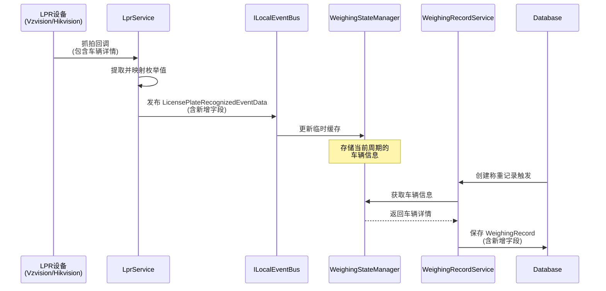

# Proposal: WeighingRecord 抓拍信息字段扩展

## Why

车牌识别设备（Hikvision 和 Vzvision）在抓拍时返回的车辆详细信息（车身颜色、车型、车牌号颜色）当前被丢弃，这些信息对称重记录的完整性和后续数据分析具有重要价值。WeighingRecord 实体缺少这三个字段，导致设备返回的有价值信息无法持久化。

## What Changes

### 核心变更

1. **WeighingRecord 实体扩展**
   - 新增 `VehicleColor` (string?) - 车身颜色
   - 新增 `VehicleType` (string?) - 车型
   - 新增 `PlateColor` (string?) - 车牌号颜色

2. **事件数据结构扩展**
   - `LicensePlateRecognizedEventData` 新增三个字段
   - `LicensePlateRecognizedMessage` 新增三个字段

3. **LPR 服务适配**
   - VzvisionLprService: 提取 `TH_PlateResult.nCarColor` 和 `nType`
   - HikvisionLprService: 提取 `byColor` 和 `byVehicleType`

4. **数据流调整**
   - WeighingStateManager 新增三个字段的临时存储
   - WeighingRecordService 创建记录时写入这些字段

### 枚举到字符串映射

- Vzvision: 使用现有的 `VzvisionColorType.Description` 特性（车牌颜色）
- 新增 `VzvisionVehicleColorType` 和 `VzvisionVehicleType` 枚举（车身颜色、车型）
- Hikvision: 新增对应的枚举类型和 Description 映射

## Capabilities

### New Capabilities

- `vehicle-capture-info`: 车辆抓拍信息持久化能力，包含车身颜色、车型、车牌号颜色的捕获、映射和存储

### Modified Capabilities

无现有能力变更，此为纯新增功能

## Impact

### 数据库影响

- WeighingRecord 表新增 3 个可空字符串列
- 需要 EF Core 迁移

### 模块影响

| 模块 | 影响类型 | 说明 |
|------|---------|------|
| MaterialClient.Common.Entities | 实体变更 | WeighingRecord 新增字段 |
| MaterialClient.Common.Events | 事件变更 | LicensePlateRecognizedEventData/Message 新增字段 |
| MaterialClient.Common.Services.Vzvision | 服务适配 | 提取并映射新增字段 |
| MaterialClient.Common.Services.Hikvision | 服务适配 | 提取并映射新增字段 |
| MaterialClient.Common.Services.AttendedWeighing | 状态管理 | WeighingStateManager 新增临时存储 |
| MaterialClient.Common.EntityFrameworkCore | 数据库 | 新增迁移 |

### 兼容性

- 无向后兼容问题（新增可空字段）
- 现有数据自动兼容（新字段为 null）

## 交互流程

## 代码变更清单

| 文件路径 | 变更类型 | 变更原因 | 影响范围 |
|---------|---------|---------|---------|
| `src/MaterialClient.Common/Entities/WeighingRecord.cs` | 新增字段 | 持久化车辆信息 | 实体层 |
| `src/MaterialClient.Common/Events/LicensePlateRecognizedEventData.cs` | 新增字段 | 传输车辆信息 | 事件层 |
| `src/MaterialClient.Common/Events/LicensePlateRecognizedMessage.cs` | 新增字段 | UI层接收车辆信息 | 消息层 |
| `src/MaterialClient.Common/Services/Vzvision/VzvisionLprService.cs` | 逻辑扩展 | 提取车辆信息 | VZ设备集成 |
| `src/MaterialClient.Common/Services/Vzvision/VzvisionColorType.cs` | 新增枚举 | 车辆颜色/类型映射 | VZ设备集成 |
| `src/MaterialClient.Common/Services/Hikvision/HikvisionLprService.cs` | 逻辑扩展 | 提取车辆信息 | 海康设备集成 |
| `src/MaterialClient.Common/Services/Hikvision/HikvisionVehicleType.cs` | 新增文件 | 车辆类型枚举 | 海康设备集成 |
| `src/MaterialClient.Common/Services/AttendedWeighing/WeighingStateManager.cs` | 新增状态 | 临时存储车辆信息 | 状态管理 |
| `src/MaterialClient.Common/Services/AttendedWeighing/WeighingRecordService.cs` | 逻辑扩展 | 写入车辆信息 | 业务逻辑 |
| `src/MaterialClient.Events/EventBusToMessageBusBridge.cs` | 桥接扩展 | 传递车辆信息到UI | 事件桥接 |
