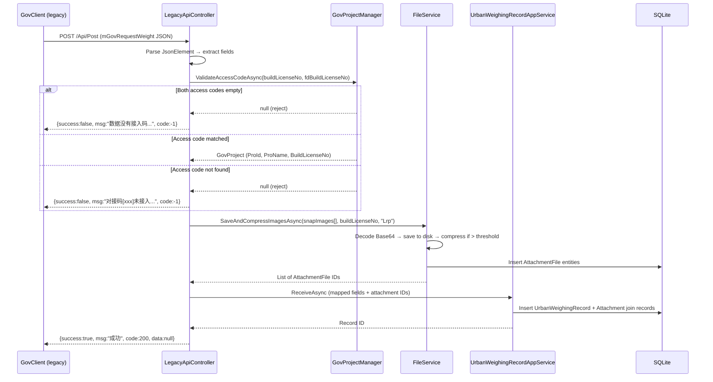
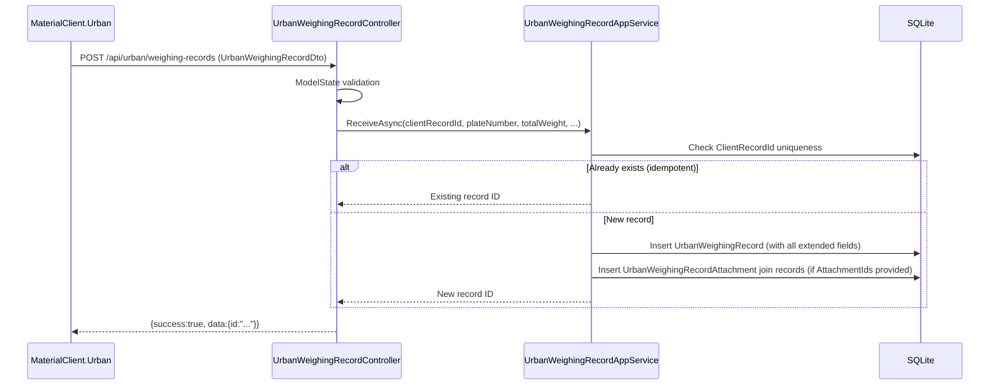

## Context

UrbanManagement is an ABP 10 + EF Core SQLite application with a 2-project simplified architecture (Core + App). Current state:

- **6 entities**: `GovProject` (Guid PK), `GovSyncData` (int PK), `GovLog` (int PK), `UrbanWeighingRecord` (long PK), `License` (int PK), `LicenseFeature` (long PK)
- **Working API**: `POST /api/urban/weighing-records` for MaterialClient.Urban with basic fields (ClientRecordId, PlateNumber, TotalWeight, WeighingTime, SyncType, SnapImages)
- **Mock controllers**: `ProjectController` and `SyncInfoController` using `SampleDataProvider`
- **No legacy client support**, no background sync worker, no image processing, no attachment entities

The source system (XiaoShanServe) is an ASP.NET Core 6 + SqlSugar + SQLite relay with 6 controllers, 3 core entities, and 1 background service. Its entire functional footprint must be ported into UrbanManagement.

**Key constraint**: The vault spec (03-数据模型映射与迁移.md) describes a future target state where all entities use Guid PKs. However, the current codebase uses `int` for GovSyncData/GovLog and `long` for UrbanWeighingRecord. This change does NOT migrate PK types — it extends existing entities in-place to avoid data migration complexity.

## Goals / Non-Goals

**Goals:**
- Port all XiaoShanServe business logic into UrbanManagement ABP modules
- Accept data from both legacy GovClient (`POST /Api/Post`) and MaterialClient.Urban (`POST /api/urban/weighing-records`)
- Replace `SampleDataProvider` mocks with real database operations
- Forward synced records to government platform via configurable HTTP endpoint
- Replace `SnapImages` string field with structured `AttachmentFile` entity pattern
- Maintain exact response contract for legacy client (`success`/`msg`/`code`/`data`/`count`)

**Non-Goals:**
- Modifying the legacy GovClient (.NET Framework WinForms) — it remains untouched
- Backward compatibility with old XiaoShanServe deployment — full replacement
- Migrating entity primary key types from int/long to Guid — deferred to a separate change
- OSS/cloud storage for images — local disk only
- Unit tests or documentation per task scope exclusion

## Decisions

### D1: Two-controller API strategy (not a single unified endpoint)

The legacy client and the new client use fundamentally different DTOs, field naming conventions, and business logic paths. Rather than one "smart" controller, we use two separate controllers:

- `LegacyApiController` — `POST /Api/Post`, `JsonElement` input, camelCase, dual access-code validation, Base64 image handling
- `UrbanWeighingRecordController` — `POST /api/urban/weighing-records`, strongly-typed `UrbanWeighingRecordDto`, `ClientRecordId` idempotency, attachment references

**Rationale**: The legacy client cannot be modified and has specific field names (`carNo`, `snapImages`, `buildLicenseNo`). Mixing both into one controller creates brittle type-detection logic. Separate controllers are clean, testable, and each can evolve independently.

**Alternative considered**: A single controller with content-type switching — rejected because it couples two incompatible contracts.

### D2: AttachmentFile entity pattern (not SnapImages string)

Replace the comma-separated `SnapImages` path string with:
```
AttachmentFile (Id: Guid, FileName, LocalPath, AttachType, AddTime)
     ↕ M:N via UrbanWeighingRecordAttachment
UrbanWeighingRecord (Id: long)
```

AttachType is restricted to `Lrp` (license plate recognition) and `UrbanPhoto` (general urban photos).

**Rationale**: The string approach prevents querying, deduplication, and metadata tracking. The entity approach aligns with MaterialClient's existing `WeighingRecordAttachment` pattern and supports future requirements (thumbnails, content types, audit).

### D3: ABP AsyncPeriodicBackgroundWorkerBase (not BackgroundService)

The old `ExplortStatisticBgService` uses `BackgroundService` with manual `while + Task.Delay(5000)`. The replacement uses ABP's `AsyncPeriodicBackgroundWorkerBase` for automatic lifecycle management within the ABP module system, built-in cancellation token propagation, and period configuration.

**Rationale**: Consistent with MaterialClient's existing pattern. ABP's worker abstraction handles the boilerplate that the old system reimplemented manually.

### D4: Refit + Polly for government HTTP forwarding

```csharp
[Headers("Content-Type: application/json")]
public interface IGovSyncHttpClient
{
    [Post("")]
    Task<GovResponseBase<string>> PostWeightAsync([Body] GovForwardRequest request);
}
```

Registered with Polly retry policy (3 attempts, exponential backoff).

**Rationale**: Refit provides type-safe HTTP client definitions; Polly adds resilience without manual retry loops. Both are already used in MaterialClient.

### D5: GovSyncData as forwarding payload (not merged into UrbanWeighingRecord)

`GovSyncData` remains a separate entity holding the business payload for government forwarding. `UrbanWeighingRecord` holds the server-side record with sync state. The background worker reads `UrbanWeighingRecord`, assembles `GovSyncData`, forwards it, and logs to `GovLog`.

**Rationale**: Separation of concerns — `UrbanWeighingRecord` is the canonical record; `GovSyncData` is the forwarding-specific payload with its own lifecycle and retry tracking.

### D6: Entity primary key types remain as-is

Current state and decision to keep:
- `GovProject`: `Entity<Guid>` — already Guid, correct
- `GovSyncData`: `Entity<int>` — keep int (matches old system's auto-increment PK)
- `GovLog`: `Entity<int>` — keep int (matches old system)
- `UrbanWeighingRecord`: `Entity<long>` — keep long (supports ClientRecordId range)

**Rationale**: The vault spec targets Guid PKs for all entities as a future ideal, but changing PK types now would require a full data migration and break existing code. Deferring this to a separate change keeps scope manageable.

## Architecture Diagram

```
┌─────────────────────────────────────────────────────────────────┐
│                    UrbanManagement.App                           │
│                    (Web Host Layer)                              │
│                                                                  │
│  ┌──────────────────┐  ┌───────────────────────────────────┐    │
│  │ LegacyApiController│  │ UrbanWeighingRecordController    │    │
│  │ POST /Api/Post    │  │ POST /api/urban/weighing-records │    │
│  │ (JsonElement in)  │  │ (UrbanWeighingRecordDto in)      │    │
│  └────────┬─────────┘  └──────────────┬────────────────────┘    │
│           │                            │                         │
│  ┌────────┴──────────┐  ┌─────────────┴──────────────────┐     │
│  │ ProjectController │  │ SyncInfoController              │     │
│  │ (CRUD → real DB)  │  │ (real DB queries)               │     │
│  └───────────────────┘  └────────────────────────────────┘     │
│                                                                  │
│  ┌──────────────────── Middleware ──────────────────────────┐   │
│  │ LicenseAuthorizationMiddleware                            │   │
│  └──────────────────────────────────────────────────────────┘   │
└─────────────────────────────────────────────────────────────────┘
                              │
                              ▼
┌─────────────────────────────────────────────────────────────────┐
│                   UrbanManagement.Core                           │
│                   (Domain + Infrastructure)                      │
│                                                                  │
│  ┌── Services ──────────────────────────────────────────────┐   │
│  │                                                           │   │
│  │  ILegacyGovSyncAppService ───► IUrbanWeighingRecordAppService
│  │       │                              │                    │   │
│  │       ├─► IGovProjectManager         │                    │   │
│  │       │     (access-code validation) │                    │   │
│  │       │                              │                    │   │
│  │       └─► IFileService               │                    │   │
│  │             (Base64→save→compress     │                    │   │
│  │              →AttachmentFile)         │                    │   │
│  │                                      │                    │   │
│  │  GovSyncBackgroundWorker ────────────┤                    │   │
│  │       │                              │                    │   │
│  │       └─► IGovSyncHttpClient         │                    │   │
│  │             (Refit + Polly)           │                    │   │
│  └──────────────────────────────────────┼────────────────────┘   │
│                                         │                        │
│  ┌── Entities ──────────────────────────┼────────────────────┐   │
│  │ GovProject (Guid)    GovSyncData (int)                    │   │
│  │ GovLog (int)         UrbanWeighingRecord (long)           │   │
│  │ AttachmentFile (Guid)  UrbanWeighingRecordAttachment(Guid)│   │
│  │ License (int)         LicenseFeature (long)               │   │
│  └───────────────────────────────────────────────────────────┘   │
│                                                                  │
│  ┌── EntityFrameworkCore ────────────────────────────────────┐  │
│  │ UrbanManagementDbContext (AbpDbContext)                    │  │
│  │   └── SQLite (UrbanManagement.db)                         │  │
│  └───────────────────────────────────────────────────────────┘  │
│                                                                  │
│  ┌── Configuration ──────────────────────────────────────────┐  │
│  │ StorageOptions: FilesPhysicalPath, CompressImage, GovAddress│  │
│  └───────────────────────────────────────────────────────────┘  │
└──────────────────────────────────────────────────────────────────┘
```

## API Sequence Diagrams

### Legacy Client Data Submission



### Background Sync to Government Platform

```mermaid
sequenceDiagram
    participant BW as GovSyncBackgroundWorker
    participant DB as SQLite
    participant FS as FileService
    participant HC as GovSyncHttpClient
    participant GOV as Government API

    loop Every 5 seconds
        BW->>DB: Query UrbanWeighingRecord WHERE SyncType!=1 AND RetryCount<10 AND IsAnomaly=false
        DB-->>BW: List of pending records
        BW->>DB: Query GovProject WHERE SyncStatus=true
        DB-->>BW: Active projects
        for each pending record matching active project
            BW->>FS: ReadAttachmentFilesAsync (read images for record)
            FS-->>BW: Base64 image data
            BW->>BW: Assemble GovSyncData + mGovRequestWeight payload
            BW->>HC: PostWeightAsync(payload)
            HC->>GOV: HTTP POST GovAddress
            GOV-->>HC: Response
            alt Success
                HC-->>BW: GovResponseBase {success}
                BW->>DB: Update SyncType=1, SyncTime=now
                BW->>DB: Insert GovLog (success entry)
            else Failure
                HC-->>BW: GovResponseBase {failure}
                BW->>DB: Update SyncType=2, RetryCount+=1
                BW->>DB: Insert GovLog (failure entry)
            else Exception (network/gone)
                BW->>DB: Update RetryCount=10 (stop retrying)
                BW->>DB: Insert GovLog (error entry)
            end
        end
    end
```

### New Client (MaterialClient.Urban) Data Submission



## Detailed Code Change Inventory

### UrbanManagement.Core

| File Path | Change Type | Change Description | Affected Module |
|-----------|-------------|-------------------|-----------------|
| `Entities/AttachmentFile.cs` | **New** | `Entity<Guid>` with FileName, LocalPath, AttachType (string, restricted to Lrp/UrbanPhoto), AddTime | Entities |
| `Entities/UrbanWeighingRecordAttachment.cs` | **New** | `Entity<Guid>` join table: UrbanWeighingRecordId (long), AttachmentFileId (Guid) | Entities |
| `Entities/Enums/AttachType.cs` | **New** | Enum: Lrp=5, UrbanPhoto=6 | Entities |
| `Entities/UrbanWeighingRecord.cs` | **Modify** | Add: VehicleColor, PlateColor, VehicleType, DeviceId, BuildLicenseNo, SiteType, ProId, ProName, IsAnomaly, ClientSyncType, ClientSyncTime, ClientRetryCount, ClientLastErrorTime, SyncTime, RetryCount, LastErrorTime. Remove: SnapImages. PK stays `long`. | Entities |
| `Entities/GovSyncData.cs` | **Modify** | Add: IsAnomaly (bool). Verify existing fields cover all forwarding needs. PK stays `int`. | Entities |
| `EntityFrameworkCore/UrbanManagementDbContext.cs` | **Modify** | Register AttachmentFile + UrbanWeighingRecordAttachment DbSets; add indexes on BuildLicenseNo, FdBuildLicenseNo, SyncType, ClientSyncType, ProId, AddTime, SyncId; update UrbanWeighingRecord column mappings (remove SnapImages, add new columns) | Data Access |
| `Services/IGovProjectManager.cs` | **New** | `ValidateAccessCodeAsync(string? buildLicenseNo, string? fdBuildLicenseNo) → GovProject?` with dual validation logic | Services |
| `Services/GovProjectManager.cs` | **New** | Implementation: fdBuildLicenseNo priority → BuildLicenseNo fallback → null rejection | Services |
| `Services/IFileService.cs` | **New** | `SaveAndCompressImagesAsync(string[] base64Images, string buildLicenseNo, string attachType) → List<Guid>`; `ReadAttachmentFilesAsync(long recordId) → List<string>` (Base64) | Services |
| `Services/FileService.cs` | **New** | Implementation: Base64 decode → save to `{FilesPhysicalPath}/TempUpload/{buildLicenseNo}/{ticks}_{i}.jpg` → compress if > CompressImage KB → create AttachmentFile entities | Services |
| `Services/ILegacyGovSyncAppService.cs` | **New** | Orchestration: validate access code → process images → build GovSyncData → persist | Services |
| `Services/LegacyGovSyncAppService.cs` | **New** | Implementation tying together GovProjectManager + FileService + repositories | Services |
| `Services/IUrbanWeighingRecordAppService.cs` | **Modify** | Extend signature to accept attachment IDs, sync state fields, and extended weighing fields | Services |
| `Services/UrbanWeighingRecordAppService.cs` | **Modify** | Handle new fields, create AttachmentFile join records on receive | Services |
| `Services/IGovSyncHttpClient.cs` | **New** | Refit interface: `[Post("")] Task<GovResponseBase<string>> PostWeightAsync([Body] GovForwardRequest)` | Services |
| `Services/GovSyncBackgroundWorker.cs` | **New** | `AsyncPeriodicBackgroundWorkerBase` subclass; 5s period; query pending records → read attachments → assemble GovSyncData → HTTP forward → update status/log | Services |
| `Services/SampleDataProvider.cs` | **Delete** | Remove after real services replace all mock usage | Services |
| `Configuration/StorageOptions.cs` | **New** | `IOptions<StorageOptions>` binding: FilesPhysicalPath, CompressImage, GovAddress | Configuration |

### UrbanManagement.App

| File Path | Change Type | Change Description | Affected Module |
|-----------|-------------|-------------------|-----------------|
| `Controllers/LegacyApiController.cs` | **New** | `[Route("Api/[action]")`, `Post([FromBody] JsonElement)` → parse → validate → save → respond with `{success, msg, code, data}` | Controllers |
| `Controllers/ProjectController.cs` | **Modify** | Replace ISampleDataProvider with IRepository<GovProject, Guid>; real CRUD operations | Controllers |
| `Controllers/SyncInfoController.cs` | **Modify** | Replace ISampleDataProvider with real IRepository queries for GovSyncData and GovLog | Controllers |
| `Controllers/UrbanWeighingRecordController.cs` | **Modify** | Extend DTO handling for new fields; accept attachment references | Controllers |
| `Models/GovRequestWeightDto.cs` | **New** | Legacy DTO with camelCase properties matching old mGovRequestWeight | Models |
| `Models/GovResponseBase.cs` | **New** | Generic response wrapper: `T? Data`, `bool Success`, `string? Msg`, `int Code` | Models |
| `Models/UrbanWeighingRecordDto.cs` | **Modify** | Add sync state fields, vehicle fields, project fields, IsAnomaly, AttachmentIds | Models |
| `UrbanManagementAppModule.cs` | **Modify** | Register Refit client; configure Polly retry policy; add custom DateTime JsonConverter | Module Config |
| `appsettings.json` | **Modify** | Add StorageOptions section with FilesPhysicalPath, CompressImage, GovAddress | Configuration |

### MaterialClient

| File Path | Change Type | Change Description | Affected Module |
|-----------|-------------|-------------------|-----------------|
| `MaterialClient.Urban/Api/IUrbanManagementApi.cs` | **New** | Refit interface for UrbanManagement `POST /api/urban/weighing-records` | API Client |
| `MaterialClient.Common/Entities/Urban/UrbanWeighingExtension.cs` | **Modify** | Verify sync-state fields (SyncStatus→ClientSyncType, RetryCount→ClientRetryCount, LastErrorTime→ClientLastErrorTime) map correctly | Entities |
| `MaterialClient.Urban/ViewModels/` | **Modify** | Update weighing completion flow to submit via IUrbanManagementApi with extended DTO | ViewModels |

## Risks / Trade-offs

| Risk | Mitigation |
|------|------------|
| Legacy GovClient sends `snapTime` as `yyyy-MM-dd HH:mm:ss` string — `System.Text.Json` defaults to ISO 8601 | Add `CustomDateTimeConverter` to global JSON options; legacy controller parses snapTime as string field |
| `GovSyncData` uses `int` PK while `UrbanWeighingRecord` uses `long` — separate tables, no conflict | Background worker operates on `UrbanWeighingRecord` for sync state, creates `GovSyncData` for forwarding |
| Dual-path data flow (legacy → GovSyncData, new → UrbanWeighingRecord) means two record paths | Legacy API creates both GovSyncData + UrbanWeighingRecord; new API creates UrbanWeighingRecord. Background worker syncs both paths. |
| No unit tests in scope | Manual verification via Postman + 48h parallel run with old system before cutover |
| Image path format depends on `FilesPhysicalPath` configuration | Validate path exists on startup; log warning if directory is missing |

## Migration Plan

1. Deploy UrbanManagement with all new code to new server
2. Import `Gov_Project` data from old XiaoShan.db (access codes, project names)
3. Import historical `Gov_SyncData` / `Gov_Log` for continuity
4. Point legacy GovClient config to new UrbanManagement address
5. Verify legacy GovClient `POST /Api/Post` succeeds for 48 hours
6. Verify background sync forwarding to government API works
7. Cutover: decommission XiaoShanServe

**Rollback**: Keep old XiaoShanServe running; simply repoint GovClient config back to old address.
